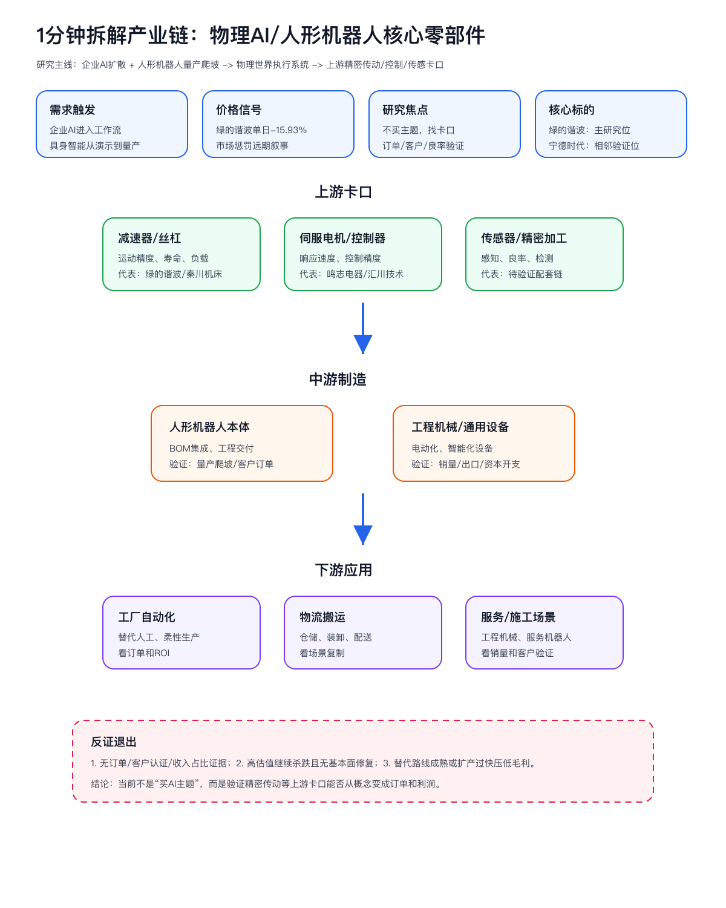
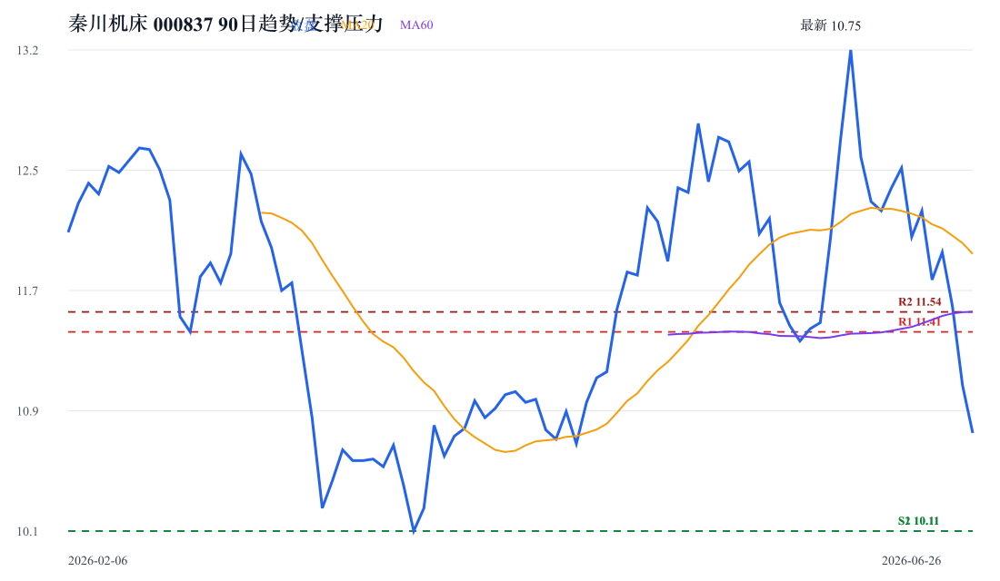

# 物理AI/人形机器人核心零部件产业链与A股公司分析报告

> 分析日期：2026-07-09  
> 研究范围：中国A股可映射的物理AI/人形机器人核心零部件链；重点验证上游精密传动卡口和核心标的买点。  
> 报告性质：产业链深度挖掘 + 股票层面跟踪框架，不构成真实交易建议。

## 0. 核心结论

1. 本轮不是简单的 AI 主题交易，而是物理 AI 产业链进入订单和估值双重验证期。真正的价值集中在上游精密传动、丝杠、伺服与控制等瓶颈卡口，尤其是能被客户认证、订单、收入占比和毛利率证明的公司。
2. 绿的谐波是当前样本里的核心研究标的：它处在机器人精密传动核心环节，2026Q1营收同比 42.96%、归母净利同比 61.17%，但当前 PE 仍高达 524.17，且近期出现股票交易风险提示公告，说明“卡口机会”和“估值安全”正在剧烈拉扯。
3. 核心跟踪标的不应只剩一只。本报告把 绿的谐波、秦川机床、鸣志电器 作为三条上游主线分别跟踪：减速器/精密传动、丝杠/机床、伺服电机/控制。排序先看卡口价值和产业证据，再看技术结构是否给出可执行位置。
4. 买点不能靠一句“机器人量产”判断，必须同时满足三件事：订单/客户/收入证据补强、估值消化到可解释区间、价格结构从单边下跌转为企稳修复。否则只是主题波动，不是产业链买点，风险收益比不成立。
5. 宁德时代、贵州茅台等样本不能被混入主线。宁德时代可作为工程机械电动化和储能资本开支的侧面验证，贵州茅台只能作为市场风险偏好温度计，不能提供物理 AI 产业链证据。

## 1. 研究对象、边界与口径

| 项目 | 定义 |
| --- | --- |
| 分析对象 | 物理AI/人形机器人核心零部件，重点是精密传动、丝杠、伺服、电机、控制器和系统集成 |
| 纳入主线 | 减速器、丝杠、伺服电机、控制器、传感器、精密加工与检测设备、人形机器人本体 |
| 相邻链路 | 工程机械电动化、新能源/储能、工业软件、视觉传感、算力基础设施 |
| 排除/弱相关 | 只有AI概念标签、无机器人收入/订单/客户认证披露的公司；消费品和非产业链样本 |
| 核心指标 | 订单/客户认证、收入占比、毛利率、产能利用率、PE/PB、远期EPS、60日价格结构 |
| 证据层级 | 公告/财报/研报PDF/行情K线 > 公开新闻 > 主题标签和逻辑推断 |

## 2. 行业背景与需求驱动

公开新闻显示企业 AI 和云端基础设施仍在扩散；A股研报端同时出现人形机器人量产、工程机械销量、国产 CPU 提价、IC 封装基板等线索。需求端没有冷却，但股票定价开始要求更硬的兑现证据。

| 驱动 | 方向 | 影响环节 | 传导逻辑 | 证据强度 |
| --- | --- | --- | --- | --- |
| 企业AI扩散 | 正向 | 算力/机器人应用 | AI进入企业流程 -> 物理世界自动化需求提升 | 中-高 |
| 人形机器人量产爬坡 | 正向 | 减速器/丝杠/伺服 | 本体放量 -> 运动部件价值量与客户认证重要性上升 | 中-高 |
| 工程机械销量与电动化 | 正向但间接 | 工程机械/新能源链 | 设备电动化和资本开支改善 -> 相邻链路验证 | 中 |
| 高估值样本大跌 | 负向/筛选 | 核心卡口标的 | 估值先于订单透支 -> 市场要求更硬证据 | 高 |

## 3. 产业链全景图谱

| 环节 | 细分领域 | 角色 | 关键输入 | 关键输出 | 价值/成本驱动 | 代表A股公司 |
| --- | --- | --- | --- | --- | --- | --- |
| 上游核心部件 | 减速器、丝杠、伺服、电机、控制器 | 决定运动精度、寿命和负载 | 精密加工、材料、客户认证 | 精密传动/运动控制部件 | 认证周期、良率、寿命、订单 | 绿的谐波、秦川机床、鸣志电器 |
| 上游设备/检测 | 精密加工与检测设备 | 影响良率和扩产速度 | 机床、检测、工艺Know-how | 加工/检测能力 | 扩产周期、良率爬坡 | 华中数控、日发精机待验证 |
| 中游制造 | 机器人本体、系统集成、工程机械 | 承接终端需求和场景交付 | 核心零部件、软件、工程能力 | 机器人/智能设备 | 订单、场景复制、成本控制 | 埃斯顿、汇川技术 |
| 下游应用 | 工厂、物流、工程施工、服务机器人 | 形成最终需求 | ROI、客户预算、场景标准化 | 自动化/智能化服务 | 订单、销量、客户验证 | 非A股或间接映射 |
| 相邻链路 | 新能源、储能、工程机械电动化 | 侧面验证制造业资本开支 | 电池、电驱、储能 | 电动化设备 | 销量和资本开支 | 宁德时代 |

## 4. 上游材料、部件与制程要素挖掘

| 上游层级 | 细分材料/部件 | 对目标产业的作用 | 价值/稀缺性 | 卡脖子程度 | A股候选 | 纳入主线判断 |
| --- | --- | --- | --- | --- | --- | --- |
| Product BOM | 减速器/丝杠/伺服电机 | 决定运动精度、负载和寿命 | 高；客户认证和可靠性要求高 | 高 | 绿的谐波/秦川机床/鸣志电器 | Core |
| Equipment/tools | 精密加工与检测设备 | 影响良率、成本和扩产速度 | 中高；良率爬坡慢 | 中 | 华中数控/日发精机待验证 | Important |
| Adjacent infrastructure | 工业软件/视觉传感/AI模型 | 提升泛化和场景复制 | 中；技术路线分散 | 中 | 科大讯飞/虹软科技待验证 | Adjacent |
| Commodity/background | 新能源/储能/工程机械电动化 | 验证设备电动化需求，不是机器人核心部件 | 中 | 低-中 | 宁德时代 | Adjacent |

## 5. 产业链核心环节价值分布

| 产业链环节 | 细分领域/关键产品 | BOM成本占比/价值占比 | 核心技术壁垒 | 卡脖子程度 | 代表A股公司 | 公司环节地位 | 证据口径/备注 |
| --- | --- | --- | --- | --- | --- | --- | --- |
| 上游 | 减速器/丝杠/伺服系统 | 定性高 | 精密加工、寿命、客户认证 | 高 | 绿的谐波、秦川机床、鸣志电器 | 卡口候选/重要配套 | 需订单和收入占比验证 |
| 中游 | 本体与系统集成 | 中高 | 工程交付、成本控制、场景数据 | 中 | 埃斯顿、汇川技术 | 核心/重要 | 需区分机器人业务收入占比 |
| 相邻 | 新能源/储能/工程机械电动化 | 中 | 电池、电驱、设备电动化客户 | 低-中 | 宁德时代 | 相邻基础设施 | 不能替代机器人核心链证据 |

## 6. 竞争格局与核心壁垒

| 候选环节 | 寡头是谁 | 扩产周期 | 替代方案 | 下游刚需 | 是否卡口 |
| --- | --- | --- | --- | --- | --- |
| 减速器/丝杠 | 国内少数精密传动供应商，海外仍有强供应商 | 中长；客户认证、寿命测试和良率爬坡耗时 | 短期可多供应商验证，但核心客户切换慢 | 是，机器人运动执行绕不开 | 卡口候选 |
| 伺服/电机/控制器 | 供应商较多但高端产品分化 | 中；需要客户和场景适配 | 替代较减速器更容易 | 是，但壁垒分化 | 重要配套 |
| 本体与系统集成 | 竞争者较多 | 中；工程交付为主 | 替代较多 | 是，但利润池可能分散 | 普通受益/核心需验证 |
| 新能源/储能 | 龙头集中但不在主链 | 长 | 与机器人核心部件替代关系弱 | 间接 | 相邻链路 |

## 7. A股公司映射与核心地位判断

| 公司 | 代码 | 环节 | 细分领域 | 产业占比/暴露度 | 核心技术/产品 | 卡脖子相关性 | 环节地位 | 证据与备注 |
| --- | --- | --- | --- | --- | --- | --- | --- | --- |
| 绿的谐波 | 688017 | 上游 | 减速器/核心零部件 | 未披露；产品与精密传动直接相关 | 谐波减速器/精密传动 | 高/待公告验证 | 主研究位/卡口候选 | 2026Q1营收同比42.96%、归母净利同比61.17%；最新风险提示公告需重视 |
| 秦川机床 | 000837 | 上游 | 丝杠/机床/核心零部件 | 待核验 | 精密机床与传动部件 | 中-高 | 重要配套 | 需补公告、订单、机器人收入占比 |
| 鸣志电器 | 603728 | 上游 | 电机/控制 | 待核验 | 步进/伺服电机 | 中 | 重要配套 | 需验证人形机器人客户与收入弹性 |
| 埃斯顿 | 002747 | 中游 | 工业机器人/系统集成 | 待核验 | 机器人本体、运动控制 | 中 | 本体侧候选 | 中游竞争更拥挤，利润弹性需验证 |
| 宁德时代 | 300750 | 相邻 | 新能源/储能/工程机械电动化 | 非机器人主链 | 动力电池与储能系统 | 低 | 相邻基础设施 | 用于验证电动化资本开支，不作为核心卡口 |

## 8. 投资线索、交易跟踪与目标价情景

### 8.1 机会类型

| 机会类型 | 产业链逻辑 | 代表A股公司 | 验证里程碑 | 风险 |
| --- | --- | --- | --- | --- |
| 核心环节龙头/卡口候选 | 机器人量产带动精密传动需求，上游认证和寿命壁垒决定价值捕获 | 绿的谐波 | 订单/客户认证/收入占比披露；毛利率稳定；价格止跌 | 估值过高、公告无法验证订单、替代路线成熟 |
| 关键技术突破者 | 丝杠、机床和精密加工能力决定运动执行部件良率和扩产 | 秦川机床 | 机器人客户、滚动功能部件订单、收入占比 | 仅有概念标签，无法确认产业占比 |
| 重要配套/高弹性 | 伺服、电机、控制环节受益于关节数量和执行单元增多，但竞争更分散 | 鸣志电器 | 高端电机产品规格、客户认证、毛利率 | 技术壁垒和客户粘性弱于减速器 |
| 相邻基础设施 | 工程机械电动化、储能和制造业资本开支提供侧面验证 | 宁德时代 | 工程机械电动化订单、储能需求 | 不是机器人核心部件，不能上升为主线标的 |

### 8.2 核心标的股票层面跟踪

股票层面的顺序是：先确认公司确实卡在产业链关键环节，再看财务和估值是否能解释预期，最后才用价格结构寻找买点。下表里的买点不是“明天买什么”，而是用于持续跟踪的触发条件：支撑位只代表观察区，必须叠加订单/客户/收入证据；压力位代表兑现或减仓观察位。

| 公司 | 代码 | 产业链结论 | 财务质量 | 当前估值 | 技术面/趋势 | 买点区间 | 止损/失效条件 | 目标价/空间 | 综合判断 |
| --- | --- | --- | --- | --- | --- | --- | --- | --- | --- |
| 绿的谐波 | 688017 | 减速器/精密传动；上游精密传动主研究位；若机器人订单兑现，卡口属性最直接 | 2026一季报营收1.40亿，同比42.96%；归母净利3263.41万，同比61.17% | 现价394.92，PE 529.43，PB 20.29；券商远期PE中位数112.28 | 多头趋势修复/延续；MA5/10/20/60=383.10/380.49/368.95/286.22；20日箱体287.00-450.20，60日箱体183.00-450.20；箱体位置79.31%；量能收敛/常态；趋势分5.0/5 | 左侧只看383.10附近缩量企稳；右侧需放量站回/突破450.20 | 有效跌破380.49且两日不能收回，技术结构失效；产业证据失效：已有财报高增长和研报覆盖，但订单/收入占比仍需公告验证 | EPS锚1.40；100/140/180x情景价 140.00/196.00/252.00；压力位 450.20/450.20 | 可跟踪候选 |
| 秦川机床 | 000837 | 丝杠/机床/精密加工；丝杠和精密机床是运动执行链的重要配套，弹性取决于机器人业务直接暴露 | 2026一季报营收11.44亿，同比9.64%；归母净利2426.68万，同比-11.71% | 现价10.41，PE 214.42，PB 2.16；券商远期PE中位数106.98 | 宽幅震荡，需突破确认；MA5/10/20/60=11.41/11.83/11.92/11.54；20日箱体10.72-13.60，60日箱体10.11-13.60；箱体位置8.60%；量能收敛/常态；趋势分1.8/5 | 左侧只看10.11附近缩量企稳；右侧需放量站回/突破11.41 | 有效跌破10.11且两日不能收回，技术结构失效；产业证据失效：保留为关键技术突破者，需继续核验收入占比和客户名单 | EPS锚0.19；100/140/180x情景价 19.00/26.60/34.20；压力位 11.41/11.54 | 观察名单，等待结构修复 |
| 鸣志电器 | 603728 | 电机/控制；电机与运动控制是机器人执行单元的重要环节，壁垒低于减速器但应用广 | 2026一季报营收7.00亿，同比17.65%；归母净利1381.71万，同比92.19% | 现价57.64，PE 356.34，PB 8.15；券商远期PE中位数159.37 | 回踩中期均线，观察承接；MA5/10/20/60=58.82/60.44/61.84/61.31；20日箱体55.80-67.90，60日箱体54.74-72.98；箱体位置15.90%；量能收敛/常态；趋势分2.2/5 | 左侧只看55.80附近缩量企稳；右侧需放量站回/突破58.82 | 有效跌破54.74且两日不能收回，技术结构失效；产业证据失效：保留为重要配套，需验证人形机器人订单和收入弹性 | EPS锚0.52；100/140/180x情景价 52.00/72.80/93.60；压力位 58.82/60.44 | 观察名单，等待结构修复 |

> 说明：目标价情景使用券商研报 EPS 预测的中位数作为粗略锚点，再用 100/140/180 倍 PE 做情景推导。由于样本估值极高，该区间不是买入建议，而是用于判断市场价格是否已经透支远期成长。

## 9. 催化因素与产业传导路径

| 催化因素 | 方向 | 影响环节 | 传导路径 | 受影响A股公司 | 证据强度 | 时间维度 |
| --- | --- | --- | --- | --- | --- | --- |
| 人形机器人量产爬坡 | 正向 | 减速器/丝杠/伺服 | 本体放量 -> 核心部件订单 -> 收入和毛利验证 | 绿的谐波、秦川机床、鸣志电器 | 中-高 | 中期 |
| 工程机械销量延续高增 | 正向但间接 | 工程机械/电动化设备 | 销量改善 -> 制造业资本开支 -> 设备智能化需求 | 宁德时代、工程机械链 | 中 | 短中期 |
| 核心公司风险提示公告 | 负向/筛选 | 高估值卡口股 | 股价波动和估值压力 -> 需要订单证据消化 | 绿的谐波 | 高 | 短期 |
| 国产CPU/封装基板研报升温 | 相邻正向 | 算力硬件/封装 | AI基础设施扩散 -> 硬件链关注度提升 | 半导体/封装链 | 中 | 中期 |

## 10. 风险提示

1. 机器人量产节奏低于预期，核心零部件订单无法兑现。
2. 绿的谐波等高估值标的已经提前反映远期成长，若订单证据不足，估值回撤可能继续。
3. 减速器、丝杠、伺服等环节存在替代路线和供应商竞争，卡口价值可能被稀释。
4. 公司公告只能证明事件存在，不等于机器人收入占比提升；必须继续核验年报、订单和客户认证。
5. 研报标题和主题热度不能代替原始财报、公告和产品收入证据。

## 11. 数据来源、证据强度与待核验事项

| 结论/数据 | 来源 | 日期 | 置信度 | 链接 |
| --- | --- | --- | --- | --- |
| Our approach to government and national security partnerships | OpenAI | 2026-07-08T13:30:00+00:00 | 中-高 | https://openai.com/index/government-national-security-partnerships |
| Separating signal from noise in coding evaluations | OpenAI | 2026-07-08T13:00:00+00:00 | 中-高 | https://openai.com/index/separating-signal-from-noise-coding-evaluations |
| Helping K–12 educators build practical AI skills | OpenAI | 2026-07-08T10:00:00+00:00 | 中-高 | https://openai.com/index/k-12-educators-practical-skills |
| 有色金属行业未来材料巡礼之深海采矿新材料2：经济性、资本开支结构特征与产业价值量 | 五矿证券 | 2026-07-09 | 中-高 | https://pdf.dfcfw.com/pdf/H3_AP202607091826834747_1.pdf |
| 计算机行业周报：大模型持续迭代，AI企业资本化加速 | 上海证券 | 2026-07-09 | 中-高 | https://pdf.dfcfw.com/pdf/H3_AP202607091826834583_1.pdf |
| 2026年新消费行业中期策略：科技消费，创技思新 | 上海证券 | 2026-07-09 | 中-高 | https://pdf.dfcfw.com/pdf/H3_AP202607091826834580_1.pdf |
| 计算机行业研究：云计算产业更新 | 国金证券 | 2026-07-09 | 中-高 | https://pdf.dfcfw.com/pdf/H3_AP202607091826833868_1.pdf |
| 中国企业置装白皮书：2026团服职业装采购指南 | 中国纺织信息中心 | 2026-07-09 | 中-高 | https://pdf.dfcfw.com/pdf/H3_AP202607091826833152_1.pdf |
| 中国医院创新转化报告2026 | 中国医学创新联盟 | 2026-07-09 | 中-高 | https://pdf.dfcfw.com/pdf/H3_AP202607091826833064_1.pdf |
| 2026年一季度业绩快速增长，人形机器人优势持续巩固 | eastmoney_reportapi | 2026-05-26 | 中-高 | https://pdf.dfcfw.com/pdf/H3_AP202605261822876254_1.pdf |
| 2025年年报及2026年一季报点评：战略卡位具身智能，营收净利表现亮眼 | eastmoney_reportapi | 2026-04-29 | 中-高 | https://pdf.dfcfw.com/pdf/H3_AP202604291821759233_1.pdf |
| 机器人需求回升，公司25Q4/26Q1净利润大幅增长 | eastmoney_reportapi | 2026-04-23 | 中-高 | https://pdf.dfcfw.com/pdf/H3_AP202604231821497943_1.pdf |
| 2025年报&2026一季报点评：Q1营收同比+43%，具身智能+工业机器人双轮驱动 | eastmoney_reportapi | 2026-04-23 | 中-高 | https://pdf.dfcfw.com/pdf/H3_AP202604231821491305_1.pdf |
| 绿的谐波:2025年年度权益分派实施公告 | eastmoney_announcement | 2026-07-06 | 高 | https://data.eastmoney.com/notices/detail/688017/AN202607051826728152.html |

### 问财增强数据交叉验证

| 查询项 | 类型 | 查询语句 | 状态 | 返回条数 | 样本/字段 | 用途 |
| --- | --- | --- | --- | --- | --- | --- |
| sector_hotspots | sector-select | 人形机器人概念板块 今日涨跌幅 主力资金净流入 市盈率 | error | 0 | 字段： | 板块热度/资金面交叉验证 |
| robotics_reports | report | 人形机器人 产业链 核心零部件 研报 投资评级 | error | 0 | 字段： | 行业研报线索补充 |
| robotics_news | news | 人形机器人 产业链 最新 政策 订单 量产 | error | 0 | 字段： | 产业催化与新闻事件补充 |
| 688017_business | business | 绿的谐波 主营业务 主要客户 供应商 重大合同 机器人 | error | 0 | 字段： | 公司经营/评级/事件证据补充 |
| 688017_rating | rating | 绿的谐波 机构评级 目标价 业绩预测 | error | 0 | 字段： | 公司经营/评级/事件证据补充 |
| 688017_event | event | 绿的谐波 机构调研 重大事件 业绩预告 机器人 | error | 0 | 字段： | 公司经营/评级/事件证据补充 |
| 688017_report | report | 绿的谐波 机器人 研报 投资评级 目标价 | error | 0 | 字段： | 公司经营/评级/事件证据补充 |
| 000837_business | business | 秦川机床 主营业务 主要客户 供应商 重大合同 机器人 | error | 0 | 字段： | 公司经营/评级/事件证据补充 |
| 000837_rating | rating | 秦川机床 机构评级 目标价 业绩预测 | error | 0 | 字段： | 公司经营/评级/事件证据补充 |
| 000837_event | event | 秦川机床 机构调研 重大事件 业绩预告 机器人 | error | 0 | 字段： | 公司经营/评级/事件证据补充 |
| 000837_report | report | 秦川机床 机器人 研报 投资评级 目标价 | error | 0 | 字段： | 公司经营/评级/事件证据补充 |
| 603728_business | business | 鸣志电器 主营业务 主要客户 供应商 重大合同 机器人 | error | 0 | 字段： | 公司经营/评级/事件证据补充 |
| 603728_rating | rating | 鸣志电器 机构评级 目标价 业绩预测 | error | 0 | 字段： | 公司经营/评级/事件证据补充 |
| 603728_event | event | 鸣志电器 机构调研 重大事件 业绩预告 机器人 | error | 0 | 字段： | 公司经营/评级/事件证据补充 |
| 603728_report | report | 鸣志电器 机器人 研报 投资评级 目标价 | error | 0 | 字段： | 公司经营/评级/事件证据补充 |

待核验事项：

1. 绿的谐波机器人相关收入占比、客户认证、订单和产能利用率。
2. 秦川机床、鸣志电器等配套公司的机器人链直接收入和客户证据。
3. 核心部件行业的真实 BOM 价值占比和国产替代率。
4. 历史 PE 分位、机构持仓、成交结构和更长周期 K 线趋势。
5. 研报 PDF 对收入预测、EPS 假设和风险提示的原文核验。
