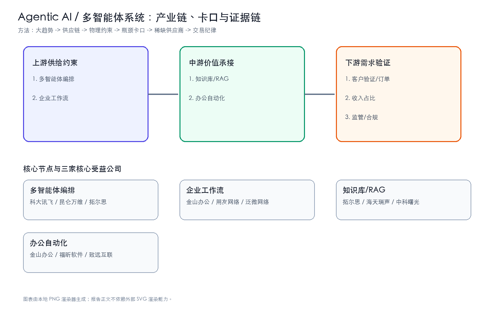
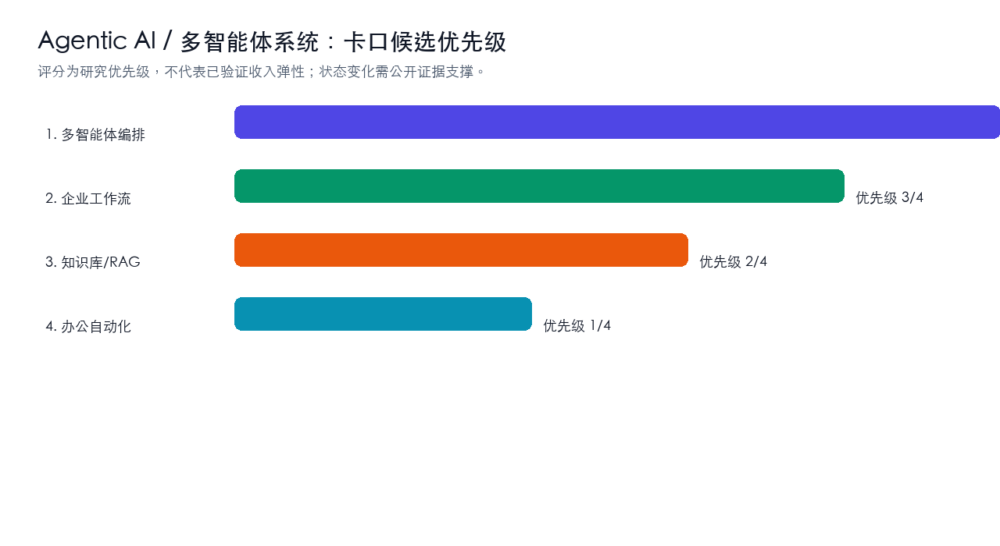
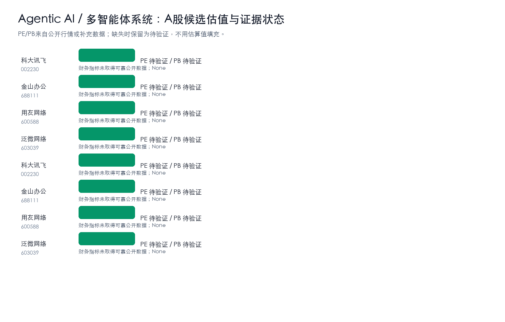
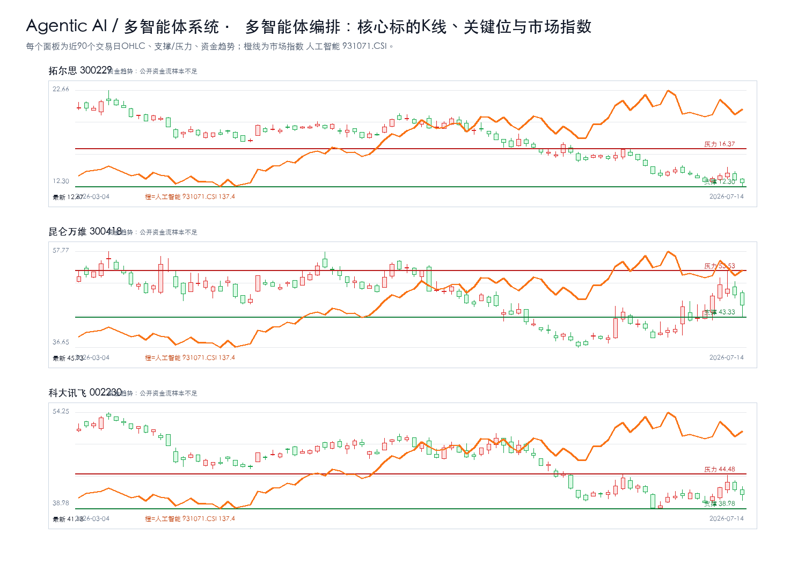
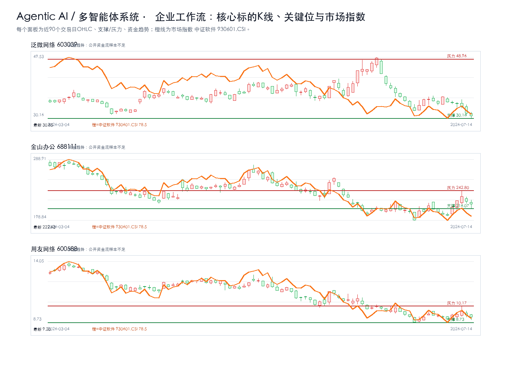
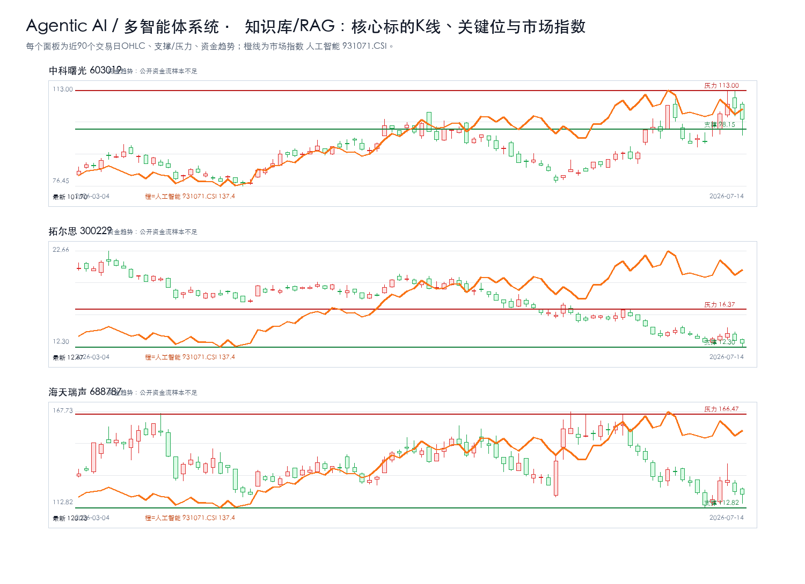
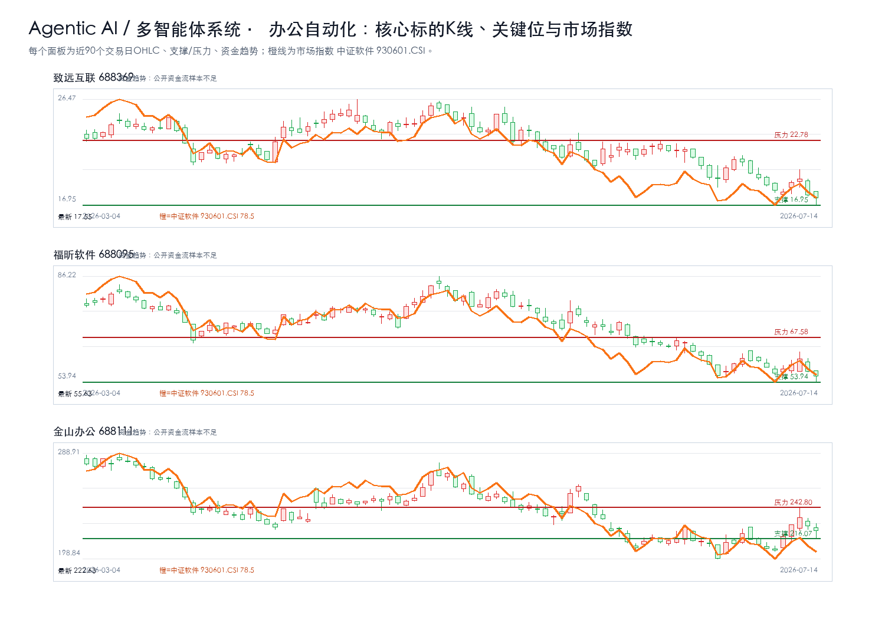

# Agentic AI / 多智能体系统主题最终报告

## 研究课题

本报告只回答三个问题：`Agentic AI / 多智能体系统` 的利润会流向哪些卡口，A股哪些公司真正暴露在这些卡口上，当前价格是否允许执行。当前跟踪范围收敛在 多智能体编排、企业工作流、知识库/RAG、办公自动化。

## 一句话结论

强命题：Agentic AI / 多智能体系统 的机会不在泛主题，而在 `多智能体编排 + 企业工作流` 能否持续出现订单、价格、客户认证、收入占比或监管里程碑。方向谨慎看多，置信度中等；当前绝对核心候选为：科大讯飞、昆仑万维、拓尔思、金山办公、用友网络。没有新增硬证据时，只观察，不追高。

## 市场盘点

- 需求：AI资本开支仍是背景变量，但只有订单、产能、客户认证和收入占比能把主题变成业绩。
- 供给：重点看认证周期、良率/交付、关键材料和工程化能力是否造成瓶颈。
- 价格：股价接近压力位时不追；回到支撑区也要等硬证据同步。
- 证据密度：硬事实台账仍偏薄，PDF正文级和公告级证据不足，研报标题只作线索。

## 核心逻辑

1. 需求侧：AI 应用和模型迭代继续推高 `Agentic AI / 多智能体系统` 相关需求，但需求强度必须通过订单、客户认证、收入占比、价格趋势或政策里程碑验证。
2. 供给侧：利润更可能集中在短期难扩产、认证周期长、替代路线慢、合规壁垒高或工程化交付难的环节，例如 多智能体编排、企业工作流、知识库/RAG、办公自动化。
3. A股映射：先判断产业链位置，再核验收入/订单暴露，最后才进入估值和交易条件；不能把行情样本或主题标签直接当作核心标的。

## 关键数据

| 判断项 | 当前结论 | 投资含义 |
| --- | --- | --- |
| 核心卡口 | 多智能体编排、企业工作流、知识库/RAG、办公自动化 | 优先验证订单、价格、客户认证和收入占比 |
| 核心候选 | 科大讯飞、昆仑万维、拓尔思、金山办公、用友网络 | 只在买入触发满足时进入交易候选 |
| 财务口径 | 核心公司继续跟踪营收同比、归母净利同比、毛利率、预测PE | 财务改善要和订单/客户认证同步才升级 |
| 证据密度 | 公告/财报级硬证据不足，研报和新闻只作线索 | 不把主题热度等同于买入结论 |
| 正文证据 | 硬事实台账不铺长表；PDF正文级证据不足时降级为线索 | 避免把内部过程写进正文 |
| 交易纪律 | 等待买入触发；风险收益比不足时不追高 | 买点、支撑、压力和止损优先于叙事 |

## 产业链跟踪

### 产业链核心环节价值分布

| 产业链环节 | 细分领域/关键产品 | BOM成本占比/价值占比 | 核心技术壁垒 | 卡脖子程度 | 代表A股公司 | 公司环节地位 | 证据口径/备注 |
| --- | --- | --- | --- | --- | --- | --- | --- |
| 上游 | 多智能体编排 | 待验证 | 客户认证、数据闭环、工程化交付、合规和成本控制 | High | 科大讯飞、昆仑万维、拓尔思 | 待验证 | 公开产业链与财务/研报口径，待公告和客户认证继续核验 |
| 上游 | 企业工作流 | 待验证 | 客户认证、数据闭环、工程化交付、合规和成本控制 | High | 金山办公、用友网络、泛微网络 | 待验证 | 公开产业链与财务/研报口径，待公告和客户认证继续核验 |
| 中游 | 知识库/RAG | 待验证 | 客户认证、数据闭环、工程化交付、合规和成本控制 | Medium | 拓尔思、海天瑞声、中科曙光 | 待验证 | 公开产业链与财务/研报口径，待公告和客户认证继续核验 |
| 中游 | 办公自动化 | 待验证 | 客户认证、数据闭环、工程化交付、合规和成本控制 | Medium | 金山办公、福昕软件、致远互联 | 待验证 | 公开产业链与财务/研报口径，待公告和客户认证继续核验 |

### 供需链路跟踪

| 环节 | 事实映射 | 供需变化方向 | 瓶颈/卡口 | A股映射 |
| --- | --- | --- | --- | --- |
| 上游 | 多智能体编排 | 上行 | 客户认证、数据闭环、工程化交付、合规和成本控制 | 科大讯飞、昆仑万维、拓尔思 |
| 上游 | 企业工作流 | 上行 | 客户认证、数据闭环、工程化交付、合规和成本控制 | 金山办公、用友网络、泛微网络 |
| 中游 | 知识库/RAG | 上行 | 客户认证、数据闭环、工程化交付、合规和成本控制 | 拓尔思、海天瑞声、中科曙光 |
| 中游 | 办公自动化 | 上行 | 客户认证、数据闭环、工程化交付、合规和成本控制 | 金山办公、福昕软件、致远互联 |

### 核心节点三公司校验

| 产业链节点 | 核心公司1 | 核心公司2 | 核心公司3 | 升级催化 | 失效条件 |
| --- | --- | --- | --- | --- | --- |
| 多智能体编排 | 科大讯飞 | 昆仑万维 | 拓尔思 | 订单/客户认证/收入占比/政策或监管里程碑出现公告级证据 | 商业化ROI不足、客户验证低于预期、收入暴露不足或监管约束增强 |
| 企业工作流 | 金山办公 | 用友网络 | 泛微网络 | 订单/客户认证/收入占比/政策或监管里程碑出现公告级证据 | 商业化ROI不足、客户验证低于预期、收入暴露不足或监管约束增强 |
| 知识库/RAG | 拓尔思 | 海天瑞声 | 中科曙光 | 订单/客户认证/收入占比/政策或监管里程碑出现公告级证据 | 商业化ROI不足、客户验证低于预期、收入暴露不足或监管约束增强 |
| 办公自动化 | 金山办公 | 福昕软件 | 致远互联 | 订单/客户认证/收入占比/政策或监管里程碑出现公告级证据 | 商业化ROI不足、客户验证低于预期、收入暴露不足或监管约束增强 |

### 瓶颈战斗地图

| 瓶颈节点 | 当前三家核心公司 | 为什么卡 | 升级信号 | 反证信号 | 节点结论 |
| --- | --- | --- | --- | --- | --- |
| 多智能体编排 | 拓尔思、昆仑万维、科大讯飞 | 需求放量与国产替代 | 订单/客户认证/收入占比/政策或监管里程碑出现公告级证据 | 商业化ROI不足、客户验证低于预期、收入暴露不足或监管约束增强 | 绝对核心 |
| 企业工作流 | 泛微网络、金山办公、用友网络 | 需求放量与国产替代 | 订单/客户认证/收入占比/政策或监管里程碑出现公告级证据 | 商业化ROI不足、客户验证低于预期、收入暴露不足或监管约束增强 | 绝对核心 |
| 知识库/RAG | 中科曙光、拓尔思、海天瑞声 | 需求放量与国产替代 | 订单/客户认证/收入占比/政策或监管里程碑出现公告级证据 | 商业化ROI不足、客户验证低于预期、收入暴露不足或监管约束增强 | 绝对核心 |
| 办公自动化 | 致远互联、福昕软件、金山办公 | 需求放量与国产替代 | 订单/客户认证/收入占比/政策或监管里程碑出现公告级证据 | 商业化ROI不足、客户验证低于预期、收入暴露不足或监管约束增强 | 绝对核心 |

### 瓶颈四标准校验

| 候选环节 | 不可替代 | 供给刚性 | 寡头垄断 | 机构低配 | 反证条件 |
| --- | --- | --- | --- | --- | --- |
| 多智能体编排 | 待验证 | 待验证 | 待验证 | 待验证 | 商业化ROI不足、客户验证低于预期、收入暴露不足或监管约束增强 |
| 企业工作流 | 待验证 | 待验证 | 待验证 | 待验证 | 商业化ROI不足、客户验证低于预期、收入暴露不足或监管约束增强 |
| 知识库/RAG | 待验证 | 待验证 | 待验证 | 待验证 | 商业化ROI不足、客户验证低于预期、收入暴露不足或监管约束增强 |
| 办公自动化 | 待验证 | 待验证 | 待验证 | 待验证 | 商业化ROI不足、客户验证低于预期、收入暴露不足或监管约束增强 |

## 投资机会挖掘

### 瓶颈识别

- 1. 多智能体编排：代表公司 科大讯飞、昆仑万维、拓尔思；催化 订单/客户认证/收入占比/政策或监管里程碑出现公告级证据；失效条件 商业化ROI不足、客户验证低于预期、收入暴露不足或监管约束增强。
- 2. 企业工作流：代表公司 金山办公、用友网络、泛微网络；催化 订单/客户认证/收入占比/政策或监管里程碑出现公告级证据；失效条件 商业化ROI不足、客户验证低于预期、收入暴露不足或监管约束增强。
- 3. 知识库/RAG：代表公司 拓尔思、海天瑞声、中科曙光；催化 订单/客户认证/收入占比/政策或监管里程碑出现公告级证据；失效条件 商业化ROI不足、客户验证低于预期、收入暴露不足或监管约束增强。
- 4. 办公自动化：代表公司 金山办公、福昕软件、致远互联；催化 订单/客户认证/收入占比/政策或监管里程碑出现公告级证据；失效条件 商业化ROI不足、客户验证低于预期、收入暴露不足或监管约束增强。

### 可交易标的筛选

- 直接暴露优先于相邻链路；公告/财报证明优先于研报标题；估值赔率优先于短期涨幅。当前所有候选仍需“收入占比/订单/客户认证”三项中的至少一项补强。

## A股可交易标的估值对比

### 多智能体编排核心三公司K线

叠加板块指数：人工智能 931071.CSI；来源：tushare.index_daily。

### 企业工作流核心三公司K线

叠加板块指数：中证软件 930601.CSI；来源：tushare.index_daily。

### 知识库/RAG核心三公司K线

叠加板块指数：人工智能 931071.CSI；来源：tushare.index_daily。

### 办公自动化核心三公司K线

叠加板块指数：中证软件 930601.CSI；来源：tushare.index_daily。

| 公司 | 代码 | 产业链位置 | 当前估值 | 财务/订单信号 | 催化 | 买点条件 | 失效条件 |
| --- | --- | --- | --- | --- | --- | --- | --- |
| 科大讯飞 | 002230 | 多智能体编排 | PE 未取得可靠公开数据 / PB 未取得可靠公开数据 | 财务指标未取得可靠公开数据；None | 订单/客户认证/收入占比/政策或监管里程碑出现公告级证据 | 等待买入触发：当前未进入买入候选；需先满足交易决策、风险收益比、K线企稳和订单/价格/客户认证增量证据 | 商业化ROI不足、客户验证低于预期、收入暴露不足或监管约束增强 |
| 昆仑万维 | 300418 | 多智能体编排 | PE 未取得可靠公开数据 / PB 未取得可靠公开数据 | 财务指标未取得可靠公开数据；None | 订单/客户认证/收入占比/政策或监管里程碑出现公告级证据 | 等待买入触发：当前未进入买入候选；需先满足交易决策、风险收益比、K线企稳和订单/价格/客户认证增量证据 | 商业化ROI不足、客户验证低于预期、收入暴露不足或监管约束增强 |
| 拓尔思 | 300229 | 多智能体编排 | PE 未取得可靠公开数据 / PB 未取得可靠公开数据 | 财务指标未取得可靠公开数据；None | 订单/客户认证/收入占比/政策或监管里程碑出现公告级证据 | 等待买入触发：当前未进入买入候选；需先满足交易决策、风险收益比、K线企稳和订单/价格/客户认证增量证据 | 商业化ROI不足、客户验证低于预期、收入暴露不足或监管约束增强 |
| 金山办公 | 688111 | 企业工作流 | PE 未取得可靠公开数据 / PB 未取得可靠公开数据 | 财务指标未取得可靠公开数据；None | 订单/客户认证/收入占比/政策或监管里程碑出现公告级证据 | 等待买入触发：当前未进入买入候选；需先满足交易决策、风险收益比、K线企稳和订单/价格/客户认证增量证据 | 商业化ROI不足、客户验证低于预期、收入暴露不足或监管约束增强 |
| 用友网络 | 600588 | 企业工作流 | PE 未取得可靠公开数据 / PB 未取得可靠公开数据 | 财务指标未取得可靠公开数据；None | 订单/客户认证/收入占比/政策或监管里程碑出现公告级证据 | 等待买入触发：当前未进入买入候选；需先满足交易决策、风险收益比、K线企稳和订单/价格/客户认证增量证据 | 商业化ROI不足、客户验证低于预期、收入暴露不足或监管约束增强 |
| 泛微网络 | 603039 | 企业工作流 | PE 未取得可靠公开数据 / PB 未取得可靠公开数据 | 财务指标未取得可靠公开数据；None | 订单/客户认证/收入占比/政策或监管里程碑出现公告级证据 | 等待买入触发：当前未进入买入候选；需先满足交易决策、风险收益比、K线企稳和订单/价格/客户认证增量证据 | 商业化ROI不足、客户验证低于预期、收入暴露不足或监管约束增强 |
| 拓尔思 | 300229 | 知识库/RAG | PE 未取得可靠公开数据 / PB 未取得可靠公开数据 | 财务指标未取得可靠公开数据；None | 订单/客户认证/收入占比/政策或监管里程碑出现公告级证据 | 等待买入触发：当前未进入买入候选；需先满足交易决策、风险收益比、K线企稳和订单/价格/客户认证增量证据 | 商业化ROI不足、客户验证低于预期、收入暴露不足或监管约束增强 |
| 海天瑞声 | 688787 | 知识库/RAG | PE 未取得可靠公开数据 / PB 未取得可靠公开数据 | 财务指标未取得可靠公开数据；None | 订单/客户认证/收入占比/政策或监管里程碑出现公告级证据 | 等待买入触发：当前未进入买入候选；需先满足交易决策、风险收益比、K线企稳和订单/价格/客户认证增量证据 | 商业化ROI不足、客户验证低于预期、收入暴露不足或监管约束增强 |
| 中科曙光 | 603019 | 知识库/RAG | PE 68.61 / PB 6.92 | 2026一季报；营收同比 23.71%；归母净利同比 22.19%；毛利率 26.56%；太平洋《业绩稳健增长，落地全国首个6万卡集群》；预测PE 48.69/39.45 | 订单/客户认证/收入占比/政策或监管里程碑出现公告级证据 | 等待买入触发：当前未进入买入候选；需先满足交易决策、风险收益比、K线企稳和订单/价格/客户认证增量证据 | 商业化ROI不足、客户验证低于预期、收入暴露不足或监管约束增强 |
| 金山办公 | 688111 | 办公自动化 | PE 未取得可靠公开数据 / PB 未取得可靠公开数据 | 财务指标未取得可靠公开数据；None | 订单/客户认证/收入占比/政策或监管里程碑出现公告级证据 | 等待买入触发：当前未进入买入候选；需先满足交易决策、风险收益比、K线企稳和订单/价格/客户认证增量证据 | 商业化ROI不足、客户验证低于预期、收入暴露不足或监管约束增强 |
| 福昕软件 | 688095 | 办公自动化 | PE 未取得可靠公开数据 / PB 未取得可靠公开数据 | 财务指标未取得可靠公开数据；None | 订单/客户认证/收入占比/政策或监管里程碑出现公告级证据 | 等待买入触发：当前未进入买入候选；需先满足交易决策、风险收益比、K线企稳和订单/价格/客户认证增量证据 | 商业化ROI不足、客户验证低于预期、收入暴露不足或监管约束增强 |
| 致远互联 | 688369 | 办公自动化 | PE 未取得可靠公开数据 / PB 未取得可靠公开数据 | 财务指标未取得可靠公开数据；None | 订单/客户认证/收入占比/政策或监管里程碑出现公告级证据 | 等待买入触发：当前未进入买入候选；需先满足交易决策、风险收益比、K线企稳和订单/价格/客户认证增量证据 | 商业化ROI不足、客户验证低于预期、收入暴露不足或监管约束增强 |

## 核心个股交易跟踪

| 公司 | 代码 | 产业链位置 | 估值 | 财务质量 | 趋势结构 | 关键位 | 买入条件 | 止损/失效 | 卖出/目标 |
| --- | --- | --- | --- | --- | --- | --- | --- | --- | --- |
| 科大讯飞 | 002230 | 多智能体编排 | PE 未取得可靠公开数据 / PB 未取得可靠公开数据 | 财务指标未取得可靠公开数据 | 现价 41.18；涨跌幅 -1.72%；MA5/10/20/60=41.86/41.30/41.37/45.47；20日箱体 38.98-44.48；空头趋势；20日箱体位置40%；风险收益比1.50；资金趋势：公开资金流样本不足 | 支撑 38.98；压力 44.48 | 等待买入触发：当前未进入买入候选；需先满足交易决策、风险收益比、K线企稳和订单/价格/客户认证增量证据 | 跌破38.98且订单/业绩无增量；商业化ROI不足、客户验证低于预期、收入暴露不足或监管约束增强 | 未设技术目标：尚未进入买入候选，先观察证据和价格结构是否修复 |
| 昆仑万维 | 300418 | 多智能体编排 | PE 未取得可靠公开数据 / PB 未取得可靠公开数据 | 财务指标未取得可靠公开数据 | 现价 45.93；涨跌幅 -4.71%；MA5/10/20/60=48.39/45.84/43.33/46.06；20日箱体 37.57-53.53；震荡分歧；20日箱体位置52%；风险收益比2.92；资金趋势：公开资金流样本不足 | 支撑 43.33；压力 53.53 | 等待买入触发：当前未进入买入候选；需先满足交易决策、风险收益比、K线企稳和订单/价格/客户认证增量证据 | 跌破43.33且订单/业绩无增量；商业化ROI不足、客户验证低于预期、收入暴露不足或监管约束增强 | 未设技术目标：尚未进入买入候选，先观察证据和价格结构是否修复 |
| 拓尔思 | 300229 | 多智能体编排 | PE 未取得可靠公开数据 / PB 未取得可靠公开数据 | 财务指标未取得可靠公开数据 | 现价 12.67；涨跌幅 -2.46%；MA5/10/20/60=13.19/13.35/14.13/16.60；20日箱体 12.30-16.37；空头趋势；20日箱体位置9%；风险收益比10.00；资金趋势：公开资金流样本不足 | 支撑 12.30；压力 16.37 | 等待买入触发：当前未进入买入候选；需先满足交易决策、风险收益比、K线企稳和订单/价格/客户认证增量证据 | 跌破12.30且订单/业绩无增量；商业化ROI不足、客户验证低于预期、收入暴露不足或监管约束增强 | 未设技术目标：尚未进入买入候选，先观察证据和价格结构是否修复 |
| 金山办公 | 688111 | 企业工作流 | PE 未取得可靠公开数据 / PB 未取得可靠公开数据 | 财务指标未取得可靠公开数据 | 现价 222.63；涨跌幅 -1.73%；MA5/10/20/60=225.68/218.93/216.07/235.25；20日箱体 198.84-242.80；震荡分歧；20日箱体位置54%；风险收益比3.08；资金趋势：公开资金流样本不足 | 支撑 216.07；压力 242.80 | 等待买入触发：当前未进入买入候选；需先满足交易决策、风险收益比、K线企稳和订单/价格/客户认证增量证据 | 跌破216.07且订单/业绩无增量；商业化ROI不足、客户验证低于预期、收入暴露不足或监管约束增强 | 未设技术目标：尚未进入买入候选，先观察证据和价格结构是否修复 |
| 用友网络 | 600588 | 企业工作流 | PE 未取得可靠公开数据 / PB 未取得可靠公开数据 | 财务指标未取得可靠公开数据 | 现价 9.20；涨跌幅 -1.71%；MA5/10/20/60=9.40/9.33/9.41/10.73；20日箱体 8.73-10.17；空头趋势；20日箱体位置33%；风险收益比2.06；资金趋势：公开资金流样本不足 | 支撑 8.73；压力 10.17 | 等待买入触发：当前未进入买入候选；需先满足交易决策、风险收益比、K线企稳和订单/价格/客户认证增量证据 | 跌破8.73且订单/业绩无增量；商业化ROI不足、客户验证低于预期、收入暴露不足或监管约束增强 | 未设技术目标：尚未进入买入候选，先观察证据和价格结构是否修复 |
| 泛微网络 | 603039 | 企业工作流 | PE 未取得可靠公开数据 / PB 未取得可靠公开数据 | 财务指标未取得可靠公开数据 | 现价 30.85；涨跌幅 -2.80%；MA5/10/20/60=33.25/34.50/35.89/38.40；20日箱体 30.16-48.96；空头趋势；20日箱体位置4%；风险收益比26.25；资金趋势：公开资金流样本不足 | 支撑 30.16；压力 48.96 | 等待买入触发：当前未进入买入候选；需先满足交易决策、风险收益比、K线企稳和订单/价格/客户认证增量证据 | 跌破30.16且订单/业绩无增量；商业化ROI不足、客户验证低于预期、收入暴露不足或监管约束增强 | 未设技术目标：尚未进入买入候选，先观察证据和价格结构是否修复 |
| 拓尔思 | 300229 | 知识库/RAG | PE 未取得可靠公开数据 / PB 未取得可靠公开数据 | 财务指标未取得可靠公开数据 | 现价 12.67；涨跌幅 -2.46%；MA5/10/20/60=13.19/13.35/14.13/16.60；20日箱体 12.30-16.37；空头趋势；20日箱体位置9%；风险收益比10.00；资金趋势：公开资金流样本不足 | 支撑 12.30；压力 16.37 | 等待买入触发：当前未进入买入候选；需先满足交易决策、风险收益比、K线企稳和订单/价格/客户认证增量证据 | 跌破12.30且订单/业绩无增量；商业化ROI不足、客户验证低于预期、收入暴露不足或监管约束增强 | 未设技术目标：尚未进入买入候选，先观察证据和价格结构是否修复 |
| 海天瑞声 | 688787 | 知识库/RAG | PE 未取得可靠公开数据 / PB 未取得可靠公开数据 | 财务指标未取得可靠公开数据 | 现价 120.23；涨跌幅 -1.38%；MA5/10/20/60=123.13/123.96/135.11/139.04；20日箱体 112.82-166.47；空头趋势；20日箱体位置14%；风险收益比6.24；资金趋势：公开资金流样本不足 | 支撑 112.82；压力 166.47 | 等待买入触发：当前未进入买入候选；需先满足交易决策、风险收益比、K线企稳和订单/价格/客户认证增量证据 | 跌破112.82且订单/业绩无增量；商业化ROI不足、客户验证低于预期、收入暴露不足或监管约束增强 | 未设技术目标：尚未进入买入候选，先观察证据和价格结构是否修复 |
| 中科曙光 | 603019 | 知识库/RAG | PE 68.61 / PB 6.92 | 2026一季报；营收同比 23.71%；归母净利同比 22.19%；毛利率 26.56% | 现价 101.90；涨跌幅 -3.99%；MA5/10/20/60=103.53/99.54/96.07/92.66；20日箱体 83.40-113.00；多头趋势；20日箱体位置63%；风险收益比2.96；资金趋势：公开资金流样本不足 | 支撑 98.15；压力 113.00 | 等待买入触发：当前未进入买入候选；需先满足交易决策、风险收益比、K线企稳和订单/价格/客户认证增量证据 | 跌破98.15且订单/业绩无增量；商业化ROI不足、客户验证低于预期、收入暴露不足或监管约束增强 | 未设技术目标：尚未进入买入候选，先观察证据和价格结构是否修复 |
| 金山办公 | 688111 | 办公自动化 | PE 未取得可靠公开数据 / PB 未取得可靠公开数据 | 财务指标未取得可靠公开数据 | 现价 222.63；涨跌幅 -1.73%；MA5/10/20/60=225.68/218.93/216.07/235.25；20日箱体 198.84-242.80；震荡分歧；20日箱体位置54%；风险收益比3.08；资金趋势：公开资金流样本不足 | 支撑 216.07；压力 242.80 | 等待买入触发：当前未进入买入候选；需先满足交易决策、风险收益比、K线企稳和订单/价格/客户认证增量证据 | 跌破216.07且订单/业绩无增量；商业化ROI不足、客户验证低于预期、收入暴露不足或监管约束增强 | 未设技术目标：尚未进入买入候选，先观察证据和价格结构是否修复 |
| 福昕软件 | 688095 | 办公自动化 | PE 未取得可靠公开数据 / PB 未取得可靠公开数据 | 财务指标未取得可靠公开数据 | 现价 55.63；涨跌幅 -2.71%；MA5/10/20/60=58.13/58.74/60.33/70.16；20日箱体 53.94-67.58；空头趋势；20日箱体位置12%；风险收益比7.07；资金趋势：公开资金流样本不足 | 支撑 53.94；压力 67.58 | 等待买入触发：当前未进入买入候选；需先满足交易决策、风险收益比、K线企稳和订单/价格/客户认证增量证据 | 跌破53.94且订单/业绩无增量；商业化ROI不足、客户验证低于预期、收入暴露不足或监管约束增强 | 未设技术目标：尚未进入买入候选，先观察证据和价格结构是否修复 |
| 致远互联 | 688369 | 办公自动化 | PE 未取得可靠公开数据 / PB 未取得可靠公开数据 | 财务指标未取得可靠公开数据 | 现价 17.55；涨跌幅 -1.63%；MA5/10/20/60=18.34/18.86/19.92/22.26；20日箱体 16.95-22.78；空头趋势；20日箱体位置10%；风险收益比8.72；资金趋势：公开资金流样本不足 | 支撑 16.95；压力 22.78 | 等待买入触发：当前未进入买入候选；需先满足交易决策、风险收益比、K线企稳和订单/价格/客户认证增量证据 | 跌破16.95且订单/业绩无增量；商业化ROI不足、客户验证低于预期、收入暴露不足或监管约束增强 | 未设技术目标：尚未进入买入候选，先观察证据和价格结构是否修复 |

交易判断只看两件事：价格是否到买入触发区，证据是否同步增强。二者缺一，继续等待。

## 产业链 / 竞争格局

### A股公司映射与核心地位判断

| 公司 | 代码 | 环节 | 细分领域 | 产业占比/暴露度 | 核心技术/产品 | 卡脖子相关性 | 环节地位 | 证据与备注 |
| --- | --- | --- | --- | --- | --- | --- | --- | --- |
| 科大讯飞 | 002230 | 多智能体编排 | 多智能体编排 | 待公告/财报核验收入、订单或客户认证占比 | 多智能体编排 | Medium/待验证 | 重要配套/待验证 | 财务指标未取得可靠公开数据；；反证/失效：商业化ROI不足、客户验证低于预期、收入暴露不足或监管约束增强 |
| 昆仑万维 | 300418 | 多智能体编排 | 多智能体编排 | 待公告/财报核验收入、订单或客户认证占比 | 多智能体编排 | Medium/待验证 | 重要配套/待验证 | 财务指标未取得可靠公开数据；；反证/失效：商业化ROI不足、客户验证低于预期、收入暴露不足或监管约束增强 |
| 拓尔思 | 300229 | 多智能体编排 | 多智能体编排 | 待公告/财报核验收入、订单或客户认证占比 | 多智能体编排 | Medium/待验证 | 重要配套/待验证 | 财务指标未取得可靠公开数据；；反证/失效：商业化ROI不足、客户验证低于预期、收入暴露不足或监管约束增强 |
| 金山办公 | 688111 | 企业工作流 | 企业工作流 | 待公告/财报核验收入、订单或客户认证占比 | 企业工作流 | Medium/待验证 | 重要配套/待验证 | 财务指标未取得可靠公开数据；；反证/失效：商业化ROI不足、客户验证低于预期、收入暴露不足或监管约束增强 |
| 用友网络 | 600588 | 企业工作流 | 企业工作流 | 待公告/财报核验收入、订单或客户认证占比 | 企业工作流 | Medium/待验证 | 重要配套/待验证 | 财务指标未取得可靠公开数据；；反证/失效：商业化ROI不足、客户验证低于预期、收入暴露不足或监管约束增强 |
| 泛微网络 | 603039 | 企业工作流 | 企业工作流 | 待公告/财报核验收入、订单或客户认证占比 | 企业工作流 | Medium/待验证 | 重要配套/待验证 | 财务指标未取得可靠公开数据；；反证/失效：商业化ROI不足、客户验证低于预期、收入暴露不足或监管约束增强 |
| 拓尔思 | 300229 | 知识库/RAG | 知识库/RAG | 待公告/财报核验收入、订单或客户认证占比 | 知识库/RAG | Medium/待验证 | 重要配套/待验证 | 财务指标未取得可靠公开数据；；反证/失效：商业化ROI不足、客户验证低于预期、收入暴露不足或监管约束增强 |
| 海天瑞声 | 688787 | 知识库/RAG | 知识库/RAG | 待公告/财报核验收入、订单或客户认证占比 | 知识库/RAG | Medium/待验证 | 重要配套/待验证 | 财务指标未取得可靠公开数据；；反证/失效：商业化ROI不足、客户验证低于预期、收入暴露不足或监管约束增强 |
| 中科曙光 | 603019 | 知识库/RAG | 知识库/RAG | 待公告/财报核验收入、订单或客户认证占比 | 知识库/RAG | Medium/待验证 | 重要配套/待验证 | 2026一季报；营收同比 23.71%；归母净利同比 22.19%；毛利率 26.…；太平洋《业绩稳健增长，落地全国首个6万卡集群》；预测PE 48.69/39.45；反证/失效：商业化ROI不足、客户验证低于预期、收入暴露不足或监管约束增强 |
| 金山办公 | 688111 | 办公自动化 | 办公自动化 | 待公告/财报核验收入、订单或客户认证占比 | 办公自动化 | Medium/待验证 | 重要配套/待验证 | 财务指标未取得可靠公开数据；；反证/失效：商业化ROI不足、客户验证低于预期、收入暴露不足或监管约束增强 |
| 福昕软件 | 688095 | 办公自动化 | 办公自动化 | 待公告/财报核验收入、订单或客户认证占比 | 办公自动化 | Medium/待验证 | 重要配套/待验证 | 财务指标未取得可靠公开数据；；反证/失效：商业化ROI不足、客户验证低于预期、收入暴露不足或监管约束增强 |
| 致远互联 | 688369 | 办公自动化 | 办公自动化 | 待公告/财报核验收入、订单或客户认证占比 | 办公自动化 | Medium/待验证 | 重要配套/待验证 | 财务指标未取得可靠公开数据；；反证/失效：商业化ROI不足、客户验证低于预期、收入暴露不足或监管约束增强 |

### 竞争格局与反证条件

| 公司 | 代码 | 卡口环节 | 直接性 | 财务信号 | 研报/公告信号 | 估值压力 | 反证条件 |
| --- | --- | --- | --- | --- | --- | --- | --- |
| 科大讯飞 | 002230 | 多智能体编排 | 重要配套 | 财务指标未取得可靠公开数据 | None | 待验证 | 商业化ROI不足、客户验证低于预期、收入暴露不足或监管约束增强 |
| 昆仑万维 | 300418 | 多智能体编排 | 重要配套 | 财务指标未取得可靠公开数据 | None | 待验证 | 商业化ROI不足、客户验证低于预期、收入暴露不足或监管约束增强 |
| 拓尔思 | 300229 | 多智能体编排 | 重要配套 | 财务指标未取得可靠公开数据 | None | 待验证 | 商业化ROI不足、客户验证低于预期、收入暴露不足或监管约束增强 |
| 金山办公 | 688111 | 企业工作流 | 重要配套 | 财务指标未取得可靠公开数据 | None | 待验证 | 商业化ROI不足、客户验证低于预期、收入暴露不足或监管约束增强 |
| 用友网络 | 600588 | 企业工作流 | 重要配套 | 财务指标未取得可靠公开数据 | None | 待验证 | 商业化ROI不足、客户验证低于预期、收入暴露不足或监管约束增强 |
| 泛微网络 | 603039 | 企业工作流 | 重要配套 | 财务指标未取得可靠公开数据 | None | 待验证 | 商业化ROI不足、客户验证低于预期、收入暴露不足或监管约束增强 |
| 拓尔思 | 300229 | 知识库/RAG | 重要配套 | 财务指标未取得可靠公开数据 | None | 待验证 | 商业化ROI不足、客户验证低于预期、收入暴露不足或监管约束增强 |
| 海天瑞声 | 688787 | 知识库/RAG | 重要配套 | 财务指标未取得可靠公开数据 | None | 待验证 | 商业化ROI不足、客户验证低于预期、收入暴露不足或监管约束增强 |
| 中科曙光 | 603019 | 知识库/RAG | 重要配套 | 2026一季报；营收同比 23.71%；归母净利同比 22.19%；毛利率 26.56% | 太平洋《业绩稳健增长，落地全国首个6万卡集群》；预测PE 48.69/39.45 | 中 | 商业化ROI不足、客户验证低于预期、收入暴露不足或监管约束增强 |
| 金山办公 | 688111 | 办公自动化 | 重要配套 | 财务指标未取得可靠公开数据 | None | 待验证 | 商业化ROI不足、客户验证低于预期、收入暴露不足或监管约束增强 |
| 福昕软件 | 688095 | 办公自动化 | 重要配套 | 财务指标未取得可靠公开数据 | None | 待验证 | 商业化ROI不足、客户验证低于预期、收入暴露不足或监管约束增强 |
| 致远互联 | 688369 | 办公自动化 | 重要配套 | 财务指标未取得可靠公开数据 | None | 待验证 | 商业化ROI不足、客户验证低于预期、收入暴露不足或监管约束增强 |

竞争判断：Agentic AI / 多智能体系统 中具备客户认证、数据闭环、合规壁垒、良率/交付和产能约束的环节更接近“瓶颈资产”；但若估值已经处在高压区，只有订单、价格、客户认证或收入占比继续补强，才能从“产业链好公司”升级为“可执行机会”。缺少差异化的概念映射容易只获得主题估值而非利润传导。

## 标的分层与入场条件

### 龙头分层

| 层级 | 公司 | 代码 | 节点 | 入选原因 | 升级触发器 | 降级/剔除条件 |
| --- | --- | --- | --- | --- | --- | --- |
| 高弹性二线 | 中科曙光 | 603019 | 知识库/RAG | 配套/相邻链路；财务增速可见；风险收益比2.96；PE 68.6 | 订单/客户认证/收入占比/政策或监管里程碑出现公告级证据 | 商业化ROI不足、客户验证低于预期、收入暴露不足或监管约束增强 |
| 主题观察 | 拓尔思 | 300229 | 多智能体编排 | 配套/相邻链路；风险收益比10.00 | 订单/客户认证/收入占比/政策或监管里程碑出现公告级证据 | 商业化ROI不足、客户验证低于预期、收入暴露不足或监管约束增强 |
| 主题观察 | 拓尔思 | 300229 | 知识库/RAG | 配套/相邻链路；风险收益比10.00 | 订单/客户认证/收入占比/政策或监管里程碑出现公告级证据 | 商业化ROI不足、客户验证低于预期、收入暴露不足或监管约束增强 |
| 主题观察 | 昆仑万维 | 300418 | 多智能体编排 | 配套/相邻链路；风险收益比2.92 | 订单/客户认证/收入占比/政策或监管里程碑出现公告级证据 | 商业化ROI不足、客户验证低于预期、收入暴露不足或监管约束增强 |
| 主题观察 | 泛微网络 | 603039 | 企业工作流 | 配套/相邻链路；风险收益比26.25 | 订单/客户认证/收入占比/政策或监管里程碑出现公告级证据 | 商业化ROI不足、客户验证低于预期、收入暴露不足或监管约束增强 |
| 主题观察 | 海天瑞声 | 688787 | 知识库/RAG | 配套/相邻链路；风险收益比6.24 | 订单/客户认证/收入占比/政策或监管里程碑出现公告级证据 | 商业化ROI不足、客户验证低于预期、收入暴露不足或监管约束增强 |
| 主题观察 | 用友网络 | 600588 | 企业工作流 | 配套/相邻链路；风险收益比2.06 | 订单/客户认证/收入占比/政策或监管里程碑出现公告级证据 | 商业化ROI不足、客户验证低于预期、收入暴露不足或监管约束增强 |
| 主题观察 | 福昕软件 | 688095 | 办公自动化 | 配套/相邻链路；风险收益比7.07 | 订单/客户认证/收入占比/政策或监管里程碑出现公告级证据 | 商业化ROI不足、客户验证低于预期、收入暴露不足或监管约束增强 |
| 主题观察 | 科大讯飞 | 002230 | 多智能体编排 | 配套/相邻链路；风险收益比1.50 | 订单/客户认证/收入占比/政策或监管里程碑出现公告级证据 | 商业化ROI不足、客户验证低于预期、收入暴露不足或监管约束增强 |
| 主题观察 | 致远互联 | 688369 | 办公自动化 | 配套/相邻链路；风险收益比8.72 | 订单/客户认证/收入占比/政策或监管里程碑出现公告级证据 | 商业化ROI不足、客户验证低于预期、收入暴露不足或监管约束增强 |
| 主题观察 | 金山办公 | 688111 | 企业工作流 | 配套/相邻链路；风险收益比3.08 | 订单/客户认证/收入占比/政策或监管里程碑出现公告级证据 | 商业化ROI不足、客户验证低于预期、收入暴露不足或监管约束增强 |
| 主题观察 | 金山办公 | 688111 | 办公自动化 | 配套/相邻链路；风险收益比3.08 | 订单/客户认证/收入占比/政策或监管里程碑出现公告级证据 | 商业化ROI不足、客户验证低于预期、收入暴露不足或监管约束增强 |

### 事件-交易触发器

| 公司 | 节点 | 需要等待的硬证据 | 买入触发 | 卖出/减仓触发 | 反证退出 |
| --- | --- | --- | --- | --- | --- |
| 科大讯飞 | 多智能体编排 | 订单/客户认证/收入占比/政策或监管里程碑出现公告级证据 | 等待买入触发：当前未进入买入候选；需先满足交易决策、风险收益比、K线企稳和订单/价格/客户认证增量证据 | 未设技术目标：尚未进入买入候选，先观察证据和价格结构是否修复 | 商业化ROI不足、客户验证低于预期、收入暴露不足或监管约束增强 |
| 昆仑万维 | 多智能体编排 | 订单/客户认证/收入占比/政策或监管里程碑出现公告级证据 | 等待买入触发：当前未进入买入候选；需先满足交易决策、风险收益比、K线企稳和订单/价格/客户认证增量证据 | 未设技术目标：尚未进入买入候选，先观察证据和价格结构是否修复 | 商业化ROI不足、客户验证低于预期、收入暴露不足或监管约束增强 |
| 拓尔思 | 多智能体编排 | 订单/客户认证/收入占比/政策或监管里程碑出现公告级证据 | 等待买入触发：当前未进入买入候选；需先满足交易决策、风险收益比、K线企稳和订单/价格/客户认证增量证据 | 未设技术目标：尚未进入买入候选，先观察证据和价格结构是否修复 | 商业化ROI不足、客户验证低于预期、收入暴露不足或监管约束增强 |
| 金山办公 | 企业工作流 | 订单/客户认证/收入占比/政策或监管里程碑出现公告级证据 | 等待买入触发：当前未进入买入候选；需先满足交易决策、风险收益比、K线企稳和订单/价格/客户认证增量证据 | 未设技术目标：尚未进入买入候选，先观察证据和价格结构是否修复 | 商业化ROI不足、客户验证低于预期、收入暴露不足或监管约束增强 |
| 用友网络 | 企业工作流 | 订单/客户认证/收入占比/政策或监管里程碑出现公告级证据 | 等待买入触发：当前未进入买入候选；需先满足交易决策、风险收益比、K线企稳和订单/价格/客户认证增量证据 | 未设技术目标：尚未进入买入候选，先观察证据和价格结构是否修复 | 商业化ROI不足、客户验证低于预期、收入暴露不足或监管约束增强 |
| 泛微网络 | 企业工作流 | 订单/客户认证/收入占比/政策或监管里程碑出现公告级证据 | 等待买入触发：当前未进入买入候选；需先满足交易决策、风险收益比、K线企稳和订单/价格/客户认证增量证据 | 未设技术目标：尚未进入买入候选，先观察证据和价格结构是否修复 | 商业化ROI不足、客户验证低于预期、收入暴露不足或监管约束增强 |
| 拓尔思 | 知识库/RAG | 订单/客户认证/收入占比/政策或监管里程碑出现公告级证据 | 等待买入触发：当前未进入买入候选；需先满足交易决策、风险收益比、K线企稳和订单/价格/客户认证增量证据 | 未设技术目标：尚未进入买入候选，先观察证据和价格结构是否修复 | 商业化ROI不足、客户验证低于预期、收入暴露不足或监管约束增强 |
| 海天瑞声 | 知识库/RAG | 订单/客户认证/收入占比/政策或监管里程碑出现公告级证据 | 等待买入触发：当前未进入买入候选；需先满足交易决策、风险收益比、K线企稳和订单/价格/客户认证增量证据 | 未设技术目标：尚未进入买入候选，先观察证据和价格结构是否修复 | 商业化ROI不足、客户验证低于预期、收入暴露不足或监管约束增强 |

## 风险、反证与退出条件

- 订单反证：公告、年报或调研无法验证新增订单、客户认证或收入占比。
- 供给反证：替代路线成熟、扩产过快或价格回落，导致卡口缓解。
- 估值反证：估值和成交拥挤先于基本面兑现，风险收益比低于 2:1。
- 主题反证：新闻/研报热度上升但公司财务、订单和价格信号没有同步改善。

## 数据来源与证据强度

| 结论/数据 | 来源 | 日期 | 置信度 |
| --- | --- | --- | --- |
| 产业链与卡口判断 | 公开产业链、研报、行情结构化证据 | 2026-07-14 | Medium |
| 核心公司估值/财务/K线 | 公开行情、财务快照、公告与研报摘要 | 2026-07-14 | Medium |
| 复核与反证条件 | 投研复核规则 | 2026-07-14 | Medium |
| 钢铁行业周报：铁水产量回落，钢厂盈利再下降 | 大同证券 | 2026-07-14 | 标题级/Medium |
| 商贸零售行业7月投资策略：扩大消费“十五五”规划出台，顶层设计引领内需复苏成长 | 国信证券 | 2026-07-14 | 标题级/Medium |
| 食品饮料行业周报：估值筑底，关注中报业绩预告催化 | 华龙证券 | 2026-07-14 | 标题级/Medium |
| How Deutsche Telekom is rewiring telecomm… | OpenAI | 2026-07-10T07:00:00+00:00 | 线索级/Low |
| Getting started with ChatGPT | OpenAI | 2026-07-10T00:00:00+00:00 | 线索级/Low |
