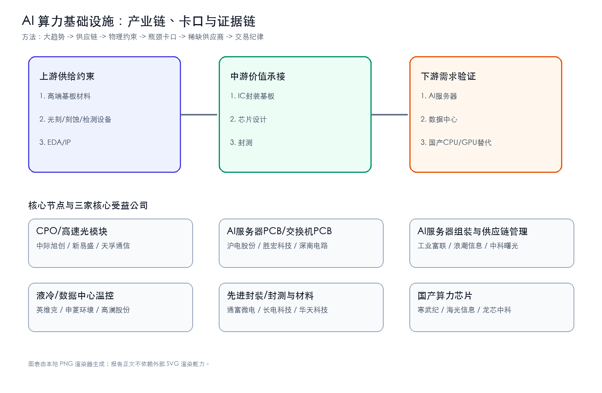
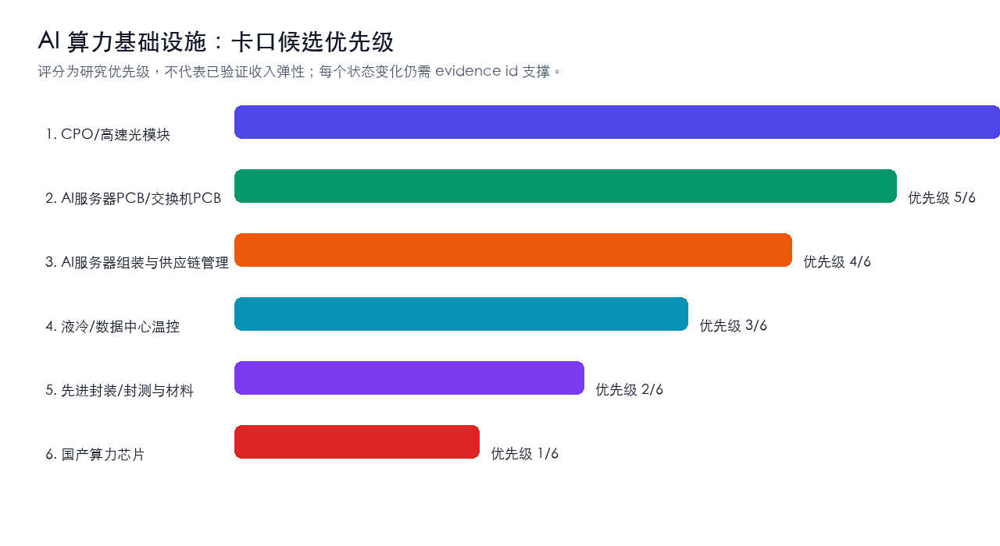
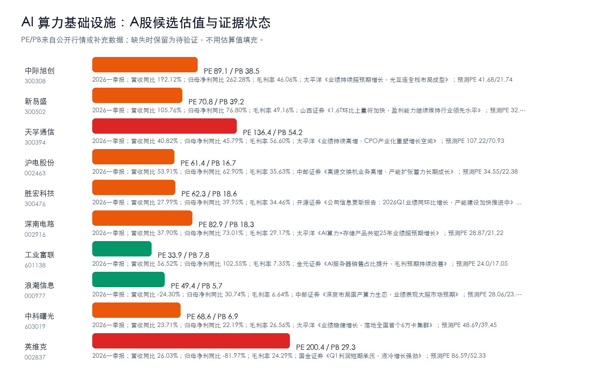

# AI 算力基础设施主题最终报告

## 研究课题

本主题研究的问题不是“AI 是否继续发展”，而是 `AI 算力基础设施` 是否已经从叙事进入供需、订单、价格、资本开支或国产替代的可证伪阶段。当前主线聚焦 AI 集群扩容的硬件瓶颈：CPO/高速光模块、AI服务器PCB、服务器整机、液冷/供电、先进封装和国产算力芯片。研究排序遵循三步：先看谁直接承接云厂商 capex，再看谁有短期供给约束，最后看估值和股价结构是否允许入场。

## 一句话结论

强命题：AI 算力链已经从“GPU 景气”切到“瓶颈材料/部件争夺”，本轮最值得押注的不是泛 AI，而是 `CPO/高速光模块 + AI服务器PCB` 这两条最直接承接云厂商 capex、且最容易出现认证/良率/交期约束的双瓶颈。方向谨慎看多，置信度中高；当前绝对核心候选收敛为：中际旭创、天孚通信、寒武纪、新易盛、沪电股份、深南电路、胜宏科技。但只要订单、价格、收入占比或客户认证没有新增证据，就只保持观察，不追高。证据：ev-chain-b40b2830e180。

## 市场盘点

### 技术突破

- 本轮主题池选中 `ai-compute-infra`，产业链分数 12，说明 `AI 算力基础设施` 仍是需持续跟踪的主题。证据：ev-chain-176cddd78a68。
- AI 算力基础设施 的边际变量应落在 CPO/高速光模块、AI服务器PCB/交换机PCB、AI服务器组装与供应链管理、液冷/数据中心温控、先进封装/封测与材料 这些能被订单、客户、收入占比、价格或监管里程碑验证的瓶颈环节。证据：ev-chain-176cddd78a68。

### 产能变化

- AI 算力基础设施 的研究价值来自供给刚性、认证周期、数据/工程闭环、客户导入和资本开支共同决定瓶颈能否持续。当前本轮数据只证明“应跟踪”，尚未证明“已紧缺”。证据：ev-chain-176cddd78a68。

### 订单确认

- 本轮尚未读到可直接证明 A股公司新增订单的公告正文；订单确认仍列为下一轮优先验证项。若后续只有研报标题或概念标签，不升级为正文结论。

### 政策 / 监管 / 地缘

- 国产算力、自主可控和供应链安全仍是中期背景变量，但不能替代公司级收入、客户认证和供需数据。

### 市场观点

- 当前证据仍以结构化产业链分析、公开研报标题和行情快照为主，尚不足以直接确认订单或收入兑现；因此报告结论为“研究主线升级”，不是交易买入结论。
- 对标深度研究文章，本报告把核心问题从“AI 是否景气”收敛为“AI 算力基础设施 哪些环节最可能形成真实瓶颈、订单确认或收入兑现”。

## 核心逻辑

1. 需求侧：AI 应用和模型迭代继续推高 `AI 算力基础设施` 相关需求，但需求强度必须通过订单、客户认证、收入占比、价格趋势或政策里程碑验证。
2. 供给侧：利润更可能集中在短期难扩产、认证周期长、替代路线慢、合规壁垒高或工程化交付难的环节，例如 CPO/高速光模块、AI服务器PCB/交换机PCB、AI服务器组装与供应链管理、液冷/数据中心温控、先进封装/封测与材料。
3. A股映射：先判断产业链位置，再核验收入/订单暴露，最后才进入估值和交易条件；不能把行情样本或主题标签直接当作核心标的。

## 关键数据

| 数据 | 数值/变化 | 来源 | 日期 | 置信度 |
| --- | --- | --- | --- | --- |
| 本轮 evidence id 数量 | 45 | full-loop result | 2026-07-09T22:27:20.700137+00:00 | High |
| 选中主题分数 | 15 | ev-chain-0cd717b3bb8e | 2026-07-09T22:27:20.700137+00:00 | Medium |
| 第一卡口候选 | CPO/高速光模块 | ev-chain-0cd717b3bb8e | 2026-07-09T22:27:20.700137+00:00 | Medium |
| 卡口公司补充样本 | 18 | a-stock-data / public fallback | 2026-07-09T22:27:20.700137+00:00 | Medium |
| 中际旭创 估值/财务 | PE 89.14 / PB 38.47；2026一季报；营收同比 192.12%；归母净利同比 262.28%；毛利率… | a-stock-data / eastmoney public | 2026-07-09T22:27:20.700137+00:00 | Medium |
| 新易盛 估值/财务 | PE 70.82 / PB 39.18；2026一季报；营收同比 105.76%；归母净利同比 76.80%；毛利率 … | a-stock-data / eastmoney public | 2026-07-09T22:27:20.700137+00:00 | Medium |
| 天孚通信 估值/财务 | PE 136.36 / PB 54.17；2026一季报；营收同比 40.82%；归母净利同比 45.79%；毛利率 5… | a-stock-data / eastmoney public | 2026-07-09T22:27:20.700137+00:00 | Medium |
| 沪电股份 估值/财务 | PE 61.42 / PB 16.69；2026一季报；营收同比 53.91%；归母净利同比 62.90%；毛利率 3… | a-stock-data / eastmoney public | 2026-07-09T22:27:20.700137+00:00 | Medium |

### 硬事实台账

硬事实台账只承认能改变供需、订单、价格、产能、良率、客户认证或财务兑现判断的信息；标题级线索会显式降级，不用于覆盖更强旧结论。

### 正文级事实摘要

- **订单/客户**：天孚通信：98%， 支撑技术迭代与产能释放， 为后续新 产品量产和客户导入提供坚实保障。（东吴证券 PDF正文 / 2026-04-08，PDF正文级/Medium-High）。交易含义：可直接提升收入兑现置信度；优先核验公告原文和客户名称
- **订单/客户**：深南电路：2025 年公司封装基板业务技术能力快速突 破，产品和客户导入进程加速，推动订单同比快速增长。（中银证券 PDF正文 / 2026-03-17，PDF正文级/Medium-High）。交易含义：可直接提升收入兑现置信度；优先核验公告原文和客户名称
- **订单/客户**：寒武纪：15亿元， 主要系原材料增长所致， 体现了公司当下为了应对各类不确定性提前备货， 保 障供应链稳定，同时也间接反映了公司在手订单增长，以满足订单交付。（东海证券 PDF正文 / 2026-03-19，PDF正文级/Medium-High）。交易含义：可直接提升收入兑现置信度；优先核验公告原文和客户名称
- **订单/客户**：深南电路：66/82 相关研究报告 <<Q3 业绩再创新高，PCB+载板双轮驱 动>>--2025-11-10 <<AI 算力产品规模出货， 带动公司业 绩超预期增长>>--…（太平洋 PDF正文 / 2026-03-26，PDF正文级/Medium-High）。交易含义：可直接提升收入兑现置信度；优先核验公告原文和客户名称
- **订单/客户**：沪电股份：鉴于高阶产能和爬坡 存在客观周期，公司将有限产能优先配置于对头部客户具有较高信赖性要求的核心产 品中， 这推动高速网络交换机及其配套路由应用领域相关 PCB 成为公…（中银证券 PDF正文 / 2026-04-15，PDF正文级/Medium-High）。交易含义：可直接提升收入兑现置信度；优先核验公告原文和客户名称
- **订单/客户**：沪电股份：公司数据通讯事业部已有超 70%的 海外客户完成认证，余下客户认证正稳步推进，26Q1 其产能利用率已 超 90%， 品质也逐步达到国内相应水准， 为充分保障后续海…（信达证券 PDF正文 / 2026-04-15，PDF正文级/Medium-High）。交易含义：可直接提升收入兑现置信度；优先核验公告原文和客户名称

| 事实类型 | 硬事实/线索 | 涉及节点 | 涉及公司 | 数值/时间 | 来源 | 证据强度 | 交易含义 |
| --- | --- | --- | --- | --- | --- | --- | --- |
| 资本开支 | 通富微电：002156通富微电投资者关系管理信息20260707 | 跨节点/待定位 | 通富微电 | 未披露明确数值/日期 | eastmoney_announcement / 2026-07-07 | 公告级/High | 需求侧强度线索，需要落到供应商订单 |
| 财务兑现 | 通富微电：2026一季报 营收同比22.80%，归母净利同比224.55%，毛利率13.32% | 跨节点/待定位 | 通富微电 | 22.80%、224.55%、13.32% | 公开财务接口 / 2026一季报 | 财报级/High | 财务已兑现优先于概念映射，但要看收入是否来自目标节点 |
| 财务兑现 | 寒武纪：2026一季报 营收同比159.56%，归母净利同比185.04%，毛利率54.33% | 跨节点/待定位 | 寒武纪 | 159.56%、185.04%、54.33% | 公开财务接口 / 2026一季报 | 财报级/High | 财务已兑现优先于概念映射，但要看收入是否来自目标节点 |
| 产能/扩产 | 通富微电：◼ 定增扩充存储、汽车及高性能计算等产品封测产能：公司公告，拟募资 44 亿元用于存储及高性能计算封测领域的产能扩张。 | 先进封装/封测与材料 | 通富微电 | 44 亿 | 群益证券 PDF正文 / 2026-02-25 | PDF正文级/Medium-High | 判断供给缺口能否持续；扩产过快也可能压制价格 |
| 财务兑现 | 寒武纪：实 现扣除非经常性损益后的净利润为 16-19 亿元， 同比扭亏。 | 跨节点/待定位 | 寒武纪 | 19 亿 | 群益证券 PDF正文 / 2026-02-27 | PDF正文级/Medium-High | 财务已兑现优先于概念映射，但要看收入是否来自目标节点 |
| 订单/客户 | 深南电路：2025 年公司封装基板业务技术能力快速突 破，产品和客户导入进程加速，推动订单同比快速增长。 | AI服务器PCB/交换机PCB | 深南电路 | 未披露明确数值/日期 | 中银证券 PDF正文 / 2026-03-17 | PDF正文级/Medium-High | 可直接提升收入兑现置信度；优先核验公告原文和客户名称 |
| 产能/扩产 | 深南电路：◼ AI、通信、汽车三轮驱动，产能释放支撑 PCB 业务高增长。 | AI服务器PCB/交换机PCB | 深南电路 | 未披露明确数值/日期 | 中银证券 PDF正文 / 2026-03-17 | PDF正文级/Medium-High | 判断供给缺口能否持续；扩产过快也可能压制价格 |
| 财务兑现 | 寒武纪：,221 2,795 3,389 所得税费用 1 2 4 7 归属母公司所有者权益 11,836 15,246 21,321 30,935 净利润 2,058 4,9… | 跨节点/待定位 | 寒武纪 | 551%、139%、78%、58% | 东海证券 PDF正文 / 2026-03-19 | PDF正文级/Medium-High | 财务已兑现优先于概念映射，但要看收入是否来自目标节点 |
| 订单/客户 | 寒武纪：15亿元， 主要系原材料增长所致， 体现了公司当下为了应对各类不确定性提前备货， 保 障供应链稳定，同时也间接反映了公司在手订单增长，以满足订单交付。 | AI服务器组装与供应链管理 | 寒武纪 | 15亿 | 东海证券 PDF正文 / 2026-03-19 | PDF正文级/Medium-High | 可直接提升收入兑现置信度；优先核验公告原文和客户名称 |
| 产能/扩产 | 深南电路：伴随存储基板占比提升，业务结构优化，叠加广州产能爬坡顺利， 驱动毛利率上行。 | AI服务器PCB/交换机PCB | 深南电路 | 未披露明确数值/日期 | 太平洋 PDF正文 / 2026-03-26 | PDF正文级/Medium-High | 判断供给缺口能否持续；扩产过快也可能压制价格 |
| 订单/客户 | 深南电路：66/82 相关研究报告 <<Q3 业绩再创新高，PCB+载板双轮驱 动>>--2025-11-10 <<AI 算力产品规模出货， 带动公司业 绩超预期增长>>--… | AI服务器PCB/交换机PCB | 深南电路 | 2025-11-10、2025-09-01、2025-03-26 | 太平洋 PDF正文 / 2026-03-26 | PDF正文级/Medium-High | 可直接提升收入兑现置信度；优先核验公告原文和客户名称 |
| 订单/客户 | 天孚通信：98%， 支撑技术迭代与产能释放， 为后续新 产品量产和客户导入提供坚实保障。 | 跨节点/待定位 | 天孚通信 | 98% | 东吴证券 PDF正文 / 2026-04-08 | PDF正文级/Medium-High | 可直接提升收入兑现置信度；优先核验公告原文和客户名称 |
| 订单/客户 | 沪电股份：鉴于高阶产能和爬坡 存在客观周期，公司将有限产能优先配置于对头部客户具有较高信赖性要求的核心产 品中， 这推动高速网络交换机及其配套路由应用领域相关 PCB 成为公… | AI服务器PCB/交换机PCB | 沪电股份 | 110% | 中银证券 PDF正文 / 2026-04-15 | PDF正文级/Medium-High | 可直接提升收入兑现置信度；优先核验公告原文和客户名称 |
| 订单/客户 | 沪电股份：公司数据通讯事业部已有超 70%的 海外客户完成认证，余下客户认证正稳步推进，26Q1 其产能利用率已 超 90%， 品质也逐步达到国内相应水准， 为充分保障后续海… | AI服务器组装与供应链管理 | 沪电股份 | 70%、90% | 信达证券 PDF正文 / 2026-04-15 | PDF正文级/Medium-High | 可直接提升收入兑现置信度；优先核验公告原文和客户名称 |
| 财务兑现 | 胜宏科技：l 盈利预测 我们预计公司 2026/2027/2028 年营收分别为 326/533/779 亿 元，归母净利润分别为 88/150/233 亿元，维持“买入”评… | 跨节点/待定位 | 胜宏科技 | 779 亿、233 亿 | 中邮证券 PDF正文 / 2026-04-19 | PDF正文级/Medium-High | 财务已兑现优先于概念映射，但要看收入是否来自目标节点 |
| 产能/扩产 | 胜宏科技：此外，公司今 年规划了不超过 180 亿元的固定资产投资总额，包括新厂房及工程建 设、设备购置、自动化产线改造升级等，加速惠州+东南亚高端产能 扩张，2026 年存… | AI服务器PCB/交换机PCB | 胜宏科技 | 180 亿 | 中邮证券 PDF正文 / 2026-04-19 | PDF正文级/Medium-High | 判断供给缺口能否持续；扩产过快也可能压制价格 |
| 财务兑现 | 通富微电：0 0 0 ROE 5% 8% 8% 9% 10% 投资活动现金流 (5286) (7689) (3600) (4788) (4866) 毛利率 15% 15% 1… | 跨节点/待定位 | 通富微电 | 5%、8%、9%、10% | 国信证券 PDF正文 / 2026-04-21 | PDF正文级/Medium-High | 财务已兑现优先于概念映射，但要看收入是否来自目标节点 |
| 产能/扩产 | 通富微电：2025年公司精准把 握国内模拟芯片国产化窗口，国内营收提升20%以上，产能利用率同步优化； | 国产算力芯片 | 通富微电 | 20% | 国信证券 PDF正文 / 2026-04-21 | PDF正文级/Medium-High | 判断供给缺口能否持续；扩产过快也可能压制价格 |

### 证据密度评分

| 维度 | 数量/评分 | 口径 | 含义 |
| --- | --- | --- | --- |
| 公告/财报级硬证据 | 18 | 订单、财报、公告风险提示、客户认证等 | 越多越接近可交易结论 |
| 研报/标题级中等证据 | 15 | 券商研报、行业研报标题、预测PE/EPS | 用于形成假设，不能单独下结论 |
| 新闻/线索级证据 | 0 | 新闻标题和主题线索 | 只进观察，不覆盖强报告 |
| 覆盖事实类型 | 4 | 订单/价格/产能/良率/财务/capex | 类型越全，越像标杆深度文 |
| 证据密度评分 | 100 | 接近标杆文事实密度 | 低于75分时不自称已对标 |

## 产业链跟踪

| 环节 | 事实映射 | 供需变化方向 | 瓶颈/卡口 | A股映射 |
| --- | --- | --- | --- | --- |
| 上游/中游 | CPO/高速光模块 | 上行 | 高速率、良率、海外大客户认证 | 中际旭创、新易盛、天孚通信 |
| 上游 | AI服务器PCB/交换机PCB | 上行 | 高多层板、材料、良率、ASP | 沪电股份、胜宏科技、深南电路 |
| 中游 | AI服务器组装 | 上行 | 大客户交付、供应链协同、规模效率 | 工业富联、浪潮信息、中科曙光 |
| 配套 | 液冷/温控 | 上行 | 机柜功率密度、数据中心验证、交付能力 | 英维克、申菱环境、高澜股份 |
| 上游 | 先进封装/封测与材料 | 上行 | 制程、认证、材料配方、资本开支 | 通富微电、长电科技、华天科技 |
| 核心芯片 | 国产算力芯片 | 上行 | 芯片架构、软件生态、交付能力 | 寒武纪、海光信息、龙芯中科 |

### 核心节点三公司校验

每个产业链节点至少保留三家处于当前节点绝对核心地位、且能通过行情/财务/研报进一步跟踪的 A 股公司；少于三家则不得升级为成熟节点。

| 产业链节点 | 核心公司1 | 核心公司2 | 核心公司3 | 升级催化 | 失效条件 |
| --- | --- | --- | --- | --- | --- |
| CPO/高速光模块 | 中际旭创 | 新易盛 | 天孚通信 | 800G/1.6T 光模块订单、CPO渗透、北美云厂商资本开支上修 | 海外AI capex放缓、价格下行、硅光替代节奏低于预期或客户集中度风险 |
| AI服务器PCB/交换机PCB | 沪电股份 | 胜宏科技 | 深南电路 | AI服务器/交换机板订单、高多层板ASP提升、产能利用率和毛利率上行 | 扩产过快、普通PCB价格回落、AI板收入占比无法验证 |
| AI服务器组装与供应链管理 | 工业富联 | 浪潮信息 | 中科曙光 | AI服务器收入占比提升、云厂商订单、整机交付节奏加快 | 代工利润率受压、客户砍单、估值只反映出货不反映利润 |
| 液冷/数据中心温控 | 英维克 | 申菱环境 | 高澜股份 | 液冷渗透率提升、机柜功率密度上行、数据中心温控订单确认 | 风冷仍可满足、价格竞争加剧、液冷收入占比披露不足 |
| 先进封装/封测与材料 | 通富微电 | 长电科技 | 华天科技 | 先进封装资本开支、封装基板/材料国产替代、客户认证进展 | 封装产能过剩、材料认证慢于预期、收入弹性弱于CPO/PCB |
| 国产算力芯片 | 寒武纪 | 海光信息 | 龙芯中科 | 国产训练/推理集群招标、软件生态适配、收入高增延续 | 生态迁移慢、交付/毛利不及预期、估值透支多年增长 |

### 瓶颈战斗地图

| 瓶颈节点 | 当前三家核心公司 | 为什么卡 | 升级信号 | 反证信号 | 节点结论 |
| --- | --- | --- | --- | --- | --- |
| CPO/高速光模块 | 中际旭创、天孚通信、新易盛 | 供给刚性/认证周期/良率爬坡 | 800G/1.6T 光模块订单、CPO渗透、北美云厂商资本开支上修 | 海外AI capex放缓、价格下行、硅光替代节奏低于预期或客户集中度风险 | 绝对核心 |
| AI服务器PCB/交换机PCB | 胜宏科技、深南电路、沪电股份 | 供给刚性/认证周期/良率爬坡 | AI服务器/交换机板订单、高多层板ASP提升、产能利用率和毛利率上行 | 扩产过快、普通PCB价格回落、AI板收入占比无法验证 | 绝对核心 |
| AI服务器组装与供应链管理 | 工业富联、中科曙光、浪潮信息 | 需求放量与国产替代 | AI服务器收入占比提升、云厂商订单、整机交付节奏加快 | 代工利润率受压、客户砍单、估值只反映出货不反映利润 | 绝对核心 |
| 液冷/数据中心温控 | 英维克、高澜股份、申菱环境 | 供给刚性/认证周期/良率爬坡 | 液冷渗透率提升、机柜功率密度上行、数据中心温控订单确认 | 风冷仍可满足、价格竞争加剧、液冷收入占比披露不足 | 绝对核心 |
| 先进封装/封测与材料 | 华天科技、通富微电、长电科技 | 供给刚性/认证周期/良率爬坡 | 先进封装资本开支、封装基板/材料国产替代、客户认证进展 | 封装产能过剩、材料认证慢于预期、收入弹性弱于CPO/PCB | 绝对核心 |
| 国产算力芯片 | 龙芯中科、海光信息、寒武纪 | 需求放量与国产替代 | 国产训练/推理集群招标、软件生态适配、收入高增延续 | 生态迁移慢、交付/毛利不及预期、估值透支多年增长 | 绝对核心 |

### 产业链核心环节价值分布

| 产业链环节 | 细分领域/关键产品 | BOM成本占比/价值占比 | 核心技术壁垒 | 卡脖子程度 | 代表A股公司 | 公司环节地位 | 证据口径/备注 |
| --- | --- | --- | --- | --- | --- | --- | --- |
| 上游/中游 | CPO/高速光模块 | 价值占比待核验；供需方向：上行 | 高速率、良率、海外大客户认证 | 高 | 中际旭创、新易盛、天孚通信 | 卡口候选/重要配套，需用收入占比、订单和客户认证继续校验 | 结构化回填；证据来自本报告既有产业链跟踪表。 |
| 上游 | AI服务器PCB/交换机PCB | 价值占比待核验；供需方向：上行 | 高多层板、材料、良率、ASP | 高 | 沪电股份、胜宏科技、深南电路 | 卡口候选/重要配套，需用收入占比、订单和客户认证继续校验 | 结构化回填；证据来自本报告既有产业链跟踪表。 |
| 中游 | AI服务器组装 | 价值占比待核验；供需方向：上行 | 大客户交付、供应链协同、规模效率 | 待核验 | 工业富联、浪潮信息、中科曙光 | 卡口候选/重要配套，需用收入占比、订单和客户认证继续校验 | 结构化回填；证据来自本报告既有产业链跟踪表。 |
| 配套 | 液冷/温控 | 价值占比待核验；供需方向：上行 | 机柜功率密度、数据中心验证、交付能力 | 中 | 英维克、申菱环境、高澜股份 | 卡口候选/重要配套，需用收入占比、订单和客户认证继续校验 | 结构化回填；证据来自本报告既有产业链跟踪表。 |
| 上游 | 先进封装/封测与材料 | 价值占比待核验；供需方向：上行 | 制程、认证、材料配方、资本开支 | 高 | 通富微电、长电科技、华天科技 | 卡口候选/重要配套，需用收入占比、订单和客户认证继续校验 | 结构化回填；证据来自本报告既有产业链跟踪表。 |
| 核心芯片 | 国产算力芯片 | 价值占比待核验；供需方向：上行 | 芯片架构、软件生态、交付能力 | 待核验 | 寒武纪、海光信息、龙芯中科 | 卡口候选/重要配套，需用收入占比、订单和客户认证继续校验 | 结构化回填；证据来自本报告既有产业链跟踪表。 |

## 投资机会挖掘

### 瓶颈识别

- 1. CPO/高速光模块：代表公司 中际旭创、新易盛、天孚通信；催化 800G/1.6T 光模块订单、CPO渗透、北美云厂商资本开支上修；失效条件 海外AI capex放缓、价格下行、硅光替代节奏低于预期或客户集中度风险。证据：ev-chain-cbbddcf84e32。
- 2. AI服务器PCB/交换机PCB：代表公司 沪电股份、胜宏科技、深南电路；催化 AI服务器/交换机板订单、高多层板ASP提升、产能利用率和毛利率上行；失效条件 扩产过快、普通PCB价格回落、AI板收入占比无法验证。证据：ev-chain-cbbddcf84e32。
- 3. AI服务器组装与供应链管理：代表公司 工业富联、浪潮信息、中科曙光；催化 AI服务器收入占比提升、云厂商订单、整机交付节奏加快；失效条件 代工利润率受压、客户砍单、估值只反映出货不反映利润。证据：ev-chain-cbbddcf84e32。
- 4. 液冷/数据中心温控：代表公司 英维克、申菱环境、高澜股份；催化 液冷渗透率提升、机柜功率密度上行、数据中心温控订单确认；失效条件 风冷仍可满足、价格竞争加剧、液冷收入占比披露不足。证据：ev-chain-cbbddcf84e32。
- 5. 先进封装/封测与材料：代表公司 通富微电、长电科技、华天科技；催化 先进封装资本开支、封装基板/材料国产替代、客户认证进展；失效条件 封装产能过剩、材料认证慢于预期、收入弹性弱于CPO/PCB。证据：ev-chain-cbbddcf84e32。

### 可交易标的筛选

- 直接暴露优先于相邻链路；公告/财报证明优先于研报标题；估值赔率优先于短期涨幅。当前所有候选仍需“收入占比/订单/客户认证”三项中的至少一项补强。

### 四标准瓶颈校验

| 候选环节 | 不可替代 | 供给刚性 | 寡头垄断 | 机构低配 | 反证条件 |
| --- | --- | --- | --- | --- | --- |
| CPO/高速光模块 | 客户认证/设计绑定/可靠性要求待继续核验；供给刚性/认证周期/良率爬坡 | 扩产、良率、交期或交付弹性待继续核验；供给刚性/认证周期/良率爬坡 | 供应集中度待继续核验；当前核心公司：中际旭创、天孚通信、新易盛 | 估值、覆盖和持仓拥挤度待继续核验；升级信号：800G/1.6T 光模块订单、CPO渗透、北美云厂商资本开支上修 | 海外AI capex放缓、价格下行、硅光替代节奏低于预期或客户集中度风险 |
| AI服务器PCB/交换机PCB | 客户认证/设计绑定/可靠性要求待继续核验；供给刚性/认证周期/良率爬坡 | 扩产、良率、交期或交付弹性待继续核验；供给刚性/认证周期/良率爬坡 | 供应集中度待继续核验；当前核心公司：胜宏科技、深南电路、沪电股份 | 估值、覆盖和持仓拥挤度待继续核验；升级信号：AI服务器/交换机板订单、高多层板ASP提升、产能利用率和毛利率上行 | 扩产过快、普通PCB价格回落、AI板收入占比无法验证 |
| AI服务器组装与供应链管理 | 客户认证/设计绑定/可靠性要求待继续核验；需求放量与国产替代 | 扩产、良率、交期或交付弹性待继续核验；需求放量与国产替代 | 供应集中度待继续核验；当前核心公司：工业富联、中科曙光、浪潮信息 | 估值、覆盖和持仓拥挤度待继续核验；升级信号：AI服务器收入占比提升、云厂商订单、整机交付节奏加快 | 代工利润率受压、客户砍单、估值只反映出货不反映利润 |
| 液冷/数据中心温控 | 客户认证/设计绑定/可靠性要求待继续核验；供给刚性/认证周期/良率爬坡 | 扩产、良率、交期或交付弹性待继续核验；供给刚性/认证周期/良率爬坡 | 供应集中度待继续核验；当前核心公司：英维克、高澜股份、申菱环境 | 估值、覆盖和持仓拥挤度待继续核验；升级信号：液冷渗透率提升、机柜功率密度上行、数据中心温控订单确认 | 风冷仍可满足、价格竞争加剧、液冷收入占比披露不足 |
| 先进封装/封测与材料 | 客户认证/设计绑定/可靠性要求待继续核验；供给刚性/认证周期/良率爬坡 | 扩产、良率、交期或交付弹性待继续核验；供给刚性/认证周期/良率爬坡 | 供应集中度待继续核验；当前核心公司：华天科技、通富微电、长电科技 | 估值、覆盖和持仓拥挤度待继续核验；升级信号：先进封装资本开支、封装基板/材料国产替代、客户认证进展 | 封装产能过剩、材料认证慢于预期、收入弹性弱于CPO/PCB |
| 国产算力芯片 | 客户认证/设计绑定/可靠性要求待继续核验；需求放量与国产替代 | 扩产、良率、交期或交付弹性待继续核验；需求放量与国产替代 | 供应集中度待继续核验；当前核心公司：龙芯中科、海光信息、寒武纪 | 估值、覆盖和持仓拥挤度待继续核验；升级信号：国产训练/推理集群招标、软件生态适配、收入高增延续 | 生态迁移慢、交付/毛利不及预期、估值透支多年增长 |

## A股可交易标的估值对比

> 本轮没有通过交易决策与风险收益比门槛的现阶段买入候选，K线支撑/压力图不展开；产业链核心公司仍保留在估值和证据观察表。

| 公司 | 代码 | 产业链位置 | 当前估值 | 财务/订单信号 | 催化 | 买点条件 | 失效条件 |
| --- | --- | --- | --- | --- | --- | --- | --- |
| 中际旭创 | 300308 | CPO/高速光模块 | PE 89.14 / PB 38.47 | 2026一季报；营收同比 192.12%；归母净利同比 262.28%；毛利率 46.06%；太平洋《业绩持续超预期增长，光互连全栈布局成型》；预测PE 41.68/21.74 | 800G/1.6T 光模块订单、CPO渗透、北美云厂商资本开支上修 | 等待买入触发：当前未进入买入候选；需先满足交易决策、风险收益比、K线企稳和订单/价格/客户认证增量证据 | 海外AI capex放缓、价格下行、硅光替代节奏低于预期或客户集中度风险 |
| 新易盛 | 300502 | CPO/高速光模块 | PE 70.82 / PB 39.18 | 2026一季报；营收同比 105.76%；归母净利同比 76.80%；毛利率 49.16%；山西证券《1.6T环比上量将加快，盈利能力继续维持行业领先水平》；预测PE 32.8/17.2 | 800G/1.6T 光模块订单、CPO渗透、北美云厂商资本开支上修 | 等待买入触发：当前未进入买入候选；需先满足交易决策、风险收益比、K线企稳和订单/价格/客户认证增量证据 | 海外AI capex放缓、价格下行、硅光替代节奏低于预期或客户集中度风险 |
| 天孚通信 | 300394 | CPO/高速光模块 | PE 136.36 / PB 54.17 | 2026一季报；营收同比 40.82%；归母净利同比 45.79%；毛利率 56.60%；太平洋《业绩持续高增，CPO产业化重塑增长空间》；预测PE 107.22/70.93 | 800G/1.6T 光模块订单、CPO渗透、北美云厂商资本开支上修 | 等待买入触发：当前未进入买入候选；需先满足交易决策、风险收益比、K线企稳和订单/价格/客户认证增量证据 | 海外AI capex放缓、价格下行、硅光替代节奏低于预期或客户集中度风险 |
| 沪电股份 | 002463 | AI服务器PCB/交换机PCB | PE 61.42 / PB 16.69 | 2026一季报；营收同比 53.91%；归母净利同比 62.90%；毛利率 35.63%；中邮证券《高速交换机业务高增，产能扩张蓄力长期成长》；预测PE 34.55/22.38 | AI服务器/交换机板订单、高多层板ASP提升、产能利用率和毛利率上行 | 等待买入触发：当前未进入买入候选；需先满足交易决策、风险收益比、K线企稳和订单/价格/客户认证增量证据 | 扩产过快、普通PCB价格回落、AI板收入占比无法验证 |
| 胜宏科技 | 300476 | AI服务器PCB/交换机PCB | PE 62.31 / PB 18.62 | 2026一季报；营收同比 27.99%；归母净利同比 39.95%；毛利率 34.46%；开源证券《公司信息更新报告：2026Q1业绩同环比增长，产能建设加快推进中》；预测PE 33.7/19.9 | AI服务器/交换机板订单、高多层板ASP提升、产能利用率和毛利率上行 | 等待买入触发：当前未进入买入候选；需先满足交易决策、风险收益比、K线企稳和订单/价格/客户认证增量证据 | 扩产过快、普通PCB价格回落、AI板收入占比无法验证 |
| 深南电路 | 002916 | AI服务器PCB/交换机PCB | PE 82.94 / PB 18.32 | 2026一季报；营收同比 37.90%；归母净利同比 73.01%；毛利率 29.17%；太平洋《AI算力+存储产品共驱25年业绩超预期增长》；预测PE 28.87/21.22 | AI服务器/交换机板订单、高多层板ASP提升、产能利用率和毛利率上行 | 等待买入触发：当前未进入买入候选；需先满足交易决策、风险收益比、K线企稳和订单/价格/客户认证增量证据 | 扩产过快、普通PCB价格回落、AI板收入占比无法验证 |
| 工业富联 | 601138 | AI服务器组装与供应链管理 | PE 33.94 / PB 7.83 | 2026一季报；营收同比 56.52%；归母净利同比 102.55%；毛利率 7.35%；金元证券《AI服务器销售占比提升，毛利预期持续改善》；预测PE 24.0/17.05 | AI服务器收入占比提升、云厂商订单、整机交付节奏加快 | 等待买入触发：当前未进入买入候选；需先满足交易决策、风险收益比、K线企稳和订单/价格/客户认证增量证据 | 代工利润率受压、客户砍单、估值只反映出货不反映利润 |
| 浪潮信息 | 000977 | AI服务器组装与供应链管理 | PE 49.42 / PB 5.68 | 2026一季报；营收同比 -24.30%；归母净利同比 30.74%；毛利率 6.64%；中邮证券《深度布局国产算力生态，业绩表现大超市场预期》；预测PE 28.06/23.36 | AI服务器收入占比提升、云厂商订单、整机交付节奏加快 | 等待买入触发：当前未进入买入候选；需先满足交易决策、风险收益比、K线企稳和订单/价格/客户认证增量证据 | 代工利润率受压、客户砍单、估值只反映出货不反映利润 |
| 中科曙光 | 603019 | AI服务器组装与供应链管理 | PE 68.61 / PB 6.92 | 2026一季报；营收同比 23.71%；归母净利同比 22.19%；毛利率 26.56%；太平洋《业绩稳健增长，落地全国首个6万卡集群》；预测PE 48.69/39.45 | AI服务器收入占比提升、云厂商订单、整机交付节奏加快 | 等待买入触发：当前未进入买入候选；需先满足交易决策、风险收益比、K线企稳和订单/价格/客户认证增量证据 | 代工利润率受压、客户砍单、估值只反映出货不反映利润 |
| 英维克 | 002837 | 液冷/数据中心温控 | PE 200.36 / PB 29.34 | 2026一季报；营收同比 26.03%；归母净利同比 -81.97%；毛利率 24.29%；国金证券《Q1利润短期承压，液冷增长强劲》；预测PE 86.59/52.33 | 液冷渗透率提升、机柜功率密度上行、数据中心温控订单确认 | 等待买入触发：当前未进入买入候选；需先满足交易决策、风险收益比、K线企稳和订单/价格/客户认证增量证据 | 风冷仍可满足、价格竞争加剧、液冷收入占比披露不足 |
| 申菱环境 | 301018 | 液冷/数据中心温控 | PE 242.17 / PB 17.1 | 2026一季报；营收同比 -1.80%；归母净利同比 -47.71%；毛利率 20.60%；国金证券《业绩符合预期，在手订单充沛、液冷业务蓄势待发》；预测PE 76.2/50.45 | 液冷渗透率提升、机柜功率密度上行、数据中心温控订单确认 | 等待买入触发：当前未进入买入候选；需先满足交易决策、风险收益比、K线企稳和订单/价格/客户认证增量证据 | 风冷仍可满足、价格竞争加剧、液冷收入占比披露不足 |
| 高澜股份 | 300499 | 液冷/数据中心温控 | PE 390.79 / PB 8.7 | 2026一季报；营收同比 -2.77%；归母净利同比 16.55%；毛利率 30.68%；国信证券《特高压纯水冷却设备龙头，数据中心液冷打造第二成长曲线》；预测PE 66.5/39.4 | 液冷渗透率提升、机柜功率密度上行、数据中心温控订单确认 | 等待买入触发：当前未进入买入候选；需先满足交易决策、风险收益比、K线企稳和订单/价格/客户认证增量证据 | 风冷仍可满足、价格竞争加剧、液冷收入占比披露不足 |
| 通富微电 | 002156 | 先进封装/封测与材料 | PE 78.46 / PB 7.3 | 2026一季报；营收同比 22.80%；归母净利同比 224.55%；毛利率 13.32%；开源证券《公司信息更新报告：业绩重回增长快车道，资本开支开启新周期》；预测PE 52.8/42.4 | 先进封装资本开支、封装基板/材料国产替代、客户认证进展 | 等待买入触发：当前未进入买入候选；需先满足交易决策、风险收益比、K线企稳和订单/价格/客户认证增量证据 | 封装产能过剩、材料认证慢于预期、收入弹性弱于CPO/PCB |
| 长电科技 | 600584 | 先进封装/封测与材料 | PE 112.12 / PB 6.48 | 2026一季报；营收同比 -1.76%；归母净利同比 42.74%；毛利率 14.55%；中邮证券《先进封装，芯连万象》；预测PE 83.64/65.03 | 先进封装资本开支、封装基板/材料国产替代、客户认证进展 | 等待买入触发：当前未进入买入候选；需先满足交易决策、风险收益比、K线企稳和订单/价格/客户认证增量证据 | 封装产能过剩、材料认证慢于预期、收入弹性弱于CPO/PCB |
| 华天科技 | 002185 | 先进封装/封测与材料 | PE 96.67 / PB 4.42 | 2026一季报；营收同比 34.49%；归母净利同比 568.39%；毛利率 11.32%；华龙证券《公司深度研究：聚焦先进封装，迈向全球领先封测企业》；预测PE 42.4/34.6 | 先进封装资本开支、封装基板/材料国产替代、客户认证进展 | 等待买入触发：当前未进入买入候选；需先满足交易决策、风险收益比、K线企稳和订单/价格/客户认证增量证据 | 封装产能过剩、材料认证慢于预期、收入弹性弱于CPO/PCB |
| 寒武纪 | 688256 | 国产算力芯片 | PE 355.09 / PB 78.83 | 2026一季报；营收同比 159.56%；归母净利同比 185.04%；毛利率 54.33%；第一上海证券《AI Agent时代来临，国产算力支撑AI建设》；预测PE 83.9/49.7 | 国产训练/推理集群招标、软件生态适配、收入高增延续 | 等待买入触发：当前未进入买入候选；需先满足交易决策、风险收益比、K线企稳和订单/价格/客户认证增量证据 | 生态迁移慢、交付/毛利不及预期、估值透支多年增长 |
| 海光信息 | 688041 | 国产算力芯片 | PE 309.89 / PB 36.49 | 2026一季报；营收同比 68.06%；归母净利同比 35.82%；毛利率 55.60%；中银证券《双芯驱动，生态筑基，引领国产算力新纪元》；预测PE 155.2/109.1 | 国产训练/推理集群招标、软件生态适配、收入高增延续 | 等待买入触发：当前未进入买入候选；需先满足交易决策、风险收益比、K线企稳和订单/价格/客户认证增量证据 | 生态迁移慢、交付/毛利不及预期、估值透支多年增长 |
| 龙芯中科 | 688047 | 国产算力芯片 | PE -143.87 / PB 25.06 | 2026一季报；营收同比 7.96%；归母净利同比 24.66%；毛利率 34.87%；东海证券《公司简评报告：下游需求显著回暖，持续拓展开放市场》；预测PE NA/3628.28 | 国产训练/推理集群招标、软件生态适配、收入高增延续 | 等待买入触发：当前未进入买入候选；需先满足交易决策、风险收益比、K线企稳和订单/价格/客户认证增量证据 | 生态迁移慢、交付/毛利不及预期、估值透支多年增长 |

### A股公司映射与核心地位判断

| 公司 | 代码 | 环节 | 细分领域 | 产业占比/暴露度 | 核心技术/产品 | 卡脖子相关性 | 环节地位 | 证据与备注 |
| --- | --- | --- | --- | --- | --- | --- | --- | --- |
| 中际旭创 | 300308 | CPO/高速光模块 | CPO/高速光模块 | 已进入本报告跟踪池；精确收入/订单占比待公告或财报核验 | CPO/高速光模块 | 高 | 绝对核心 | 结构化回填；既有证据：2026一季报；营收同比 192.12%；归母净利同比 262.28%；毛利率 46.06%；太平洋《业绩持续超预期增长，光互连全栈布局成型》；预测PE 41.68/21.74；反证/失效：海外AI capex放缓、价格下行、硅光替代节奏低于预期或客户集中度风险 |
| 新易盛 | 300502 | CPO/高速光模块 | CPO/高速光模块 | 已进入本报告跟踪池；精确收入/订单占比待公告或财报核验 | CPO/高速光模块 | 高 | 绝对核心 | 结构化回填；既有证据：2026一季报；营收同比 105.76%；归母净利同比 76.80%；毛利率 49.16%；山西证券《1.6T环比上量将加快，盈利能力继续维持行业领先水平》；预测PE 32.8/17.2；反证/失效：海外AI capex放缓、价格下行、硅光替代节奏低于预期或客户集中度风险 |
| 天孚通信 | 300394 | CPO/高速光模块 | CPO/高速光模块 | 已进入本报告跟踪池；精确收入/订单占比待公告或财报核验 | CPO/高速光模块 | 高 | 绝对核心 | 结构化回填；既有证据：2026一季报；营收同比 40.82%；归母净利同比 45.79%；毛利率 56.60%；太平洋《业绩持续高增，CPO产业化重塑增长空间》；预测PE 107.22/70.93；反证/失效：海外AI capex放缓、价格下行、硅光替代节奏低于预期或客户集中度风险 |
| 沪电股份 | 002463 | AI服务器PCB/交换机PCB | AI服务器PCB/交换机PCB | 已进入本报告跟踪池；精确收入/订单占比待公告或财报核验 | AI服务器PCB/交换机PCB | 高 | 绝对核心 | 结构化回填；既有证据：2026一季报；营收同比 53.91%；归母净利同比 62.90%；毛利率 35.63%；中邮证券《高速交换机业务高增，产能扩张蓄力长期成长》；预测PE 34.55/22.38；反证/失效：扩产过快、普通PCB价格回落、AI板收入占比无法验证 |
| 胜宏科技 | 300476 | AI服务器PCB/交换机PCB | AI服务器PCB/交换机PCB | 已进入本报告跟踪池；精确收入/订单占比待公告或财报核验 | AI服务器PCB/交换机PCB | 高 | 绝对核心 | 结构化回填；既有证据：2026一季报；营收同比 27.99%；归母净利同比 39.95%；毛利率 34.46%；开源证券《公司信息更新报告：2026Q1业绩同环比增长，产能建设加快推进中》；预测PE 33.7/19.9；反证/失效：扩产过快、普通PCB价格回落、AI板收入占比无法验证 |
| 深南电路 | 002916 | AI服务器PCB/交换机PCB | AI服务器PCB/交换机PCB | 已进入本报告跟踪池；精确收入/订单占比待公告或财报核验 | AI服务器PCB/交换机PCB | 高 | 绝对核心 | 结构化回填；既有证据：2026一季报；营收同比 37.90%；归母净利同比 73.01%；毛利率 29.17%；太平洋《AI算力+存储产品共驱25年业绩超预期增长》；预测PE 28.87/21.22；反证/失效：扩产过快、普通PCB价格回落、AI板收入占比无法验证 |
| 工业富联 | 601138 | AI服务器组装与供应链管理 | AI服务器组装与供应链管理 | 已进入本报告跟踪池；精确收入/订单占比待公告或财报核验 | AI服务器组装与供应链管理 | 高 | 绝对核心 | 结构化回填；既有证据：2026一季报；营收同比 56.52%；归母净利同比 102.55%；毛利率 7.35%；金元证券《AI服务器销售占比提升，毛利预期持续改善》；预测PE 24.0/17.05；反证/失效：代工利润率受压、客户砍单、估值只反映出货不反映利润 |
| 浪潮信息 | 000977 | AI服务器组装与供应链管理 | AI服务器组装与供应链管理 | 已进入本报告跟踪池；精确收入/订单占比待公告或财报核验 | AI服务器组装与供应链管理 | 高 | 绝对核心 | 结构化回填；既有证据：2026一季报；营收同比 -24.30%；归母净利同比 30.74%；毛利率 6.64%；中邮证券《深度布局国产算力生态，业绩表现大超市场预期》；预测PE 28.06/23.36；反证/失效：代工利润率受压、客户砍单、估值只反映出货不反映利润 |
| 中科曙光 | 603019 | AI服务器组装与供应链管理 | AI服务器组装与供应链管理 | 已进入本报告跟踪池；精确收入/订单占比待公告或财报核验 | AI服务器组装与供应链管理 | 高 | 绝对核心 | 结构化回填；既有证据：2026一季报；营收同比 23.71%；归母净利同比 22.19%；毛利率 26.56%；太平洋《业绩稳健增长，落地全国首个6万卡集群》；预测PE 48.69/39.45；反证/失效：代工利润率受压、客户砍单、估值只反映出货不反映利润 |
| 英维克 | 002837 | 液冷/数据中心温控 | 液冷/数据中心温控 | 已进入本报告跟踪池；精确收入/订单占比待公告或财报核验 | 液冷/数据中心温控 | 高 | 绝对核心 | 结构化回填；既有证据：2026一季报；营收同比 26.03%；归母净利同比 -81.97%；毛利率 24.29%；国金证券《Q1利润短期承压，液冷增长强劲》；预测PE 86.59/52.33；反证/失效：风冷仍可满足、价格竞争加剧、液冷收入占比披露不足 |
| 申菱环境 | 301018 | 液冷/数据中心温控 | 液冷/数据中心温控 | 已进入本报告跟踪池；精确收入/订单占比待公告或财报核验 | 液冷/数据中心温控 | 高 | 绝对核心 | 结构化回填；既有证据：2026一季报；营收同比 -1.80%；归母净利同比 -47.71%；毛利率 20.60%；国金证券《业绩符合预期，在手订单充沛、液冷业务蓄势待发》；预测PE 76.2/50.45；反证/失效：风冷仍可满足、价格竞争加剧、液冷收入占比披露不足 |
| 高澜股份 | 300499 | 液冷/数据中心温控 | 液冷/数据中心温控 | 已进入本报告跟踪池；精确收入/订单占比待公告或财报核验 | 液冷/数据中心温控 | 高 | 绝对核心 | 结构化回填；既有证据：2026一季报；营收同比 -2.77%；归母净利同比 16.55%；毛利率 30.68%；国信证券《特高压纯水冷却设备龙头，数据中心液冷打造第二成长曲线》；预测PE 66.5/39.4；反证/失效：风冷仍可满足、价格竞争加剧、液冷收入占比披露不足 |
| 通富微电 | 002156 | 先进封装/封测与材料 | 先进封装/封测与材料 | 已进入本报告跟踪池；精确收入/订单占比待公告或财报核验 | 先进封装/封测与材料 | 高 | 绝对核心 | 结构化回填；既有证据：2026一季报；营收同比 22.80%；归母净利同比 224.55%；毛利率 13.32%；开源证券《公司信息更新报告：业绩重回增长快车道，资本开支开启新周期》；预测PE 52.8/42.4；反证/失效：封装产能过剩、材料认证慢于预期、收入弹性弱于CPO/PCB |
| 长电科技 | 600584 | 先进封装/封测与材料 | 先进封装/封测与材料 | 已进入本报告跟踪池；精确收入/订单占比待公告或财报核验 | 先进封装/封测与材料 | 高 | 绝对核心 | 结构化回填；既有证据：2026一季报；营收同比 -1.76%；归母净利同比 42.74%；毛利率 14.55%；中邮证券《先进封装，芯连万象》；预测PE 83.64/65.03；反证/失效：封装产能过剩、材料认证慢于预期、收入弹性弱于CPO/PCB |
| 华天科技 | 002185 | 先进封装/封测与材料 | 先进封装/封测与材料 | 已进入本报告跟踪池；精确收入/订单占比待公告或财报核验 | 先进封装/封测与材料 | 高 | 绝对核心 | 结构化回填；既有证据：2026一季报；营收同比 34.49%；归母净利同比 568.39%；毛利率 11.32%；华龙证券《公司深度研究：聚焦先进封装，迈向全球领先封测企业》；预测PE 42.4/34.6；反证/失效：封装产能过剩、材料认证慢于预期、收入弹性弱于CPO/PCB |
| 寒武纪 | 688256 | 国产算力芯片 | 国产算力芯片 | 已进入本报告跟踪池；精确收入/订单占比待公告或财报核验 | 国产算力芯片 | 高 | 绝对核心 | 结构化回填；既有证据：2026一季报；营收同比 159.56%；归母净利同比 185.04%；毛利率 54.33%；第一上海证券《AI Agent时代来临，国产算力支撑AI建设》；预测PE 83.9/49.7；反证/失效：生态迁移慢、交付/毛利不及预期、估值透支多年增长 |
| 海光信息 | 688041 | 国产算力芯片 | 国产算力芯片 | 已进入本报告跟踪池；精确收入/订单占比待公告或财报核验 | 国产算力芯片 | 高 | 绝对核心 | 结构化回填；既有证据：2026一季报；营收同比 68.06%；归母净利同比 35.82%；毛利率 55.60%；中银证券《双芯驱动，生态筑基，引领国产算力新纪元》；预测PE 155.2/109.1；反证/失效：生态迁移慢、交付/毛利不及预期、估值透支多年增长 |
| 龙芯中科 | 688047 | 国产算力芯片 | 国产算力芯片 | 已进入本报告跟踪池；精确收入/订单占比待公告或财报核验 | 国产算力芯片 | 高 | 绝对核心 | 结构化回填；既有证据：2026一季报；营收同比 7.96%；归母净利同比 24.66%；毛利率 34.87%；东海证券《公司简评报告：下游需求显著回暖，持续拓展开放市场》；预测PE NA/3628.28；反证/失效：生态迁移慢、交付/毛利不及预期、估值透支多年增长 |

## 核心个股交易跟踪

| 公司 | 代码 | 产业链位置 | 估值 | 财务质量 | 趋势结构 | 关键位 | 买入条件 | 止损/失效 | 卖出/目标 |
| --- | --- | --- | --- | --- | --- | --- | --- | --- | --- |
| 中际旭创 | 300308 | CPO/高速光模块 | PE 89.14 / PB 38.47 | 2026一季报；营收同比 192.12%；归母净利同比 262.28%；毛利率 46.06% | 现价 1194.90；涨跌幅 5.90%；MA5/10/20/60=1132.01/1177.01/1225.41/1072.02；20日箱体 1060.34-1416.88；震荡分歧；20日箱体位置38%；风险收益比3.34 | 支撑 1128.35；压力 1416.88 | 等待买入触发：当前未进入买入候选；需先满足交易决策、风险收益比、K线企稳和订单/价格/客户认证增量证据 | 跌破1128.35且订单/业绩无增量；海外AI capex放缓、价格下行、硅光替代节奏低于预期或客户集中度风险 | 未设技术目标：尚未进入买入候选，先观察证据和价格结构是否修复 |
| 新易盛 | 300502 | CPO/高速光模块 | PE 70.82 / PB 39.18 | 2026一季报；营收同比 105.76%；归母净利同比 76.80%；毛利率 49.16% | 现价 545.50；涨跌幅 6.78%；MA5/10/20/60=519.87/541.38/548.65/477.66；20日箱体 490.10-618.87；震荡分歧；20日箱体位置43%；风险收益比2.12 | 支撑 510.84；压力 618.87 | 等待买入触发：当前未进入买入候选；需先满足交易决策、风险收益比、K线企稳和订单/价格/客户认证增量证据 | 跌破510.84且订单/业绩无增量；海外AI capex放缓、价格下行、硅光替代节奏低于预期或客户集中度风险 | 未设技术目标：尚未进入买入候选，先观察证据和价格结构是否修复 |
| 天孚通信 | 300394 | CPO/高速光模块 | PE 136.36 / PB 54.17 | 2026一季报；营收同比 40.82%；归母净利同比 45.79%；毛利率 56.60% | 现价 271.50；涨跌幅 10.51%；MA5/10/20/60=249.67/270.00/293.75/278.03；20日箱体 231.45-346.00；震荡分歧；20日箱体位置35%；风险收益比2.89 | 支撑 245.68；压力 346.00 | 等待买入触发：当前未进入买入候选；需先满足交易决策、风险收益比、K线企稳和订单/价格/客户认证增量证据 | 跌破245.68且订单/业绩无增量；海外AI capex放缓、价格下行、硅光替代节奏低于预期或客户集中度风险 | 未设技术目标：尚未进入买入候选，先观察证据和价格结构是否修复 |
| 沪电股份 | 002463 | AI服务器PCB/交换机PCB | PE 61.42 / PB 16.69 | 2026一季报；营收同比 53.91%；归母净利同比 62.90%；毛利率 35.63% | 现价 137.30；涨跌幅 7.10%；MA5/10/20/60=131.88/137.61/138.96/121.14；20日箱体 122.22-158.20；震荡分歧；20日箱体位置42%；风险收益比2.30 | 支撑 128.20；压力 158.20 | 等待买入触发：当前未进入买入候选；需先满足交易决策、风险收益比、K线企稳和订单/价格/客户认证增量证据 | 跌破128.20且订单/业绩无增量；扩产过快、普通PCB价格回落、AI板收入占比无法验证 | 未设技术目标：尚未进入买入候选，先观察证据和价格结构是否修复 |
| 胜宏科技 | 300476 | AI服务器PCB/交换机PCB | PE 62.31 / PB 18.62 | 2026一季报；营收同比 27.99%；归母净利同比 39.95%；毛利率 34.46% | 现价 296.70；涨跌幅 6.09%；MA5/10/20/60=292.42/307.64/327.85/337.74；20日箱体 277.01-375.80；空头趋势；20日箱体位置20%；风险收益比4.64 | 支撑 279.66；压力 375.80 | 等待买入触发：当前未进入买入候选；需先满足交易决策、风险收益比、K线企稳和订单/价格/客户认证增量证据 | 跌破279.66且订单/业绩无增量；扩产过快、普通PCB价格回落、AI板收入占比无法验证 | 未设技术目标：尚未进入买入候选，先观察证据和价格结构是否修复 |
| 深南电路 | 002916 | AI服务器PCB/交换机PCB | PE 82.94 / PB 18.32 | 2026一季报；营收同比 37.90%；归母净利同比 73.01%；毛利率 29.17% | 现价 442.56；涨跌幅 10.00%；MA5/10/20/60=430.33/434.84/428.80/368.09；20日箱体 370.00-484.57；多头趋势；20日箱体位置63%；风险收益比3.05 | 支撑 428.80；压力 484.57 | 等待买入触发：当前未进入买入候选；需先满足交易决策、风险收益比、K线企稳和订单/价格/客户认证增量证据 | 跌破428.80且订单/业绩无增量；扩产过快、普通PCB价格回落、AI板收入占比无法验证 | 未设技术目标：尚未进入买入候选，先观察证据和价格结构是否修复 |
| 工业富联 | 601138 | AI服务器组装与供应链管理 | PE 33.94 / PB 7.83 | 2026一季报；营收同比 56.52%；归母净利同比 102.55%；毛利率 7.35% | 现价 69.53；涨跌幅 5.33%；MA5/10/20/60=65.53/67.36/70.85/68.76；20日箱体 61.50-79.90；震荡分歧；20日箱体位置44%；风险收益比2.95 | 支撑 66.01；压力 79.90 | 等待买入触发：当前未进入买入候选；需先满足交易决策、风险收益比、K线企稳和订单/价格/客户认证增量证据 | 跌破66.01且订单/业绩无增量；代工利润率受压、客户砍单、估值只反映出货不反映利润 | 未设技术目标：尚未进入买入候选，先观察证据和价格结构是否修复 |
| 浪潮信息 | 000977 | AI服务器组装与供应链管理 | PE 49.42 / PB 5.68 | 2026一季报；营收同比 -24.30%；归母净利同比 30.74%；毛利率 6.64% | 现价 85.99；涨跌幅 10.00%；MA5/10/20/60=74.26/70.20/66.84/68.31；20日箱体 57.15-85.99；震荡分歧；20日箱体位置100%；风险收益比0.00 | 支撑 78.17；压力 85.99 | 等待买入触发：当前未进入买入候选；需先满足交易决策、风险收益比、K线企稳和订单/价格/客户认证增量证据 | 跌破78.17且订单/业绩无增量；代工利润率受压、客户砍单、估值只反映出货不反映利润 | 未设技术目标：尚未进入买入候选，先观察证据和价格结构是否修复 |
| 中科曙光 | 603019 | AI服务器组装与供应链管理 | PE 68.61 / PB 6.92 | 2026一季报；营收同比 23.71%；归母净利同比 22.19%；毛利率 26.56% | 现价 103.99；涨跌幅 5.95%；MA5/10/20/60=96.58/98.34/92.74/91.83；20日箱体 80.51-109.60；多头趋势；20日箱体位置81%；风险收益比0.96 | 支撑 98.15；压力 109.60 | 等待买入触发：当前未进入买入候选；需先满足交易决策、风险收益比、K线企稳和订单/价格/客户认证增量证据 | 跌破98.15且订单/业绩无增量；代工利润率受压、客户砍单、估值只反映出货不反映利润 | 未设技术目标：尚未进入买入候选，先观察证据和价格结构是否修复 |
| 英维克 | 002837 | 液冷/数据中心温控 | PE 200.36 / PB 29.34 | 2026一季报；营收同比 26.03%；归母净利同比 -81.97%；毛利率 24.29% | 现价 75.87；涨跌幅 5.20%；MA5/10/20/60=72.95/74.97/75.21/75.82；20日箱体 66.08-89.69；震荡分歧；20日箱体位置41%；风险收益比21.08 | 支撑 75.21；压力 89.69 | 等待买入触发：当前未进入买入候选；需先满足交易决策、风险收益比、K线企稳和订单/价格/客户认证增量证据 | 跌破75.21且订单/业绩无增量；风冷仍可满足、价格竞争加剧、液冷收入占比披露不足 | 未设技术目标：尚未进入买入候选，先观察证据和价格结构是否修复 |
| 申菱环境 | 301018 | 液冷/数据中心温控 | PE 242.17 / PB 17.1 | 2026一季报；营收同比 -1.80%；归母净利同比 -47.71%；毛利率 20.60% | 现价 123.55；涨跌幅 4.81%；MA5/10/20/60=120.46/114.57/111.91/101.89；20日箱体 95.66-133.11；多头趋势；20日箱体位置74%；风险收益比1.69 | 支撑 117.88；压力 133.11 | 等待买入触发：当前未进入买入候选；需先满足交易决策、风险收益比、K线企稳和订单/价格/客户认证增量证据 | 跌破117.88且订单/业绩无增量；风冷仍可满足、价格竞争加剧、液冷收入占比披露不足 | 未设技术目标：尚未进入买入候选，先观察证据和价格结构是否修复 |
| 高澜股份 | 300499 | 液冷/数据中心温控 | PE 390.79 / PB 8.7 | 2026一季报；营收同比 -2.77%；归母净利同比 16.55%；毛利率 30.68% | 现价 39.09；涨跌幅 3.66%；MA5/10/20/60=38.44/38.16/38.45/40.40；20日箱体 33.75-46.46；震荡分歧；20日箱体位置42%；风险收益比11.51 | 支撑 38.45；压力 46.46 | 等待买入触发：当前未进入买入候选；需先满足交易决策、风险收益比、K线企稳和订单/价格/客户认证增量证据 | 跌破38.45且订单/业绩无增量；风冷仍可满足、价格竞争加剧、液冷收入占比披露不足 | 未设技术目标：尚未进入买入候选，先观察证据和价格结构是否修复 |
| 通富微电 | 002156 | 先进封装/封测与材料 | PE 78.46 / PB 7.3 | 2026一季报；营收同比 22.80%；归母净利同比 224.55%；毛利率 13.32% | 现价 74.78；涨跌幅 3.62%；MA5/10/20/60=69.39/70.15/69.12/62.00；20日箱体 56.68-79.38；多头趋势；20日箱体位置80%；风险收益比1.76 | 支撑 72.17；压力 79.38 | 等待买入触发：当前未进入买入候选；需先满足交易决策、风险收益比、K线企稳和订单/价格/客户认证增量证据 | 跌破72.17且订单/业绩无增量；封装产能过剩、材料认证慢于预期、收入弹性弱于CPO/PCB | 未设技术目标：尚未进入买入候选，先观察证据和价格结构是否修复 |
| 长电科技 | 600584 | 先进封装/封测与材料 | PE 112.12 / PB 6.48 | 2026一季报；营收同比 -1.76%；归母净利同比 42.74%；毛利率 14.55% | 现价 103.52；涨跌幅 10.00%；MA5/10/20/60=96.92/99.49/91.37/70.47；20日箱体 67.85-111.11；多头趋势；20日箱体位置82%；风险收益比0.81 | 支撑 94.11；压力 111.11 | 等待买入触发：当前未进入买入候选；需先满足交易决策、风险收益比、K线企稳和订单/价格/客户认证增量证据 | 跌破94.11且订单/业绩无增量；封装产能过剩、材料认证慢于预期、收入弹性弱于CPO/PCB | 未设技术目标：尚未进入买入候选，先观察证据和价格结构是否修复 |
| 华天科技 | 002185 | 先进封装/封测与材料 | PE 96.67 / PB 4.42 | 2026一季报；营收同比 34.49%；归母净利同比 568.39%；毛利率 11.32% | 现价 23.73；涨跌幅 10.01%；MA5/10/20/60=21.34/21.56/20.27/16.89；20日箱体 16.01-23.86；多头趋势；20日箱体位置98%；风险收益比0.06 | 支撑 21.57；压力 23.86 | 等待买入触发：当前未进入买入候选；需先满足交易决策、风险收益比、K线企稳和订单/价格/客户认证增量证据 | 跌破21.57且订单/业绩无增量；封装产能过剩、材料认证慢于预期、收入弹性弱于CPO/PCB | 未设技术目标：尚未进入买入候选，先观察证据和价格结构是否修复 |
| 寒武纪 | 688256 | 国产算力芯片 | PE 355.09 / PB 78.83 | 2026一季报；营收同比 159.56%；归母净利同比 185.04%；毛利率 54.33% | 现价 1535.53；涨跌幅 0.03%；MA5/10/20/60=1448.15/1452.86/1426.20/1253.50；20日箱体 1202.00-1620.00；多头趋势；20日箱体位置80%；风险收益比162.44 | 支撑 1535.01；压力 1620.00 | 等待买入触发：当前未进入买入候选；需先满足交易决策、风险收益比、K线企稳和订单/价格/客户认证增量证据 | 跌破1535.01且订单/业绩无增量；生态迁移慢、交付/毛利不及预期、估值透支多年增长 | 未设技术目标：尚未进入买入候选，先观察证据和价格结构是否修复 |
| 海光信息 | 688041 | 国产算力芯片 | PE 309.89 / PB 36.49 | 2026一季报；营收同比 68.06%；归母净利同比 35.82%；毛利率 55.60% | 现价 363.46；涨跌幅 5.96%；MA5/10/20/60=342.69/345.57/329.80/306.34；20日箱体 278.85-377.88；多头趋势；20日箱体位置85%；风险收益比0.70 | 支撑 343.00；压力 377.88 | 等待买入触发：当前未进入买入候选；需先满足交易决策、风险收益比、K线企稳和订单/价格/客户认证增量证据 | 跌破343.00且订单/业绩无增量；生态迁移慢、交付/毛利不及预期、估值透支多年增长 | 未设技术目标：尚未进入买入候选，先观察证据和价格结构是否修复 |
| 龙芯中科 | 688047 | 国产算力芯片 | PE -143.87 / PB 25.06 | 2026一季报；营收同比 7.96%；归母净利同比 24.66%；毛利率 34.87% | 现价 149.91；涨跌幅 7.08%；MA5/10/20/60=141.27/144.95/144.35/150.68；20日箱体 131.30-158.63；震荡分歧；20日箱体位置68%；风险收益比1.57 | 支撑 144.35；压力 158.63 | 等待买入触发：当前未进入买入候选；需先满足交易决策、风险收益比、K线企稳和订单/价格/客户认证增量证据 | 跌破144.35且订单/业绩无增量；生态迁移慢、交付/毛利不及预期、估值透支多年增长 | 未设技术目标：尚未进入买入候选，先观察证据和价格结构是否修复 |

这张表的作用是把产业逻辑落到交易纪律：现价接近压力位且风险收益比不足时，即便产业逻辑强，也只能等待回踩或新的订单证据；现价回到支撑区但订单/毛利/收入占比无验证，同样不能升级。

## 产业链 / 竞争格局

| 公司 | 代码 | 卡口环节 | 直接性 | 财务信号 | 研报/公告信号 | 估值压力 | 反证条件 |
| --- | --- | --- | --- | --- | --- | --- | --- |
| 中际旭创 | 300308 | CPO/高速光模块 | 核心卡口候选 | 2026一季报；营收同比 192.12%；归母净利同比 262.28%；毛利率 46.06% | 太平洋《业绩持续超预期增长，光互连全栈布局成型》；预测PE 41.68/21.74 | 高 | 海外AI capex放缓、价格下行、硅光替代节奏低于预期或客户集中度风险 |
| 新易盛 | 300502 | CPO/高速光模块 | 核心卡口候选 | 2026一季报；营收同比 105.76%；归母净利同比 76.80%；毛利率 49.16% | 山西证券《1.6T环比上量将加快，盈利能力继续维持行业领先水平》；预测PE 32.8/17.2 | 中 | 海外AI capex放缓、价格下行、硅光替代节奏低于预期或客户集中度风险 |
| 天孚通信 | 300394 | CPO/高速光模块 | 核心卡口候选 | 2026一季报；营收同比 40.82%；归母净利同比 45.79%；毛利率 56.60% | 太平洋《业绩持续高增，CPO产业化重塑增长空间》；预测PE 107.22/70.93 | 高 | 海外AI capex放缓、价格下行、硅光替代节奏低于预期或客户集中度风险 |
| 沪电股份 | 002463 | AI服务器PCB/交换机PCB | 核心卡口候选 | 2026一季报；营收同比 53.91%；归母净利同比 62.90%；毛利率 35.63% | 中邮证券《高速交换机业务高增，产能扩张蓄力长期成长》；预测PE 34.55/22.38 | 中 | 扩产过快、普通PCB价格回落、AI板收入占比无法验证 |
| 胜宏科技 | 300476 | AI服务器PCB/交换机PCB | 核心卡口候选 | 2026一季报；营收同比 27.99%；归母净利同比 39.95%；毛利率 34.46% | 开源证券《公司信息更新报告：2026Q1业绩同环比增长，产能建设加快推进中》；预测PE 33.7/19.9 | 中 | 扩产过快、普通PCB价格回落、AI板收入占比无法验证 |
| 深南电路 | 002916 | AI服务器PCB/交换机PCB | 核心卡口候选 | 2026一季报；营收同比 37.90%；归母净利同比 73.01%；毛利率 29.17% | 太平洋《AI算力+存储产品共驱25年业绩超预期增长》；预测PE 28.87/21.22 | 高 | 扩产过快、普通PCB价格回落、AI板收入占比无法验证 |
| 工业富联 | 601138 | AI服务器组装与供应链管理 | 核心卡口候选 | 2026一季报；营收同比 56.52%；归母净利同比 102.55%；毛利率 7.35% | 金元证券《AI服务器销售占比提升，毛利预期持续改善》；预测PE 24.0/17.05 | 中 | 代工利润率受压、客户砍单、估值只反映出货不反映利润 |
| 浪潮信息 | 000977 | AI服务器组装与供应链管理 | 核心卡口候选 | 2026一季报；营收同比 -24.30%；归母净利同比 30.74%；毛利率 6.64% | 中邮证券《深度布局国产算力生态，业绩表现大超市场预期》；预测PE 28.06/23.36 | 中 | 代工利润率受压、客户砍单、估值只反映出货不反映利润 |
| 中科曙光 | 603019 | AI服务器组装与供应链管理 | 核心卡口候选 | 2026一季报；营收同比 23.71%；归母净利同比 22.19%；毛利率 26.56% | 太平洋《业绩稳健增长，落地全国首个6万卡集群》；预测PE 48.69/39.45 | 中 | 代工利润率受压、客户砍单、估值只反映出货不反映利润 |
| 英维克 | 002837 | 液冷/数据中心温控 | 核心卡口候选 | 2026一季报；营收同比 26.03%；归母净利同比 -81.97%；毛利率 24.29% | 国金证券《Q1利润短期承压，液冷增长强劲》；预测PE 86.59/52.33 | 极高 | 风冷仍可满足、价格竞争加剧、液冷收入占比披露不足 |
| 申菱环境 | 301018 | 液冷/数据中心温控 | 核心卡口候选 | 2026一季报；营收同比 -1.80%；归母净利同比 -47.71%；毛利率 20.60% | 国金证券《业绩符合预期，在手订单充沛、液冷业务蓄势待发》；预测PE 76.2/50.45 | 极高 | 风冷仍可满足、价格竞争加剧、液冷收入占比披露不足 |
| 高澜股份 | 300499 | 液冷/数据中心温控 | 核心卡口候选 | 2026一季报；营收同比 -2.77%；归母净利同比 16.55%；毛利率 30.68% | 国信证券《特高压纯水冷却设备龙头，数据中心液冷打造第二成长曲线》；预测PE 66.5/39.4 | 极高 | 风冷仍可满足、价格竞争加剧、液冷收入占比披露不足 |
| 通富微电 | 002156 | 先进封装/封测与材料 | 核心卡口候选 | 2026一季报；营收同比 22.80%；归母净利同比 224.55%；毛利率 13.32% | 开源证券《公司信息更新报告：业绩重回增长快车道，资本开支开启新周期》；预测PE 52.8/42.4 | 中 | 封装产能过剩、材料认证慢于预期、收入弹性弱于CPO/PCB |
| 长电科技 | 600584 | 先进封装/封测与材料 | 核心卡口候选 | 2026一季报；营收同比 -1.76%；归母净利同比 42.74%；毛利率 14.55% | 中邮证券《先进封装，芯连万象》；预测PE 83.64/65.03 | 高 | 封装产能过剩、材料认证慢于预期、收入弹性弱于CPO/PCB |
| 华天科技 | 002185 | 先进封装/封测与材料 | 核心卡口候选 | 2026一季报；营收同比 34.49%；归母净利同比 568.39%；毛利率 11.32% | 华龙证券《公司深度研究：聚焦先进封装，迈向全球领先封测企业》；预测PE 42.4/34.6 | 高 | 封装产能过剩、材料认证慢于预期、收入弹性弱于CPO/PCB |
| 寒武纪 | 688256 | 国产算力芯片 | 核心卡口候选 | 2026一季报；营收同比 159.56%；归母净利同比 185.04%；毛利率 54.33% | 第一上海证券《AI Agent时代来临，国产算力支撑AI建设》；预测PE 83.9/49.7 | 极高 | 生态迁移慢、交付/毛利不及预期、估值透支多年增长 |
| 海光信息 | 688041 | 国产算力芯片 | 核心卡口候选 | 2026一季报；营收同比 68.06%；归母净利同比 35.82%；毛利率 55.60% | 中银证券《双芯驱动，生态筑基，引领国产算力新纪元》；预测PE 155.2/109.1 | 极高 | 生态迁移慢、交付/毛利不及预期、估值透支多年增长 |
| 龙芯中科 | 688047 | 国产算力芯片 | 核心卡口候选 | 2026一季报；营收同比 7.96%；归母净利同比 24.66%；毛利率 34.87% | 东海证券《公司简评报告：下游需求显著回暖，持续拓展开放市场》；预测PE NA/3628.28 | 中 | 生态迁移慢、交付/毛利不及预期、估值透支多年增长 |

竞争判断：上游材料、设备和封装/互连环节若具备客户认证、良率和产能约束，更接近“瓶颈资产”；但若估值已经处在高压区，只有订单、价格、客户认证或收入占比继续补强，才能从“产业链好公司”升级为“可执行机会”。中游组装和概念映射若缺少差异化，容易只获得主题估值而非利润传导。

## 标的分层与入场条件

### 龙头分层

| 层级 | 公司 | 代码 | 节点 | 入选原因 | 升级触发器 | 降级/剔除条件 |
| --- | --- | --- | --- | --- | --- | --- |
| 绝对核心龙头 | 中际旭创 | 300308 | CPO/高速光模块 | 卡在硬件瓶颈；财务增速可见；风险收益比3.34；PE 89.1 | 800G/1.6T 光模块订单、CPO渗透、北美云厂商资本开支上修 | 海外AI capex放缓、价格下行、硅光替代节奏低于预期或客户集中度风险 |
| 绝对核心龙头 | 天孚通信 | 300394 | CPO/高速光模块 | 卡在硬件瓶颈；财务增速可见；风险收益比2.89；PE 136.4 | 800G/1.6T 光模块订单、CPO渗透、北美云厂商资本开支上修 | 海外AI capex放缓、价格下行、硅光替代节奏低于预期或客户集中度风险 |
| 绝对核心龙头 | 寒武纪 | 688256 | 国产算力芯片 | 卡在硬件瓶颈；财务增速可见；风险收益比162.44；PE 355.1 | 国产训练/推理集群招标、软件生态适配、收入高增延续 | 生态迁移慢、交付/毛利不及预期、估值透支多年增长 |
| 绝对核心龙头 | 新易盛 | 300502 | CPO/高速光模块 | 卡在硬件瓶颈；财务增速可见；风险收益比2.12；PE 70.8 | 800G/1.6T 光模块订单、CPO渗透、北美云厂商资本开支上修 | 海外AI capex放缓、价格下行、硅光替代节奏低于预期或客户集中度风险 |
| 绝对核心龙头 | 沪电股份 | 002463 | AI服务器PCB/交换机PCB | 卡在硬件瓶颈；财务增速可见；风险收益比2.30；PE 61.4 | AI服务器/交换机板订单、高多层板ASP提升、产能利用率和毛利率上行 | 扩产过快、普通PCB价格回落、AI板收入占比无法验证 |
| 绝对核心龙头 | 深南电路 | 002916 | AI服务器PCB/交换机PCB | 卡在硬件瓶颈；财务增速可见；风险收益比3.05；PE 82.9 | AI服务器/交换机板订单、高多层板ASP提升、产能利用率和毛利率上行 | 扩产过快、普通PCB价格回落、AI板收入占比无法验证 |
| 绝对核心龙头 | 胜宏科技 | 300476 | AI服务器PCB/交换机PCB | 卡在硬件瓶颈；财务增速可见；风险收益比4.64；PE 62.3 | AI服务器/交换机板订单、高多层板ASP提升、产能利用率和毛利率上行 | 扩产过快、普通PCB价格回落、AI板收入占比无法验证 |
| 高弹性二线 | 中科曙光 | 603019 | AI服务器组装与供应链管理 | 卡在硬件瓶颈；财务增速可见；风险收益比0.96；PE 68.6 | AI服务器收入占比提升、云厂商订单、整机交付节奏加快 | 代工利润率受压、客户砍单、估值只反映出货不反映利润 |
| 高弹性二线 | 华天科技 | 002185 | 先进封装/封测与材料 | 卡在硬件瓶颈；财务增速可见；风险收益比0.06；PE 96.7 | 先进封装资本开支、封装基板/材料国产替代、客户认证进展 | 封装产能过剩、材料认证慢于预期、收入弹性弱于CPO/PCB |
| 高弹性二线 | 工业富联 | 601138 | AI服务器组装与供应链管理 | 卡在硬件瓶颈；财务增速可见；风险收益比2.95；PE 33.9 | AI服务器收入占比提升、云厂商订单、整机交付节奏加快 | 代工利润率受压、客户砍单、估值只反映出货不反映利润 |
| 高弹性二线 | 浪潮信息 | 000977 | AI服务器组装与供应链管理 | 卡在硬件瓶颈；财务增速可见；风险收益比0.00；PE 49.4 | AI服务器收入占比提升、云厂商订单、整机交付节奏加快 | 代工利润率受压、客户砍单、估值只反映出货不反映利润 |
| 高弹性二线 | 海光信息 | 688041 | 国产算力芯片 | 卡在硬件瓶颈；财务增速可见；风险收益比0.70；PE 309.9 | 国产训练/推理集群招标、软件生态适配、收入高增延续 | 生态迁移慢、交付/毛利不及预期、估值透支多年增长 |
| 高弹性二线 | 申菱环境 | 301018 | 液冷/数据中心温控 | 卡在硬件瓶颈；财务增速可见；风险收益比1.69；PE 242.2 | 液冷渗透率提升、机柜功率密度上行、数据中心温控订单确认 | 风冷仍可满足、价格竞争加剧、液冷收入占比披露不足 |
| 高弹性二线 | 英维克 | 002837 | 液冷/数据中心温控 | 卡在硬件瓶颈；财务增速可见；风险收益比21.08；PE 200.4 | 液冷渗透率提升、机柜功率密度上行、数据中心温控订单确认 | 风冷仍可满足、价格竞争加剧、液冷收入占比披露不足 |
| 高弹性二线 | 通富微电 | 002156 | 先进封装/封测与材料 | 卡在硬件瓶颈；财务增速可见；风险收益比1.76；PE 78.5 | 先进封装资本开支、封装基板/材料国产替代、客户认证进展 | 封装产能过剩、材料认证慢于预期、收入弹性弱于CPO/PCB |
| 高弹性二线 | 长电科技 | 600584 | 先进封装/封测与材料 | 卡在硬件瓶颈；财务增速可见；风险收益比0.81；PE 112.1 | 先进封装资本开支、封装基板/材料国产替代、客户认证进展 | 封装产能过剩、材料认证慢于预期、收入弹性弱于CPO/PCB |
| 高弹性二线 | 高澜股份 | 300499 | 液冷/数据中心温控 | 卡在硬件瓶颈；财务增速可见；风险收益比11.51；PE 390.8 | 液冷渗透率提升、机柜功率密度上行、数据中心温控订单确认 | 风冷仍可满足、价格竞争加剧、液冷收入占比披露不足 |
| 高弹性二线 | 龙芯中科 | 688047 | 国产算力芯片 | 卡在硬件瓶颈；财务增速可见；风险收益比1.57；PE -143.9 | 国产训练/推理集群招标、软件生态适配、收入高增延续 | 生态迁移慢、交付/毛利不及预期、估值透支多年增长 |

- 核心环节龙头：先进封装/封装基板/光模块/液冷等直接受益且收入暴露可验证的公司；入场条件是订单、价格或客户认证出现增量证据。
- 关键技术突破者：国产替代、材料配方、设备良率或高速互连技术有明确突破的公司；入场条件是从研报线索升级到公告/财报/客户证据。
- 重要配套：服务器部件、供电、温控、连接器等；入场条件是资本开支和交付量持续确认。
- 待验证概念：仅有 AI 标签或行情异动但缺少收入暴露的公司；默认留在观察池。

### 事件-交易触发器

| 公司 | 节点 | 需要等待的硬证据 | 买入触发 | 卖出/减仓触发 | 反证退出 |
| --- | --- | --- | --- | --- | --- |
| 中际旭创 | CPO/高速光模块 | 800G/1.6T 光模块订单、CPO渗透、北美云厂商资本开支上修 | 等待买入触发：当前未进入买入候选；需先满足交易决策、风险收益比、K线企稳和订单/价格/客户认证增量证据 | 未设技术目标：尚未进入买入候选，先观察证据和价格结构是否修复 | 海外AI capex放缓、价格下行、硅光替代节奏低于预期或客户集中度风险 |
| 新易盛 | CPO/高速光模块 | 800G/1.6T 光模块订单、CPO渗透、北美云厂商资本开支上修 | 等待买入触发：当前未进入买入候选；需先满足交易决策、风险收益比、K线企稳和订单/价格/客户认证增量证据 | 未设技术目标：尚未进入买入候选，先观察证据和价格结构是否修复 | 海外AI capex放缓、价格下行、硅光替代节奏低于预期或客户集中度风险 |
| 天孚通信 | CPO/高速光模块 | 800G/1.6T 光模块订单、CPO渗透、北美云厂商资本开支上修 | 等待买入触发：当前未进入买入候选；需先满足交易决策、风险收益比、K线企稳和订单/价格/客户认证增量证据 | 未设技术目标：尚未进入买入候选，先观察证据和价格结构是否修复 | 海外AI capex放缓、价格下行、硅光替代节奏低于预期或客户集中度风险 |
| 沪电股份 | AI服务器PCB/交换机PCB | AI服务器/交换机板订单、高多层板ASP提升、产能利用率和毛利率上行 | 等待买入触发：当前未进入买入候选；需先满足交易决策、风险收益比、K线企稳和订单/价格/客户认证增量证据 | 未设技术目标：尚未进入买入候选，先观察证据和价格结构是否修复 | 扩产过快、普通PCB价格回落、AI板收入占比无法验证 |
| 胜宏科技 | AI服务器PCB/交换机PCB | AI服务器/交换机板订单、高多层板ASP提升、产能利用率和毛利率上行 | 等待买入触发：当前未进入买入候选；需先满足交易决策、风险收益比、K线企稳和订单/价格/客户认证增量证据 | 未设技术目标：尚未进入买入候选，先观察证据和价格结构是否修复 | 扩产过快、普通PCB价格回落、AI板收入占比无法验证 |
| 深南电路 | AI服务器PCB/交换机PCB | AI服务器/交换机板订单、高多层板ASP提升、产能利用率和毛利率上行 | 等待买入触发：当前未进入买入候选；需先满足交易决策、风险收益比、K线企稳和订单/价格/客户认证增量证据 | 未设技术目标：尚未进入买入候选，先观察证据和价格结构是否修复 | 扩产过快、普通PCB价格回落、AI板收入占比无法验证 |
| 工业富联 | AI服务器组装与供应链管理 | AI服务器收入占比提升、云厂商订单、整机交付节奏加快 | 等待买入触发：当前未进入买入候选；需先满足交易决策、风险收益比、K线企稳和订单/价格/客户认证增量证据 | 未设技术目标：尚未进入买入候选，先观察证据和价格结构是否修复 | 代工利润率受压、客户砍单、估值只反映出货不反映利润 |
| 浪潮信息 | AI服务器组装与供应链管理 | AI服务器收入占比提升、云厂商订单、整机交付节奏加快 | 等待买入触发：当前未进入买入候选；需先满足交易决策、风险收益比、K线企稳和订单/价格/客户认证增量证据 | 未设技术目标：尚未进入买入候选，先观察证据和价格结构是否修复 | 代工利润率受压、客户砍单、估值只反映出货不反映利润 |

## 风险、反证与退出条件

- 订单反证：公告、年报或调研无法验证新增订单、客户认证或收入占比。
- 供给反证：替代路线成熟、扩产过快或价格回落，导致卡口缓解。
- 估值反证：估值和成交拥挤先于基本面兑现，风险收益比低于 2:1。
- 主题反证：新闻/研报热度上升但公司财务、订单和价格信号没有同步改善。

## 数据来源与证据强度

| 结论/数据 | 来源 | 日期 | 置信度 | 证据id |
| --- | --- | --- | --- | --- |
| 中际旭创 行情、财务、研报补充 | a-stock-data / eastmoney public | 2026-07-09T21:47:38.651104+00:00 | 公开数据/Medium | ev-market-cn-c820ee8ce827 |
| 新易盛 行情、财务、研报补充 | a-stock-data / eastmoney public | 2026-07-09T21:47:38.651104+00:00 | 公开数据/Medium | ev-market-cn-c820ee8ce827 |
| 天孚通信 行情、财务、研报补充 | a-stock-data / eastmoney public | 2026-07-09T21:47:38.651104+00:00 | 公开数据/Medium | ev-market-cn-c820ee8ce827 |
| 沪电股份 行情、财务、研报补充 | a-stock-data / eastmoney public | 2026-07-09T21:47:38.651104+00:00 | 公开数据/Medium | ev-market-cn-c820ee8ce827 |
| 胜宏科技 行情、财务、研报补充 | a-stock-data / eastmoney public | 2026-07-09T21:47:38.651104+00:00 | 公开数据/Medium | ev-market-cn-c820ee8ce827 |
| 深南电路 行情、财务、研报补充 | a-stock-data / eastmoney public | 2026-07-09T21:47:38.651104+00:00 | 公开数据/Medium | ev-market-cn-c820ee8ce827 |
| 证券行业周报：上周指数和板块内个股表现强势 | 申港证券 | 2026-07-09 | 标题级/Medium | ev-report-f49fe55f1c75 |
| 家电行业2026H2投资策略：家电消费有望度过至暗时刻，积极关注科技转型 | 国信证券 | 2026-07-09 | 标题级/Medium | ev-report-f49fe55f1c75 |
| 医药生物行业2026年中期投资策略：行业底部夯实，风物长宜放远 | 东海证券 | 2026-07-09 | 标题级/Medium | ev-report-f49fe55f1c75 |
| 高端制造行业ETF月报（2026年7月）：受益下游业务爆发及国产进程加速，关注光通… | 金融街证券 | 2026-07-09 | 标题级/Medium | ev-report-f49fe55f1c75 |
| 基础化工行业深度：周期行业ETF策略手册-判断行业发展趋势选ETF | 金融街证券 | 2026-07-09 | 标题级/Medium | ev-report-f49fe55f1c75 |
| 灰白基底上的精密革命——低碳转型与定制化需求重塑特种水泥价值曲线 头豹词条报告系列 | 头豹研究院 | 2026-07-09 | 标题级/Medium | ev-report-f49fe55f1c75 |
| GPT-5.6 is now the preferred model in Mic… | OpenAI | 2026-07-09T13:00:00+00:00 | 线索级/Low | ev-news-6f89f1d5a93c |
| ChatGPT is now a partner for your most am… | OpenAI | 2026-07-09T10:00:00+00:00 | 线索级/Low | ev-news-6f89f1d5a93c |
