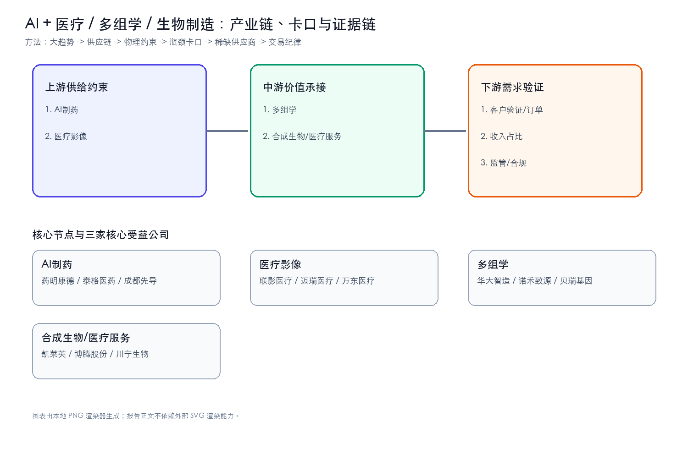
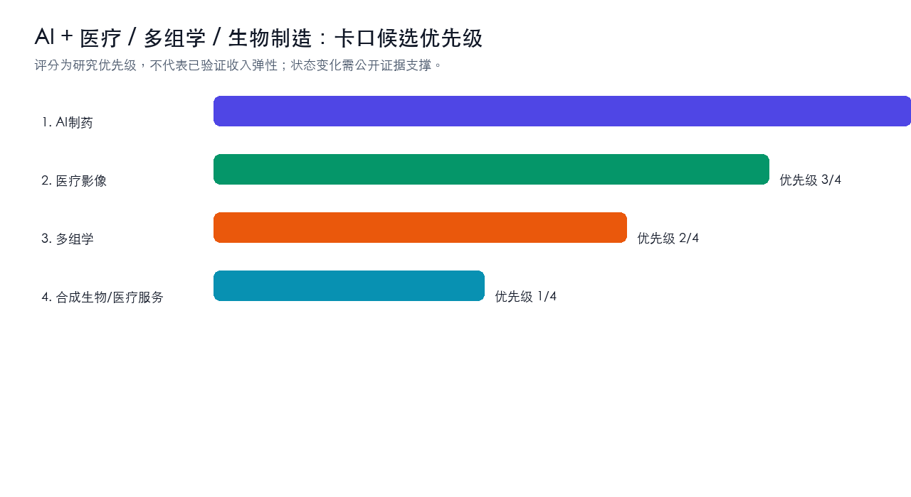
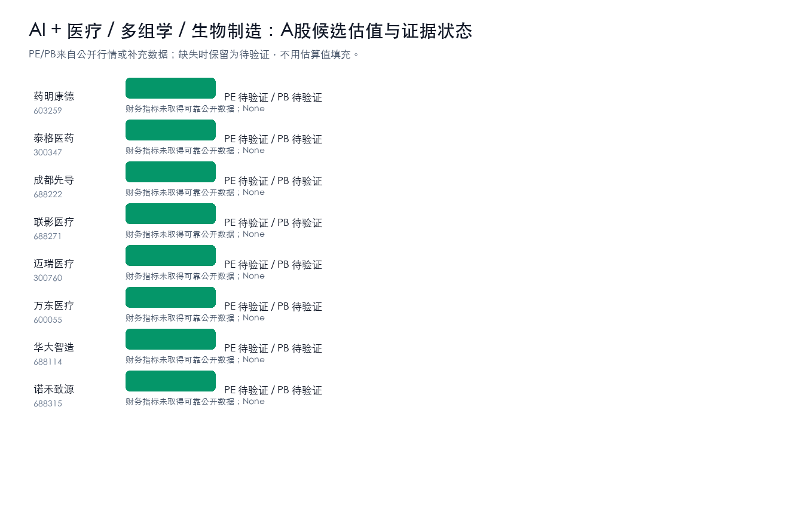
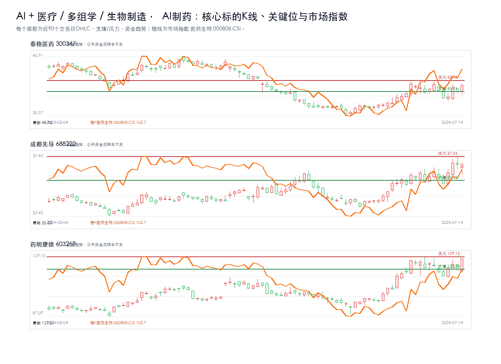
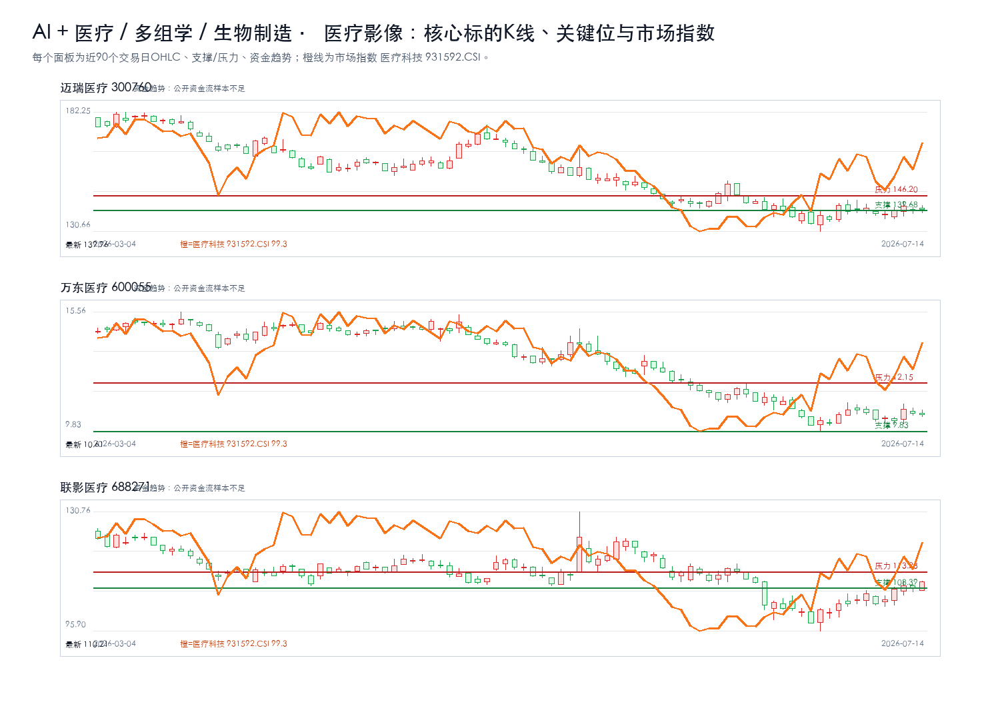
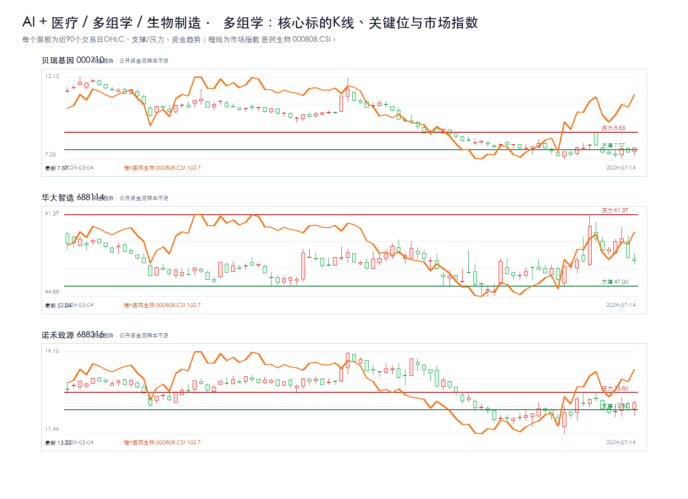
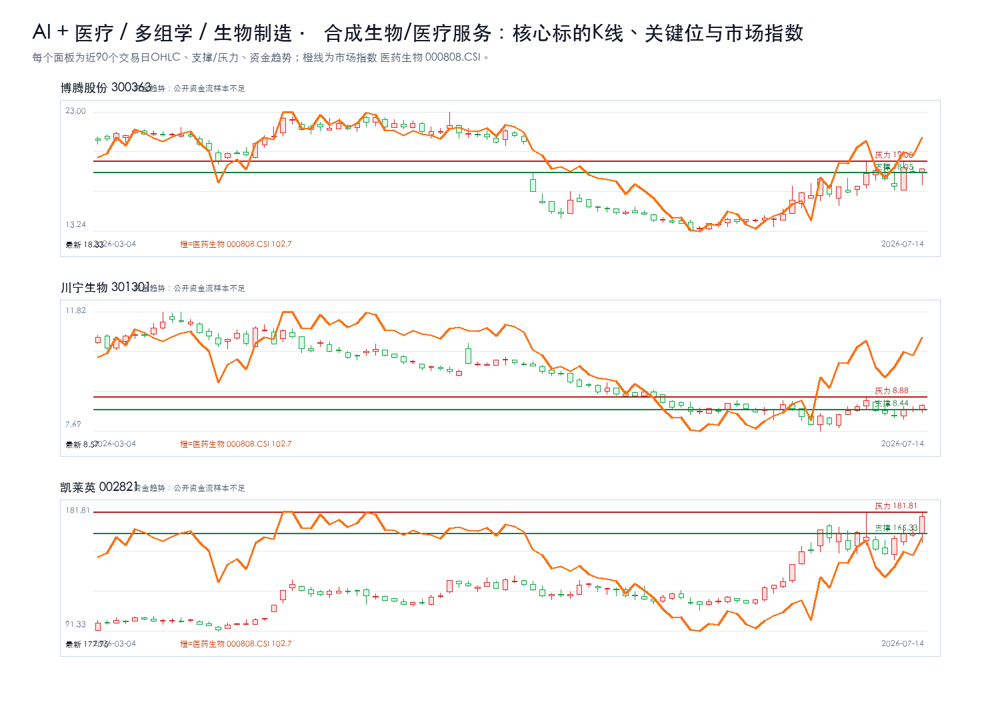

# AI + 医疗 / 多组学 / 生物制造主题最终报告

## 研究课题

本报告只回答三个问题：`AI + 医疗 / 多组学 / 生物制造` 的利润会流向哪些卡口，A股哪些公司真正暴露在这些卡口上，当前价格是否允许执行。当前跟踪范围收敛在 AI制药、医疗影像、多组学、合成生物/医疗服务。

## 一句话结论

强命题：AI + 医疗 / 多组学 / 生物制造 的机会不在泛主题，而在 `AI制药 + 医疗影像` 能否持续出现订单、价格、客户认证、收入占比或监管里程碑。方向谨慎看多，置信度中等；当前绝对核心候选为：药明康德、泰格医药、成都先导、联影医疗、迈瑞医疗。没有新增硬证据时，只观察，不追高。

## 市场盘点

- 需求：AI资本开支仍是背景变量，但只有订单、产能、客户认证和收入占比能把主题变成业绩。
- 供给：重点看认证周期、良率/交付、关键材料和工程化能力是否造成瓶颈。
- 价格：股价接近压力位时不追；回到支撑区也要等硬证据同步。
- 证据密度：硬事实台账仍偏薄，PDF正文级和公告级证据不足，研报标题只作线索。

## 核心逻辑

1. 需求侧：AI 应用和模型迭代继续推高 `AI + 医疗 / 多组学 / 生物制造` 相关需求，但需求强度必须通过订单、客户认证、收入占比、价格趋势或政策里程碑验证。
2. 供给侧：利润更可能集中在短期难扩产、认证周期长、替代路线慢、合规壁垒高或工程化交付难的环节，例如 AI制药、医疗影像、多组学、合成生物/医疗服务。
3. A股映射：先判断产业链位置，再核验收入/订单暴露，最后才进入估值和交易条件；不能把行情样本或主题标签直接当作核心标的。

## 关键数据

| 判断项 | 当前结论 | 投资含义 |
| --- | --- | --- |
| 核心卡口 | AI制药、医疗影像、多组学、合成生物/医疗服务 | 优先验证订单、价格、客户认证和收入占比 |
| 核心候选 | 药明康德、泰格医药、成都先导、联影医疗、迈瑞医疗 | 只在买入触发满足时进入交易候选 |
| 财务口径 | 核心公司继续跟踪营收同比、归母净利同比、毛利率、预测PE | 财务改善要和订单/客户认证同步才升级 |
| 证据密度 | 公告/财报级硬证据不足，研报和新闻只作线索 | 不把主题热度等同于买入结论 |
| 正文证据 | 硬事实台账不铺长表；PDF正文级证据不足时降级为线索 | 避免把内部过程写进正文 |
| 交易纪律 | 等待买入触发；风险收益比不足时不追高 | 买点、支撑、压力和止损优先于叙事 |

## 产业链跟踪

### 产业链核心环节价值分布

| 产业链环节 | 细分领域/关键产品 | BOM成本占比/价值占比 | 核心技术壁垒 | 卡脖子程度 | 代表A股公司 | 公司环节地位 | 证据口径/备注 |
| --- | --- | --- | --- | --- | --- | --- | --- |
| 上游 | AI制药 | 待验证 | 客户认证、数据闭环、工程化交付、合规和成本控制 | High | 药明康德、泰格医药、成都先导 | 待验证 | 公开产业链与财务/研报口径，待公告和客户认证继续核验 |
| 上游 | 医疗影像 | 待验证 | 客户认证、数据闭环、工程化交付、合规和成本控制 | High | 联影医疗、迈瑞医疗、万东医疗 | 待验证 | 公开产业链与财务/研报口径，待公告和客户认证继续核验 |
| 中游 | 多组学 | 待验证 | 客户认证、数据闭环、工程化交付、合规和成本控制 | Medium | 华大智造、诺禾致源、贝瑞基因 | 待验证 | 公开产业链与财务/研报口径，待公告和客户认证继续核验 |
| 中游 | 合成生物/医疗服务 | 待验证 | 客户认证、数据闭环、工程化交付、合规和成本控制 | Medium | 凯莱英、博腾股份、川宁生物 | 待验证 | 公开产业链与财务/研报口径，待公告和客户认证继续核验 |

### 供需链路跟踪

| 环节 | 事实映射 | 供需变化方向 | 瓶颈/卡口 | A股映射 |
| --- | --- | --- | --- | --- |
| 上游 | AI制药 | 上行 | 客户认证、数据闭环、工程化交付、合规和成本控制 | 药明康德、泰格医药、成都先导 |
| 上游 | 医疗影像 | 上行 | 客户认证、数据闭环、工程化交付、合规和成本控制 | 联影医疗、迈瑞医疗、万东医疗 |
| 中游 | 多组学 | 上行 | 客户认证、数据闭环、工程化交付、合规和成本控制 | 华大智造、诺禾致源、贝瑞基因 |
| 中游 | 合成生物/医疗服务 | 上行 | 客户认证、数据闭环、工程化交付、合规和成本控制 | 凯莱英、博腾股份、川宁生物 |

### 核心节点三公司校验

| 产业链节点 | 核心公司1 | 核心公司2 | 核心公司3 | 升级催化 | 失效条件 |
| --- | --- | --- | --- | --- | --- |
| AI制药 | 药明康德 | 泰格医药 | 成都先导 | 订单/客户认证/收入占比/政策或监管里程碑出现公告级证据 | 商业化ROI不足、客户验证低于预期、收入暴露不足或监管约束增强 |
| 医疗影像 | 联影医疗 | 迈瑞医疗 | 万东医疗 | 订单/客户认证/收入占比/政策或监管里程碑出现公告级证据 | 商业化ROI不足、客户验证低于预期、收入暴露不足或监管约束增强 |
| 多组学 | 华大智造 | 诺禾致源 | 贝瑞基因 | 订单/客户认证/收入占比/政策或监管里程碑出现公告级证据 | 商业化ROI不足、客户验证低于预期、收入暴露不足或监管约束增强 |
| 合成生物/医疗服务 | 凯莱英 | 博腾股份 | 川宁生物 | 订单/客户认证/收入占比/政策或监管里程碑出现公告级证据 | 商业化ROI不足、客户验证低于预期、收入暴露不足或监管约束增强 |

### 瓶颈战斗地图

| 瓶颈节点 | 当前三家核心公司 | 为什么卡 | 升级信号 | 反证信号 | 节点结论 |
| --- | --- | --- | --- | --- | --- |
| AI制药 | 泰格医药、成都先导、药明康德 | 需求放量与国产替代 | 订单/客户认证/收入占比/政策或监管里程碑出现公告级证据 | 商业化ROI不足、客户验证低于预期、收入暴露不足或监管约束增强 | 绝对核心 |
| 医疗影像 | 迈瑞医疗、万东医疗、联影医疗 | 需求放量与国产替代 | 订单/客户认证/收入占比/政策或监管里程碑出现公告级证据 | 商业化ROI不足、客户验证低于预期、收入暴露不足或监管约束增强 | 绝对核心 |
| 多组学 | 贝瑞基因、华大智造、诺禾致源 | 需求放量与国产替代 | 订单/客户认证/收入占比/政策或监管里程碑出现公告级证据 | 商业化ROI不足、客户验证低于预期、收入暴露不足或监管约束增强 | 绝对核心 |
| 合成生物/医疗服务 | 博腾股份、川宁生物、凯莱英 | 需求放量与国产替代 | 订单/客户认证/收入占比/政策或监管里程碑出现公告级证据 | 商业化ROI不足、客户验证低于预期、收入暴露不足或监管约束增强 | 绝对核心 |

### 瓶颈四标准校验

| 候选环节 | 不可替代 | 供给刚性 | 寡头垄断 | 机构低配 | 反证条件 |
| --- | --- | --- | --- | --- | --- |
| AI制药 | 待验证 | 待验证 | 待验证 | 待验证 | 商业化ROI不足、客户验证低于预期、收入暴露不足或监管约束增强 |
| 医疗影像 | 待验证 | 待验证 | 待验证 | 待验证 | 商业化ROI不足、客户验证低于预期、收入暴露不足或监管约束增强 |
| 多组学 | 待验证 | 待验证 | 待验证 | 待验证 | 商业化ROI不足、客户验证低于预期、收入暴露不足或监管约束增强 |
| 合成生物/医疗服务 | 待验证 | 待验证 | 待验证 | 待验证 | 商业化ROI不足、客户验证低于预期、收入暴露不足或监管约束增强 |

## 投资机会挖掘

### 瓶颈识别

- 1. AI制药：代表公司 药明康德、泰格医药、成都先导；催化 订单/客户认证/收入占比/政策或监管里程碑出现公告级证据；失效条件 商业化ROI不足、客户验证低于预期、收入暴露不足或监管约束增强。
- 2. 医疗影像：代表公司 联影医疗、迈瑞医疗、万东医疗；催化 订单/客户认证/收入占比/政策或监管里程碑出现公告级证据；失效条件 商业化ROI不足、客户验证低于预期、收入暴露不足或监管约束增强。
- 3. 多组学：代表公司 华大智造、诺禾致源、贝瑞基因；催化 订单/客户认证/收入占比/政策或监管里程碑出现公告级证据；失效条件 商业化ROI不足、客户验证低于预期、收入暴露不足或监管约束增强。
- 4. 合成生物/医疗服务：代表公司 凯莱英、博腾股份、川宁生物；催化 订单/客户认证/收入占比/政策或监管里程碑出现公告级证据；失效条件 商业化ROI不足、客户验证低于预期、收入暴露不足或监管约束增强。

### 可交易标的筛选

- 直接暴露优先于相邻链路；公告/财报证明优先于研报标题；估值赔率优先于短期涨幅。当前所有候选仍需“收入占比/订单/客户认证”三项中的至少一项补强。

## A股可交易标的估值对比

### AI制药核心三公司K线

叠加板块指数：医药生物 000808.CSI；来源：tushare.index_daily。

### 医疗影像核心三公司K线

叠加板块指数：医疗科技 931592.CSI；来源：tushare.index_daily。

### 多组学核心三公司K线

叠加板块指数：医药生物 000808.CSI；来源：tushare.index_daily。

### 合成生物/医疗服务核心三公司K线

叠加板块指数：医药生物 000808.CSI；来源：tushare.index_daily。

| 公司 | 代码 | 产业链位置 | 当前估值 | 财务/订单信号 | 催化 | 买点条件 | 失效条件 |
| --- | --- | --- | --- | --- | --- | --- | --- |
| 药明康德 | 603259 | AI制药 | PE 未取得可靠公开数据 / PB 未取得可靠公开数据 | 财务指标未取得可靠公开数据；None | 订单/客户认证/收入占比/政策或监管里程碑出现公告级证据 | 等待买入触发：当前未进入买入候选；需先满足交易决策、风险收益比、K线企稳和订单/价格/客户认证增量证据 | 商业化ROI不足、客户验证低于预期、收入暴露不足或监管约束增强 |
| 泰格医药 | 300347 | AI制药 | PE 未取得可靠公开数据 / PB 未取得可靠公开数据 | 财务指标未取得可靠公开数据；None | 订单/客户认证/收入占比/政策或监管里程碑出现公告级证据 | 等待买入触发：当前未进入买入候选；需先满足交易决策、风险收益比、K线企稳和订单/价格/客户认证增量证据 | 商业化ROI不足、客户验证低于预期、收入暴露不足或监管约束增强 |
| 成都先导 | 688222 | AI制药 | PE 未取得可靠公开数据 / PB 未取得可靠公开数据 | 财务指标未取得可靠公开数据；None | 订单/客户认证/收入占比/政策或监管里程碑出现公告级证据 | 等待买入触发：当前未进入买入候选；需先满足交易决策、风险收益比、K线企稳和订单/价格/客户认证增量证据 | 商业化ROI不足、客户验证低于预期、收入暴露不足或监管约束增强 |
| 联影医疗 | 688271 | 医疗影像 | PE 未取得可靠公开数据 / PB 未取得可靠公开数据 | 财务指标未取得可靠公开数据；None | 订单/客户认证/收入占比/政策或监管里程碑出现公告级证据 | 等待买入触发：当前未进入买入候选；需先满足交易决策、风险收益比、K线企稳和订单/价格/客户认证增量证据 | 商业化ROI不足、客户验证低于预期、收入暴露不足或监管约束增强 |
| 迈瑞医疗 | 300760 | 医疗影像 | PE 未取得可靠公开数据 / PB 未取得可靠公开数据 | 财务指标未取得可靠公开数据；None | 订单/客户认证/收入占比/政策或监管里程碑出现公告级证据 | 等待买入触发：当前未进入买入候选；需先满足交易决策、风险收益比、K线企稳和订单/价格/客户认证增量证据 | 商业化ROI不足、客户验证低于预期、收入暴露不足或监管约束增强 |
| 万东医疗 | 600055 | 医疗影像 | PE 未取得可靠公开数据 / PB 未取得可靠公开数据 | 财务指标未取得可靠公开数据；None | 订单/客户认证/收入占比/政策或监管里程碑出现公告级证据 | 等待买入触发：当前未进入买入候选；需先满足交易决策、风险收益比、K线企稳和订单/价格/客户认证增量证据 | 商业化ROI不足、客户验证低于预期、收入暴露不足或监管约束增强 |
| 华大智造 | 688114 | 多组学 | PE 未取得可靠公开数据 / PB 未取得可靠公开数据 | 财务指标未取得可靠公开数据；None | 订单/客户认证/收入占比/政策或监管里程碑出现公告级证据 | 等待买入触发：当前未进入买入候选；需先满足交易决策、风险收益比、K线企稳和订单/价格/客户认证增量证据 | 商业化ROI不足、客户验证低于预期、收入暴露不足或监管约束增强 |
| 诺禾致源 | 688315 | 多组学 | PE 未取得可靠公开数据 / PB 未取得可靠公开数据 | 财务指标未取得可靠公开数据；None | 订单/客户认证/收入占比/政策或监管里程碑出现公告级证据 | 等待买入触发：当前未进入买入候选；需先满足交易决策、风险收益比、K线企稳和订单/价格/客户认证增量证据 | 商业化ROI不足、客户验证低于预期、收入暴露不足或监管约束增强 |
| 贝瑞基因 | 000710 | 多组学 | PE 未取得可靠公开数据 / PB 未取得可靠公开数据 | 财务指标未取得可靠公开数据；None | 订单/客户认证/收入占比/政策或监管里程碑出现公告级证据 | 等待买入触发：当前未进入买入候选；需先满足交易决策、风险收益比、K线企稳和订单/价格/客户认证增量证据 | 商业化ROI不足、客户验证低于预期、收入暴露不足或监管约束增强 |
| 凯莱英 | 002821 | 合成生物/医疗服务 | PE 未取得可靠公开数据 / PB 未取得可靠公开数据 | 财务指标未取得可靠公开数据；None | 订单/客户认证/收入占比/政策或监管里程碑出现公告级证据 | 等待买入触发：当前未进入买入候选；需先满足交易决策、风险收益比、K线企稳和订单/价格/客户认证增量证据 | 商业化ROI不足、客户验证低于预期、收入暴露不足或监管约束增强 |
| 博腾股份 | 300363 | 合成生物/医疗服务 | PE 未取得可靠公开数据 / PB 未取得可靠公开数据 | 财务指标未取得可靠公开数据；None | 订单/客户认证/收入占比/政策或监管里程碑出现公告级证据 | 等待买入触发：当前未进入买入候选；需先满足交易决策、风险收益比、K线企稳和订单/价格/客户认证增量证据 | 商业化ROI不足、客户验证低于预期、收入暴露不足或监管约束增强 |
| 川宁生物 | 301301 | 合成生物/医疗服务 | PE 未取得可靠公开数据 / PB 未取得可靠公开数据 | 财务指标未取得可靠公开数据；None | 订单/客户认证/收入占比/政策或监管里程碑出现公告级证据 | 等待买入触发：当前未进入买入候选；需先满足交易决策、风险收益比、K线企稳和订单/价格/客户认证增量证据 | 商业化ROI不足、客户验证低于预期、收入暴露不足或监管约束增强 |

## 核心个股交易跟踪

| 公司 | 代码 | 产业链位置 | 估值 | 财务质量 | 趋势结构 | 关键位 | 买入条件 | 止损/失效 | 卖出/目标 |
| --- | --- | --- | --- | --- | --- | --- | --- | --- | --- |
| 药明康德 | 603259 | AI制药 | PE 未取得可靠公开数据 / PB 未取得可靠公开数据 | 财务指标未取得可靠公开数据 | 现价 127.51；涨跌幅 6.05%；MA5/10/20/60=121.50/121.94/116.66/107.17；20日箱体 96.50-129.15；多头趋势；20日箱体位置95%；风险收益比0.23；资金趋势：公开资金流样本不足 | 支撑 120.24；压力 129.15 | 等待买入触发：当前未进入买入候选；需先满足交易决策、风险收益比、K线企稳和订单/价格/客户认证增量证据 | 跌破120.24且订单/业绩无增量；商业化ROI不足、客户验证低于预期、收入暴露不足或监管约束增强 | 未设技术目标：尚未进入买入候选，先观察证据和价格结构是否修复 |
| 泰格医药 | 300347 | AI制药 | PE 未取得可靠公开数据 / PB 未取得可靠公开数据 | 财务指标未取得可靠公开数据 | 现价 48.70；涨跌幅 6.08%；MA5/10/20/60=45.71/46.36/44.75/46.38；20日箱体 38.50-50.66；震荡分歧；20日箱体位置84%；风险收益比0.70；资金趋势：公开资金流样本不足 | 支撑 45.91；压力 50.66 | 等待买入触发：当前未进入买入候选；需先满足交易决策、风险收益比、K线企稳和订单/价格/客户认证增量证据 | 跌破45.91且订单/业绩无增量；商业化ROI不足、客户验证低于预期、收入暴露不足或监管约束增强 | 未设技术目标：尚未进入买入候选，先观察证据和价格结构是否修复 |
| 成都先导 | 688222 | AI制药 | PE 未取得可靠公开数据 / PB 未取得可靠公开数据 | 财务指标未取得可靠公开数据 | 现价 35.52；涨跌幅 -0.03%；MA5/10/20/60=34.21/33.36/31.55/29.20；20日箱体 25.71-37.65；多头趋势；20日箱体位置82%；风险收益比0.54；资金趋势：公开资金流样本不足 | 支撑 31.55；压力 37.65 | 等待买入触发：当前未进入买入候选；需先满足交易决策、风险收益比、K线企稳和订单/价格/客户认证增量证据 | 跌破31.55且订单/业绩无增量；商业化ROI不足、客户验证低于预期、收入暴露不足或监管约束增强 | 未设技术目标：尚未进入买入候选，先观察证据和价格结构是否修复 |
| 联影医疗 | 688271 | 医疗影像 | PE 未取得可靠公开数据 / PB 未取得可靠公开数据 | 财务指标未取得可靠公开数据 | 现价 110.21；涨跌幅 1.68%；MA5/10/20/60=108.14/106.40/105.03/111.49；20日箱体 95.90-113.23；震荡分歧；20日箱体位置83%；风险收益比1.66；资金趋势：公开资金流样本不足 | 支撑 108.39；压力 113.23 | 等待买入触发：当前未进入买入候选；需先满足交易决策、风险收益比、K线企稳和订单/价格/客户认证增量证据 | 跌破108.39且订单/业绩无增量；商业化ROI不足、客户验证低于预期、收入暴露不足或监管约束增强 | 未设技术目标：尚未进入买入候选，先观察证据和价格结构是否修复 |
| 迈瑞医疗 | 300760 | 医疗影像 | PE 未取得可靠公开数据 / PB 未取得可靠公开数据 | 财务指标未取得可靠公开数据 | 现价 139.96；涨跌幅 0.20%；MA5/10/20/60=139.74/139.84/139.40/150.69；20日箱体 130.66-146.20；震荡分歧；20日箱体位置60%；风险收益比22.29；资金趋势：公开资金流样本不足 | 支撑 139.68；压力 146.20 | 等待买入触发：当前未进入买入候选；需先满足交易决策、风险收益比、K线企稳和订单/价格/客户认证增量证据 | 跌破139.68且订单/业绩无增量；商业化ROI不足、客户验证低于预期、收入暴露不足或监管约束增强 | 未设技术目标：尚未进入买入候选，先观察证据和价格结构是否修复 |
| 万东医疗 | 600055 | 医疗影像 | PE 未取得可靠公开数据 / PB 未取得可靠公开数据 | 财务指标未取得可靠公开数据 | 现价 10.61；涨跌幅 -0.75%；MA5/10/20/60=10.59/10.63/10.76/12.57；20日箱体 9.83-12.15；空头趋势；20日箱体位置34%；风险收益比1.97；资金趋势：公开资金流样本不足 | 支撑 9.83；压力 12.15 | 等待买入触发：当前未进入买入候选；需先满足交易决策、风险收益比、K线企稳和订单/价格/客户认证增量证据 | 跌破9.83且订单/业绩无增量；商业化ROI不足、客户验证低于预期、收入暴露不足或监管约束增强 | 未设技术目标：尚未进入买入候选，先观察证据和价格结构是否修复 |
| 华大智造 | 688114 | 多组学 | PE 未取得可靠公开数据 / PB 未取得可靠公开数据 | 财务指标未取得可靠公开数据 | 现价 52.04；涨跌幅 -1.06%；MA5/10/20/60=54.28/54.50/52.21/51.25；20日箱体 47.00-61.39；震荡分歧；20日箱体位置35%；风险收益比1.86；资金趋势：公开资金流样本不足 | 支撑 47.00；压力 61.39 | 等待买入触发：当前未进入买入候选；需先满足交易决策、风险收益比、K线企稳和订单/价格/客户认证增量证据 | 跌破47.00且订单/业绩无增量；商业化ROI不足、客户验证低于预期、收入暴露不足或监管约束增强 | 未设技术目标：尚未进入买入候选，先观察证据和价格结构是否修复 |
| 诺禾致源 | 688315 | 多组学 | PE 未取得可靠公开数据 / PB 未取得可靠公开数据 | 财务指标未取得可靠公开数据 | 现价 13.22；涨跌幅 3.12%；MA5/10/20/60=12.91/13.08/12.79/13.82；20日箱体 11.46-13.80；震荡分歧；20日箱体位置75%；风险收益比1.45；资金趋势：公开资金流样本不足 | 支撑 12.82；压力 13.80 | 等待买入触发：当前未进入买入候选；需先满足交易决策、风险收益比、K线企稳和订单/价格/客户认证增量证据 | 跌破12.82且订单/业绩无增量；商业化ROI不足、客户验证低于预期、收入暴露不足或监管约束增强 | 未设技术目标：尚未进入买入候选，先观察证据和价格结构是否修复 |
| 贝瑞基因 | 000710 | 多组学 | PE 未取得可靠公开数据 / PB 未取得可靠公开数据 | 财务指标未取得可靠公开数据 | 现价 7.87；涨跌幅 3.55%；MA5/10/20/60=7.65/7.77/7.77/8.93；20日箱体 7.20-8.83；震荡分歧；20日箱体位置41%；风险收益比9.95；资金趋势：公开资金流样本不足 | 支撑 7.77；压力 8.83 | 等待买入触发：当前未进入买入候选；需先满足交易决策、风险收益比、K线企稳和订单/价格/客户认证增量证据 | 跌破7.77且订单/业绩无增量；商业化ROI不足、客户验证低于预期、收入暴露不足或监管约束增强 | 未设技术目标：尚未进入买入候选，先观察证据和价格结构是否修复 |
| 凯莱英 | 002821 | 合成生物/医疗服务 | PE 未取得可靠公开数据 / PB 未取得可靠公开数据 | 财务指标未取得可靠公开数据 | 现价 177.95；涨跌幅 7.63%；MA5/10/20/60=163.89/161.84/149.96/129.62；20日箱体 111.18-181.81；多头趋势；20日箱体位置95%；风险收益比0.31；资金趋势：公开资金流样本不足 | 支撑 165.33；压力 181.81 | 等待买入触发：当前未进入买入候选；需先满足交易决策、风险收益比、K线企稳和订单/价格/客户认证增量证据 | 跌破165.33且订单/业绩无增量；商业化ROI不足、客户验证低于预期、收入暴露不足或监管约束增强 | 未设技术目标：尚未进入买入候选，先观察证据和价格结构是否修复 |
| 博腾股份 | 300363 | 合成生物/医疗服务 | PE 未取得可靠公开数据 / PB 未取得可靠公开数据 | 财务指标未取得可靠公开数据 | 现价 18.33；涨跌幅 1.55%；MA5/10/20/60=17.86/17.56/16.46/17.16；20日箱体 13.60-19.00；震荡分歧；20日箱体位置88%；风险收益比2.39；资金趋势：公开资金流样本不足 | 支撑 18.05；压力 19.00 | 等待买入触发：当前未进入买入候选；需先满足交易决策、风险收益比、K线企稳和订单/价格/客户认证增量证据 | 跌破18.05且订单/业绩无增量；商业化ROI不足、客户验证低于预期、收入暴露不足或监管约束增强 | 未设技术目标：尚未进入买入候选，先观察证据和价格结构是否修复 |
| 川宁生物 | 301301 | 合成生物/医疗服务 | PE 未取得可靠公开数据 / PB 未取得可靠公开数据 | 财务指标未取得可靠公开数据 | 现价 8.57；涨跌幅 1.54%；MA5/10/20/60=8.39/8.43/8.36/9.07；20日箱体 7.69-8.88；震荡分歧；20日箱体位置74%；风险收益比2.38；资金趋势：公开资金流样本不足 | 支撑 8.44；压力 8.88 | 等待买入触发：当前未进入买入候选；需先满足交易决策、风险收益比、K线企稳和订单/价格/客户认证增量证据 | 跌破8.44且订单/业绩无增量；商业化ROI不足、客户验证低于预期、收入暴露不足或监管约束增强 | 未设技术目标：尚未进入买入候选，先观察证据和价格结构是否修复 |

交易判断只看两件事：价格是否到买入触发区，证据是否同步增强。二者缺一，继续等待。

## 产业链 / 竞争格局

### A股公司映射与核心地位判断

| 公司 | 代码 | 环节 | 细分领域 | 产业占比/暴露度 | 核心技术/产品 | 卡脖子相关性 | 环节地位 | 证据与备注 |
| --- | --- | --- | --- | --- | --- | --- | --- | --- |
| 药明康德 | 603259 | AI制药 | AI制药 | 待公告/财报核验收入、订单或客户认证占比 | AI制药 | Medium/待验证 | 重要配套/待验证 | 财务指标未取得可靠公开数据；；反证/失效：商业化ROI不足、客户验证低于预期、收入暴露不足或监管约束增强 |
| 泰格医药 | 300347 | AI制药 | AI制药 | 待公告/财报核验收入、订单或客户认证占比 | AI制药 | Medium/待验证 | 重要配套/待验证 | 财务指标未取得可靠公开数据；；反证/失效：商业化ROI不足、客户验证低于预期、收入暴露不足或监管约束增强 |
| 成都先导 | 688222 | AI制药 | AI制药 | 待公告/财报核验收入、订单或客户认证占比 | AI制药 | Medium/待验证 | 重要配套/待验证 | 财务指标未取得可靠公开数据；；反证/失效：商业化ROI不足、客户验证低于预期、收入暴露不足或监管约束增强 |
| 联影医疗 | 688271 | 医疗影像 | 医疗影像 | 待公告/财报核验收入、订单或客户认证占比 | 医疗影像 | Medium/待验证 | 重要配套/待验证 | 财务指标未取得可靠公开数据；；反证/失效：商业化ROI不足、客户验证低于预期、收入暴露不足或监管约束增强 |
| 迈瑞医疗 | 300760 | 医疗影像 | 医疗影像 | 待公告/财报核验收入、订单或客户认证占比 | 医疗影像 | Medium/待验证 | 重要配套/待验证 | 财务指标未取得可靠公开数据；；反证/失效：商业化ROI不足、客户验证低于预期、收入暴露不足或监管约束增强 |
| 万东医疗 | 600055 | 医疗影像 | 医疗影像 | 待公告/财报核验收入、订单或客户认证占比 | 医疗影像 | Medium/待验证 | 重要配套/待验证 | 财务指标未取得可靠公开数据；；反证/失效：商业化ROI不足、客户验证低于预期、收入暴露不足或监管约束增强 |
| 华大智造 | 688114 | 多组学 | 多组学 | 待公告/财报核验收入、订单或客户认证占比 | 多组学 | Medium/待验证 | 重要配套/待验证 | 财务指标未取得可靠公开数据；；反证/失效：商业化ROI不足、客户验证低于预期、收入暴露不足或监管约束增强 |
| 诺禾致源 | 688315 | 多组学 | 多组学 | 待公告/财报核验收入、订单或客户认证占比 | 多组学 | Medium/待验证 | 重要配套/待验证 | 财务指标未取得可靠公开数据；；反证/失效：商业化ROI不足、客户验证低于预期、收入暴露不足或监管约束增强 |
| 贝瑞基因 | 000710 | 多组学 | 多组学 | 待公告/财报核验收入、订单或客户认证占比 | 多组学 | Medium/待验证 | 重要配套/待验证 | 财务指标未取得可靠公开数据；；反证/失效：商业化ROI不足、客户验证低于预期、收入暴露不足或监管约束增强 |
| 凯莱英 | 002821 | 合成生物/医疗服务 | 合成生物/医疗服务 | 待公告/财报核验收入、订单或客户认证占比 | 合成生物/医疗服务 | Medium/待验证 | 重要配套/待验证 | 财务指标未取得可靠公开数据；；反证/失效：商业化ROI不足、客户验证低于预期、收入暴露不足或监管约束增强 |
| 博腾股份 | 300363 | 合成生物/医疗服务 | 合成生物/医疗服务 | 待公告/财报核验收入、订单或客户认证占比 | 合成生物/医疗服务 | Medium/待验证 | 重要配套/待验证 | 财务指标未取得可靠公开数据；；反证/失效：商业化ROI不足、客户验证低于预期、收入暴露不足或监管约束增强 |
| 川宁生物 | 301301 | 合成生物/医疗服务 | 合成生物/医疗服务 | 待公告/财报核验收入、订单或客户认证占比 | 合成生物/医疗服务 | Medium/待验证 | 重要配套/待验证 | 财务指标未取得可靠公开数据；；反证/失效：商业化ROI不足、客户验证低于预期、收入暴露不足或监管约束增强 |

### 竞争格局与反证条件

| 公司 | 代码 | 卡口环节 | 直接性 | 财务信号 | 研报/公告信号 | 估值压力 | 反证条件 |
| --- | --- | --- | --- | --- | --- | --- | --- |
| 药明康德 | 603259 | AI制药 | 重要配套 | 财务指标未取得可靠公开数据 | None | 待验证 | 商业化ROI不足、客户验证低于预期、收入暴露不足或监管约束增强 |
| 泰格医药 | 300347 | AI制药 | 重要配套 | 财务指标未取得可靠公开数据 | None | 待验证 | 商业化ROI不足、客户验证低于预期、收入暴露不足或监管约束增强 |
| 成都先导 | 688222 | AI制药 | 重要配套 | 财务指标未取得可靠公开数据 | None | 待验证 | 商业化ROI不足、客户验证低于预期、收入暴露不足或监管约束增强 |
| 联影医疗 | 688271 | 医疗影像 | 重要配套 | 财务指标未取得可靠公开数据 | None | 待验证 | 商业化ROI不足、客户验证低于预期、收入暴露不足或监管约束增强 |
| 迈瑞医疗 | 300760 | 医疗影像 | 重要配套 | 财务指标未取得可靠公开数据 | None | 待验证 | 商业化ROI不足、客户验证低于预期、收入暴露不足或监管约束增强 |
| 万东医疗 | 600055 | 医疗影像 | 重要配套 | 财务指标未取得可靠公开数据 | None | 待验证 | 商业化ROI不足、客户验证低于预期、收入暴露不足或监管约束增强 |
| 华大智造 | 688114 | 多组学 | 重要配套 | 财务指标未取得可靠公开数据 | None | 待验证 | 商业化ROI不足、客户验证低于预期、收入暴露不足或监管约束增强 |
| 诺禾致源 | 688315 | 多组学 | 重要配套 | 财务指标未取得可靠公开数据 | None | 待验证 | 商业化ROI不足、客户验证低于预期、收入暴露不足或监管约束增强 |
| 贝瑞基因 | 000710 | 多组学 | 重要配套 | 财务指标未取得可靠公开数据 | None | 待验证 | 商业化ROI不足、客户验证低于预期、收入暴露不足或监管约束增强 |
| 凯莱英 | 002821 | 合成生物/医疗服务 | 重要配套 | 财务指标未取得可靠公开数据 | None | 待验证 | 商业化ROI不足、客户验证低于预期、收入暴露不足或监管约束增强 |
| 博腾股份 | 300363 | 合成生物/医疗服务 | 重要配套 | 财务指标未取得可靠公开数据 | None | 待验证 | 商业化ROI不足、客户验证低于预期、收入暴露不足或监管约束增强 |
| 川宁生物 | 301301 | 合成生物/医疗服务 | 重要配套 | 财务指标未取得可靠公开数据 | None | 待验证 | 商业化ROI不足、客户验证低于预期、收入暴露不足或监管约束增强 |

竞争判断：AI + 医疗 / 多组学 / 生物制造 中具备客户认证、数据闭环、合规壁垒、良率/交付和产能约束的环节更接近“瓶颈资产”；但若估值已经处在高压区，只有订单、价格、客户认证或收入占比继续补强，才能从“产业链好公司”升级为“可执行机会”。缺少差异化的概念映射容易只获得主题估值而非利润传导。

## 标的分层与入场条件

### 龙头分层

| 层级 | 公司 | 代码 | 节点 | 入选原因 | 升级触发器 | 降级/剔除条件 |
| --- | --- | --- | --- | --- | --- | --- |
| 主题观察 | 万东医疗 | 600055 | 医疗影像 | 配套/相邻链路；风险收益比1.97 | 订单/客户认证/收入占比/政策或监管里程碑出现公告级证据 | 商业化ROI不足、客户验证低于预期、收入暴露不足或监管约束增强 |
| 主题观察 | 凯莱英 | 002821 | 合成生物/医疗服务 | 配套/相邻链路；风险收益比0.31 | 订单/客户认证/收入占比/政策或监管里程碑出现公告级证据 | 商业化ROI不足、客户验证低于预期、收入暴露不足或监管约束增强 |
| 主题观察 | 华大智造 | 688114 | 多组学 | 配套/相邻链路；风险收益比1.86 | 订单/客户认证/收入占比/政策或监管里程碑出现公告级证据 | 商业化ROI不足、客户验证低于预期、收入暴露不足或监管约束增强 |
| 主题观察 | 博腾股份 | 300363 | 合成生物/医疗服务 | 配套/相邻链路；风险收益比2.39 | 订单/客户认证/收入占比/政策或监管里程碑出现公告级证据 | 商业化ROI不足、客户验证低于预期、收入暴露不足或监管约束增强 |
| 主题观察 | 川宁生物 | 301301 | 合成生物/医疗服务 | 配套/相邻链路；风险收益比2.38 | 订单/客户认证/收入占比/政策或监管里程碑出现公告级证据 | 商业化ROI不足、客户验证低于预期、收入暴露不足或监管约束增强 |
| 主题观察 | 成都先导 | 688222 | AI制药 | 配套/相邻链路；风险收益比0.54 | 订单/客户认证/收入占比/政策或监管里程碑出现公告级证据 | 商业化ROI不足、客户验证低于预期、收入暴露不足或监管约束增强 |
| 主题观察 | 泰格医药 | 300347 | AI制药 | 配套/相邻链路；风险收益比0.70 | 订单/客户认证/收入占比/政策或监管里程碑出现公告级证据 | 商业化ROI不足、客户验证低于预期、收入暴露不足或监管约束增强 |
| 主题观察 | 联影医疗 | 688271 | 医疗影像 | 配套/相邻链路；风险收益比1.66 | 订单/客户认证/收入占比/政策或监管里程碑出现公告级证据 | 商业化ROI不足、客户验证低于预期、收入暴露不足或监管约束增强 |
| 主题观察 | 药明康德 | 603259 | AI制药 | 配套/相邻链路；风险收益比0.23 | 订单/客户认证/收入占比/政策或监管里程碑出现公告级证据 | 商业化ROI不足、客户验证低于预期、收入暴露不足或监管约束增强 |
| 主题观察 | 诺禾致源 | 688315 | 多组学 | 配套/相邻链路；风险收益比1.45 | 订单/客户认证/收入占比/政策或监管里程碑出现公告级证据 | 商业化ROI不足、客户验证低于预期、收入暴露不足或监管约束增强 |
| 主题观察 | 贝瑞基因 | 000710 | 多组学 | 配套/相邻链路；风险收益比9.95 | 订单/客户认证/收入占比/政策或监管里程碑出现公告级证据 | 商业化ROI不足、客户验证低于预期、收入暴露不足或监管约束增强 |
| 主题观察 | 迈瑞医疗 | 300760 | 医疗影像 | 配套/相邻链路；风险收益比22.29 | 订单/客户认证/收入占比/政策或监管里程碑出现公告级证据 | 商业化ROI不足、客户验证低于预期、收入暴露不足或监管约束增强 |

### 事件-交易触发器

| 公司 | 节点 | 需要等待的硬证据 | 买入触发 | 卖出/减仓触发 | 反证退出 |
| --- | --- | --- | --- | --- | --- |
| 药明康德 | AI制药 | 订单/客户认证/收入占比/政策或监管里程碑出现公告级证据 | 等待买入触发：当前未进入买入候选；需先满足交易决策、风险收益比、K线企稳和订单/价格/客户认证增量证据 | 未设技术目标：尚未进入买入候选，先观察证据和价格结构是否修复 | 商业化ROI不足、客户验证低于预期、收入暴露不足或监管约束增强 |
| 泰格医药 | AI制药 | 订单/客户认证/收入占比/政策或监管里程碑出现公告级证据 | 等待买入触发：当前未进入买入候选；需先满足交易决策、风险收益比、K线企稳和订单/价格/客户认证增量证据 | 未设技术目标：尚未进入买入候选，先观察证据和价格结构是否修复 | 商业化ROI不足、客户验证低于预期、收入暴露不足或监管约束增强 |
| 成都先导 | AI制药 | 订单/客户认证/收入占比/政策或监管里程碑出现公告级证据 | 等待买入触发：当前未进入买入候选；需先满足交易决策、风险收益比、K线企稳和订单/价格/客户认证增量证据 | 未设技术目标：尚未进入买入候选，先观察证据和价格结构是否修复 | 商业化ROI不足、客户验证低于预期、收入暴露不足或监管约束增强 |
| 联影医疗 | 医疗影像 | 订单/客户认证/收入占比/政策或监管里程碑出现公告级证据 | 等待买入触发：当前未进入买入候选；需先满足交易决策、风险收益比、K线企稳和订单/价格/客户认证增量证据 | 未设技术目标：尚未进入买入候选，先观察证据和价格结构是否修复 | 商业化ROI不足、客户验证低于预期、收入暴露不足或监管约束增强 |
| 迈瑞医疗 | 医疗影像 | 订单/客户认证/收入占比/政策或监管里程碑出现公告级证据 | 等待买入触发：当前未进入买入候选；需先满足交易决策、风险收益比、K线企稳和订单/价格/客户认证增量证据 | 未设技术目标：尚未进入买入候选，先观察证据和价格结构是否修复 | 商业化ROI不足、客户验证低于预期、收入暴露不足或监管约束增强 |
| 万东医疗 | 医疗影像 | 订单/客户认证/收入占比/政策或监管里程碑出现公告级证据 | 等待买入触发：当前未进入买入候选；需先满足交易决策、风险收益比、K线企稳和订单/价格/客户认证增量证据 | 未设技术目标：尚未进入买入候选，先观察证据和价格结构是否修复 | 商业化ROI不足、客户验证低于预期、收入暴露不足或监管约束增强 |
| 华大智造 | 多组学 | 订单/客户认证/收入占比/政策或监管里程碑出现公告级证据 | 等待买入触发：当前未进入买入候选；需先满足交易决策、风险收益比、K线企稳和订单/价格/客户认证增量证据 | 未设技术目标：尚未进入买入候选，先观察证据和价格结构是否修复 | 商业化ROI不足、客户验证低于预期、收入暴露不足或监管约束增强 |
| 诺禾致源 | 多组学 | 订单/客户认证/收入占比/政策或监管里程碑出现公告级证据 | 等待买入触发：当前未进入买入候选；需先满足交易决策、风险收益比、K线企稳和订单/价格/客户认证增量证据 | 未设技术目标：尚未进入买入候选，先观察证据和价格结构是否修复 | 商业化ROI不足、客户验证低于预期、收入暴露不足或监管约束增强 |

## 风险、反证与退出条件

- 订单反证：公告、年报或调研无法验证新增订单、客户认证或收入占比。
- 供给反证：替代路线成熟、扩产过快或价格回落，导致卡口缓解。
- 估值反证：估值和成交拥挤先于基本面兑现，风险收益比低于 2:1。
- 主题反证：新闻/研报热度上升但公司财务、订单和价格信号没有同步改善。

## 数据来源与证据强度

| 结论/数据 | 来源 | 日期 | 置信度 |
| --- | --- | --- | --- |
| 产业链与卡口判断 | 公开产业链、研报、行情结构化证据 | 2026-07-14 | Medium |
| 核心公司估值/财务/K线 | 公开行情、财务快照、公告与研报摘要 | 2026-07-14 | Medium |
| 复核与反证条件 | 投研复核规则 | 2026-07-14 | Medium |
| 钢铁行业周报：铁水产量回落，钢厂盈利再下降 | 大同证券 | 2026-07-14 | 标题级/Medium |
| 商贸零售行业7月投资策略：扩大消费“十五五”规划出台，顶层设计引领内需复苏成长 | 国信证券 | 2026-07-14 | 标题级/Medium |
| 食品饮料行业周报：估值筑底，关注中报业绩预告催化 | 华龙证券 | 2026-07-14 | 标题级/Medium |
| How Deutsche Telekom is rewiring telecomm… | OpenAI | 2026-07-10T07:00:00+00:00 | 线索级/Low |
| Getting started with ChatGPT | OpenAI | 2026-07-10T00:00:00+00:00 | 线索级/Low |
