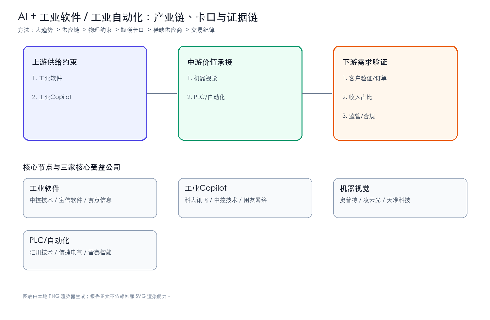
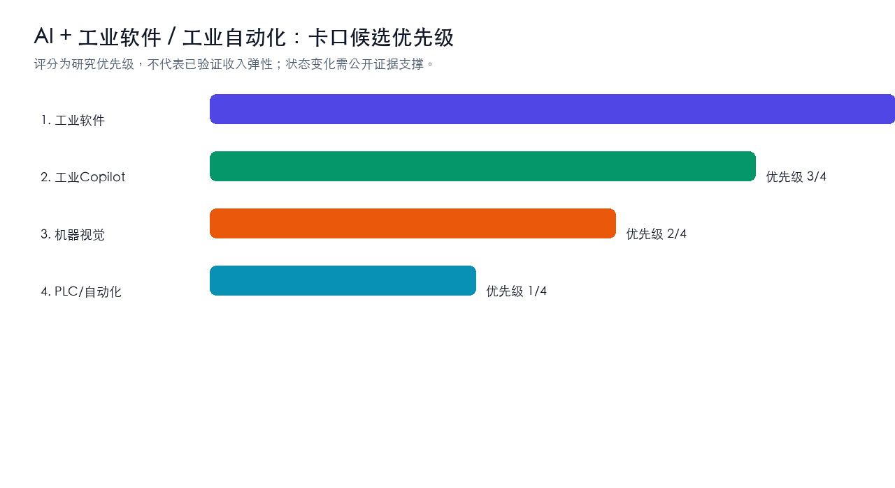
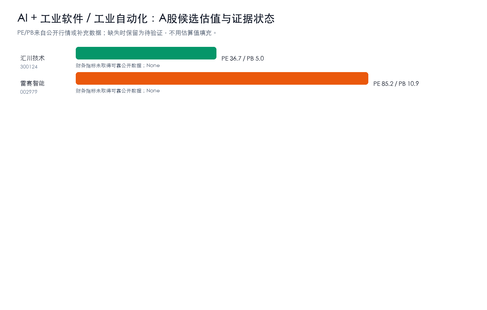
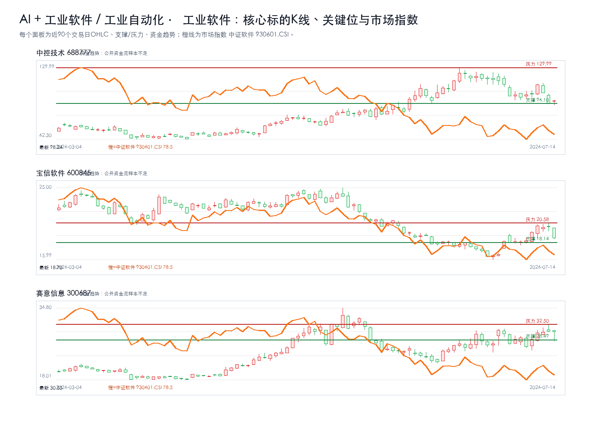
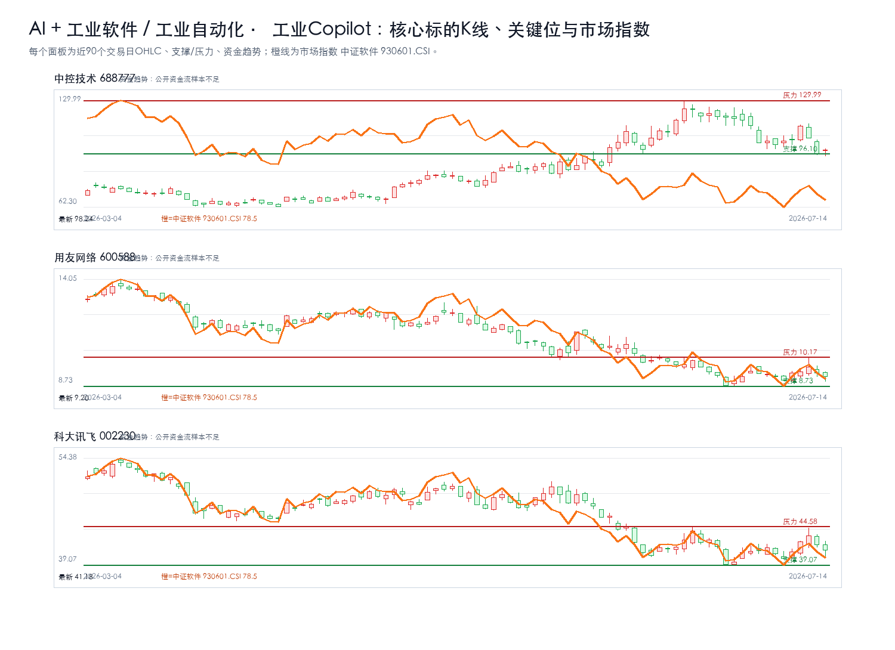
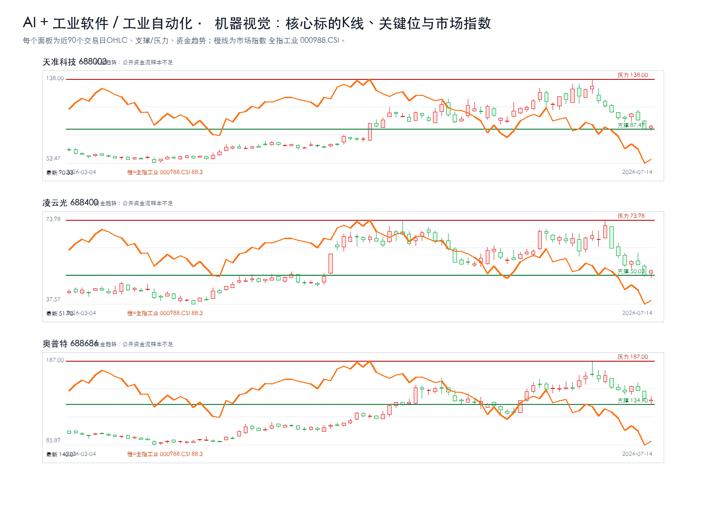
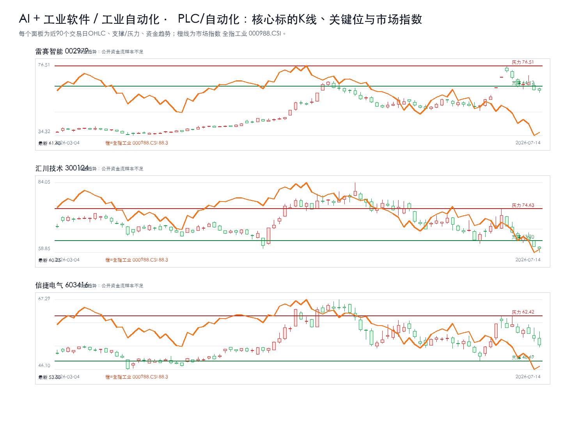

# AI + 工业软件 / 工业自动化主题最终报告

## 研究课题

本报告只回答三个问题：`AI + 工业软件 / 工业自动化` 的利润会流向哪些卡口，A股哪些公司真正暴露在这些卡口上，当前价格是否允许执行。当前跟踪范围收敛在 工业软件、工业Copilot、机器视觉、PLC/自动化。

## 一句话结论

强命题：AI + 工业软件 / 工业自动化 的机会不在泛主题，而在 `工业软件 + 工业Copilot` 能否持续出现订单、价格、客户认证、收入占比或监管里程碑。方向谨慎看多，置信度中等；当前绝对核心候选为：中控技术、宝信软件、赛意信息、科大讯飞、中控技术。没有新增硬证据时，只观察，不追高。

## 市场盘点

- 需求：AI资本开支仍是背景变量，但只有订单、产能、客户认证和收入占比能把主题变成业绩。
- 供给：重点看认证周期、良率/交付、关键材料和工程化能力是否造成瓶颈。
- 价格：股价接近压力位时不追；回到支撑区也要等硬证据同步。
- 证据密度：硬事实台账仍偏薄，PDF正文级和公告级证据不足，研报标题只作线索。

## 核心逻辑

1. 需求侧：AI 应用和模型迭代继续推高 `AI + 工业软件 / 工业自动化` 相关需求，但需求强度必须通过订单、客户认证、收入占比、价格趋势或政策里程碑验证。
2. 供给侧：利润更可能集中在短期难扩产、认证周期长、替代路线慢、合规壁垒高或工程化交付难的环节，例如 工业软件、工业Copilot、机器视觉、PLC/自动化。
3. A股映射：先判断产业链位置，再核验收入/订单暴露，最后才进入估值和交易条件；不能把行情样本或主题标签直接当作核心标的。

## 关键数据

| 判断项 | 当前结论 | 投资含义 |
| --- | --- | --- |
| 核心卡口 | 工业软件、工业Copilot、机器视觉、PLC/自动化 | 优先验证订单、价格、客户认证和收入占比 |
| 核心候选 | 中控技术、宝信软件、赛意信息、科大讯飞、中控技术 | 只在买入触发满足时进入交易候选 |
| 财务口径 | 核心公司继续跟踪营收同比、归母净利同比、毛利率、预测PE | 财务改善要和订单/客户认证同步才升级 |
| 证据密度 | 公告/财报级硬证据不足，研报和新闻只作线索 | 不把主题热度等同于买入结论 |
| 正文证据 | 硬事实台账不铺长表；PDF正文级证据不足时降级为线索 | 避免把内部过程写进正文 |
| 交易纪律 | 等待买入触发；风险收益比不足时不追高 | 买点、支撑、压力和止损优先于叙事 |

## 产业链跟踪

### 产业链核心环节价值分布

| 产业链环节 | 细分领域/关键产品 | BOM成本占比/价值占比 | 核心技术壁垒 | 卡脖子程度 | 代表A股公司 | 公司环节地位 | 证据口径/备注 |
| --- | --- | --- | --- | --- | --- | --- | --- |
| 上游 | 工业软件 | 待验证 | 客户认证、数据闭环、工程化交付、合规和成本控制 | High | 中控技术、宝信软件、赛意信息 | 待验证 | 公开产业链与财务/研报口径，待公告和客户认证继续核验 |
| 上游 | 工业Copilot | 待验证 | 客户认证、数据闭环、工程化交付、合规和成本控制 | High | 科大讯飞、中控技术、用友网络 | 待验证 | 公开产业链与财务/研报口径，待公告和客户认证继续核验 |
| 中游 | 机器视觉 | 待验证 | 客户认证、数据闭环、工程化交付、合规和成本控制 | Medium | 奥普特、凌云光、天准科技 | 待验证 | 公开产业链与财务/研报口径，待公告和客户认证继续核验 |
| 中游 | PLC/自动化 | 待验证 | 客户认证、数据闭环、工程化交付、合规和成本控制 | Medium | 汇川技术、信捷电气、雷赛智能 | 待验证 | 公开产业链与财务/研报口径，待公告和客户认证继续核验 |

### 供需链路跟踪

| 环节 | 事实映射 | 供需变化方向 | 瓶颈/卡口 | A股映射 |
| --- | --- | --- | --- | --- |
| 上游 | 工业软件 | 上行 | 客户认证、数据闭环、工程化交付、合规和成本控制 | 中控技术、宝信软件、赛意信息 |
| 上游 | 工业Copilot | 上行 | 客户认证、数据闭环、工程化交付、合规和成本控制 | 科大讯飞、中控技术、用友网络 |
| 中游 | 机器视觉 | 上行 | 客户认证、数据闭环、工程化交付、合规和成本控制 | 奥普特、凌云光、天准科技 |
| 中游 | PLC/自动化 | 上行 | 客户认证、数据闭环、工程化交付、合规和成本控制 | 汇川技术、信捷电气、雷赛智能 |

### 核心节点三公司校验

| 产业链节点 | 核心公司1 | 核心公司2 | 核心公司3 | 升级催化 | 失效条件 |
| --- | --- | --- | --- | --- | --- |
| 工业软件 | 中控技术 | 宝信软件 | 赛意信息 | 订单/客户认证/收入占比/政策或监管里程碑出现公告级证据 | 商业化ROI不足、客户验证低于预期、收入暴露不足或监管约束增强 |
| 工业Copilot | 科大讯飞 | 中控技术 | 用友网络 | 订单/客户认证/收入占比/政策或监管里程碑出现公告级证据 | 商业化ROI不足、客户验证低于预期、收入暴露不足或监管约束增强 |
| 机器视觉 | 奥普特 | 凌云光 | 天准科技 | 订单/客户认证/收入占比/政策或监管里程碑出现公告级证据 | 商业化ROI不足、客户验证低于预期、收入暴露不足或监管约束增强 |
| PLC/自动化 | 汇川技术 | 信捷电气 | 雷赛智能 | 订单/客户认证/收入占比/政策或监管里程碑出现公告级证据 | 商业化ROI不足、客户验证低于预期、收入暴露不足或监管约束增强 |

### 瓶颈战斗地图

| 瓶颈节点 | 当前三家核心公司 | 为什么卡 | 升级信号 | 反证信号 | 节点结论 |
| --- | --- | --- | --- | --- | --- |
| 工业软件 | 中控技术、宝信软件、赛意信息 | 需求放量与国产替代 | 订单/客户认证/收入占比/政策或监管里程碑出现公告级证据 | 商业化ROI不足、客户验证低于预期、收入暴露不足或监管约束增强 | 绝对核心 |
| 工业Copilot | 中控技术、用友网络、科大讯飞 | 需求放量与国产替代 | 订单/客户认证/收入占比/政策或监管里程碑出现公告级证据 | 商业化ROI不足、客户验证低于预期、收入暴露不足或监管约束增强 | 绝对核心 |
| 机器视觉 | 天准科技、凌云光、奥普特 | 需求放量与国产替代 | 订单/客户认证/收入占比/政策或监管里程碑出现公告级证据 | 商业化ROI不足、客户验证低于预期、收入暴露不足或监管约束增强 | 绝对核心 |
| PLC/自动化 | 雷赛智能、汇川技术、信捷电气 | 需求放量与国产替代 | 订单/客户认证/收入占比/政策或监管里程碑出现公告级证据 | 商业化ROI不足、客户验证低于预期、收入暴露不足或监管约束增强 | 绝对核心 |

### 瓶颈四标准校验

| 候选环节 | 不可替代 | 供给刚性 | 寡头垄断 | 机构低配 | 反证条件 |
| --- | --- | --- | --- | --- | --- |
| 工业软件 | 待验证 | 待验证 | 待验证 | 待验证 | 商业化ROI不足、客户验证低于预期、收入暴露不足或监管约束增强 |
| 工业Copilot | 待验证 | 待验证 | 待验证 | 待验证 | 商业化ROI不足、客户验证低于预期、收入暴露不足或监管约束增强 |
| 机器视觉 | 待验证 | 待验证 | 待验证 | 待验证 | 商业化ROI不足、客户验证低于预期、收入暴露不足或监管约束增强 |
| PLC/自动化 | 待验证 | 待验证 | 待验证 | 待验证 | 商业化ROI不足、客户验证低于预期、收入暴露不足或监管约束增强 |

## 投资机会挖掘

### 瓶颈识别

- 1. 工业软件：代表公司 中控技术、宝信软件、赛意信息；催化 订单/客户认证/收入占比/政策或监管里程碑出现公告级证据；失效条件 商业化ROI不足、客户验证低于预期、收入暴露不足或监管约束增强。
- 2. 工业Copilot：代表公司 科大讯飞、中控技术、用友网络；催化 订单/客户认证/收入占比/政策或监管里程碑出现公告级证据；失效条件 商业化ROI不足、客户验证低于预期、收入暴露不足或监管约束增强。
- 3. 机器视觉：代表公司 奥普特、凌云光、天准科技；催化 订单/客户认证/收入占比/政策或监管里程碑出现公告级证据；失效条件 商业化ROI不足、客户验证低于预期、收入暴露不足或监管约束增强。
- 4. PLC/自动化：代表公司 汇川技术、信捷电气、雷赛智能；催化 订单/客户认证/收入占比/政策或监管里程碑出现公告级证据；失效条件 商业化ROI不足、客户验证低于预期、收入暴露不足或监管约束增强。

### 可交易标的筛选

- 直接暴露优先于相邻链路；公告/财报证明优先于研报标题；估值赔率优先于短期涨幅。当前所有候选仍需“收入占比/订单/客户认证”三项中的至少一项补强。

## A股可交易标的估值对比

### 工业软件核心三公司K线

叠加板块指数：中证软件 930601.CSI；来源：tushare.index_daily。

### 工业Copilot核心三公司K线

叠加板块指数：中证软件 930601.CSI；来源：tushare.index_daily。

### 机器视觉核心三公司K线

叠加板块指数：全指工业 000988.CSI；来源：tushare.index_daily。

### PLC/自动化核心三公司K线

叠加板块指数：全指工业 000988.CSI；来源：tushare.index_daily。

| 公司 | 代码 | 产业链位置 | 当前估值 | 财务/订单信号 | 催化 | 买点条件 | 失效条件 |
| --- | --- | --- | --- | --- | --- | --- | --- |
| 中控技术 | 688777 | 工业软件 | PE 未取得可靠公开数据 / PB 未取得可靠公开数据 | 财务指标未取得可靠公开数据；None | 订单/客户认证/收入占比/政策或监管里程碑出现公告级证据 | 等待买入触发：当前未进入买入候选；需先满足交易决策、风险收益比、K线企稳和订单/价格/客户认证增量证据 | 商业化ROI不足、客户验证低于预期、收入暴露不足或监管约束增强 |
| 宝信软件 | 600845 | 工业软件 | PE 未取得可靠公开数据 / PB 未取得可靠公开数据 | 财务指标未取得可靠公开数据；None | 订单/客户认证/收入占比/政策或监管里程碑出现公告级证据 | 等待买入触发：当前未进入买入候选；需先满足交易决策、风险收益比、K线企稳和订单/价格/客户认证增量证据 | 商业化ROI不足、客户验证低于预期、收入暴露不足或监管约束增强 |
| 赛意信息 | 300687 | 工业软件 | PE 未取得可靠公开数据 / PB 未取得可靠公开数据 | 财务指标未取得可靠公开数据；None | 订单/客户认证/收入占比/政策或监管里程碑出现公告级证据 | 等待买入触发：当前未进入买入候选；需先满足交易决策、风险收益比、K线企稳和订单/价格/客户认证增量证据 | 商业化ROI不足、客户验证低于预期、收入暴露不足或监管约束增强 |
| 科大讯飞 | 002230 | 工业Copilot | PE 未取得可靠公开数据 / PB 未取得可靠公开数据 | 财务指标未取得可靠公开数据；None | 订单/客户认证/收入占比/政策或监管里程碑出现公告级证据 | 等待买入触发：当前未进入买入候选；需先满足交易决策、风险收益比、K线企稳和订单/价格/客户认证增量证据 | 商业化ROI不足、客户验证低于预期、收入暴露不足或监管约束增强 |
| 中控技术 | 688777 | 工业Copilot | PE 未取得可靠公开数据 / PB 未取得可靠公开数据 | 财务指标未取得可靠公开数据；None | 订单/客户认证/收入占比/政策或监管里程碑出现公告级证据 | 等待买入触发：当前未进入买入候选；需先满足交易决策、风险收益比、K线企稳和订单/价格/客户认证增量证据 | 商业化ROI不足、客户验证低于预期、收入暴露不足或监管约束增强 |
| 用友网络 | 600588 | 工业Copilot | PE 未取得可靠公开数据 / PB 未取得可靠公开数据 | 财务指标未取得可靠公开数据；None | 订单/客户认证/收入占比/政策或监管里程碑出现公告级证据 | 等待买入触发：当前未进入买入候选；需先满足交易决策、风险收益比、K线企稳和订单/价格/客户认证增量证据 | 商业化ROI不足、客户验证低于预期、收入暴露不足或监管约束增强 |
| 奥普特 | 688686 | 机器视觉 | PE 未取得可靠公开数据 / PB 未取得可靠公开数据 | 财务指标未取得可靠公开数据；None | 订单/客户认证/收入占比/政策或监管里程碑出现公告级证据 | 等待买入触发：当前未进入买入候选；需先满足交易决策、风险收益比、K线企稳和订单/价格/客户认证增量证据 | 商业化ROI不足、客户验证低于预期、收入暴露不足或监管约束增强 |
| 凌云光 | 688400 | 机器视觉 | PE 未取得可靠公开数据 / PB 未取得可靠公开数据 | 财务指标未取得可靠公开数据；None | 订单/客户认证/收入占比/政策或监管里程碑出现公告级证据 | 等待买入触发：当前未进入买入候选；需先满足交易决策、风险收益比、K线企稳和订单/价格/客户认证增量证据 | 商业化ROI不足、客户验证低于预期、收入暴露不足或监管约束增强 |
| 天准科技 | 688003 | 机器视觉 | PE 未取得可靠公开数据 / PB 未取得可靠公开数据 | 财务指标未取得可靠公开数据；None | 订单/客户认证/收入占比/政策或监管里程碑出现公告级证据 | 等待买入触发：当前未进入买入候选；需先满足交易决策、风险收益比、K线企稳和订单/价格/客户认证增量证据 | 商业化ROI不足、客户验证低于预期、收入暴露不足或监管约束增强 |
| 汇川技术 | 300124 | PLC/自动化 | PE 36.74 / PB 4.97 | 财务指标未取得可靠公开数据；None | 订单/客户认证/收入占比/政策或监管里程碑出现公告级证据 | 等待买入触发：当前未进入买入候选；需先满足交易决策、风险收益比、K线企稳和订单/价格/客户认证增量证据 | 商业化ROI不足、客户验证低于预期、收入暴露不足或监管约束增强 |
| 信捷电气 | 603416 | PLC/自动化 | PE 未取得可靠公开数据 / PB 未取得可靠公开数据 | 财务指标未取得可靠公开数据；None | 订单/客户认证/收入占比/政策或监管里程碑出现公告级证据 | 等待买入触发：当前未进入买入候选；需先满足交易决策、风险收益比、K线企稳和订单/价格/客户认证增量证据 | 商业化ROI不足、客户验证低于预期、收入暴露不足或监管约束增强 |
| 雷赛智能 | 002979 | PLC/自动化 | PE 85.18 / PB 10.91 | 财务指标未取得可靠公开数据；None | 订单/客户认证/收入占比/政策或监管里程碑出现公告级证据 | 等待买入触发：当前未进入买入候选；需先满足交易决策、风险收益比、K线企稳和订单/价格/客户认证增量证据 | 商业化ROI不足、客户验证低于预期、收入暴露不足或监管约束增强 |

## 核心个股交易跟踪

| 公司 | 代码 | 产业链位置 | 估值 | 财务质量 | 趋势结构 | 关键位 | 买入条件 | 止损/失效 | 卖出/目标 |
| --- | --- | --- | --- | --- | --- | --- | --- | --- | --- |
| 中控技术 | 688777 | 工业软件 | PE 未取得可靠公开数据 / PB 未取得可靠公开数据 | 财务指标未取得可靠公开数据 | 现价 98.24；涨跌幅 2.23%；MA5/10/20/60=103.60/104.49/111.82/93.78；20日箱体 94.66-129.99；震荡分歧；20日箱体位置10%；风险收益比14.84；资金趋势：公开资金流样本不足 | 支撑 96.10；压力 129.99 | 等待买入触发：当前未进入买入候选；需先满足交易决策、风险收益比、K线企稳和订单/价格/客户认证增量证据 | 跌破96.10且订单/业绩无增量；商业化ROI不足、客户验证低于预期、收入暴露不足或监管约束增强 | 未设技术目标：尚未进入买入候选，先观察证据和价格结构是否修复 |
| 宝信软件 | 600845 | 工业软件 | PE 未取得可靠公开数据 / PB 未取得可靠公开数据 | 财务指标未取得可靠公开数据 | 现价 18.70；涨跌幅 -7.15%；MA5/10/20/60=19.69/18.96/18.14/20.65；20日箱体 15.99-20.58；震荡分歧；20日箱体位置59%；风险收益比3.37；资金趋势：公开资金流样本不足 | 支撑 18.14；压力 20.58 | 等待买入触发：当前未进入买入候选；需先满足交易决策、风险收益比、K线企稳和订单/价格/客户认证增量证据 | 跌破18.14且订单/业绩无增量；商业化ROI不足、客户验证低于预期、收入暴露不足或监管约束增强 | 未设技术目标：尚未进入买入候选，先观察证据和价格结构是否修复 |
| 赛意信息 | 300687 | 工业软件 | PE 未取得可靠公开数据 / PB 未取得可靠公开数据 | 财务指标未取得可靠公开数据 | 现价 30.55；涨跌幅 -0.26%；MA5/10/20/60=30.08/29.21/28.49/27.38；20日箱体 25.10-32.50；多头趋势；20日箱体位置74%；风险收益比0.94；资金趋势：公开资金流样本不足 | 支撑 28.49；压力 32.50 | 等待买入触发：当前未进入买入候选；需先满足交易决策、风险收益比、K线企稳和订单/价格/客户认证增量证据 | 跌破28.49且订单/业绩无增量；商业化ROI不足、客户验证低于预期、收入暴露不足或监管约束增强 | 未设技术目标：尚未进入买入候选，先观察证据和价格结构是否修复 |
| 科大讯飞 | 002230 | 工业Copilot | PE 未取得可靠公开数据 / PB 未取得可靠公开数据 | 财务指标未取得可靠公开数据 | 现价 41.18；涨跌幅 -1.72%；MA5/10/20/60=41.92/41.38/41.46/45.57；20日箱体 39.07-44.58；空头趋势；20日箱体位置38%；风险收益比1.61；资金趋势：公开资金流样本不足 | 支撑 39.07；压力 44.58 | 等待买入触发：当前未进入买入候选；需先满足交易决策、风险收益比、K线企稳和订单/价格/客户认证增量证据 | 跌破39.07且订单/业绩无增量；商业化ROI不足、客户验证低于预期、收入暴露不足或监管约束增强 | 未设技术目标：尚未进入买入候选，先观察证据和价格结构是否修复 |
| 中控技术 | 688777 | 工业Copilot | PE 未取得可靠公开数据 / PB 未取得可靠公开数据 | 财务指标未取得可靠公开数据 | 现价 98.24；涨跌幅 2.23%；MA5/10/20/60=103.60/104.49/111.82/93.78；20日箱体 94.66-129.99；震荡分歧；20日箱体位置10%；风险收益比14.84；资金趋势：公开资金流样本不足 | 支撑 96.10；压力 129.99 | 等待买入触发：当前未进入买入候选；需先满足交易决策、风险收益比、K线企稳和订单/价格/客户认证增量证据 | 跌破96.10且订单/业绩无增量；商业化ROI不足、客户验证低于预期、收入暴露不足或监管约束增强 | 未设技术目标：尚未进入买入候选，先观察证据和价格结构是否修复 |
| 用友网络 | 600588 | 工业Copilot | PE 未取得可靠公开数据 / PB 未取得可靠公开数据 | 财务指标未取得可靠公开数据 | 现价 9.20；涨跌幅 -1.71%；MA5/10/20/60=9.40/9.33/9.41/10.73；20日箱体 8.73-10.17；空头趋势；20日箱体位置33%；风险收益比2.06；资金趋势：公开资金流样本不足 | 支撑 8.73；压力 10.17 | 等待买入触发：当前未进入买入候选；需先满足交易决策、风险收益比、K线企稳和订单/价格/客户认证增量证据 | 跌破8.73且订单/业绩无增量；商业化ROI不足、客户验证低于预期、收入暴露不足或监管约束增强 | 未设技术目标：尚未进入买入候选，先观察证据和价格结构是否修复 |
| 奥普特 | 688686 | 机器视觉 | PE 未取得可靠公开数据 / PB 未取得可靠公开数据 | 财务指标未取得可靠公开数据 | 现价 140.01；涨跌幅 -1.19%；MA5/10/20/60=147.76/155.06/155.86/136.11；20日箱体 134.60-187.00；震荡分歧；20日箱体位置10%；风险收益比8.69；资金趋势：公开资金流样本不足 | 支撑 134.60；压力 187.00 | 等待买入触发：当前未进入买入候选；需先满足交易决策、风险收益比、K线企稳和订单/价格/客户认证增量证据 | 跌破134.60且订单/业绩无增量；商业化ROI不足、客户验证低于预期、收入暴露不足或监管约束增强 | 未设技术目标：尚未进入买入候选，先观察证据和价格结构是否修复 |
| 凌云光 | 688400 | 机器视觉 | PE 未取得可靠公开数据 / PB 未取得可靠公开数据 | 财务指标未取得可靠公开数据 | 现价 51.90；涨跌幅 3.74%；MA5/10/20/60=53.37/59.11/61.91/59.89；20日箱体 48.91-73.98；震荡分歧；20日箱体位置12%；风险收益比11.81；资金趋势：公开资金流样本不足 | 支撑 50.03；压力 73.98 | 等待买入触发：当前未进入买入候选；需先满足交易决策、风险收益比、K线企稳和订单/价格/客户认证增量证据 | 跌破50.03且订单/业绩无增量；商业化ROI不足、客户验证低于预期、收入暴露不足或监管约束增强 | 未设技术目标：尚未进入买入候选，先观察证据和价格结构是否修复 |
| 天准科技 | 688003 | 机器视觉 | PE 未取得可靠公开数据 / PB 未取得可靠公开数据 | 财务指标未取得可靠公开数据 | 现价 90.33；涨跌幅 3.25%；MA5/10/20/60=95.08/103.65/111.39/97.26；20日箱体 86.10-138.00；震荡分歧；20日箱体位置8%；风险收益比16.79；资金趋势：公开资金流样本不足 | 支撑 87.49；压力 138.00 | 等待买入触发：当前未进入买入候选；需先满足交易决策、风险收益比、K线企稳和订单/价格/客户认证增量证据 | 跌破87.49且订单/业绩无增量；商业化ROI不足、客户验证低于预期、收入暴露不足或监管约束增强 | 未设技术目标：尚未进入买入候选，先观察证据和价格结构是否修复 |
| 汇川技术 | 300124 | PLC/自动化 | PE 36.74 / PB 4.97 | 财务指标未取得可靠公开数据 | 现价 64.32；涨跌幅 1.77%；MA5/10/20/60=62.43/65.53/66.51/70.61；20日箱体 58.85-74.63；空头趋势；20日箱体位置35%；风险收益比9.21；资金趋势：公开资金流样本不足 | 支撑 63.20；压力 74.63 | 等待买入触发：当前未进入买入候选；需先满足交易决策、风险收益比、K线企稳和订单/价格/客户认证增量证据 | 跌破63.20且订单/业绩无增量；商业化ROI不足、客户验证低于预期、收入暴露不足或监管约束增强 | 未设技术目标：尚未进入买入候选，先观察证据和价格结构是否修复 |
| 信捷电气 | 603416 | PLC/自动化 | PE 未取得可靠公开数据 / PB 未取得可靠公开数据 | 财务指标未取得可靠公开数据 | 现价 53.50；涨跌幅 -3.69%；MA5/10/20/60=56.22/57.47/55.56/56.72；20日箱体 48.69-62.42；空头趋势；20日箱体位置35%；风险收益比1.85；资金趋势：公开资金流样本不足 | 支撑 48.69；压力 62.42 | 等待买入触发：当前未进入买入候选；需先满足交易决策、风险收益比、K线企稳和订单/价格/客户认证增量证据 | 跌破48.69且订单/业绩无增量；商业化ROI不足、客户验证低于预期、收入暴露不足或监管约束增强 | 未设技术目标：尚未进入买入候选，先观察证据和价格结构是否修复 |
| 雷赛智能 | 002979 | PLC/自动化 | PE 85.18 / PB 10.91 | 财务指标未取得可靠公开数据 | 现价 65.14；涨跌幅 1.59%；MA5/10/20/60=63.72/65.15/59.40/54.12；20日箱体 49.32-76.51；多头趋势；20日箱体位置58%；风险收益比11.15；资金趋势：公开资金流样本不足 | 支撑 64.12；压力 76.51 | 等待买入触发：当前未进入买入候选；需先满足交易决策、风险收益比、K线企稳和订单/价格/客户认证增量证据 | 跌破64.12且订单/业绩无增量；商业化ROI不足、客户验证低于预期、收入暴露不足或监管约束增强 | 未设技术目标：尚未进入买入候选，先观察证据和价格结构是否修复 |

交易判断只看两件事：价格是否到买入触发区，证据是否同步增强。二者缺一，继续等待。

## 产业链 / 竞争格局

### A股公司映射与核心地位判断

| 公司 | 代码 | 环节 | 细分领域 | 产业占比/暴露度 | 核心技术/产品 | 卡脖子相关性 | 环节地位 | 证据与备注 |
| --- | --- | --- | --- | --- | --- | --- | --- | --- |
| 中控技术 | 688777 | 工业软件 | 工业软件 | 待公告/财报核验收入、订单或客户认证占比 | 工业软件 | Medium/待验证 | 重要配套/待验证 | 财务指标未取得可靠公开数据；；反证/失效：商业化ROI不足、客户验证低于预期、收入暴露不足或监管约束增强 |
| 宝信软件 | 600845 | 工业软件 | 工业软件 | 待公告/财报核验收入、订单或客户认证占比 | 工业软件 | Medium/待验证 | 重要配套/待验证 | 财务指标未取得可靠公开数据；；反证/失效：商业化ROI不足、客户验证低于预期、收入暴露不足或监管约束增强 |
| 赛意信息 | 300687 | 工业软件 | 工业软件 | 待公告/财报核验收入、订单或客户认证占比 | 工业软件 | Medium/待验证 | 重要配套/待验证 | 财务指标未取得可靠公开数据；；反证/失效：商业化ROI不足、客户验证低于预期、收入暴露不足或监管约束增强 |
| 科大讯飞 | 002230 | 工业Copilot | 工业Copilot | 待公告/财报核验收入、订单或客户认证占比 | 工业Copilot | Medium/待验证 | 重要配套/待验证 | 财务指标未取得可靠公开数据；；反证/失效：商业化ROI不足、客户验证低于预期、收入暴露不足或监管约束增强 |
| 中控技术 | 688777 | 工业Copilot | 工业Copilot | 待公告/财报核验收入、订单或客户认证占比 | 工业Copilot | Medium/待验证 | 重要配套/待验证 | 财务指标未取得可靠公开数据；；反证/失效：商业化ROI不足、客户验证低于预期、收入暴露不足或监管约束增强 |
| 用友网络 | 600588 | 工业Copilot | 工业Copilot | 待公告/财报核验收入、订单或客户认证占比 | 工业Copilot | Medium/待验证 | 重要配套/待验证 | 财务指标未取得可靠公开数据；；反证/失效：商业化ROI不足、客户验证低于预期、收入暴露不足或监管约束增强 |
| 奥普特 | 688686 | 机器视觉 | 机器视觉 | 待公告/财报核验收入、订单或客户认证占比 | 机器视觉 | Medium/待验证 | 重要配套/待验证 | 财务指标未取得可靠公开数据；；反证/失效：商业化ROI不足、客户验证低于预期、收入暴露不足或监管约束增强 |
| 凌云光 | 688400 | 机器视觉 | 机器视觉 | 待公告/财报核验收入、订单或客户认证占比 | 机器视觉 | Medium/待验证 | 重要配套/待验证 | 财务指标未取得可靠公开数据；；反证/失效：商业化ROI不足、客户验证低于预期、收入暴露不足或监管约束增强 |
| 天准科技 | 688003 | 机器视觉 | 机器视觉 | 待公告/财报核验收入、订单或客户认证占比 | 机器视觉 | Medium/待验证 | 重要配套/待验证 | 财务指标未取得可靠公开数据；；反证/失效：商业化ROI不足、客户验证低于预期、收入暴露不足或监管约束增强 |
| 汇川技术 | 300124 | PLC/自动化 | PLC/自动化 | 待公告/财报核验收入、订单或客户认证占比 | PLC/自动化 | Medium/待验证 | 重要配套/待验证 | 财务指标未取得可靠公开数据；；反证/失效：商业化ROI不足、客户验证低于预期、收入暴露不足或监管约束增强 |
| 信捷电气 | 603416 | PLC/自动化 | PLC/自动化 | 待公告/财报核验收入、订单或客户认证占比 | PLC/自动化 | Medium/待验证 | 重要配套/待验证 | 财务指标未取得可靠公开数据；；反证/失效：商业化ROI不足、客户验证低于预期、收入暴露不足或监管约束增强 |
| 雷赛智能 | 002979 | PLC/自动化 | PLC/自动化 | 待公告/财报核验收入、订单或客户认证占比 | PLC/自动化 | Medium/待验证 | 重要配套/待验证 | 财务指标未取得可靠公开数据；；反证/失效：商业化ROI不足、客户验证低于预期、收入暴露不足或监管约束增强 |

### 竞争格局与反证条件

| 公司 | 代码 | 卡口环节 | 直接性 | 财务信号 | 研报/公告信号 | 估值压力 | 反证条件 |
| --- | --- | --- | --- | --- | --- | --- | --- |
| 中控技术 | 688777 | 工业软件 | 重要配套 | 财务指标未取得可靠公开数据 | None | 待验证 | 商业化ROI不足、客户验证低于预期、收入暴露不足或监管约束增强 |
| 宝信软件 | 600845 | 工业软件 | 重要配套 | 财务指标未取得可靠公开数据 | None | 待验证 | 商业化ROI不足、客户验证低于预期、收入暴露不足或监管约束增强 |
| 赛意信息 | 300687 | 工业软件 | 重要配套 | 财务指标未取得可靠公开数据 | None | 待验证 | 商业化ROI不足、客户验证低于预期、收入暴露不足或监管约束增强 |
| 科大讯飞 | 002230 | 工业Copilot | 重要配套 | 财务指标未取得可靠公开数据 | None | 待验证 | 商业化ROI不足、客户验证低于预期、收入暴露不足或监管约束增强 |
| 中控技术 | 688777 | 工业Copilot | 重要配套 | 财务指标未取得可靠公开数据 | None | 待验证 | 商业化ROI不足、客户验证低于预期、收入暴露不足或监管约束增强 |
| 用友网络 | 600588 | 工业Copilot | 重要配套 | 财务指标未取得可靠公开数据 | None | 待验证 | 商业化ROI不足、客户验证低于预期、收入暴露不足或监管约束增强 |
| 奥普特 | 688686 | 机器视觉 | 重要配套 | 财务指标未取得可靠公开数据 | None | 待验证 | 商业化ROI不足、客户验证低于预期、收入暴露不足或监管约束增强 |
| 凌云光 | 688400 | 机器视觉 | 重要配套 | 财务指标未取得可靠公开数据 | None | 待验证 | 商业化ROI不足、客户验证低于预期、收入暴露不足或监管约束增强 |
| 天准科技 | 688003 | 机器视觉 | 重要配套 | 财务指标未取得可靠公开数据 | None | 待验证 | 商业化ROI不足、客户验证低于预期、收入暴露不足或监管约束增强 |
| 汇川技术 | 300124 | PLC/自动化 | 重要配套 | 财务指标未取得可靠公开数据 | None | 中 | 商业化ROI不足、客户验证低于预期、收入暴露不足或监管约束增强 |
| 信捷电气 | 603416 | PLC/自动化 | 重要配套 | 财务指标未取得可靠公开数据 | None | 待验证 | 商业化ROI不足、客户验证低于预期、收入暴露不足或监管约束增强 |
| 雷赛智能 | 002979 | PLC/自动化 | 重要配套 | 财务指标未取得可靠公开数据 | None | 高 | 商业化ROI不足、客户验证低于预期、收入暴露不足或监管约束增强 |

竞争判断：AI + 工业软件 / 工业自动化 中具备客户认证、数据闭环、合规壁垒、良率/交付和产能约束的环节更接近“瓶颈资产”；但若估值已经处在高压区，只有订单、价格、客户认证或收入占比继续补强，才能从“产业链好公司”升级为“可执行机会”。缺少差异化的概念映射容易只获得主题估值而非利润传导。

## 标的分层与入场条件

### 龙头分层

| 层级 | 公司 | 代码 | 节点 | 入选原因 | 升级触发器 | 降级/剔除条件 |
| --- | --- | --- | --- | --- | --- | --- |
| 主题观察 | 中控技术 | 688777 | 工业软件 | 配套/相邻链路；风险收益比14.84 | 订单/客户认证/收入占比/政策或监管里程碑出现公告级证据 | 商业化ROI不足、客户验证低于预期、收入暴露不足或监管约束增强 |
| 主题观察 | 中控技术 | 688777 | 工业Copilot | 配套/相邻链路；风险收益比14.84 | 订单/客户认证/收入占比/政策或监管里程碑出现公告级证据 | 商业化ROI不足、客户验证低于预期、收入暴露不足或监管约束增强 |
| 主题观察 | 信捷电气 | 603416 | PLC/自动化 | 配套/相邻链路；风险收益比1.85 | 订单/客户认证/收入占比/政策或监管里程碑出现公告级证据 | 商业化ROI不足、客户验证低于预期、收入暴露不足或监管约束增强 |
| 主题观察 | 凌云光 | 688400 | 机器视觉 | 配套/相邻链路；风险收益比11.81 | 订单/客户认证/收入占比/政策或监管里程碑出现公告级证据 | 商业化ROI不足、客户验证低于预期、收入暴露不足或监管约束增强 |
| 主题观察 | 天准科技 | 688003 | 机器视觉 | 配套/相邻链路；风险收益比16.79 | 订单/客户认证/收入占比/政策或监管里程碑出现公告级证据 | 商业化ROI不足、客户验证低于预期、收入暴露不足或监管约束增强 |
| 主题观察 | 奥普特 | 688686 | 机器视觉 | 配套/相邻链路；风险收益比8.69 | 订单/客户认证/收入占比/政策或监管里程碑出现公告级证据 | 商业化ROI不足、客户验证低于预期、收入暴露不足或监管约束增强 |
| 主题观察 | 宝信软件 | 600845 | 工业软件 | 配套/相邻链路；风险收益比3.37 | 订单/客户认证/收入占比/政策或监管里程碑出现公告级证据 | 商业化ROI不足、客户验证低于预期、收入暴露不足或监管约束增强 |
| 主题观察 | 汇川技术 | 300124 | PLC/自动化 | 配套/相邻链路；风险收益比9.21；PE 36.7 | 订单/客户认证/收入占比/政策或监管里程碑出现公告级证据 | 商业化ROI不足、客户验证低于预期、收入暴露不足或监管约束增强 |
| 主题观察 | 用友网络 | 600588 | 工业Copilot | 配套/相邻链路；风险收益比2.06 | 订单/客户认证/收入占比/政策或监管里程碑出现公告级证据 | 商业化ROI不足、客户验证低于预期、收入暴露不足或监管约束增强 |
| 主题观察 | 科大讯飞 | 002230 | 工业Copilot | 配套/相邻链路；风险收益比1.61 | 订单/客户认证/收入占比/政策或监管里程碑出现公告级证据 | 商业化ROI不足、客户验证低于预期、收入暴露不足或监管约束增强 |
| 主题观察 | 赛意信息 | 300687 | 工业软件 | 配套/相邻链路；风险收益比0.94 | 订单/客户认证/收入占比/政策或监管里程碑出现公告级证据 | 商业化ROI不足、客户验证低于预期、收入暴露不足或监管约束增强 |
| 主题观察 | 雷赛智能 | 002979 | PLC/自动化 | 配套/相邻链路；风险收益比11.15；PE 85.2 | 订单/客户认证/收入占比/政策或监管里程碑出现公告级证据 | 商业化ROI不足、客户验证低于预期、收入暴露不足或监管约束增强 |

### 事件-交易触发器

| 公司 | 节点 | 需要等待的硬证据 | 买入触发 | 卖出/减仓触发 | 反证退出 |
| --- | --- | --- | --- | --- | --- |
| 中控技术 | 工业软件 | 订单/客户认证/收入占比/政策或监管里程碑出现公告级证据 | 等待买入触发：当前未进入买入候选；需先满足交易决策、风险收益比、K线企稳和订单/价格/客户认证增量证据 | 未设技术目标：尚未进入买入候选，先观察证据和价格结构是否修复 | 商业化ROI不足、客户验证低于预期、收入暴露不足或监管约束增强 |
| 宝信软件 | 工业软件 | 订单/客户认证/收入占比/政策或监管里程碑出现公告级证据 | 等待买入触发：当前未进入买入候选；需先满足交易决策、风险收益比、K线企稳和订单/价格/客户认证增量证据 | 未设技术目标：尚未进入买入候选，先观察证据和价格结构是否修复 | 商业化ROI不足、客户验证低于预期、收入暴露不足或监管约束增强 |
| 赛意信息 | 工业软件 | 订单/客户认证/收入占比/政策或监管里程碑出现公告级证据 | 等待买入触发：当前未进入买入候选；需先满足交易决策、风险收益比、K线企稳和订单/价格/客户认证增量证据 | 未设技术目标：尚未进入买入候选，先观察证据和价格结构是否修复 | 商业化ROI不足、客户验证低于预期、收入暴露不足或监管约束增强 |
| 科大讯飞 | 工业Copilot | 订单/客户认证/收入占比/政策或监管里程碑出现公告级证据 | 等待买入触发：当前未进入买入候选；需先满足交易决策、风险收益比、K线企稳和订单/价格/客户认证增量证据 | 未设技术目标：尚未进入买入候选，先观察证据和价格结构是否修复 | 商业化ROI不足、客户验证低于预期、收入暴露不足或监管约束增强 |
| 中控技术 | 工业Copilot | 订单/客户认证/收入占比/政策或监管里程碑出现公告级证据 | 等待买入触发：当前未进入买入候选；需先满足交易决策、风险收益比、K线企稳和订单/价格/客户认证增量证据 | 未设技术目标：尚未进入买入候选，先观察证据和价格结构是否修复 | 商业化ROI不足、客户验证低于预期、收入暴露不足或监管约束增强 |
| 用友网络 | 工业Copilot | 订单/客户认证/收入占比/政策或监管里程碑出现公告级证据 | 等待买入触发：当前未进入买入候选；需先满足交易决策、风险收益比、K线企稳和订单/价格/客户认证增量证据 | 未设技术目标：尚未进入买入候选，先观察证据和价格结构是否修复 | 商业化ROI不足、客户验证低于预期、收入暴露不足或监管约束增强 |
| 奥普特 | 机器视觉 | 订单/客户认证/收入占比/政策或监管里程碑出现公告级证据 | 等待买入触发：当前未进入买入候选；需先满足交易决策、风险收益比、K线企稳和订单/价格/客户认证增量证据 | 未设技术目标：尚未进入买入候选，先观察证据和价格结构是否修复 | 商业化ROI不足、客户验证低于预期、收入暴露不足或监管约束增强 |
| 凌云光 | 机器视觉 | 订单/客户认证/收入占比/政策或监管里程碑出现公告级证据 | 等待买入触发：当前未进入买入候选；需先满足交易决策、风险收益比、K线企稳和订单/价格/客户认证增量证据 | 未设技术目标：尚未进入买入候选，先观察证据和价格结构是否修复 | 商业化ROI不足、客户验证低于预期、收入暴露不足或监管约束增强 |

## 风险、反证与退出条件

- 订单反证：公告、年报或调研无法验证新增订单、客户认证或收入占比。
- 供给反证：替代路线成熟、扩产过快或价格回落，导致卡口缓解。
- 估值反证：估值和成交拥挤先于基本面兑现，风险收益比低于 2:1。
- 主题反证：新闻/研报热度上升但公司财务、订单和价格信号没有同步改善。

## 数据来源与证据强度

| 结论/数据 | 来源 | 日期 | 置信度 |
| --- | --- | --- | --- |
| 产业链与卡口判断 | 公开产业链、研报、行情结构化证据 | 2026-07-14 | Medium |
| 核心公司估值/财务/K线 | 公开行情、财务快照、公告与研报摘要 | 2026-07-14 | Medium |
| 复核与反证条件 | 投研复核规则 | 2026-07-14 | Medium |
| 钢铁行业周报：铁水产量回落，钢厂盈利再下降 | 大同证券 | 2026-07-14 | 标题级/Medium |
| 商贸零售行业7月投资策略：扩大消费“十五五”规划出台，顶层设计引领内需复苏成长 | 国信证券 | 2026-07-14 | 标题级/Medium |
| 食品饮料行业周报：估值筑底，关注中报业绩预告催化 | 华龙证券 | 2026-07-14 | 标题级/Medium |
| How Deutsche Telekom is rewiring telecomm… | OpenAI | 2026-07-10T07:00:00+00:00 | 线索级/Low |
| Getting started with ChatGPT | OpenAI | 2026-07-10T00:00:00+00:00 | 线索级/Low |
