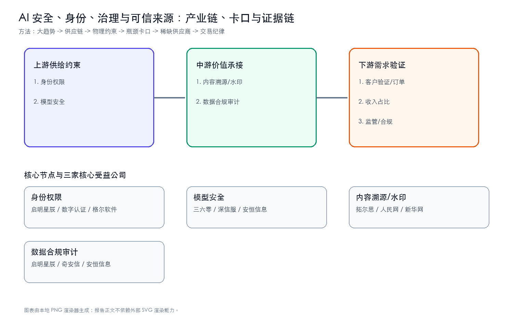
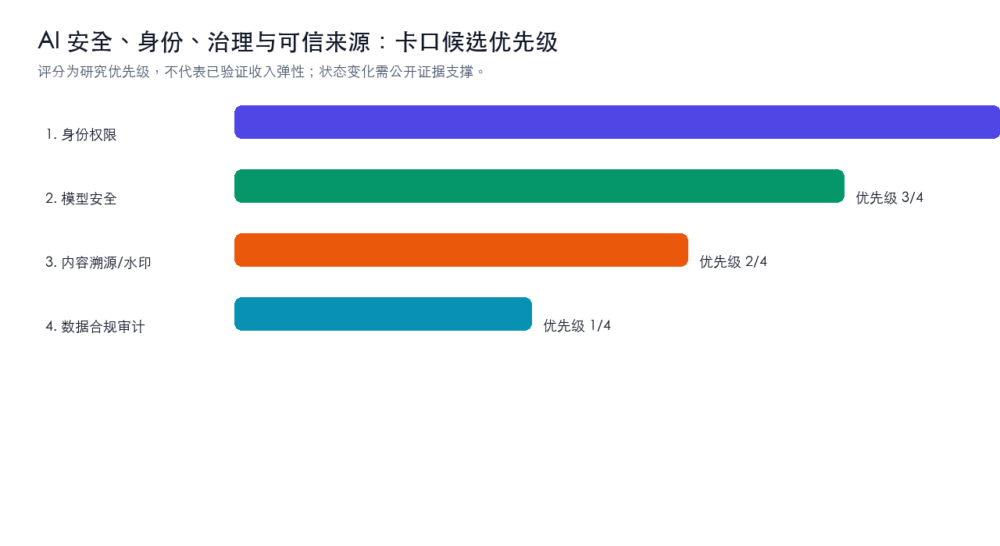
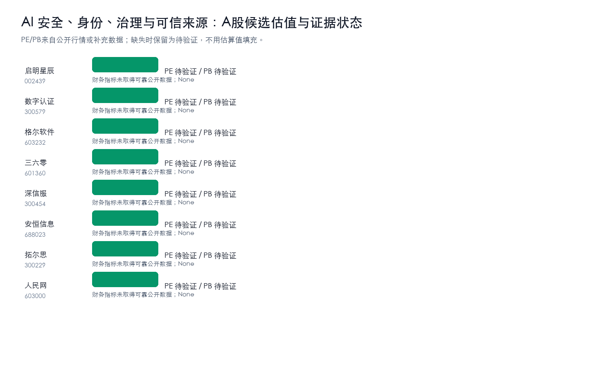
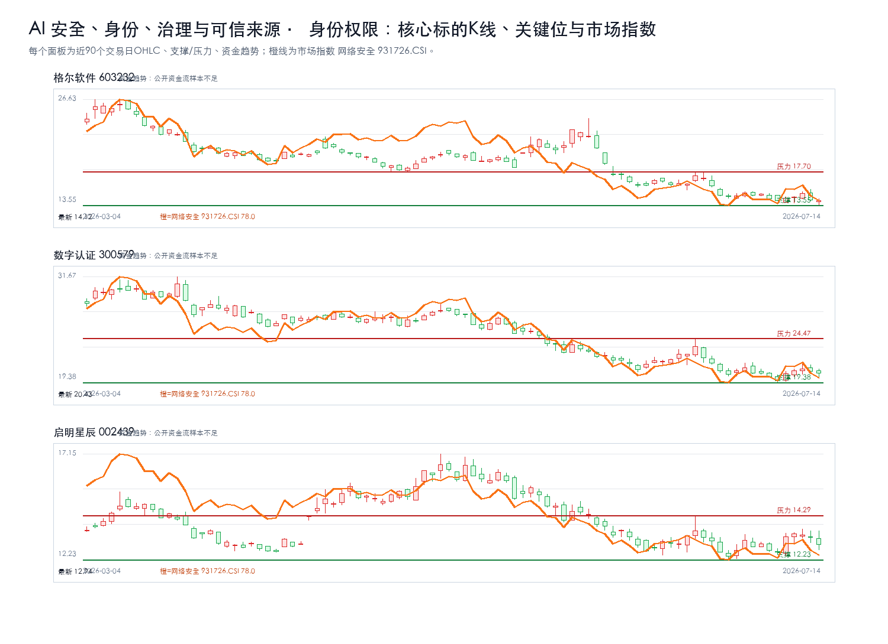
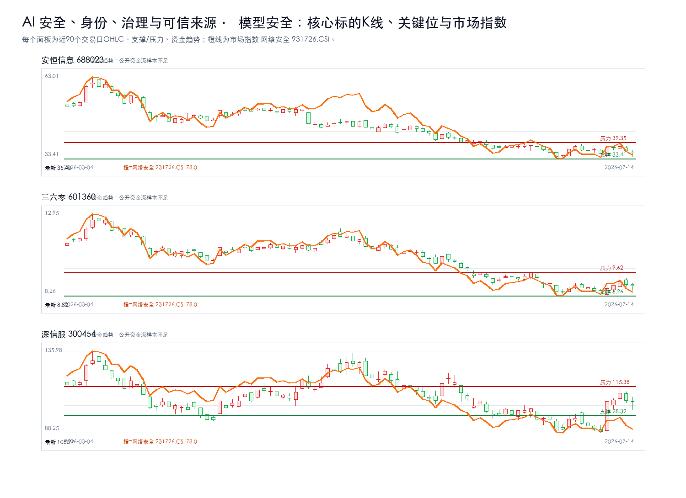
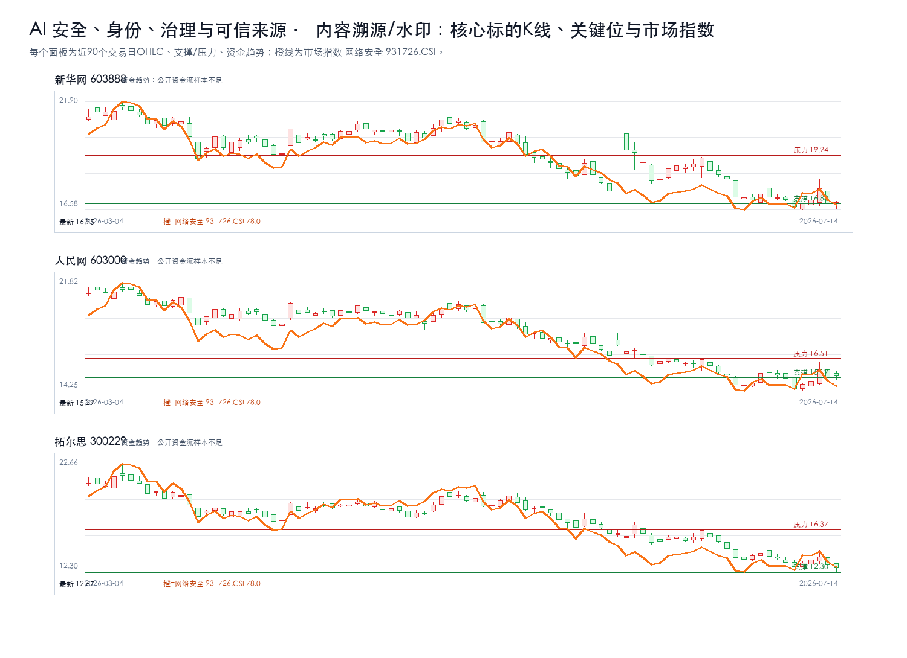
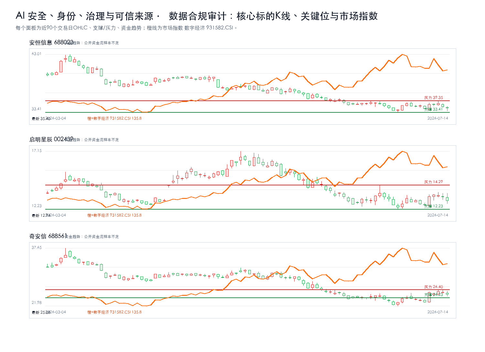

# AI 安全、身份、治理与可信来源主题最终报告

## 研究课题

本报告只回答三个问题：`AI 安全、身份、治理与可信来源` 的利润会流向哪些卡口，A股哪些公司真正暴露在这些卡口上，当前价格是否允许执行。当前跟踪范围收敛在 身份权限、模型安全、内容溯源/水印、数据合规审计。

## 一句话结论

强命题：AI 安全、身份、治理与可信来源 的机会不在泛主题，而在 `身份权限 + 模型安全` 能否持续出现订单、价格、客户认证、收入占比或监管里程碑。方向谨慎看多，置信度中等；当前绝对核心候选为：启明星辰、数字认证、格尔软件、三六零、深信服。没有新增硬证据时，只观察，不追高。

## 市场盘点

- 需求：AI资本开支仍是背景变量，但只有订单、产能、客户认证和收入占比能把主题变成业绩。
- 供给：重点看认证周期、良率/交付、关键材料和工程化能力是否造成瓶颈。
- 价格：股价接近压力位时不追；回到支撑区也要等硬证据同步。
- 证据密度：硬事实台账仍偏薄，PDF正文级和公告级证据不足，研报标题只作线索。

## 核心逻辑

1. 需求侧：AI 应用和模型迭代继续推高 `AI 安全、身份、治理与可信来源` 相关需求，但需求强度必须通过订单、客户认证、收入占比、价格趋势或政策里程碑验证。
2. 供给侧：利润更可能集中在短期难扩产、认证周期长、替代路线慢、合规壁垒高或工程化交付难的环节，例如 身份权限、模型安全、内容溯源/水印、数据合规审计。
3. A股映射：先判断产业链位置，再核验收入/订单暴露，最后才进入估值和交易条件；不能把行情样本或主题标签直接当作核心标的。

## 关键数据

| 判断项 | 当前结论 | 投资含义 |
| --- | --- | --- |
| 核心卡口 | 身份权限、模型安全、内容溯源/水印、数据合规审计 | 优先验证订单、价格、客户认证和收入占比 |
| 核心候选 | 启明星辰、数字认证、格尔软件、三六零、深信服 | 只在买入触发满足时进入交易候选 |
| 财务口径 | 核心公司继续跟踪营收同比、归母净利同比、毛利率、预测PE | 财务改善要和订单/客户认证同步才升级 |
| 证据密度 | 公告/财报级硬证据不足，研报和新闻只作线索 | 不把主题热度等同于买入结论 |
| 正文证据 | 硬事实台账不铺长表；PDF正文级证据不足时降级为线索 | 避免把内部过程写进正文 |
| 交易纪律 | 等待买入触发；风险收益比不足时不追高 | 买点、支撑、压力和止损优先于叙事 |

## 产业链跟踪

### 产业链核心环节价值分布

| 产业链环节 | 细分领域/关键产品 | BOM成本占比/价值占比 | 核心技术壁垒 | 卡脖子程度 | 代表A股公司 | 公司环节地位 | 证据口径/备注 |
| --- | --- | --- | --- | --- | --- | --- | --- |
| 上游 | 身份权限 | 待验证 | 客户认证、数据闭环、工程化交付、合规和成本控制 | High | 启明星辰、数字认证、格尔软件 | 待验证 | 公开产业链与财务/研报口径，待公告和客户认证继续核验 |
| 上游 | 模型安全 | 待验证 | 客户认证、数据闭环、工程化交付、合规和成本控制 | High | 三六零、深信服、安恒信息 | 待验证 | 公开产业链与财务/研报口径，待公告和客户认证继续核验 |
| 中游 | 内容溯源/水印 | 待验证 | 客户认证、数据闭环、工程化交付、合规和成本控制 | Medium | 拓尔思、人民网、新华网 | 待验证 | 公开产业链与财务/研报口径，待公告和客户认证继续核验 |
| 中游 | 数据合规审计 | 待验证 | 客户认证、数据闭环、工程化交付、合规和成本控制 | Medium | 启明星辰、奇安信、安恒信息 | 待验证 | 公开产业链与财务/研报口径，待公告和客户认证继续核验 |

### 供需链路跟踪

| 环节 | 事实映射 | 供需变化方向 | 瓶颈/卡口 | A股映射 |
| --- | --- | --- | --- | --- |
| 上游 | 身份权限 | 上行 | 客户认证、数据闭环、工程化交付、合规和成本控制 | 启明星辰、数字认证、格尔软件 |
| 上游 | 模型安全 | 上行 | 客户认证、数据闭环、工程化交付、合规和成本控制 | 三六零、深信服、安恒信息 |
| 中游 | 内容溯源/水印 | 上行 | 客户认证、数据闭环、工程化交付、合规和成本控制 | 拓尔思、人民网、新华网 |
| 中游 | 数据合规审计 | 上行 | 客户认证、数据闭环、工程化交付、合规和成本控制 | 启明星辰、奇安信、安恒信息 |

### 核心节点三公司校验

| 产业链节点 | 核心公司1 | 核心公司2 | 核心公司3 | 升级催化 | 失效条件 |
| --- | --- | --- | --- | --- | --- |
| 身份权限 | 启明星辰 | 数字认证 | 格尔软件 | 订单/客户认证/收入占比/政策或监管里程碑出现公告级证据 | 商业化ROI不足、客户验证低于预期、收入暴露不足或监管约束增强 |
| 模型安全 | 三六零 | 深信服 | 安恒信息 | 订单/客户认证/收入占比/政策或监管里程碑出现公告级证据 | 商业化ROI不足、客户验证低于预期、收入暴露不足或监管约束增强 |
| 内容溯源/水印 | 拓尔思 | 人民网 | 新华网 | 订单/客户认证/收入占比/政策或监管里程碑出现公告级证据 | 商业化ROI不足、客户验证低于预期、收入暴露不足或监管约束增强 |
| 数据合规审计 | 启明星辰 | 奇安信 | 安恒信息 | 订单/客户认证/收入占比/政策或监管里程碑出现公告级证据 | 商业化ROI不足、客户验证低于预期、收入暴露不足或监管约束增强 |

### 瓶颈战斗地图

| 瓶颈节点 | 当前三家核心公司 | 为什么卡 | 升级信号 | 反证信号 | 节点结论 |
| --- | --- | --- | --- | --- | --- |
| 身份权限 | 格尔软件、数字认证、启明星辰 | 需求放量与国产替代 | 订单/客户认证/收入占比/政策或监管里程碑出现公告级证据 | 商业化ROI不足、客户验证低于预期、收入暴露不足或监管约束增强 | 绝对核心 |
| 模型安全 | 安恒信息、三六零、深信服 | 需求放量与国产替代 | 订单/客户认证/收入占比/政策或监管里程碑出现公告级证据 | 商业化ROI不足、客户验证低于预期、收入暴露不足或监管约束增强 | 绝对核心 |
| 内容溯源/水印 | 新华网、人民网、拓尔思 | 需求放量与国产替代 | 订单/客户认证/收入占比/政策或监管里程碑出现公告级证据 | 商业化ROI不足、客户验证低于预期、收入暴露不足或监管约束增强 | 绝对核心 |
| 数据合规审计 | 安恒信息、启明星辰、奇安信 | 需求放量与国产替代 | 订单/客户认证/收入占比/政策或监管里程碑出现公告级证据 | 商业化ROI不足、客户验证低于预期、收入暴露不足或监管约束增强 | 绝对核心 |

### 瓶颈四标准校验

| 候选环节 | 不可替代 | 供给刚性 | 寡头垄断 | 机构低配 | 反证条件 |
| --- | --- | --- | --- | --- | --- |
| 身份权限 | 待验证 | 待验证 | 待验证 | 待验证 | 商业化ROI不足、客户验证低于预期、收入暴露不足或监管约束增强 |
| 模型安全 | 待验证 | 待验证 | 待验证 | 待验证 | 商业化ROI不足、客户验证低于预期、收入暴露不足或监管约束增强 |
| 内容溯源/水印 | 待验证 | 待验证 | 待验证 | 待验证 | 商业化ROI不足、客户验证低于预期、收入暴露不足或监管约束增强 |
| 数据合规审计 | 待验证 | 待验证 | 待验证 | 待验证 | 商业化ROI不足、客户验证低于预期、收入暴露不足或监管约束增强 |

## 投资机会挖掘

### 瓶颈识别

- 1. 身份权限：代表公司 启明星辰、数字认证、格尔软件；催化 订单/客户认证/收入占比/政策或监管里程碑出现公告级证据；失效条件 商业化ROI不足、客户验证低于预期、收入暴露不足或监管约束增强。
- 2. 模型安全：代表公司 三六零、深信服、安恒信息；催化 订单/客户认证/收入占比/政策或监管里程碑出现公告级证据；失效条件 商业化ROI不足、客户验证低于预期、收入暴露不足或监管约束增强。
- 3. 内容溯源/水印：代表公司 拓尔思、人民网、新华网；催化 订单/客户认证/收入占比/政策或监管里程碑出现公告级证据；失效条件 商业化ROI不足、客户验证低于预期、收入暴露不足或监管约束增强。
- 4. 数据合规审计：代表公司 启明星辰、奇安信、安恒信息；催化 订单/客户认证/收入占比/政策或监管里程碑出现公告级证据；失效条件 商业化ROI不足、客户验证低于预期、收入暴露不足或监管约束增强。

### 可交易标的筛选

- 直接暴露优先于相邻链路；公告/财报证明优先于研报标题；估值赔率优先于短期涨幅。当前所有候选仍需“收入占比/订单/客户认证”三项中的至少一项补强。

## A股可交易标的估值对比

### 身份权限核心三公司K线

叠加板块指数：网络安全 931726.CSI；来源：tushare.index_daily。

### 模型安全核心三公司K线

叠加板块指数：网络安全 931726.CSI；来源：tushare.index_daily。

### 内容溯源/水印核心三公司K线

叠加板块指数：网络安全 931726.CSI；来源：tushare.index_daily。

### 数据合规审计核心三公司K线

叠加板块指数：数字经济 931582.CSI；来源：tushare.index_daily。

| 公司 | 代码 | 产业链位置 | 当前估值 | 财务/订单信号 | 催化 | 买点条件 | 失效条件 |
| --- | --- | --- | --- | --- | --- | --- | --- |
| 启明星辰 | 002439 | 身份权限 | PE 未取得可靠公开数据 / PB 未取得可靠公开数据 | 财务指标未取得可靠公开数据；None | 订单/客户认证/收入占比/政策或监管里程碑出现公告级证据 | 等待买入触发：当前未进入买入候选；需先满足交易决策、风险收益比、K线企稳和订单/价格/客户认证增量证据 | 商业化ROI不足、客户验证低于预期、收入暴露不足或监管约束增强 |
| 数字认证 | 300579 | 身份权限 | PE 未取得可靠公开数据 / PB 未取得可靠公开数据 | 财务指标未取得可靠公开数据；None | 订单/客户认证/收入占比/政策或监管里程碑出现公告级证据 | 等待买入触发：当前未进入买入候选；需先满足交易决策、风险收益比、K线企稳和订单/价格/客户认证增量证据 | 商业化ROI不足、客户验证低于预期、收入暴露不足或监管约束增强 |
| 格尔软件 | 603232 | 身份权限 | PE 未取得可靠公开数据 / PB 未取得可靠公开数据 | 财务指标未取得可靠公开数据；None | 订单/客户认证/收入占比/政策或监管里程碑出现公告级证据 | 等待买入触发：当前未进入买入候选；需先满足交易决策、风险收益比、K线企稳和订单/价格/客户认证增量证据 | 商业化ROI不足、客户验证低于预期、收入暴露不足或监管约束增强 |
| 三六零 | 601360 | 模型安全 | PE 未取得可靠公开数据 / PB 未取得可靠公开数据 | 财务指标未取得可靠公开数据；None | 订单/客户认证/收入占比/政策或监管里程碑出现公告级证据 | 等待买入触发：当前未进入买入候选；需先满足交易决策、风险收益比、K线企稳和订单/价格/客户认证增量证据 | 商业化ROI不足、客户验证低于预期、收入暴露不足或监管约束增强 |
| 深信服 | 300454 | 模型安全 | PE 未取得可靠公开数据 / PB 未取得可靠公开数据 | 财务指标未取得可靠公开数据；None | 订单/客户认证/收入占比/政策或监管里程碑出现公告级证据 | 等待买入触发：当前未进入买入候选；需先满足交易决策、风险收益比、K线企稳和订单/价格/客户认证增量证据 | 商业化ROI不足、客户验证低于预期、收入暴露不足或监管约束增强 |
| 安恒信息 | 688023 | 模型安全 | PE 未取得可靠公开数据 / PB 未取得可靠公开数据 | 财务指标未取得可靠公开数据；None | 订单/客户认证/收入占比/政策或监管里程碑出现公告级证据 | 等待买入触发：当前未进入买入候选；需先满足交易决策、风险收益比、K线企稳和订单/价格/客户认证增量证据 | 商业化ROI不足、客户验证低于预期、收入暴露不足或监管约束增强 |
| 拓尔思 | 300229 | 内容溯源/水印 | PE 未取得可靠公开数据 / PB 未取得可靠公开数据 | 财务指标未取得可靠公开数据；None | 订单/客户认证/收入占比/政策或监管里程碑出现公告级证据 | 等待买入触发：当前未进入买入候选；需先满足交易决策、风险收益比、K线企稳和订单/价格/客户认证增量证据 | 商业化ROI不足、客户验证低于预期、收入暴露不足或监管约束增强 |
| 人民网 | 603000 | 内容溯源/水印 | PE 未取得可靠公开数据 / PB 未取得可靠公开数据 | 财务指标未取得可靠公开数据；None | 订单/客户认证/收入占比/政策或监管里程碑出现公告级证据 | 等待买入触发：当前未进入买入候选；需先满足交易决策、风险收益比、K线企稳和订单/价格/客户认证增量证据 | 商业化ROI不足、客户验证低于预期、收入暴露不足或监管约束增强 |
| 新华网 | 603888 | 内容溯源/水印 | PE 未取得可靠公开数据 / PB 未取得可靠公开数据 | 财务指标未取得可靠公开数据；None | 订单/客户认证/收入占比/政策或监管里程碑出现公告级证据 | 等待买入触发：当前未进入买入候选；需先满足交易决策、风险收益比、K线企稳和订单/价格/客户认证增量证据 | 商业化ROI不足、客户验证低于预期、收入暴露不足或监管约束增强 |
| 启明星辰 | 002439 | 数据合规审计 | PE 未取得可靠公开数据 / PB 未取得可靠公开数据 | 财务指标未取得可靠公开数据；None | 订单/客户认证/收入占比/政策或监管里程碑出现公告级证据 | 等待买入触发：当前未进入买入候选；需先满足交易决策、风险收益比、K线企稳和订单/价格/客户认证增量证据 | 商业化ROI不足、客户验证低于预期、收入暴露不足或监管约束增强 |
| 奇安信 | 688561 | 数据合规审计 | PE 未取得可靠公开数据 / PB 未取得可靠公开数据 | 财务指标未取得可靠公开数据；None | 订单/客户认证/收入占比/政策或监管里程碑出现公告级证据 | 等待买入触发：当前未进入买入候选；需先满足交易决策、风险收益比、K线企稳和订单/价格/客户认证增量证据 | 商业化ROI不足、客户验证低于预期、收入暴露不足或监管约束增强 |
| 安恒信息 | 688023 | 数据合规审计 | PE 未取得可靠公开数据 / PB 未取得可靠公开数据 | 财务指标未取得可靠公开数据；None | 订单/客户认证/收入占比/政策或监管里程碑出现公告级证据 | 等待买入触发：当前未进入买入候选；需先满足交易决策、风险收益比、K线企稳和订单/价格/客户认证增量证据 | 商业化ROI不足、客户验证低于预期、收入暴露不足或监管约束增强 |

## 核心个股交易跟踪

| 公司 | 代码 | 产业链位置 | 估值 | 财务质量 | 趋势结构 | 关键位 | 买入条件 | 止损/失效 | 卖出/目标 |
| --- | --- | --- | --- | --- | --- | --- | --- | --- | --- |
| 启明星辰 | 002439 | 身份权限 | PE 未取得可靠公开数据 / PB 未取得可靠公开数据 | 财务指标未取得可靠公开数据 | 现价 12.94；涨跌幅 -2.41%；MA5/10/20/60=13.26/13.04/13.02/14.34；20日箱体 12.23-14.29；空头趋势；20日箱体位置34%；风险收益比1.90；资金趋势：公开资金流样本不足 | 支撑 12.23；压力 14.29 | 等待买入触发：当前未进入买入候选；需先满足交易决策、风险收益比、K线企稳和订单/价格/客户认证增量证据 | 跌破12.23且订单/业绩无增量；商业化ROI不足、客户验证低于预期、收入暴露不足或监管约束增强 | 未设技术目标：尚未进入买入候选，先观察证据和价格结构是否修复 |
| 数字认证 | 300579 | 身份权限 | PE 未取得可靠公开数据 / PB 未取得可靠公开数据 | 财务指标未取得可靠公开数据 | 现价 20.43；涨跌幅 -1.16%；MA5/10/20/60=20.62/20.47/21.14/23.80；20日箱体 19.38-24.47；空头趋势；20日箱体位置21%；风险收益比3.85；资金趋势：公开资金流样本不足 | 支撑 19.38；压力 24.47 | 等待买入触发：当前未进入买入候选；需先满足交易决策、风险收益比、K线企稳和订单/价格/客户认证增量证据 | 跌破19.38且订单/业绩无增量；商业化ROI不足、客户验证低于预期、收入暴露不足或监管约束增强 | 未设技术目标：尚未进入买入候选，先观察证据和价格结构是否修复 |
| 格尔软件 | 603232 | 身份权限 | PE 未取得可靠公开数据 / PB 未取得可靠公开数据 | 财务指标未取得可靠公开数据 | 现价 14.12；涨跌幅 -0.21%；MA5/10/20/60=14.44/14.53/15.21/17.94；20日箱体 13.55-17.70；空头趋势；20日箱体位置14%；风险收益比6.28；资金趋势：公开资金流样本不足 | 支撑 13.55；压力 17.70 | 等待买入触发：当前未进入买入候选；需先满足交易决策、风险收益比、K线企稳和订单/价格/客户认证增量证据 | 跌破13.55且订单/业绩无增量；商业化ROI不足、客户验证低于预期、收入暴露不足或监管约束增强 | 未设技术目标：尚未进入买入候选，先观察证据和价格结构是否修复 |
| 三六零 | 601360 | 模型安全 | PE 未取得可靠公开数据 / PB 未取得可靠公开数据 | 财务指标未取得可靠公开数据 | 现价 8.82；涨跌幅 -0.90%；MA5/10/20/60=8.86/8.74/8.89/10.07；20日箱体 8.26-9.62；空头趋势；20日箱体位置41%；风险收益比1.43；资金趋势：公开资金流样本不足 | 支撑 8.26；压力 9.62 | 等待买入触发：当前未进入买入候选；需先满足交易决策、风险收益比、K线企稳和订单/价格/客户认证增量证据 | 跌破8.26且订单/业绩无增量；商业化ROI不足、客户验证低于预期、收入暴露不足或监管约束增强 | 未设技术目标：尚未进入买入候选，先观察证据和价格结构是否修复 |
| 深信服 | 300454 | 模型安全 | PE 未取得可靠公开数据 / PB 未取得可靠公开数据 | 财务指标未取得可靠公开数据 | 现价 105.97；涨跌幅 -0.98%；MA5/10/20/60=107.61/99.95/98.39/109.00；20日箱体 88.25-115.38；震荡分歧；20日箱体位置65%；风险收益比1.24；资金趋势：公开资金流样本不足 | 支撑 98.39；压力 115.38 | 等待买入触发：当前未进入买入候选；需先满足交易决策、风险收益比、K线企稳和订单/价格/客户认证增量证据 | 跌破98.39且订单/业绩无增量；商业化ROI不足、客户验证低于预期、收入暴露不足或监管约束增强 | 未设技术目标：尚未进入买入候选，先观察证据和价格结构是否修复 |
| 安恒信息 | 688023 | 模型安全 | PE 未取得可靠公开数据 / PB 未取得可靠公开数据 | 财务指标未取得可靠公开数据 | 现价 35.40；涨跌幅 -2.10%；MA5/10/20/60=36.80/36.61/36.67/41.89；20日箱体 33.41-39.35；空头趋势；20日箱体位置34%；风险收益比1.98；资金趋势：公开资金流样本不足 | 支撑 33.41；压力 39.35 | 等待买入触发：当前未进入买入候选；需先满足交易决策、风险收益比、K线企稳和订单/价格/客户认证增量证据 | 跌破33.41且订单/业绩无增量；商业化ROI不足、客户验证低于预期、收入暴露不足或监管约束增强 | 未设技术目标：尚未进入买入候选，先观察证据和价格结构是否修复 |
| 拓尔思 | 300229 | 内容溯源/水印 | PE 未取得可靠公开数据 / PB 未取得可靠公开数据 | 财务指标未取得可靠公开数据 | 现价 12.67；涨跌幅 -2.46%；MA5/10/20/60=13.19/13.35/14.13/16.60；20日箱体 12.30-16.37；空头趋势；20日箱体位置9%；风险收益比10.00；资金趋势：公开资金流样本不足 | 支撑 12.30；压力 16.37 | 等待买入触发：当前未进入买入候选；需先满足交易决策、风险收益比、K线企稳和订单/价格/客户认证增量证据 | 跌破12.30且订单/业绩无增量；商业化ROI不足、客户验证低于预期、收入暴露不足或监管约束增强 | 未设技术目标：尚未进入买入候选，先观察证据和价格结构是否修复 |
| 人民网 | 603000 | 内容溯源/水印 | PE 未取得可靠公开数据 / PB 未取得可靠公开数据 | 财务指标未取得可靠公开数据 | 现价 15.29；涨跌幅 0.66%；MA5/10/20/60=15.16/15.16/15.38/17.50；20日箱体 14.25-16.51；空头趋势；20日箱体位置46%；风险收益比12.20；资金趋势：公开资金流样本不足 | 支撑 15.19；压力 16.51 | 等待买入触发：当前未进入买入候选；需先满足交易决策、风险收益比、K线企稳和订单/价格/客户认证增量证据 | 跌破15.19且订单/业绩无增量；商业化ROI不足、客户验证低于预期、收入暴露不足或监管约束增强 | 未设技术目标：尚未进入买入候选，先观察证据和价格结构是否修复 |
| 新华网 | 603888 | 内容溯源/水印 | PE 未取得可靠公开数据 / PB 未取得可靠公开数据 | 财务指标未取得可靠公开数据 | 现价 16.95；涨跌幅 0.41%；MA5/10/20/60=17.07/17.08/17.62/18.95；20日箱体 16.58-19.24；空头趋势；20日箱体位置14%；风险收益比32.71；资金趋势：公开资金流样本不足 | 支撑 16.88；压力 19.24 | 等待买入触发：当前未进入买入候选；需先满足交易决策、风险收益比、K线企稳和订单/价格/客户认证增量证据 | 跌破16.88且订单/业绩无增量；商业化ROI不足、客户验证低于预期、收入暴露不足或监管约束增强 | 未设技术目标：尚未进入买入候选，先观察证据和价格结构是否修复 |
| 启明星辰 | 002439 | 数据合规审计 | PE 未取得可靠公开数据 / PB 未取得可靠公开数据 | 财务指标未取得可靠公开数据 | 现价 12.94；涨跌幅 -2.41%；MA5/10/20/60=13.26/13.04/13.02/14.34；20日箱体 12.23-14.29；空头趋势；20日箱体位置34%；风险收益比1.90；资金趋势：公开资金流样本不足 | 支撑 12.23；压力 14.29 | 等待买入触发：当前未进入买入候选；需先满足交易决策、风险收益比、K线企稳和订单/价格/客户认证增量证据 | 跌破12.23且订单/业绩无增量；商业化ROI不足、客户验证低于预期、收入暴露不足或监管约束增强 | 未设技术目标：尚未进入买入候选，先观察证据和价格结构是否修复 |
| 奇安信 | 688561 | 数据合规审计 | PE 未取得可靠公开数据 / PB 未取得可靠公开数据 | 财务指标未取得可靠公开数据 | 现价 25.08；涨跌幅 -2.45%；MA5/10/20/60=25.52/24.60/24.23/27.27；20日箱体 21.98-26.40；震荡分歧；20日箱体位置70%；风险收益比1.55；资金趋势：公开资金流样本不足 | 支撑 24.23；压力 26.40 | 等待买入触发：当前未进入买入候选；需先满足交易决策、风险收益比、K线企稳和订单/价格/客户认证增量证据 | 跌破24.23且订单/业绩无增量；商业化ROI不足、客户验证低于预期、收入暴露不足或监管约束增强 | 未设技术目标：尚未进入买入候选，先观察证据和价格结构是否修复 |
| 安恒信息 | 688023 | 数据合规审计 | PE 未取得可靠公开数据 / PB 未取得可靠公开数据 | 财务指标未取得可靠公开数据 | 现价 35.40；涨跌幅 -2.10%；MA5/10/20/60=36.80/36.61/36.67/41.89；20日箱体 33.41-39.35；空头趋势；20日箱体位置34%；风险收益比1.98；资金趋势：公开资金流样本不足 | 支撑 33.41；压力 39.35 | 等待买入触发：当前未进入买入候选；需先满足交易决策、风险收益比、K线企稳和订单/价格/客户认证增量证据 | 跌破33.41且订单/业绩无增量；商业化ROI不足、客户验证低于预期、收入暴露不足或监管约束增强 | 未设技术目标：尚未进入买入候选，先观察证据和价格结构是否修复 |

交易判断只看两件事：价格是否到买入触发区，证据是否同步增强。二者缺一，继续等待。

## 产业链 / 竞争格局

### A股公司映射与核心地位判断

| 公司 | 代码 | 环节 | 细分领域 | 产业占比/暴露度 | 核心技术/产品 | 卡脖子相关性 | 环节地位 | 证据与备注 |
| --- | --- | --- | --- | --- | --- | --- | --- | --- |
| 启明星辰 | 002439 | 身份权限 | 身份权限 | 待公告/财报核验收入、订单或客户认证占比 | 身份权限 | Medium/待验证 | 重要配套/待验证 | 财务指标未取得可靠公开数据；；反证/失效：商业化ROI不足、客户验证低于预期、收入暴露不足或监管约束增强 |
| 数字认证 | 300579 | 身份权限 | 身份权限 | 待公告/财报核验收入、订单或客户认证占比 | 身份权限 | Medium/待验证 | 重要配套/待验证 | 财务指标未取得可靠公开数据；；反证/失效：商业化ROI不足、客户验证低于预期、收入暴露不足或监管约束增强 |
| 格尔软件 | 603232 | 身份权限 | 身份权限 | 待公告/财报核验收入、订单或客户认证占比 | 身份权限 | Medium/待验证 | 重要配套/待验证 | 财务指标未取得可靠公开数据；；反证/失效：商业化ROI不足、客户验证低于预期、收入暴露不足或监管约束增强 |
| 三六零 | 601360 | 模型安全 | 模型安全 | 待公告/财报核验收入、订单或客户认证占比 | 模型安全 | Medium/待验证 | 重要配套/待验证 | 财务指标未取得可靠公开数据；；反证/失效：商业化ROI不足、客户验证低于预期、收入暴露不足或监管约束增强 |
| 深信服 | 300454 | 模型安全 | 模型安全 | 待公告/财报核验收入、订单或客户认证占比 | 模型安全 | Medium/待验证 | 重要配套/待验证 | 财务指标未取得可靠公开数据；；反证/失效：商业化ROI不足、客户验证低于预期、收入暴露不足或监管约束增强 |
| 安恒信息 | 688023 | 模型安全 | 模型安全 | 待公告/财报核验收入、订单或客户认证占比 | 模型安全 | Medium/待验证 | 重要配套/待验证 | 财务指标未取得可靠公开数据；；反证/失效：商业化ROI不足、客户验证低于预期、收入暴露不足或监管约束增强 |
| 拓尔思 | 300229 | 内容溯源/水印 | 内容溯源/水印 | 待公告/财报核验收入、订单或客户认证占比 | 内容溯源/水印 | Medium/待验证 | 重要配套/待验证 | 财务指标未取得可靠公开数据；；反证/失效：商业化ROI不足、客户验证低于预期、收入暴露不足或监管约束增强 |
| 人民网 | 603000 | 内容溯源/水印 | 内容溯源/水印 | 待公告/财报核验收入、订单或客户认证占比 | 内容溯源/水印 | Medium/待验证 | 重要配套/待验证 | 财务指标未取得可靠公开数据；；反证/失效：商业化ROI不足、客户验证低于预期、收入暴露不足或监管约束增强 |
| 新华网 | 603888 | 内容溯源/水印 | 内容溯源/水印 | 待公告/财报核验收入、订单或客户认证占比 | 内容溯源/水印 | Medium/待验证 | 重要配套/待验证 | 财务指标未取得可靠公开数据；；反证/失效：商业化ROI不足、客户验证低于预期、收入暴露不足或监管约束增强 |
| 启明星辰 | 002439 | 数据合规审计 | 数据合规审计 | 待公告/财报核验收入、订单或客户认证占比 | 数据合规审计 | Medium/待验证 | 重要配套/待验证 | 财务指标未取得可靠公开数据；；反证/失效：商业化ROI不足、客户验证低于预期、收入暴露不足或监管约束增强 |
| 奇安信 | 688561 | 数据合规审计 | 数据合规审计 | 待公告/财报核验收入、订单或客户认证占比 | 数据合规审计 | Medium/待验证 | 重要配套/待验证 | 财务指标未取得可靠公开数据；；反证/失效：商业化ROI不足、客户验证低于预期、收入暴露不足或监管约束增强 |
| 安恒信息 | 688023 | 数据合规审计 | 数据合规审计 | 待公告/财报核验收入、订单或客户认证占比 | 数据合规审计 | Medium/待验证 | 重要配套/待验证 | 财务指标未取得可靠公开数据；；反证/失效：商业化ROI不足、客户验证低于预期、收入暴露不足或监管约束增强 |

### 竞争格局与反证条件

| 公司 | 代码 | 卡口环节 | 直接性 | 财务信号 | 研报/公告信号 | 估值压力 | 反证条件 |
| --- | --- | --- | --- | --- | --- | --- | --- |
| 启明星辰 | 002439 | 身份权限 | 重要配套 | 财务指标未取得可靠公开数据 | None | 待验证 | 商业化ROI不足、客户验证低于预期、收入暴露不足或监管约束增强 |
| 数字认证 | 300579 | 身份权限 | 重要配套 | 财务指标未取得可靠公开数据 | None | 待验证 | 商业化ROI不足、客户验证低于预期、收入暴露不足或监管约束增强 |
| 格尔软件 | 603232 | 身份权限 | 重要配套 | 财务指标未取得可靠公开数据 | None | 待验证 | 商业化ROI不足、客户验证低于预期、收入暴露不足或监管约束增强 |
| 三六零 | 601360 | 模型安全 | 重要配套 | 财务指标未取得可靠公开数据 | None | 待验证 | 商业化ROI不足、客户验证低于预期、收入暴露不足或监管约束增强 |
| 深信服 | 300454 | 模型安全 | 重要配套 | 财务指标未取得可靠公开数据 | None | 待验证 | 商业化ROI不足、客户验证低于预期、收入暴露不足或监管约束增强 |
| 安恒信息 | 688023 | 模型安全 | 重要配套 | 财务指标未取得可靠公开数据 | None | 待验证 | 商业化ROI不足、客户验证低于预期、收入暴露不足或监管约束增强 |
| 拓尔思 | 300229 | 内容溯源/水印 | 重要配套 | 财务指标未取得可靠公开数据 | None | 待验证 | 商业化ROI不足、客户验证低于预期、收入暴露不足或监管约束增强 |
| 人民网 | 603000 | 内容溯源/水印 | 重要配套 | 财务指标未取得可靠公开数据 | None | 待验证 | 商业化ROI不足、客户验证低于预期、收入暴露不足或监管约束增强 |
| 新华网 | 603888 | 内容溯源/水印 | 重要配套 | 财务指标未取得可靠公开数据 | None | 待验证 | 商业化ROI不足、客户验证低于预期、收入暴露不足或监管约束增强 |
| 启明星辰 | 002439 | 数据合规审计 | 重要配套 | 财务指标未取得可靠公开数据 | None | 待验证 | 商业化ROI不足、客户验证低于预期、收入暴露不足或监管约束增强 |
| 奇安信 | 688561 | 数据合规审计 | 重要配套 | 财务指标未取得可靠公开数据 | None | 待验证 | 商业化ROI不足、客户验证低于预期、收入暴露不足或监管约束增强 |
| 安恒信息 | 688023 | 数据合规审计 | 重要配套 | 财务指标未取得可靠公开数据 | None | 待验证 | 商业化ROI不足、客户验证低于预期、收入暴露不足或监管约束增强 |

竞争判断：AI 安全、身份、治理与可信来源 中具备客户认证、数据闭环、合规壁垒、良率/交付和产能约束的环节更接近“瓶颈资产”；但若估值已经处在高压区，只有订单、价格、客户认证或收入占比继续补强，才能从“产业链好公司”升级为“可执行机会”。缺少差异化的概念映射容易只获得主题估值而非利润传导。

## 标的分层与入场条件

### 龙头分层

| 层级 | 公司 | 代码 | 节点 | 入选原因 | 升级触发器 | 降级/剔除条件 |
| --- | --- | --- | --- | --- | --- | --- |
| 主题观察 | 三六零 | 601360 | 模型安全 | 配套/相邻链路；风险收益比1.43 | 订单/客户认证/收入占比/政策或监管里程碑出现公告级证据 | 商业化ROI不足、客户验证低于预期、收入暴露不足或监管约束增强 |
| 主题观察 | 人民网 | 603000 | 内容溯源/水印 | 配套/相邻链路；风险收益比12.20 | 订单/客户认证/收入占比/政策或监管里程碑出现公告级证据 | 商业化ROI不足、客户验证低于预期、收入暴露不足或监管约束增强 |
| 主题观察 | 启明星辰 | 002439 | 身份权限 | 配套/相邻链路；风险收益比1.90 | 订单/客户认证/收入占比/政策或监管里程碑出现公告级证据 | 商业化ROI不足、客户验证低于预期、收入暴露不足或监管约束增强 |
| 主题观察 | 启明星辰 | 002439 | 数据合规审计 | 配套/相邻链路；风险收益比1.90 | 订单/客户认证/收入占比/政策或监管里程碑出现公告级证据 | 商业化ROI不足、客户验证低于预期、收入暴露不足或监管约束增强 |
| 主题观察 | 奇安信 | 688561 | 数据合规审计 | 配套/相邻链路；风险收益比1.55 | 订单/客户认证/收入占比/政策或监管里程碑出现公告级证据 | 商业化ROI不足、客户验证低于预期、收入暴露不足或监管约束增强 |
| 主题观察 | 安恒信息 | 688023 | 模型安全 | 配套/相邻链路；风险收益比1.98 | 订单/客户认证/收入占比/政策或监管里程碑出现公告级证据 | 商业化ROI不足、客户验证低于预期、收入暴露不足或监管约束增强 |
| 主题观察 | 安恒信息 | 688023 | 数据合规审计 | 配套/相邻链路；风险收益比1.98 | 订单/客户认证/收入占比/政策或监管里程碑出现公告级证据 | 商业化ROI不足、客户验证低于预期、收入暴露不足或监管约束增强 |
| 主题观察 | 拓尔思 | 300229 | 内容溯源/水印 | 配套/相邻链路；风险收益比10.00 | 订单/客户认证/收入占比/政策或监管里程碑出现公告级证据 | 商业化ROI不足、客户验证低于预期、收入暴露不足或监管约束增强 |
| 主题观察 | 数字认证 | 300579 | 身份权限 | 配套/相邻链路；风险收益比3.85 | 订单/客户认证/收入占比/政策或监管里程碑出现公告级证据 | 商业化ROI不足、客户验证低于预期、收入暴露不足或监管约束增强 |
| 主题观察 | 新华网 | 603888 | 内容溯源/水印 | 配套/相邻链路；风险收益比32.71 | 订单/客户认证/收入占比/政策或监管里程碑出现公告级证据 | 商业化ROI不足、客户验证低于预期、收入暴露不足或监管约束增强 |
| 主题观察 | 格尔软件 | 603232 | 身份权限 | 配套/相邻链路；风险收益比6.28 | 订单/客户认证/收入占比/政策或监管里程碑出现公告级证据 | 商业化ROI不足、客户验证低于预期、收入暴露不足或监管约束增强 |
| 主题观察 | 深信服 | 300454 | 模型安全 | 配套/相邻链路；风险收益比1.24 | 订单/客户认证/收入占比/政策或监管里程碑出现公告级证据 | 商业化ROI不足、客户验证低于预期、收入暴露不足或监管约束增强 |

### 事件-交易触发器

| 公司 | 节点 | 需要等待的硬证据 | 买入触发 | 卖出/减仓触发 | 反证退出 |
| --- | --- | --- | --- | --- | --- |
| 启明星辰 | 身份权限 | 订单/客户认证/收入占比/政策或监管里程碑出现公告级证据 | 等待买入触发：当前未进入买入候选；需先满足交易决策、风险收益比、K线企稳和订单/价格/客户认证增量证据 | 未设技术目标：尚未进入买入候选，先观察证据和价格结构是否修复 | 商业化ROI不足、客户验证低于预期、收入暴露不足或监管约束增强 |
| 数字认证 | 身份权限 | 订单/客户认证/收入占比/政策或监管里程碑出现公告级证据 | 等待买入触发：当前未进入买入候选；需先满足交易决策、风险收益比、K线企稳和订单/价格/客户认证增量证据 | 未设技术目标：尚未进入买入候选，先观察证据和价格结构是否修复 | 商业化ROI不足、客户验证低于预期、收入暴露不足或监管约束增强 |
| 格尔软件 | 身份权限 | 订单/客户认证/收入占比/政策或监管里程碑出现公告级证据 | 等待买入触发：当前未进入买入候选；需先满足交易决策、风险收益比、K线企稳和订单/价格/客户认证增量证据 | 未设技术目标：尚未进入买入候选，先观察证据和价格结构是否修复 | 商业化ROI不足、客户验证低于预期、收入暴露不足或监管约束增强 |
| 三六零 | 模型安全 | 订单/客户认证/收入占比/政策或监管里程碑出现公告级证据 | 等待买入触发：当前未进入买入候选；需先满足交易决策、风险收益比、K线企稳和订单/价格/客户认证增量证据 | 未设技术目标：尚未进入买入候选，先观察证据和价格结构是否修复 | 商业化ROI不足、客户验证低于预期、收入暴露不足或监管约束增强 |
| 深信服 | 模型安全 | 订单/客户认证/收入占比/政策或监管里程碑出现公告级证据 | 等待买入触发：当前未进入买入候选；需先满足交易决策、风险收益比、K线企稳和订单/价格/客户认证增量证据 | 未设技术目标：尚未进入买入候选，先观察证据和价格结构是否修复 | 商业化ROI不足、客户验证低于预期、收入暴露不足或监管约束增强 |
| 安恒信息 | 模型安全 | 订单/客户认证/收入占比/政策或监管里程碑出现公告级证据 | 等待买入触发：当前未进入买入候选；需先满足交易决策、风险收益比、K线企稳和订单/价格/客户认证增量证据 | 未设技术目标：尚未进入买入候选，先观察证据和价格结构是否修复 | 商业化ROI不足、客户验证低于预期、收入暴露不足或监管约束增强 |
| 拓尔思 | 内容溯源/水印 | 订单/客户认证/收入占比/政策或监管里程碑出现公告级证据 | 等待买入触发：当前未进入买入候选；需先满足交易决策、风险收益比、K线企稳和订单/价格/客户认证增量证据 | 未设技术目标：尚未进入买入候选，先观察证据和价格结构是否修复 | 商业化ROI不足、客户验证低于预期、收入暴露不足或监管约束增强 |
| 人民网 | 内容溯源/水印 | 订单/客户认证/收入占比/政策或监管里程碑出现公告级证据 | 等待买入触发：当前未进入买入候选；需先满足交易决策、风险收益比、K线企稳和订单/价格/客户认证增量证据 | 未设技术目标：尚未进入买入候选，先观察证据和价格结构是否修复 | 商业化ROI不足、客户验证低于预期、收入暴露不足或监管约束增强 |

## 风险、反证与退出条件

- 订单反证：公告、年报或调研无法验证新增订单、客户认证或收入占比。
- 供给反证：替代路线成熟、扩产过快或价格回落，导致卡口缓解。
- 估值反证：估值和成交拥挤先于基本面兑现，风险收益比低于 2:1。
- 主题反证：新闻/研报热度上升但公司财务、订单和价格信号没有同步改善。

## 数据来源与证据强度

| 结论/数据 | 来源 | 日期 | 置信度 |
| --- | --- | --- | --- |
| 产业链与卡口判断 | 公开产业链、研报、行情结构化证据 | 2026-07-14 | Medium |
| 核心公司估值/财务/K线 | 公开行情、财务快照、公告与研报摘要 | 2026-07-14 | Medium |
| 复核与反证条件 | 投研复核规则 | 2026-07-14 | Medium |
| 钢铁行业周报：铁水产量回落，钢厂盈利再下降 | 大同证券 | 2026-07-14 | 标题级/Medium |
| 商贸零售行业7月投资策略：扩大消费“十五五”规划出台，顶层设计引领内需复苏成长 | 国信证券 | 2026-07-14 | 标题级/Medium |
| 食品饮料行业周报：估值筑底，关注中报业绩预告催化 | 华龙证券 | 2026-07-14 | 标题级/Medium |
| How Deutsche Telekom is rewiring telecomm… | OpenAI | 2026-07-10T07:00:00+00:00 | 线索级/Low |
| Getting started with ChatGPT | OpenAI | 2026-07-10T00:00:00+00:00 | 线索级/Low |
