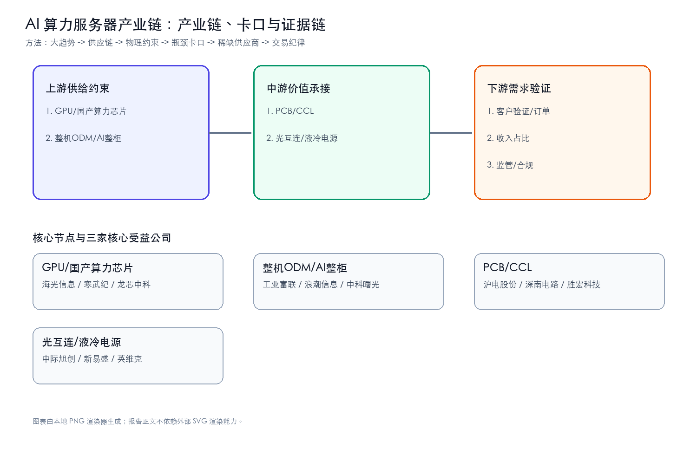
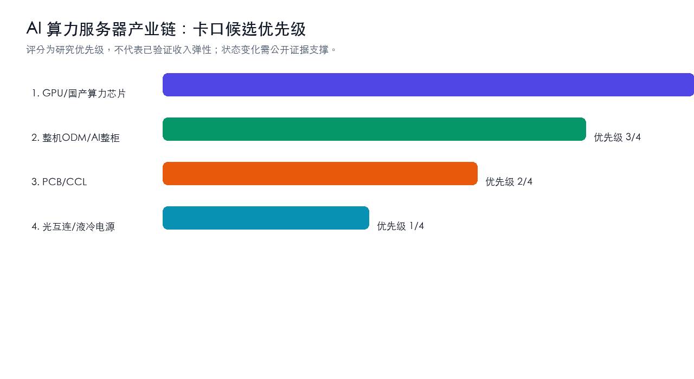
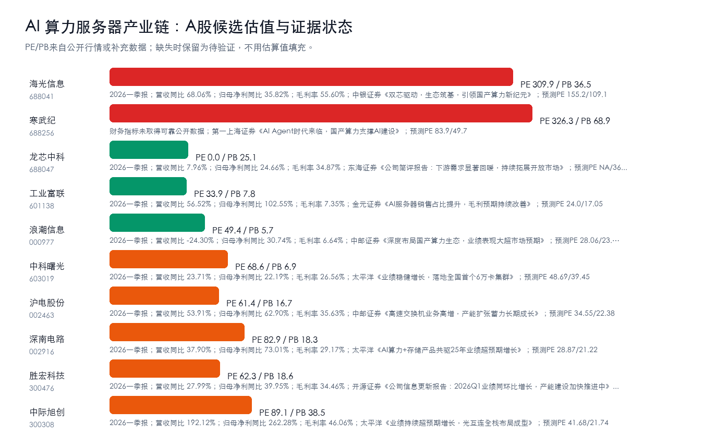
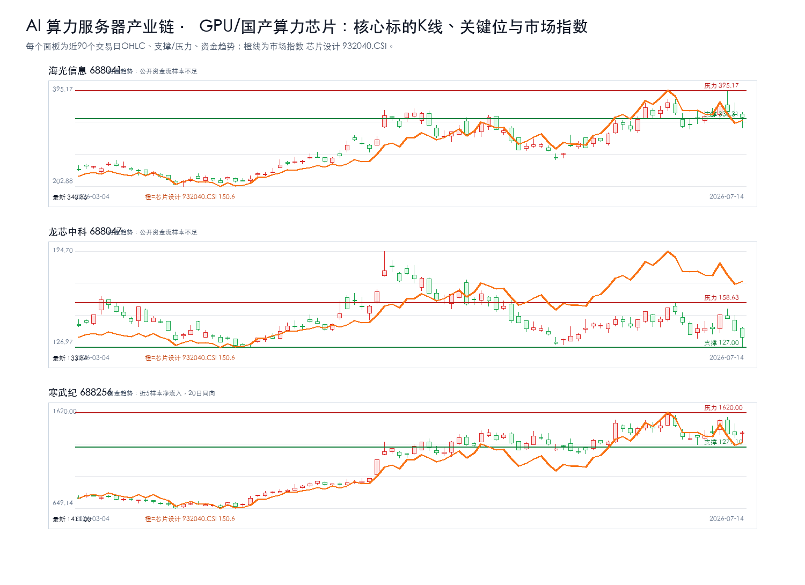
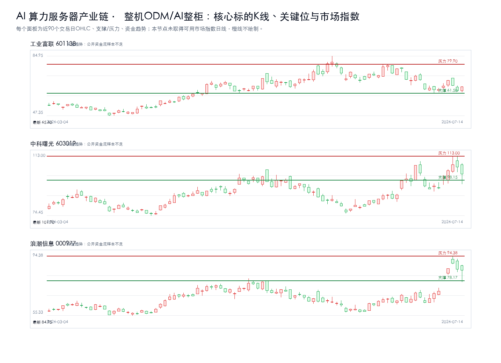
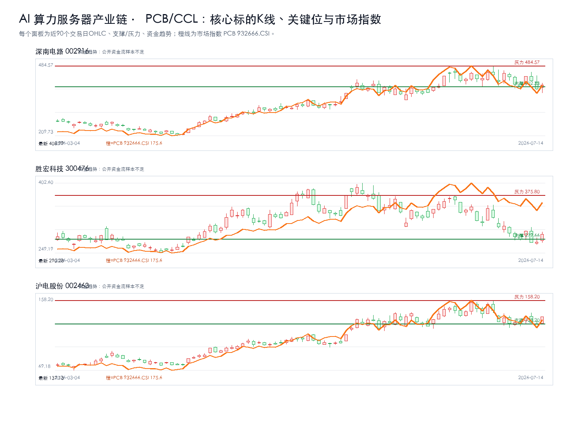
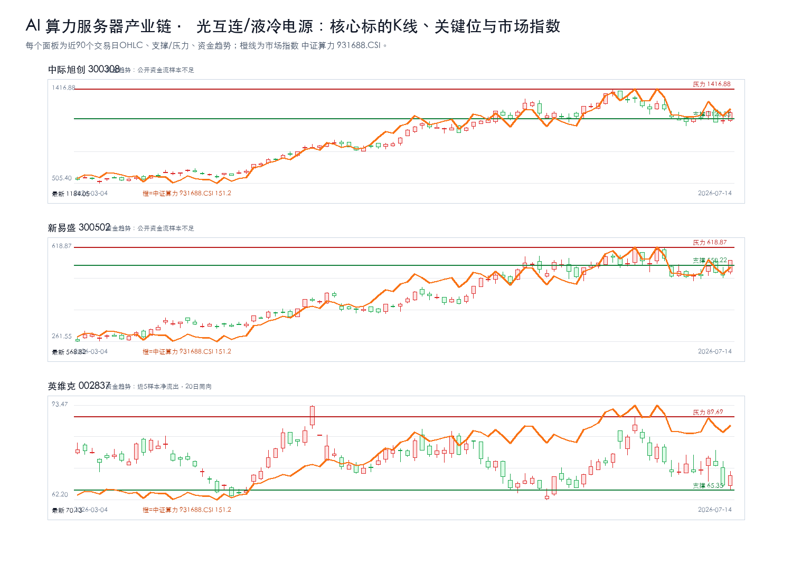
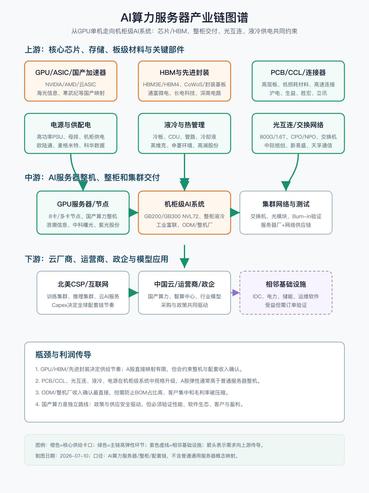

# AI算力服务器上下游产业链与A股公司分析报告

## 研究课题

本报告只回答三个问题：`AI 算力服务器产业链` 的利润会流向哪些卡口，A股哪些公司真正暴露在这些卡口上，当前价格是否允许执行。当前跟踪范围收敛在 GPU/国产算力芯片、整机ODM/AI整柜、PCB/CCL、光互连/液冷电源。

## 一句话结论

强命题：AI 算力服务器产业链 的机会不在泛主题，而在 `GPU/国产算力芯片 + 整机ODM/AI整柜` 能否持续出现订单、价格、客户认证、收入占比或监管里程碑。方向谨慎看多，置信度中等；当前绝对核心候选为：中际旭创、寒武纪、新易盛、沪电股份、深南电路、胜宏科技。没有新增硬证据时，只观察，不追高。

## 市场盘点

- 需求：AI资本开支仍是背景变量，但只有订单、产能、客户认证和收入占比能把主题变成业绩。
- 供给：重点看认证周期、良率/交付、关键材料和工程化能力是否造成瓶颈。
- 价格：股价接近压力位时不追；回到支撑区也要等硬证据同步。
- 证据密度：硬事实台账仍偏薄，PDF正文级和公告级证据不足，研报标题只作线索。

## 核心逻辑

1. 需求侧：AI 应用和模型迭代继续推高 `AI 算力服务器产业链` 相关需求，但需求强度必须通过订单、客户认证、收入占比、价格趋势或政策里程碑验证。
2. 供给侧：利润更可能集中在短期难扩产、认证周期长、替代路线慢、合规壁垒高或工程化交付难的环节，例如 GPU/国产算力芯片、整机ODM/AI整柜、PCB/CCL、光互连/液冷电源。
3. A股映射：先判断产业链位置，再核验收入/订单暴露，最后才进入估值和交易条件；不能把行情样本或主题标签直接当作核心标的。

## 关键数据

| 判断项 | 当前结论 | 投资含义 |
| --- | --- | --- |
| 核心卡口 | GPU/国产算力芯片、整机ODM/AI整柜、PCB/CCL、光互连/液冷电源 | 优先验证订单、价格、客户认证和收入占比 |
| 核心候选 | 中际旭创、寒武纪、新易盛、沪电股份、深南电路、胜宏科技 | 只在买入触发满足时进入交易候选 |
| 财务口径 | 核心公司继续跟踪营收同比、归母净利同比、毛利率、预测PE | 财务改善要和订单/客户认证同步才升级 |
| 证据密度 | 公告/财报级硬证据不足，研报和新闻只作线索 | 不把主题热度等同于买入结论 |
| 正文证据 | 硬事实台账不铺长表；PDF正文级证据不足时降级为线索 | 避免把内部过程写进正文 |
| 交易纪律 | 等待买入触发；风险收益比不足时不追高 | 买点、支撑、压力和止损优先于叙事 |

## 产业链跟踪

### 产业链核心环节价值分布

| 产业链环节 | 细分领域/关键产品 | BOM成本占比/价值占比 | 核心技术壁垒 | 卡脖子程度 | 代表A股公司 | 公司环节地位 | 证据口径/备注 |
| --- | --- | --- | --- | --- | --- | --- | --- |
| 上游 | GPU/国产算力芯片 | 待验证 | 客户认证、数据闭环、工程化交付、合规和成本控制 | High | 海光信息、寒武纪、龙芯中科 | 待验证 | 公开产业链与财务/研报口径，待公告和客户认证继续核验 |
| 上游 | 整机ODM/AI整柜 | 待验证 | 客户认证、数据闭环、工程化交付、合规和成本控制 | High | 工业富联、浪潮信息、中科曙光 | 待验证 | 公开产业链与财务/研报口径，待公告和客户认证继续核验 |
| 中游 | PCB/CCL | 待验证 | 客户认证、数据闭环、工程化交付、合规和成本控制 | Medium | 沪电股份、深南电路、胜宏科技 | 待验证 | 公开产业链与财务/研报口径，待公告和客户认证继续核验 |
| 中游 | 光互连/液冷电源 | 待验证 | 客户认证、数据闭环、工程化交付、合规和成本控制 | Medium | 中际旭创、新易盛、英维克 | 待验证 | 公开产业链与财务/研报口径，待公告和客户认证继续核验 |

### 供需链路跟踪

| 环节 | 事实映射 | 供需变化方向 | 瓶颈/卡口 | A股映射 |
| --- | --- | --- | --- | --- |
| 上游 | GPU/国产算力芯片 | 上行 | 客户认证、数据闭环、工程化交付、合规和成本控制 | 海光信息、寒武纪、龙芯中科 |
| 上游 | 整机ODM/AI整柜 | 上行 | 客户认证、数据闭环、工程化交付、合规和成本控制 | 工业富联、浪潮信息、中科曙光 |
| 中游 | PCB/CCL | 上行 | 客户认证、数据闭环、工程化交付、合规和成本控制 | 沪电股份、深南电路、胜宏科技 |
| 中游 | 光互连/液冷电源 | 上行 | 客户认证、数据闭环、工程化交付、合规和成本控制 | 中际旭创、新易盛、英维克 |

### 核心节点三公司校验

| 产业链节点 | 核心公司1 | 核心公司2 | 核心公司3 | 升级催化 | 失效条件 |
| --- | --- | --- | --- | --- | --- |
| GPU/国产算力芯片 | 海光信息 | 寒武纪 | 龙芯中科 | 订单/客户认证/收入占比/政策或监管里程碑出现公告级证据 | 商业化ROI不足、客户验证低于预期、收入暴露不足或监管约束增强 |
| 整机ODM/AI整柜 | 工业富联 | 浪潮信息 | 中科曙光 | 订单/客户认证/收入占比/政策或监管里程碑出现公告级证据 | 商业化ROI不足、客户验证低于预期、收入暴露不足或监管约束增强 |
| PCB/CCL | 沪电股份 | 深南电路 | 胜宏科技 | 订单/客户认证/收入占比/政策或监管里程碑出现公告级证据 | 商业化ROI不足、客户验证低于预期、收入暴露不足或监管约束增强 |
| 光互连/液冷电源 | 中际旭创 | 新易盛 | 英维克 | 订单/客户认证/收入占比/政策或监管里程碑出现公告级证据 | 商业化ROI不足、客户验证低于预期、收入暴露不足或监管约束增强 |

### 瓶颈战斗地图

| 瓶颈节点 | 当前三家核心公司 | 为什么卡 | 升级信号 | 反证信号 | 节点结论 |
| --- | --- | --- | --- | --- | --- |
| GPU/国产算力芯片 | 海光信息、龙芯中科、寒武纪 | 需求放量与国产替代 | 订单/客户认证/收入占比/政策或监管里程碑出现公告级证据 | 商业化ROI不足、客户验证低于预期、收入暴露不足或监管约束增强 | 绝对核心 |
| 整机ODM/AI整柜 | 工业富联、中科曙光、浪潮信息 | 需求放量与国产替代 | 订单/客户认证/收入占比/政策或监管里程碑出现公告级证据 | 商业化ROI不足、客户验证低于预期、收入暴露不足或监管约束增强 | 绝对核心 |
| PCB/CCL | 深南电路、胜宏科技、沪电股份 | 供给刚性/认证周期/良率爬坡 | 订单/客户认证/收入占比/政策或监管里程碑出现公告级证据 | 商业化ROI不足、客户验证低于预期、收入暴露不足或监管约束增强 | 绝对核心 |
| 光互连/液冷电源 | 中际旭创、新易盛、英维克 | 供给刚性/认证周期/良率爬坡 | 订单/客户认证/收入占比/政策或监管里程碑出现公告级证据 | 商业化ROI不足、客户验证低于预期、收入暴露不足或监管约束增强 | 绝对核心 |

### 瓶颈四标准校验

| 候选环节 | 不可替代 | 供给刚性 | 寡头垄断 | 机构低配 | 反证条件 |
| --- | --- | --- | --- | --- | --- |
| GPU/国产算力芯片 | 待验证 | 待验证 | 待验证 | 待验证 | 商业化ROI不足、客户验证低于预期、收入暴露不足或监管约束增强 |
| 整机ODM/AI整柜 | 待验证 | 待验证 | 待验证 | 待验证 | 商业化ROI不足、客户验证低于预期、收入暴露不足或监管约束增强 |
| PCB/CCL | 待验证 | 待验证 | 待验证 | 待验证 | 商业化ROI不足、客户验证低于预期、收入暴露不足或监管约束增强 |
| 光互连/液冷电源 | 待验证 | 待验证 | 待验证 | 待验证 | 商业化ROI不足、客户验证低于预期、收入暴露不足或监管约束增强 |

## 投资机会挖掘

### 瓶颈识别

- 1. GPU/国产算力芯片：代表公司 海光信息、寒武纪、龙芯中科；催化 订单/客户认证/收入占比/政策或监管里程碑出现公告级证据；失效条件 商业化ROI不足、客户验证低于预期、收入暴露不足或监管约束增强。
- 2. 整机ODM/AI整柜：代表公司 工业富联、浪潮信息、中科曙光；催化 订单/客户认证/收入占比/政策或监管里程碑出现公告级证据；失效条件 商业化ROI不足、客户验证低于预期、收入暴露不足或监管约束增强。
- 3. PCB/CCL：代表公司 沪电股份、深南电路、胜宏科技；催化 订单/客户认证/收入占比/政策或监管里程碑出现公告级证据；失效条件 商业化ROI不足、客户验证低于预期、收入暴露不足或监管约束增强。
- 4. 光互连/液冷电源：代表公司 中际旭创、新易盛、英维克；催化 订单/客户认证/收入占比/政策或监管里程碑出现公告级证据；失效条件 商业化ROI不足、客户验证低于预期、收入暴露不足或监管约束增强。

### 可交易标的筛选

- 直接暴露优先于相邻链路；公告/财报证明优先于研报标题；估值赔率优先于短期涨幅。当前所有候选仍需“收入占比/订单/客户认证”三项中的至少一项补强。

## A股可交易标的估值对比

### GPU/国产算力芯片核心三公司K线

叠加板块指数：芯片设计 932040.CSI；来源：tushare.index_daily。

### 整机ODM/AI整柜核心三公司K线

叠加板块指数：未匹配到市场真实指数；需补充主题-指数映射后复核。

### PCB/CCL核心三公司K线

叠加板块指数：PCB 932666.CSI；来源：tushare.index_daily。

### 光互连/液冷电源核心三公司K线

叠加板块指数：中证算力 931688.CSI；来源：tushare.index_daily。

| 公司 | 代码 | 产业链位置 | 当前估值 | 财务/订单信号 | 催化 | 买点条件 | 失效条件 |
| --- | --- | --- | --- | --- | --- | --- | --- |
| 海光信息 | 688041 | GPU/国产算力芯片 | PE 309.89 / PB 36.49 | 2026一季报；营收同比 68.06%；归母净利同比 35.82%；毛利率 55.60%；中银证券《双芯驱动，生态筑基，引领国产算力新纪元》；预测PE 155.2/109.1 | 订单/客户认证/收入占比/政策或监管里程碑出现公告级证据 | 等待买入触发：当前未进入买入候选；需先满足交易决策、风险收益比、K线企稳和订单/价格/客户认证增量证据 | 商业化ROI不足、客户验证低于预期、收入暴露不足或监管约束增强 |
| 寒武纪 | 688256 | GPU/国产算力芯片 | PE 326.2896 / PB 68.8758 | 财务指标未取得可靠公开数据；第一上海证券《AI Agent时代来临，国产算力支撑AI建设》；预测PE 83.9/49.7 | 订单/客户认证/收入占比/政策或监管里程碑出现公告级证据 | 等待买入触发：当前未进入买入候选；需先满足交易决策、风险收益比、K线企稳和订单/价格/客户认证增量证据 | 商业化ROI不足、客户验证低于预期、收入暴露不足或监管约束增强 |
| 龙芯中科 | 688047 | GPU/国产算力芯片 | PE -143.87 / PB 25.06 | 2026一季报；营收同比 7.96%；归母净利同比 24.66%；毛利率 34.87%；东海证券《公司简评报告：下游需求显著回暖，持续拓展开放市场》；预测PE NA/3628.28 | 订单/客户认证/收入占比/政策或监管里程碑出现公告级证据 | 等待买入触发：当前未进入买入候选；需先满足交易决策、风险收益比、K线企稳和订单/价格/客户认证增量证据 | 商业化ROI不足、客户验证低于预期、收入暴露不足或监管约束增强 |
| 工业富联 | 601138 | 整机ODM/AI整柜 | PE 33.94 / PB 7.83 | 2026一季报；营收同比 56.52%；归母净利同比 102.55%；毛利率 7.35%；金元证券《AI服务器销售占比提升，毛利预期持续改善》；预测PE 24.0/17.05 | 订单/客户认证/收入占比/政策或监管里程碑出现公告级证据 | 等待买入触发：当前未进入买入候选；需先满足交易决策、风险收益比、K线企稳和订单/价格/客户认证增量证据 | 商业化ROI不足、客户验证低于预期、收入暴露不足或监管约束增强 |
| 浪潮信息 | 000977 | 整机ODM/AI整柜 | PE 49.42 / PB 5.68 | 2026一季报；营收同比 -24.30%；归母净利同比 30.74%；毛利率 6.64%；中邮证券《深度布局国产算力生态，业绩表现大超市场预期》；预测PE 28.06/23.36 | 订单/客户认证/收入占比/政策或监管里程碑出现公告级证据 | 等待买入触发：当前未进入买入候选；需先满足交易决策、风险收益比、K线企稳和订单/价格/客户认证增量证据 | 商业化ROI不足、客户验证低于预期、收入暴露不足或监管约束增强 |
| 中科曙光 | 603019 | 整机ODM/AI整柜 | PE 68.61 / PB 6.92 | 2026一季报；营收同比 23.71%；归母净利同比 22.19%；毛利率 26.56%；太平洋《业绩稳健增长，落地全国首个6万卡集群》；预测PE 48.69/39.45 | 订单/客户认证/收入占比/政策或监管里程碑出现公告级证据 | 等待买入触发：当前未进入买入候选；需先满足交易决策、风险收益比、K线企稳和订单/价格/客户认证增量证据 | 商业化ROI不足、客户验证低于预期、收入暴露不足或监管约束增强 |
| 沪电股份 | 002463 | PCB/CCL | PE 61.42 / PB 16.69 | 2026一季报；营收同比 53.91%；归母净利同比 62.90%；毛利率 35.63%；中邮证券《高速交换机业务高增，产能扩张蓄力长期成长》；预测PE 34.55/22.38 | 订单/客户认证/收入占比/政策或监管里程碑出现公告级证据 | 等待买入触发：当前未进入买入候选；需先满足交易决策、风险收益比、K线企稳和订单/价格/客户认证增量证据 | 商业化ROI不足、客户验证低于预期、收入暴露不足或监管约束增强 |
| 深南电路 | 002916 | PCB/CCL | PE 82.94 / PB 18.32 | 2026一季报；营收同比 37.90%；归母净利同比 73.01%；毛利率 29.17%；太平洋《AI算力+存储产品共驱25年业绩超预期增长》；预测PE 28.87/21.22 | 订单/客户认证/收入占比/政策或监管里程碑出现公告级证据 | 等待买入触发：当前未进入买入候选；需先满足交易决策、风险收益比、K线企稳和订单/价格/客户认证增量证据 | 商业化ROI不足、客户验证低于预期、收入暴露不足或监管约束增强 |
| 胜宏科技 | 300476 | PCB/CCL | PE 62.31 / PB 18.62 | 2026一季报；营收同比 27.99%；归母净利同比 39.95%；毛利率 34.46%；开源证券《公司信息更新报告：2026Q1业绩同环比增长，产能建设加快推进中》；预测PE 33.7/19.9 | 订单/客户认证/收入占比/政策或监管里程碑出现公告级证据 | 等待买入触发：当前未进入买入候选；需先满足交易决策、风险收益比、K线企稳和订单/价格/客户认证增量证据 | 商业化ROI不足、客户验证低于预期、收入暴露不足或监管约束增强 |
| 中际旭创 | 300308 | 光互连/液冷电源 | PE 89.14 / PB 38.47 | 2026一季报；营收同比 192.12%；归母净利同比 262.28%；毛利率 46.06%；太平洋《业绩持续超预期增长，光互连全栈布局成型》；预测PE 41.68/21.74 | 订单/客户认证/收入占比/政策或监管里程碑出现公告级证据 | 等待买入触发：当前未进入买入候选；需先满足交易决策、风险收益比、K线企稳和订单/价格/客户认证增量证据 | 商业化ROI不足、客户验证低于预期、收入暴露不足或监管约束增强 |
| 新易盛 | 300502 | 光互连/液冷电源 | PE 70.82 / PB 39.18 | 2026一季报；营收同比 105.76%；归母净利同比 76.80%；毛利率 49.16%；山西证券《1.6T环比上量将加快，盈利能力继续维持行业领先水平》；预测PE 32.8/17.2 | 订单/客户认证/收入占比/政策或监管里程碑出现公告级证据 | 等待买入触发：当前未进入买入候选；需先满足交易决策、风险收益比、K线企稳和订单/价格/客户认证增量证据 | 商业化ROI不足、客户验证低于预期、收入暴露不足或监管约束增强 |
| 英维克 | 002837 | 光互连/液冷电源 | PE 176.8808 / PB 24.6567 | 财务指标未取得可靠公开数据；None | 订单/客户认证/收入占比/政策或监管里程碑出现公告级证据 | 等待买入触发：当前未进入买入候选；需先满足交易决策、风险收益比、K线企稳和订单/价格/客户认证增量证据 | 商业化ROI不足、客户验证低于预期、收入暴露不足或监管约束增强 |

## 核心个股交易跟踪

| 公司 | 代码 | 产业链位置 | 估值 | 财务质量 | 趋势结构 | 关键位 | 买入条件 | 止损/失效 | 卖出/目标 |
| --- | --- | --- | --- | --- | --- | --- | --- | --- | --- |
| 海光信息 | 688041 | GPU/国产算力芯片 | PE 309.89 / PB 36.49 | 2026一季报；营收同比 68.06%；归母净利同比 35.82%；毛利率 55.60% | 现价 340.85；涨跌幅 -1.20%；MA5/10/20/60=349.06/342.45/338.31/311.23；20日箱体 284.96-395.17；多头趋势；20日箱体位置51%；风险收益比21.36；资金趋势：公开资金流样本不足 | 支撑 338.31；压力 395.17 | 等待买入触发：当前未进入买入候选；需先满足交易决策、风险收益比、K线企稳和订单/价格/客户认证增量证据 | 跌破338.31且订单/业绩无增量；商业化ROI不足、客户验证低于预期、收入暴露不足或监管约束增强 | 未设技术目标：尚未进入买入候选，先观察证据和价格结构是否修复 |
| 寒武纪 | 688256 | GPU/国产算力芯片 | PE 326.2896 / PB 68.8758 | 财务指标未取得可靠公开数据 | 现价 1411.00；涨跌幅 1.51%；MA5/10/20/60=1429.91/1411.76/1430.78/1269.88；20日箱体 1271.10-1620.00；震荡分歧；20日箱体位置40%；风险收益比1.49；资金趋势：近5样本净流入，20日同向 | 支撑 1271.10；压力 1620.00 | 等待买入触发：当前未进入买入候选；需先满足交易决策、风险收益比、K线企稳和订单/价格/客户认证增量证据 | 跌破1271.10且订单/业绩无增量；商业化ROI不足、客户验证低于预期、收入暴露不足或监管约束增强 | 未设技术目标：尚未进入买入候选，先观察证据和价格结构是否修复 |
| 龙芯中科 | 688047 | GPU/国产算力芯片 | PE -143.87 / PB 25.06 | 2026一季报；营收同比 7.96%；归母净利同比 24.66%；毛利率 34.87% | 现价 133.84；涨跌幅 -3.36%；MA5/10/20/60=141.87/142.25/144.34/150.65；20日箱体 127.00-158.63；空头趋势；20日箱体位置22%；风险收益比3.62；资金趋势：公开资金流样本不足 | 支撑 127.00；压力 158.63 | 等待买入触发：当前未进入买入候选；需先满足交易决策、风险收益比、K线企稳和订单/价格/客户认证增量证据 | 跌破127.00且订单/业绩无增量；商业化ROI不足、客户验证低于预期、收入暴露不足或监管约束增强 | 未设技术目标：尚未进入买入候选，先观察证据和价格结构是否修复 |
| 工业富联 | 601138 | 整机ODM/AI整柜 | PE 33.94 / PB 7.83 | 2026一季报；营收同比 56.52%；归母净利同比 102.55%；毛利率 7.35% | 现价 65.60；涨跌幅 3.99%；MA5/10/20/60=66.10/65.66/69.95/69.14；20日箱体 61.50-79.90；震荡分歧；20日箱体位置22%；风险收益比3.49；资金趋势：公开资金流样本不足 | 支撑 61.50；压力 79.90 | 等待买入触发：当前未进入买入候选；需先满足交易决策、风险收益比、K线企稳和订单/价格/客户认证增量证据 | 跌破61.50且订单/业绩无增量；商业化ROI不足、客户验证低于预期、收入暴露不足或监管约束增强 | 未设技术目标：尚未进入买入候选，先观察证据和价格结构是否修复 |
| 浪潮信息 | 000977 | 整机ODM/AI整柜 | PE 49.42 / PB 5.68 | 2026一季报；营收同比 -24.30%；归母净利同比 30.74%；毛利率 6.64% | 现价 84.95；涨跌幅 -0.63%；MA5/10/20/60=84.82/76.23/70.90/69.22；20日箱体 61.50-94.38；多头趋势；20日箱体位置71%；风险收益比1.39；资金趋势：公开资金流样本不足 | 支撑 78.17；压力 94.38 | 等待买入触发：当前未进入买入候选；需先满足交易决策、风险收益比、K线企稳和订单/价格/客户认证增量证据 | 跌破78.17且订单/业绩无增量；商业化ROI不足、客户验证低于预期、收入暴露不足或监管约束增强 | 未设技术目标：尚未进入买入候选，先观察证据和价格结构是否修复 |
| 中科曙光 | 603019 | 整机ODM/AI整柜 | PE 68.61 / PB 6.92 | 2026一季报；营收同比 23.71%；归母净利同比 22.19%；毛利率 26.56% | 现价 101.90；涨跌幅 -3.99%；MA5/10/20/60=103.53/99.54/96.07/92.66；20日箱体 83.40-113.00；多头趋势；20日箱体位置63%；风险收益比2.96；资金趋势：公开资金流样本不足 | 支撑 98.15；压力 113.00 | 等待买入触发：当前未进入买入候选；需先满足交易决策、风险收益比、K线企稳和订单/价格/客户认证增量证据 | 跌破98.15且订单/业绩无增量；商业化ROI不足、客户验证低于预期、收入暴露不足或监管约束增强 | 未设技术目标：尚未进入买入候选，先观察证据和价格结构是否修复 |
| 沪电股份 | 002463 | PCB/CCL | PE 61.42 / PB 16.69 | 2026一季报；营收同比 53.91%；归母净利同比 62.90%；毛利率 35.63% | 现价 137.13；涨跌幅 10.00%；MA5/10/20/60=131.35/132.62/139.22/123.04；20日箱体 123.00-158.20；震荡分歧；20日箱体位置40%；风险收益比2.36；资金趋势：公开资金流样本不足 | 支撑 128.20；压力 158.20 | 等待买入触发：当前未进入买入候选；需先满足交易决策、风险收益比、K线企稳和订单/价格/客户认证增量证据 | 跌破128.20且订单/业绩无增量；商业化ROI不足、客户验证低于预期、收入暴露不足或监管约束增强 | 未设技术目标：尚未进入买入候选，先观察证据和价格结构是否修复 |
| 深南电路 | 002916 | PCB/CCL | PE 82.94 / PB 18.32 | 2026一季报；营收同比 37.90%；归母净利同比 73.01%；毛利率 29.17% | 现价 408.99；涨跌幅 3.91%；MA5/10/20/60=414.69/425.14/432.46/375.12；20日箱体 378.00-484.57；震荡分歧；20日箱体位置29%；风险收益比11.35；资金趋势：公开资金流样本不足 | 支撑 402.33；压力 484.57 | 等待买入触发：当前未进入买入候选；需先满足交易决策、风险收益比、K线企稳和订单/价格/客户认证增量证据 | 跌破402.33且订单/业绩无增量；商业化ROI不足、客户验证低于预期、收入暴露不足或监管约束增强 | 未设技术目标：尚未进入买入候选，先观察证据和价格结构是否修复 |
| 胜宏科技 | 300476 | PCB/CCL | PE 62.31 / PB 18.62 | 2026一季报；营收同比 27.99%；归母净利同比 39.95%；毛利率 34.46% | 现价 290.28；涨跌幅 6.33%；MA5/10/20/60=282.33/293.04/319.75/336.67；20日箱体 268.00-375.80；空头趋势；20日箱体位置21%；风险收益比8.05；资金趋势：公开资金流样本不足 | 支撑 279.66；压力 375.80 | 等待买入触发：当前未进入买入候选；需先满足交易决策、风险收益比、K线企稳和订单/价格/客户认证增量证据 | 跌破279.66且订单/业绩无增量；商业化ROI不足、客户验证低于预期、收入暴露不足或监管约束增强 | 未设技术目标：尚未进入买入候选，先观察证据和价格结构是否修复 |
| 中际旭创 | 300308 | 光互连/液冷电源 | PE 89.14 / PB 38.47 | 2026一季报；营收同比 192.12%；归母净利同比 262.28%；毛利率 46.06% | 现价 1184.05；涨跌幅 6.86%；MA5/10/20/60=1141.86/1141.23/1218.81/1090.32；20日箱体 1060.34-1416.88；震荡分歧；20日箱体位置35%；风险收益比4.18；资金趋势：公开资金流样本不足 | 支撑 1128.35；压力 1416.88 | 等待买入触发：当前未进入买入候选；需先满足交易决策、风险收益比、K线企稳和订单/价格/客户认证增量证据 | 跌破1128.35且订单/业绩无增量；商业化ROI不足、客户验证低于预期、收入暴露不足或监管约束增强 | 未设技术目标：尚未进入买入候选，先观察证据和价格结构是否修复 |
| 新易盛 | 300502 | 光互连/液冷电源 | PE 70.82 / PB 39.18 | 2026一季报；营收同比 105.76%；归母净利同比 76.80%；毛利率 49.16% | 现价 568.82；涨跌幅 10.99%；MA5/10/20/60=532.14/528.83/550.22/486.30；20日箱体 490.10-618.87；多头趋势；20日箱体位置61%；风险收益比2.69；资金趋势：公开资金流样本不足 | 支撑 550.22；压力 618.87 | 等待买入触发：当前未进入买入候选；需先满足交易决策、风险收益比、K线企稳和订单/价格/客户认证增量证据 | 跌破550.22且订单/业绩无增量；商业化ROI不足、客户验证低于预期、收入暴露不足或监管约束增强 | 未设技术目标：尚未进入买入候选，先观察证据和价格结构是否修复 |
| 英维克 | 002837 | 光互连/液冷电源 | PE 176.8808 / PB 24.6567 | 财务指标未取得可靠公开数据 | 现价 70.13；涨跌幅 4.70%；MA5/10/20/60=71.73/72.16/75.56/75.26；20日箱体 65.35-89.69；震荡分歧；20日箱体位置20%；风险收益比4.09；资金趋势：近5样本净流出，20日同向 | 支撑 65.35；压力 89.69 | 等待买入触发：当前未进入买入候选；需先满足交易决策、风险收益比、K线企稳和订单/价格/客户认证增量证据 | 跌破65.35且订单/业绩无增量；商业化ROI不足、客户验证低于预期、收入暴露不足或监管约束增强 | 未设技术目标：尚未进入买入候选，先观察证据和价格结构是否修复 |

交易判断只看两件事：价格是否到买入触发区，证据是否同步增强。二者缺一，继续等待。

## 产业链 / 竞争格局

### A股公司映射与核心地位判断

| 公司 | 代码 | 环节 | 细分领域 | 产业占比/暴露度 | 核心技术/产品 | 卡脖子相关性 | 环节地位 | 证据与备注 |
| --- | --- | --- | --- | --- | --- | --- | --- | --- |
| 海光信息 | 688041 | GPU/国产算力芯片 | GPU/国产算力芯片 | 待公告/财报核验收入、订单或客户认证占比 | GPU/国产算力芯片 | High/待验证 | 核心卡口候选 | 2026一季报；营收同比 68.06%；归母净利同比 35.82%；毛利率 55.…；中银证券《双芯驱动，生态筑基，引领国产算力新纪元》；预测PE 155.2/109.1；反证/失效：商业化ROI不足、客户验证低于预期、收入暴露不足或监管约束增强 |
| 寒武纪 | 688256 | GPU/国产算力芯片 | GPU/国产算力芯片 | 待公告/财报核验收入、订单或客户认证占比 | GPU/国产算力芯片 | High/待验证 | 核心卡口候选 | 财务指标未取得可靠公开数据；第一上海证券《AI Agent时代来临，国产算力支撑AI建设》；预测PE 83.9…；反证/失效：商业化ROI不足、客户验证低于预期、收入暴露不足或监管约束增强 |
| 龙芯中科 | 688047 | GPU/国产算力芯片 | GPU/国产算力芯片 | 待公告/财报核验收入、订单或客户认证占比 | GPU/国产算力芯片 | High/待验证 | 核心卡口候选 | 2026一季报；营收同比 7.96%；归母净利同比 24.66%；毛利率 34.8…；东海证券《公司简评报告：下游需求显著回暖，持续拓展开放市场》；预测PE NA/36…；反证/失效：商业化ROI不足、客户验证低于预期、收入暴露不足或监管约束增强 |
| 工业富联 | 601138 | 整机ODM/AI整柜 | 整机ODM/AI整柜 | 待公告/财报核验收入、订单或客户认证占比 | 整机ODM/AI整柜 | Medium/待验证 | 重要配套/待验证 | 2026一季报；营收同比 56.52%；归母净利同比 102.55%；毛利率 7.…；金元证券《AI服务器销售占比提升，毛利预期持续改善》；预测PE 24.0/17.05；反证/失效：商业化ROI不足、客户验证低于预期、收入暴露不足或监管约束增强 |
| 浪潮信息 | 000977 | 整机ODM/AI整柜 | 整机ODM/AI整柜 | 待公告/财报核验收入、订单或客户认证占比 | 整机ODM/AI整柜 | Medium/待验证 | 重要配套/待验证 | 2026一季报；营收同比 -24.30%；归母净利同比 30.74%；毛利率 6.…；中邮证券《深度布局国产算力生态，业绩表现大超市场预期》；预测PE 28.06/23…；反证/失效：商业化ROI不足、客户验证低于预期、收入暴露不足或监管约束增强 |
| 中科曙光 | 603019 | 整机ODM/AI整柜 | 整机ODM/AI整柜 | 待公告/财报核验收入、订单或客户认证占比 | 整机ODM/AI整柜 | Medium/待验证 | 重要配套/待验证 | 2026一季报；营收同比 23.71%；归母净利同比 22.19%；毛利率 26.…；太平洋《业绩稳健增长，落地全国首个6万卡集群》；预测PE 48.69/39.45；反证/失效：商业化ROI不足、客户验证低于预期、收入暴露不足或监管约束增强 |
| 沪电股份 | 002463 | PCB/CCL | PCB/CCL | 待公告/财报核验收入、订单或客户认证占比 | PCB/CCL | High/待验证 | 核心卡口候选 | 2026一季报；营收同比 53.91%；归母净利同比 62.90%；毛利率 35.…；中邮证券《高速交换机业务高增，产能扩张蓄力长期成长》；预测PE 34.55/22.…；反证/失效：商业化ROI不足、客户验证低于预期、收入暴露不足或监管约束增强 |
| 深南电路 | 002916 | PCB/CCL | PCB/CCL | 待公告/财报核验收入、订单或客户认证占比 | PCB/CCL | High/待验证 | 核心卡口候选 | 2026一季报；营收同比 37.90%；归母净利同比 73.01%；毛利率 29.…；太平洋《AI算力+存储产品共驱25年业绩超预期增长》；预测PE 28.87/21.…；反证/失效：商业化ROI不足、客户验证低于预期、收入暴露不足或监管约束增强 |
| 胜宏科技 | 300476 | PCB/CCL | PCB/CCL | 待公告/财报核验收入、订单或客户认证占比 | PCB/CCL | High/待验证 | 核心卡口候选 | 2026一季报；营收同比 27.99%；归母净利同比 39.95%；毛利率 34.…；开源证券《公司信息更新报告：2026Q1业绩同环比增长，产能建设加快推进中》；预测…；反证/失效：商业化ROI不足、客户验证低于预期、收入暴露不足或监管约束增强 |
| 中际旭创 | 300308 | 光互连/液冷电源 | 光互连/液冷电源 | 待公告/财报核验收入、订单或客户认证占比 | 光互连/液冷电源 | High/待验证 | 核心卡口候选 | 2026一季报；营收同比 192.12%；归母净利同比 262.28%；毛利率 4…；太平洋《业绩持续超预期增长，光互连全栈布局成型》；预测PE 41.68/21.74；反证/失效：商业化ROI不足、客户验证低于预期、收入暴露不足或监管约束增强 |
| 新易盛 | 300502 | 光互连/液冷电源 | 光互连/液冷电源 | 待公告/财报核验收入、订单或客户认证占比 | 光互连/液冷电源 | High/待验证 | 核心卡口候选 | 2026一季报；营收同比 105.76%；归母净利同比 76.80%；毛利率 49…；山西证券《1.6T环比上量将加快，盈利能力继续维持行业领先水平》；预测PE 32.…；反证/失效：商业化ROI不足、客户验证低于预期、收入暴露不足或监管约束增强 |
| 英维克 | 002837 | 光互连/液冷电源 | 光互连/液冷电源 | 待公告/财报核验收入、订单或客户认证占比 | 光互连/液冷电源 | High/待验证 | 核心卡口候选 | 财务指标未取得可靠公开数据；；反证/失效：商业化ROI不足、客户验证低于预期、收入暴露不足或监管约束增强 |

### 竞争格局与反证条件

| 公司 | 代码 | 卡口环节 | 直接性 | 财务信号 | 研报/公告信号 | 估值压力 | 反证条件 |
| --- | --- | --- | --- | --- | --- | --- | --- |
| 海光信息 | 688041 | GPU/国产算力芯片 | 核心卡口候选 | 2026一季报；营收同比 68.06%；归母净利同比 35.82%；毛利率 55.60% | 中银证券《双芯驱动，生态筑基，引领国产算力新纪元》；预测PE 155.2/109.1 | 极高 | 商业化ROI不足、客户验证低于预期、收入暴露不足或监管约束增强 |
| 寒武纪 | 688256 | GPU/国产算力芯片 | 核心卡口候选 | 财务指标未取得可靠公开数据 | 第一上海证券《AI Agent时代来临，国产算力支撑AI建设》；预测PE 83.9/49.7 | 极高 | 商业化ROI不足、客户验证低于预期、收入暴露不足或监管约束增强 |
| 龙芯中科 | 688047 | GPU/国产算力芯片 | 核心卡口候选 | 2026一季报；营收同比 7.96%；归母净利同比 24.66%；毛利率 34.87% | 东海证券《公司简评报告：下游需求显著回暖，持续拓展开放市场》；预测PE NA/3628.28 | 中 | 商业化ROI不足、客户验证低于预期、收入暴露不足或监管约束增强 |
| 工业富联 | 601138 | 整机ODM/AI整柜 | 重要配套 | 2026一季报；营收同比 56.52%；归母净利同比 102.55%；毛利率 7.35% | 金元证券《AI服务器销售占比提升，毛利预期持续改善》；预测PE 24.0/17.05 | 中 | 商业化ROI不足、客户验证低于预期、收入暴露不足或监管约束增强 |
| 浪潮信息 | 000977 | 整机ODM/AI整柜 | 重要配套 | 2026一季报；营收同比 -24.30%；归母净利同比 30.74%；毛利率 6.64% | 中邮证券《深度布局国产算力生态，业绩表现大超市场预期》；预测PE 28.06/23.36 | 中 | 商业化ROI不足、客户验证低于预期、收入暴露不足或监管约束增强 |
| 中科曙光 | 603019 | 整机ODM/AI整柜 | 重要配套 | 2026一季报；营收同比 23.71%；归母净利同比 22.19%；毛利率 26.56% | 太平洋《业绩稳健增长，落地全国首个6万卡集群》；预测PE 48.69/39.45 | 中 | 商业化ROI不足、客户验证低于预期、收入暴露不足或监管约束增强 |
| 沪电股份 | 002463 | PCB/CCL | 核心卡口候选 | 2026一季报；营收同比 53.91%；归母净利同比 62.90%；毛利率 35.63% | 中邮证券《高速交换机业务高增，产能扩张蓄力长期成长》；预测PE 34.55/22.38 | 中 | 商业化ROI不足、客户验证低于预期、收入暴露不足或监管约束增强 |
| 深南电路 | 002916 | PCB/CCL | 核心卡口候选 | 2026一季报；营收同比 37.90%；归母净利同比 73.01%；毛利率 29.17% | 太平洋《AI算力+存储产品共驱25年业绩超预期增长》；预测PE 28.87/21.22 | 高 | 商业化ROI不足、客户验证低于预期、收入暴露不足或监管约束增强 |
| 胜宏科技 | 300476 | PCB/CCL | 核心卡口候选 | 2026一季报；营收同比 27.99%；归母净利同比 39.95%；毛利率 34.46% | 开源证券《公司信息更新报告：2026Q1业绩同环比增长，产能建设加快推进中》；预测PE 33.7/19.9 | 中 | 商业化ROI不足、客户验证低于预期、收入暴露不足或监管约束增强 |
| 中际旭创 | 300308 | 光互连/液冷电源 | 核心卡口候选 | 2026一季报；营收同比 192.12%；归母净利同比 262.28%；毛利率 46.06% | 太平洋《业绩持续超预期增长，光互连全栈布局成型》；预测PE 41.68/21.74 | 高 | 商业化ROI不足、客户验证低于预期、收入暴露不足或监管约束增强 |
| 新易盛 | 300502 | 光互连/液冷电源 | 核心卡口候选 | 2026一季报；营收同比 105.76%；归母净利同比 76.80%；毛利率 49.16% | 山西证券《1.6T环比上量将加快，盈利能力继续维持行业领先水平》；预测PE 32.8/17.2 | 中 | 商业化ROI不足、客户验证低于预期、收入暴露不足或监管约束增强 |
| 英维克 | 002837 | 光互连/液冷电源 | 核心卡口候选 | 财务指标未取得可靠公开数据 | None | 高 | 商业化ROI不足、客户验证低于预期、收入暴露不足或监管约束增强 |

竞争判断：AI 算力服务器产业链 中具备客户认证、数据闭环、合规壁垒、良率/交付和产能约束的环节更接近“瓶颈资产”；但若估值已经处在高压区，只有订单、价格、客户认证或收入占比继续补强，才能从“产业链好公司”升级为“可执行机会”。缺少差异化的概念映射容易只获得主题估值而非利润传导。

## 标的分层与入场条件

### 龙头分层

| 层级 | 公司 | 代码 | 节点 | 入选原因 | 升级触发器 | 降级/剔除条件 |
| --- | --- | --- | --- | --- | --- | --- |
| 绝对核心龙头 | 中际旭创 | 300308 | 光互连/液冷电源 | 卡在硬件瓶颈；财务增速可见；风险收益比4.18；PE 89.1 | 订单/客户认证/收入占比/政策或监管里程碑出现公告级证据 | 商业化ROI不足、客户验证低于预期、收入暴露不足或监管约束增强 |
| 绝对核心龙头 | 寒武纪 | 688256 | GPU/国产算力芯片 | 卡在硬件瓶颈；风险收益比1.49；PE 326.3 | 订单/客户认证/收入占比/政策或监管里程碑出现公告级证据 | 商业化ROI不足、客户验证低于预期、收入暴露不足或监管约束增强 |
| 绝对核心龙头 | 新易盛 | 300502 | 光互连/液冷电源 | 卡在硬件瓶颈；财务增速可见；风险收益比2.69；PE 70.8 | 订单/客户认证/收入占比/政策或监管里程碑出现公告级证据 | 商业化ROI不足、客户验证低于预期、收入暴露不足或监管约束增强 |
| 绝对核心龙头 | 沪电股份 | 002463 | PCB/CCL | 卡在硬件瓶颈；财务增速可见；风险收益比2.36；PE 61.4 | 订单/客户认证/收入占比/政策或监管里程碑出现公告级证据 | 商业化ROI不足、客户验证低于预期、收入暴露不足或监管约束增强 |
| 绝对核心龙头 | 深南电路 | 002916 | PCB/CCL | 卡在硬件瓶颈；财务增速可见；风险收益比11.35；PE 82.9 | 订单/客户认证/收入占比/政策或监管里程碑出现公告级证据 | 商业化ROI不足、客户验证低于预期、收入暴露不足或监管约束增强 |
| 绝对核心龙头 | 胜宏科技 | 300476 | PCB/CCL | 卡在硬件瓶颈；财务增速可见；风险收益比8.05；PE 62.3 | 订单/客户认证/收入占比/政策或监管里程碑出现公告级证据 | 商业化ROI不足、客户验证低于预期、收入暴露不足或监管约束增强 |
| 高弹性二线 | 中科曙光 | 603019 | 整机ODM/AI整柜 | 配套/相邻链路；财务增速可见；风险收益比2.96；PE 68.6 | 订单/客户认证/收入占比/政策或监管里程碑出现公告级证据 | 商业化ROI不足、客户验证低于预期、收入暴露不足或监管约束增强 |
| 高弹性二线 | 工业富联 | 601138 | 整机ODM/AI整柜 | 配套/相邻链路；财务增速可见；风险收益比3.49；PE 33.9 | 订单/客户认证/收入占比/政策或监管里程碑出现公告级证据 | 商业化ROI不足、客户验证低于预期、收入暴露不足或监管约束增强 |
| 高弹性二线 | 浪潮信息 | 000977 | 整机ODM/AI整柜 | 配套/相邻链路；财务增速可见；风险收益比1.39；PE 49.4 | 订单/客户认证/收入占比/政策或监管里程碑出现公告级证据 | 商业化ROI不足、客户验证低于预期、收入暴露不足或监管约束增强 |
| 高弹性二线 | 海光信息 | 688041 | GPU/国产算力芯片 | 卡在硬件瓶颈；财务增速可见；风险收益比21.36；PE 309.9 | 订单/客户认证/收入占比/政策或监管里程碑出现公告级证据 | 商业化ROI不足、客户验证低于预期、收入暴露不足或监管约束增强 |
| 高弹性二线 | 英维克 | 002837 | 光互连/液冷电源 | 卡在硬件瓶颈；风险收益比4.09；PE 176.9 | 订单/客户认证/收入占比/政策或监管里程碑出现公告级证据 | 商业化ROI不足、客户验证低于预期、收入暴露不足或监管约束增强 |
| 高弹性二线 | 龙芯中科 | 688047 | GPU/国产算力芯片 | 卡在硬件瓶颈；财务增速可见；风险收益比3.62；PE -143.9 | 订单/客户认证/收入占比/政策或监管里程碑出现公告级证据 | 商业化ROI不足、客户验证低于预期、收入暴露不足或监管约束增强 |

### 事件-交易触发器

| 公司 | 节点 | 需要等待的硬证据 | 买入触发 | 卖出/减仓触发 | 反证退出 |
| --- | --- | --- | --- | --- | --- |
| 海光信息 | GPU/国产算力芯片 | 订单/客户认证/收入占比/政策或监管里程碑出现公告级证据 | 等待买入触发：当前未进入买入候选；需先满足交易决策、风险收益比、K线企稳和订单/价格/客户认证增量证据 | 未设技术目标：尚未进入买入候选，先观察证据和价格结构是否修复 | 商业化ROI不足、客户验证低于预期、收入暴露不足或监管约束增强 |
| 寒武纪 | GPU/国产算力芯片 | 订单/客户认证/收入占比/政策或监管里程碑出现公告级证据 | 等待买入触发：当前未进入买入候选；需先满足交易决策、风险收益比、K线企稳和订单/价格/客户认证增量证据 | 未设技术目标：尚未进入买入候选，先观察证据和价格结构是否修复 | 商业化ROI不足、客户验证低于预期、收入暴露不足或监管约束增强 |
| 龙芯中科 | GPU/国产算力芯片 | 订单/客户认证/收入占比/政策或监管里程碑出现公告级证据 | 等待买入触发：当前未进入买入候选；需先满足交易决策、风险收益比、K线企稳和订单/价格/客户认证增量证据 | 未设技术目标：尚未进入买入候选，先观察证据和价格结构是否修复 | 商业化ROI不足、客户验证低于预期、收入暴露不足或监管约束增强 |
| 工业富联 | 整机ODM/AI整柜 | 订单/客户认证/收入占比/政策或监管里程碑出现公告级证据 | 等待买入触发：当前未进入买入候选；需先满足交易决策、风险收益比、K线企稳和订单/价格/客户认证增量证据 | 未设技术目标：尚未进入买入候选，先观察证据和价格结构是否修复 | 商业化ROI不足、客户验证低于预期、收入暴露不足或监管约束增强 |
| 浪潮信息 | 整机ODM/AI整柜 | 订单/客户认证/收入占比/政策或监管里程碑出现公告级证据 | 等待买入触发：当前未进入买入候选；需先满足交易决策、风险收益比、K线企稳和订单/价格/客户认证增量证据 | 未设技术目标：尚未进入买入候选，先观察证据和价格结构是否修复 | 商业化ROI不足、客户验证低于预期、收入暴露不足或监管约束增强 |
| 中科曙光 | 整机ODM/AI整柜 | 订单/客户认证/收入占比/政策或监管里程碑出现公告级证据 | 等待买入触发：当前未进入买入候选；需先满足交易决策、风险收益比、K线企稳和订单/价格/客户认证增量证据 | 未设技术目标：尚未进入买入候选，先观察证据和价格结构是否修复 | 商业化ROI不足、客户验证低于预期、收入暴露不足或监管约束增强 |
| 沪电股份 | PCB/CCL | 订单/客户认证/收入占比/政策或监管里程碑出现公告级证据 | 等待买入触发：当前未进入买入候选；需先满足交易决策、风险收益比、K线企稳和订单/价格/客户认证增量证据 | 未设技术目标：尚未进入买入候选，先观察证据和价格结构是否修复 | 商业化ROI不足、客户验证低于预期、收入暴露不足或监管约束增强 |
| 深南电路 | PCB/CCL | 订单/客户认证/收入占比/政策或监管里程碑出现公告级证据 | 等待买入触发：当前未进入买入候选；需先满足交易决策、风险收益比、K线企稳和订单/价格/客户认证增量证据 | 未设技术目标：尚未进入买入候选，先观察证据和价格结构是否修复 | 商业化ROI不足、客户验证低于预期、收入暴露不足或监管约束增强 |

## 风险、反证与退出条件

- 订单反证：公告、年报或调研无法验证新增订单、客户认证或收入占比。
- 供给反证：替代路线成熟、扩产过快或价格回落，导致卡口缓解。
- 估值反证：估值和成交拥挤先于基本面兑现，风险收益比低于 2:1。
- 主题反证：新闻/研报热度上升但公司财务、订单和价格信号没有同步改善。

## 数据来源与证据强度

| 结论/数据 | 来源 | 日期 | 置信度 |
| --- | --- | --- | --- |
| 产业链与卡口判断 | 公开产业链、研报、行情结构化证据 | 2026-07-14 | Medium |
| 核心公司估值/财务/K线 | 公开行情、财务快照、公告与研报摘要 | 2026-07-14 | Medium |
| 复核与反证条件 | 投研复核规则 | 2026-07-14 | Medium |
| 钢铁行业周报：铁水产量回落，钢厂盈利再下降 | 大同证券 | 2026-07-14 | 标题级/Medium |
| 商贸零售行业7月投资策略：扩大消费“十五五”规划出台，顶层设计引领内需复苏成长 | 国信证券 | 2026-07-14 | 标题级/Medium |
| 食品饮料行业周报：估值筑底，关注中报业绩预告催化 | 华龙证券 | 2026-07-14 | 标题级/Medium |
| How Deutsche Telekom is rewiring telecomm… | OpenAI | 2026-07-10T07:00:00+00:00 | 线索级/Low |
| Getting started with ChatGPT | OpenAI | 2026-07-10T00:00:00+00:00 | 线索级/Low |

## 0. 核心结论

1. AI算力服务器已经从“单台GPU服务器”升级为“机柜级AI系统”竞争。GB200/GB300 NVL72等形态把GPU/CPU、HBM、NVLink/交换、液冷、电源和光网络绑定在一起，价值判断要从整机品牌扩展到整柜交付和关键配套。
2. 产业链最高价值池仍在GPU/ASIC、HBM和先进封装，A股直接掌握核心GPU/HBM价值的公司较少，更多映射在国产算力、整机ODM、PCB/CCL、光模块、液冷、电源和连接器。
3. A股受益顺序不等于市值顺序：工业富联、浪潮信息、中科曙光更直接承接服务器/整柜订单；沪电股份、生益科技、深南电路、胜宏科技受PCB/CCL规格升级拉动；中际旭创、新易盛、天孚通信、光迅科技对应集群光互连；英维克、申菱环境、高澜股份、欧陆通、麦格米特对应液冷与供电约束。
4. 核心卡口优先级：GPU/HBM/先进封装 > 高速PCB/CCL与连接器 > 800G/1.6T光互连 > 液冷/电源 > 整机ODM。整机收入确认最直接，但配套环节的价格弹性和利润率未必低于整机。
5. 最大风险是把普通服务器、普通PCB、普通散热或普通电源全部贴上AI算力标签。真正的产业暴露必须看AI服务器收入占比、客户、规格、订单、产能利用率和是否进入NVIDIA/云厂商/国产算力生态。

## 1. 研究对象、边界与口径

| 项目 | 定义 |
| --- | --- |
| 分析对象 | AI算力服务器、GPU服务器、AI整柜、智算集群节点及关键配套 |
| 纳入主线 | GPU/ASIC/HBM、CPU/DPU/NIC、先进封装、服务器主板/高层PCB、低损耗CCL、整机ODM、液冷、电源、光模块、交换网络、机柜 |
| 相邻链路 | IDC土建、电网变压器、UPS、储能、云平台软件、服务器操作系统、集群调度软件 |
| 弱相关/排除 | 普通办公服务器、传统风冷通用服务器、无AI客户/高端规格披露的普通PCB或散热产品 |
| 核心指标 | GPU供给、HBM容量、先进封装产能、服务器订单、AI服务器收入占比、PCB层数和材料等级、液冷渗透率、光模块速率、云厂商Capex |
| A股映射口径 | 公司年报/公告/投关披露优先；未披露AI服务器收入占比时标注“未披露/待核验” |

## 2. 行业背景与需求驱动

大模型训练和推理扩张让服务器从“算力单机”变成“集群工程”。单卡性能提升带来更高功耗、更高HBM容量、更高板级互连密度和更复杂网络拓扑，传统风冷和普通服务器架构难以支撑机柜级密度。以NVIDIA Blackwell平台为代表，AI服务器正在向整柜交付、液冷交付和网络一体化演进。

| 驱动 | 方向 | 影响环节 | 传导逻辑 | 证据强度 |
| --- | --- | --- | --- | --- |
| 北美CSP与互联网AI Capex | 正向 | 整机ODM、光模块、PCB、液冷 | 云厂商资本开支增加 -> GPU集群扩容 -> 服务器、网络和配套链订单提升 | High |
| Blackwell/Ultra代际升级 | 正向 | 整柜、液冷、电源、PCB、连接器 | 机柜功耗和互连密度提升 -> 液冷/供电/高层板规格升级 | High |
| HBM与先进封装供给 | 正向但约束 | GPU/HBM、封装基板、封测 | HBM/封装产能决定GPU交付，进而影响整机收入确认 | High |
| 800G/1.6T光互连升级 | 正向 | 光模块、光器件、交换网络 | GPU集群规模扩大 -> 交换网络扩容 -> 高速光模块需求上升 | Medium-High |
| ASIC推理与云厂商自研芯片 | 分化 | ODM、PCB、HBM、网络 | 自研ASIC可能降低对单一GPU平台依赖，但仍拉动服务器和板级材料 | Medium |
| 国产算力和供应安全 | 正向但分化 | 国产AI服务器、国产芯片和系统 | 政策和供应限制推动国产替代，但生态、性能和客户验证决定兑现 | Medium-High |

## 3. 产业链全景图谱

| 环节 | 细分领域 | 角色 | 关键输入 | 关键输出 | 价值/成本驱动 | 代表A股公司 |
| --- | --- | --- | --- | --- | --- | --- |
| 上游核心芯片 | GPU/ASIC、CPU、HBM、DPU/NIC | 决定算力性能和成本底座 | 晶圆、先进封装、HBM、软件生态 | GPU模组、加速卡、计算节点 | GPU供给、HBM容量、封装产能 | 海光信息、寒武纪、龙芯中科等国产映射 |
| 上游材料/部件 | PCB、CCL、电子布、铜箔、连接器、电源、散热件 | 支撑高功耗、高速信号和可靠性 | 低损耗树脂、玻纤布、铜箔、泵阀、冷板 | 主板、交换板、电源模组、液冷系统 | 层数、材料等级、良率、认证 | 沪电股份、生益科技、深南电路、胜宏科技、英维克 |
| 中游整机/ODM | GPU服务器、整柜、国产AI服务器 | 把芯片、板卡、散热和网络集成 | GPU/HBM、主板、电源、机柜、冷却 | AI服务器、机柜级系统 | 客户订单、交付能力、毛利率 | 工业富联、浪潮信息、中科曙光、紫光股份 |
| 网络互连 | 交换机、800G/1.6T光模块、光器件、DAC/AEC | 连接GPU集群 | DSP/硅光/EML、光芯片、FAU、连接器 | 光模块、交换网络 | 速率升级、端口密度、客户份额 | 中际旭创、新易盛、天孚通信、光迅科技 |
| 下游应用 | 云厂商、互联网、运营商、科研、金融政企 | 形成最终需求 | 数据中心、电力、模型和应用 | 训练/推理算力服务 | Capex、利用率、模型商业化 | 阿里/腾讯/字节等非A股；IDC和云生态间接受益 |

## 4. 上游材料、部件与制程要素挖掘

| 上游层级 | 细分材料/部件 | 对目标产业的作用 | 价值/稀缺性 | 卡脖子程度 | A股候选 | 纳入主线判断 |
| --- | --- | --- | --- | --- | --- | --- |
| Product BOM | GPU、ASIC、CPU、HBM、DPU/NIC | 决定AI服务器性能、成本和供给节奏 | 极高；全球核心供应商集中 | High | 海光信息、寒武纪、龙芯中科等国产映射 | Core/Important |
| Product BOM | 高层PCB、服务器主板、交换板、加速卡板 | 支撑高速信号完整性和高功耗系统 | 高；AI服务器层数、材料和良率要求提升 | Medium/High | 沪电股份、深南电路、胜宏科技、景旺电子 | Core/Important |
| Board/package materials | 低损耗CCL、电子布、铜箔、树脂、半固化片 | 决定PCB高频高速性能和可靠性 | 中高；高端材料国产替代空间大 | Medium/High | 生益科技、华正新材、中国巨石、宏和科技 | Important |
| Manufacturing Process | SMT、整机组装、液冷集成、Burn-in测试 | 决定订单能否按期交付 | 高；机柜级交付复杂度提升 | Medium | 工业富联、浪潮信息、中科曙光 | Core |
| Adjacent infrastructure | 冷板、CDU、泵阀、管路、冷却液、电源/UPS、机柜 | 高功耗机柜运行所需 | 高；GB200/GB300等机柜推动液冷和供电升级 | Medium/High | 英维克、申菱环境、高澜股份、欧陆通、麦格米特 | Important/Adjacent |
| Adjacent infrastructure | 光模块、光器件、交换机、光纤连接 | 集群规模扩张的网络瓶颈 | 高；800G/1.6T升级带来高弹性 | Medium/High | 中际旭创、新易盛、天孚通信、光迅科技、紫光股份 | Important |

五层扫描结论：AI算力服务器不能只看服务器厂商。GPU/HBM是价值最高且供给最紧的核心BOM；PCB/CCL、液冷、电源和光模块是A股弹性更强的配套层；IDC、电力和UPS属于相邻基础设施，除非有明确AI数据中心订单，否则不宜排进核心公司表前列。

## 5. 产业链核心环节价值分布

| 产业链环节 | 细分领域/关键产品 | BOM成本占比/价值占比 | 核心技术壁垒 | 卡脖子程度 | 代表A股公司 | 公司环节地位 | 证据口径/备注 |
| --- | --- | --- | --- | --- | --- | --- | --- |
| 核心算力 | GPU/ASIC、HBM | 定性最高；通常为AI服务器BOM最大价值池 | GPU架构、HBM、先进封装、软件生态 | High | 海光信息、寒武纪等国产映射 | 国产替代/挑战者 | 全球核心仍由NVIDIA/AMD和HBM厂主导，A股多为国产替代口径 |
| 先进封装 | CoWoS/类CoWoS、封装基板、封测 | 高；约束GPU/HBM交付 | 先进封装、基板、良率、设备和客户认证 | High | 通富微电、长电科技、华天科技、深南电路 | 重要配套/国产替代 | 与GPU/HBM供给强相关，但A股收入弹性需逐家公司核验 |
| 整机/ODM | GPU服务器、整柜、机柜级系统 | 高；收入确认大但毛利率受客户和BOM约束 | 大客户认证、供应链管理、液冷整合、测试 | Medium/High | 工业富联、浪潮信息、中科曙光 | 核心承接 | AI服务器收入占比和客户结构需逐家公司核验 |
| PCB/CCL | 高层板、高速低损耗材料、交换板 | 中高；规格升级带来单机价值量提升 | 层数、良率、信号完整性、低损耗材料 | Medium/High | 沪电股份、生益科技、深南电路、胜宏科技 | 重要配套/高弹性 | 受AI服务器和交换机共同拉动 |
| 光互连 | 800G/1.6T光模块、FAU、光器件 | 中高；随集群规模放大 | 高速设计、硅光/EML、客户认证、良率 | Medium/High | 中际旭创、新易盛、天孚通信、光迅科技 | 核心配套/下游高弹性 | 网络侧弹性有时高于服务器整机 |
| 液冷/热管理 | 冷板、CDU、泵阀、管路、机房液冷 | 中；从可选项变为高功耗机柜约束 | 流体设计、可靠性、泄漏控制、交付经验 | Medium | 英维克、申菱环境、高澜股份 | 重要配套 | 订单和收入确认滞后于GPU平台放量 |
| 电源/连接 | PSU、母排、连接器、高速线缆、UPS | 中；功率密度提升带来升级 | 高效率、高可靠性、安规、客户认证 | Medium | 欧陆通、麦格米特、立讯精密、沃尔核材 | 重要配套/相邻 | 需区分AI服务器电源与普通电源收入 |

## 6. 竞争格局与核心壁垒

| 环节/细分 | 全球领导者/参考体系 | 中国/A股映射 | 壁垒类型 | 国产化状态 | 核心瓶颈 |
| --- | --- | --- | --- | --- | --- |
| GPU/HBM | NVIDIA、AMD、SK海力士、三星、美光 | 海光信息、寒武纪等国产算力 | 架构、软件生态、HBM、先进封装 | 国产替代推进但差距仍大 | GPU供给、HBM、生态 |
| 整机ODM | Foxconn、Quanta、Wistron、Supermicro、Dell、HPE | 工业富联、浪潮信息、中科曙光 | 大客户认证、供应链、交付 | 全球和国内双线竞争 | GPU配给、毛利率、交付良率 |
| PCB/CCL | 日美台高端材料和PCB厂 | 沪电股份、生益科技、深南电路、胜宏科技 | 高层板、低损耗材料、良率 | 国内龙头进入高端 | 高端材料和客户认证 |
| 光模块/器件 | Coherent、Broadcom、Marvell、全球模块厂 | 中际旭创、新易盛、天孚通信、光迅科技 | 高速设计、光芯片、硅光、客户份额 | 国内龙头全球竞争力强 | 价格下行和代际切换 |
| 液冷/热管理 | Vertiv、Schneider等数据中心热管理厂 | 英维克、申菱环境、高澜股份 | 工程交付、可靠性、客户认证 | 国内供应链加速 | 规模化交付和毛利 |
| 电源/连接 | Delta、Lite-On、Amphenol、Molex等 | 欧陆通、麦格米特、立讯精密、沃尔核材 | 效率、可靠性、安规、精密制造 | 部分国产替代 | 高功率密度和客户认证 |

### 四层物理约束校验

| 候选环节 | 寡头是谁 | 扩产周期 | 替代方案 | 下游刚需 | 是否卡口 |
| --- | --- | --- | --- | --- | --- |
| GPU/HBM/先进封装 | NVIDIA/AMD与HBM厂、先进封装产能 | HBM和封装扩产周期长，良率和设备约束强 | 国产GPU/ASIC、自研芯片，但生态和性能有差距 | AI训练/推理集群刚需 | 是 |
| 高速PCB/CCL | 国内外高端PCB/材料龙头 | 高端产能和客户认证周期中等偏长 | 普通PCB无法替代高层高速板 | AI服务器和交换机刚需 | 是，需看高端占比 |
| 800G/1.6T光互连 | 全球光模块龙头和少数光器件厂 | 光芯片/硅光/封装良率爬坡 | DAC/AEC短距替代有限，规模集群仍需光互连 | 大规模GPU集群刚需 | 是 |
| 液冷/电源 | 数据中心热管理和电源龙头 | 项目交付、认证和工程能力约束 | 低功耗场景可风冷，但高功耗整柜难替代 | 高功率机柜刚需 | 候选卡口 |
| 整机ODM | 全球ODM和服务器品牌厂 | 供应链与客户认证强，但竞争较多 | 多家ODM可承接 | GPU平台交付刚需 | 核心承接，不一定是最窄卡口 |

## 7. A股公司映射与核心地位判断

| 公司 | 代码 | 环节 | 细分领域 | 产业占比/暴露度 | 核心技术/产品 | 卡脖子相关性 | 环节地位 | 证据与备注 |
| --- | --- | --- | --- | --- | --- | --- | --- | --- |
| 工业富联 | 601138 | 中游整机/ODM | AI服务器、云计算设备、整柜交付 | 未披露完整AI服务器收入占比；云计算/AI服务器为核心增长口径 | 高端服务器制造、全球客户交付、供应链管理 | Medium | 核心承接/ODM龙头 | 需关注大客户订单、GPU平台切换和毛利率 |
| 浪潮信息 | 000977 | 中游整机 | AI服务器、通用服务器、液冷服务器 | 未披露精确AI服务器占比；服务器主营 | AI服务器整机、国产与海外生态适配 | Medium | 国内整机龙头 | 直接度高，但受GPU供给和竞争影响 |
| 中科曙光 | 603019 | 中游整机/国产算力 | 高性能计算、AI服务器、液冷数据中心 | 未披露AI服务器单独占比 | HPC/AI服务器、液冷和国产算力生态 | Medium/High | 国产算力核心承接 | 受政策和国产生态拉动，需看订单兑现 |
| 沪电股份 | 002463 | 上游PCB | 高速高层PCB、服务器/交换机板 | 未披露AI服务器单独占比；高速通信板占比高 | 高层板、HDI/高速PCB | Medium/High | PCB核心配套 | AI服务器和交换机规格升级受益 |
| 生益科技 | 600183 | 上游材料 | 高速覆铜板、低损耗CCL | 未披露AI服务器单独占比 | 高速高频CCL、封装/服务器材料 | Medium/High | 材料核心配套 | 受高层PCB和交换板材料升级拉动 |
| 深南电路 | 002916 | 上游PCB/封装基板 | 通信PCB、服务器/数据中心PCB、封装基板 | 未披露AI服务器单独占比 | 高多层PCB、封装基板、电子装联 | Medium | 重要配套 | 客户结构和产能利用率决定弹性 |
| 胜宏科技 | 300476 | 上游PCB | AI服务器PCB、GPU板、交换机板 | 未披露精确占比；AI相关增长需核验 | 高多层板、高速PCB | Medium | 高弹性配套 | 关注产能、客户和高端板占比 |
| 中际旭创 | 300308 | 网络互连 | 800G/1.6T高速光模块 | 未披露AI服务器单独占比；数通光模块为核心 | 高速光模块、硅光/EML路线 | Medium/High | 光模块龙头 | AI集群网络高弹性，受价格和客户份额影响 |
| 新易盛 | 300502 | 网络互连 | 高速光模块 | 未披露AI服务器单独占比 | 800G/1.6T光模块、数据中心互连 | Medium/High | 光模块核心配套 | 与海外云客户和速率升级相关 |
| 天孚通信 | 300394 | 网络器件 | FAU、微光学、光引擎配套 | 未披露AI服务器单独占比 | 光无源器件、FAU、微光学平台 | Medium | 重要配套 | 受高速光模块和CPO/NPO趋势带动 |
| 光迅科技 | 002281 | 网络互连 | 光模块、光器件、AI智算中心互连 | 未披露AI服务器单独占比 | 800G/1.6T光模块、光器件 | Medium | 重要配套 | 兼具国产光互连生态属性 |
| 英维克 | 002837 | 液冷/热管理 | 数据中心冷却、服务器液冷、机柜温控 | 未披露AI服务器单独占比 | 冷板/CDU/机房热管理解决方案 | Medium | 液冷核心配套 | 高功率机柜推动需求，订单兑现需跟踪 |
| 申菱环境 | 301018 | 液冷/热管理 | 数据中心精密空调、液冷系统 | 未披露AI服务器单独占比 | 液冷温控、机房环境控制 | Medium | 重要配套 | 受AI数据中心项目节奏影响 |
| 欧陆通 | 300870 | 电源 | 服务器电源、适配器、电源模块 | 未披露AI服务器单独占比 | 高功率电源、服务器电源 | Medium | 重要配套/待验证 | 需核验AI服务器电源订单和客户 |
| 麦格米特 | 002851 | 电源/电控 | 服务器电源、工业电源、电控 | AI服务器收入占比未披露 | 高效电源、电力电子平台 | Medium | 重要配套/待验证 | 需区分普通电源与AI服务器电源 |
| 海光信息 | 688041 | 核心芯片/国产算力 | CPU/DCU加速器 | AI算力产品收入占比需以年报分部核验 | 高端处理器、DCU | High | 国产算力挑战者 | 受国产替代和生态影响，和NVIDIA链条不同 |
| 寒武纪 | 688256 | 核心芯片/国产算力 | AI训练/推理芯片、加速卡 | 收入弹性高但波动较大 | AI芯片、软件栈 | High | 国产算力高弹性 | 需关注商业化、客户和盈利节奏 |

## 8. 投资线索、交易跟踪与目标价情景

本报告不输出买点、目标价和止损区间，因为当前任务是产业链报告而非交易跟踪。产业链机会按“直接暴露 + 卡口价值 + 验证里程碑”排序如下。

| 机会类型 | 产业链逻辑 | 代表A股公司 | 验证里程碑 | 风险 |
| --- | --- | --- | --- | --- |
| 核心环节龙头 | AI服务器订单直接转化为整机收入，机柜级交付提升准入门槛 | 工业富联、浪潮信息、中科曙光 | AI服务器收入占比、订单、GPU平台切换、毛利率 | GPU配给、客户集中、毛利率被压缩 |
| 关键技术突破者 | 国产算力在供应安全背景下替代海外GPU生态 | 海光信息、寒武纪 | 大客户导入、软件生态、出货、盈利能力 | 性能/生态差距、估值波动 |
| 重要配套/高弹性 | 高速高层PCB和低损耗CCL随AI服务器/交换机规格升级 | 沪电股份、生益科技、深南电路、胜宏科技 | 高端板收入占比、产能利用率、客户认证 | 价格竞争、材料替代、客户订单波动 |
| 相邻基础设施 | GPU集群扩大带来800G/1.6T光模块和光器件需求 | 中际旭创、新易盛、天孚通信、光迅科技 | 800G/1.6T出货、客户份额、硅光/CPO/NPO进展 | 光模块降价、代际切换和客户集中 |
| 重要约束环节 | 高功耗机柜推动液冷、电源、连接器和机柜升级 | 英维克、申菱环境、高澜股份、欧陆通、麦格米特 | 液冷订单、CDU/冷板交付、电源认证、收入占比 | 项目制波动、毛利下行、技术路线变化 |
| 待验证概念 | 普通服务器、普通散热、普通电子材料被贴AI服务器标签 | 待核验公司 | 披露AI服务器客户、规格、订单或收入占比 | 概念退潮，业绩无法兑现 |

## 9. 催化因素与产业传导路径

| 催化因素 | 方向 | 影响环节 | 传导路径 | 受影响A股公司 | 证据强度 | 时间维度 |
| --- | --- | --- | --- | --- | --- | --- |
| GB200/GB300等机柜级平台放量 | 正向 | ODM、液冷、电源、PCB | GPU平台升级 -> 整柜交付 -> 液冷/电源/高层板价值提升 | 工业富联、英维克、沪电股份、生益科技 | High | 短中期 |
| 云厂商AI Capex扩张 | 正向 | 全链条 | 资本开支增加 -> 服务器订单 -> 材料和网络配套放量 | 工业富联、中际旭创、新易盛、浪潮信息 | High | 短中期 |
| 800G向1.6T升级 | 正向 | 光模块、光器件、交换网络 | 集群规模扩大 -> 交换网络升级 -> 光模块价值量提升 | 中际旭创、新易盛、天孚通信、光迅科技 | Medium-High | 中期 |
| 液冷渗透率提升 | 正向 | 热管理、电源、机柜 | 高功耗机柜 -> 冷板/CDU/管路/电源升级 -> 项目订单兑现 | 英维克、申菱环境、高澜股份、欧陆通 | Medium-High | 中期 |
| HBM/GPU供给紧张 | 分化 | GPU、ODM、下游客户 | 上游供给不足 -> 整机交付受限 -> 配套链收入确认延后 | 工业富联、浪潮信息、PCB/液冷链 | High | 短期 |
| 国产算力政策和采购 | 正向 | 国产芯片、国产服务器 | 供应安全和政策采购 -> 国产AI服务器订单 -> 生态验证 | 海光信息、寒武纪、中科曙光 | Medium-High | 中长期 |

## 10. 风险提示

1. GPU/HBM供给不足或平台切换延迟，会直接影响整机ODM和配套链收入确认。
2. 云厂商资本开支若低于预期，服务器、PCB、光模块、液冷和电源都会出现订单波动。
3. AI服务器整机收入规模大但毛利率可能受客户集中、BOM占比和价格谈判压制。
4. PCB/CCL、光模块和液冷公司若AI相关收入占比不透明，主题弹性可能被高估。
5. 光模块存在代际切换、降价、硅光/CPO/NPO路线变化风险。
6. 国产算力公司受政策支持，但仍面临生态、性能、软件适配和盈利节奏不确定。
7. 普通服务器或普通散热公司被市场贴上AI服务器标签后，若缺少订单和客户验证，估值回撤风险较大。

## 11. 数据来源、证据强度与待核验事项

| 结论/数据 | 来源 | 日期 | 置信度 |
| --- | --- | --- | --- |
| NVIDIA Blackwell/GB200/GB300等平台推动AI计算走向机柜级系统，液冷、供电、互连和整柜交付重要性提升 | NVIDIA官方产品资料与公开发布 | 2024-2026 | High |
| 主流服务器厂商围绕NVIDIA平台推出液冷机柜和AI服务器，说明整柜交付成为产业主线 | Supermicro、Dell、HPE等公开资料 | 2024-2026 | High |
| 工业富联、浪潮信息、中科曙光等A股公司披露服务器、云计算设备或AI服务器相关业务 | 公司年报、公告、投关公开资料 | 2025-2026 | High |
| 沪电股份、生益科技、深南电路、胜宏科技等受AI服务器/交换机高层PCB和高速材料升级影响 | 公司年报、公告、行业公开资料 | 2025-2026 | High/Medium |
| 中际旭创、新易盛、天孚通信、光迅科技等受AI集群光互连和800G/1.6T升级影响 | 公司年报、公告、行业公开资料 | 2025-2026 | High/Medium |
| 英维克、申菱环境、高澜股份、欧陆通等可映射液冷和电源环节，但AI服务器收入占比需核验 | 公司年报、公告、投关公开资料 | 2025-2026 | Medium |
| AI服务器需求受云厂商Capex、GPU/HBM供应和ASIC推理扩张共同影响 | TrendForce、行业公开资料 | 2026 | Medium |

待核验事项：

1. 各整机厂AI服务器收入占比、毛利率、客户结构和GB200/GB300平台订单节奏。
2. PCB/CCL公司AI服务器、交换机和高端材料的收入占比、层数结构、客户认证和产能利用率。
3. 光模块公司800G/1.6T出货结构、客户集中度、价格下行和硅光/CPO/NPO路线进展。
4. 液冷公司冷板、CDU、机柜液冷和数据中心项目的订单、收入确认、毛利率和客户。
5. 国产AI芯片和国产服务器生态的性能、软件适配、客户验证和盈利节奏。
6. 云厂商Capex与实际服务器装机之间存在时间差，需要跟踪订单、交付和库存。
