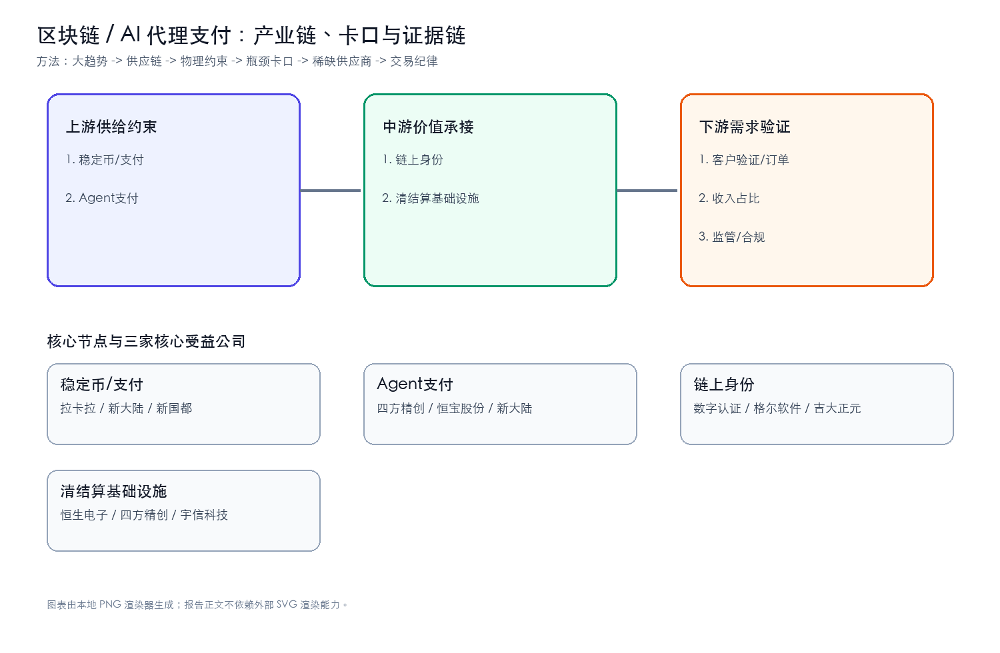
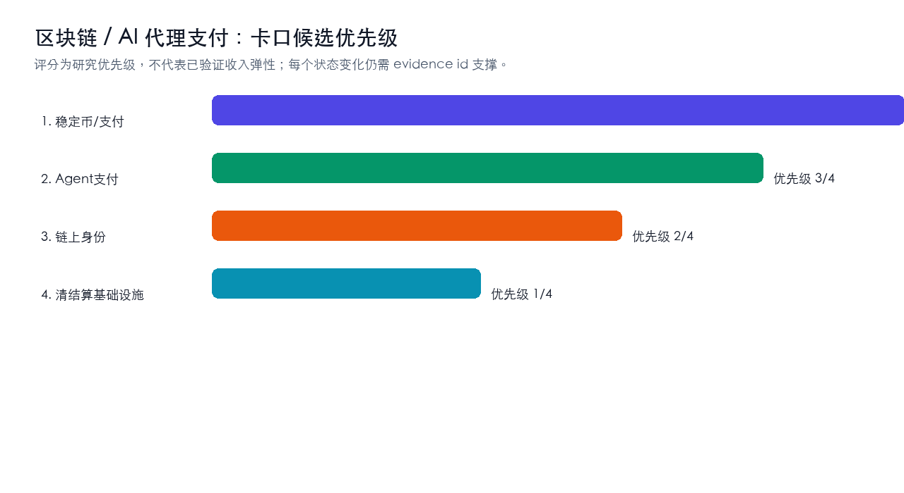
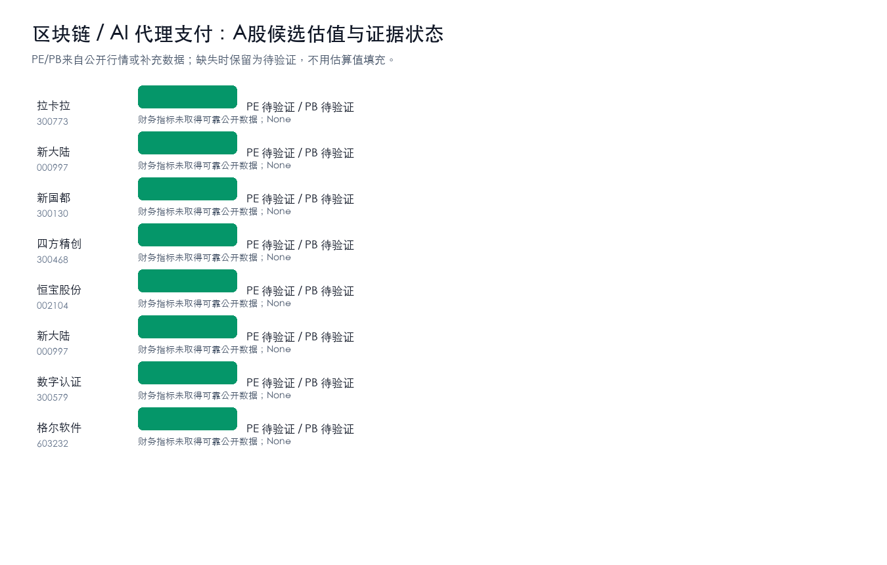
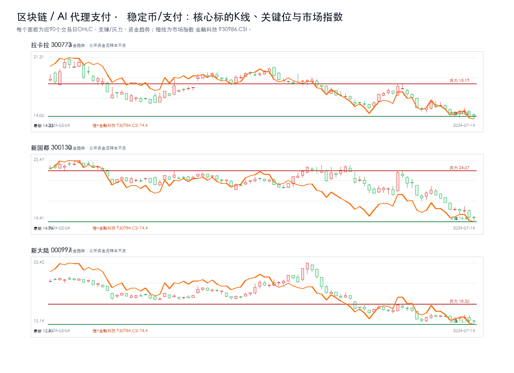
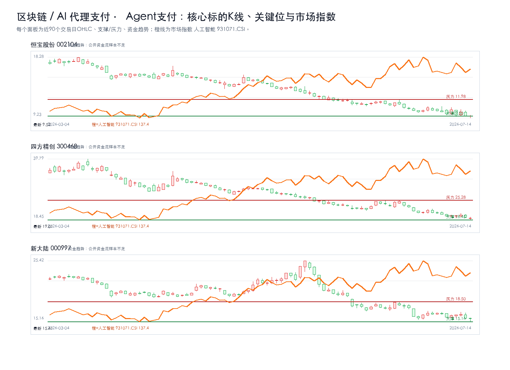
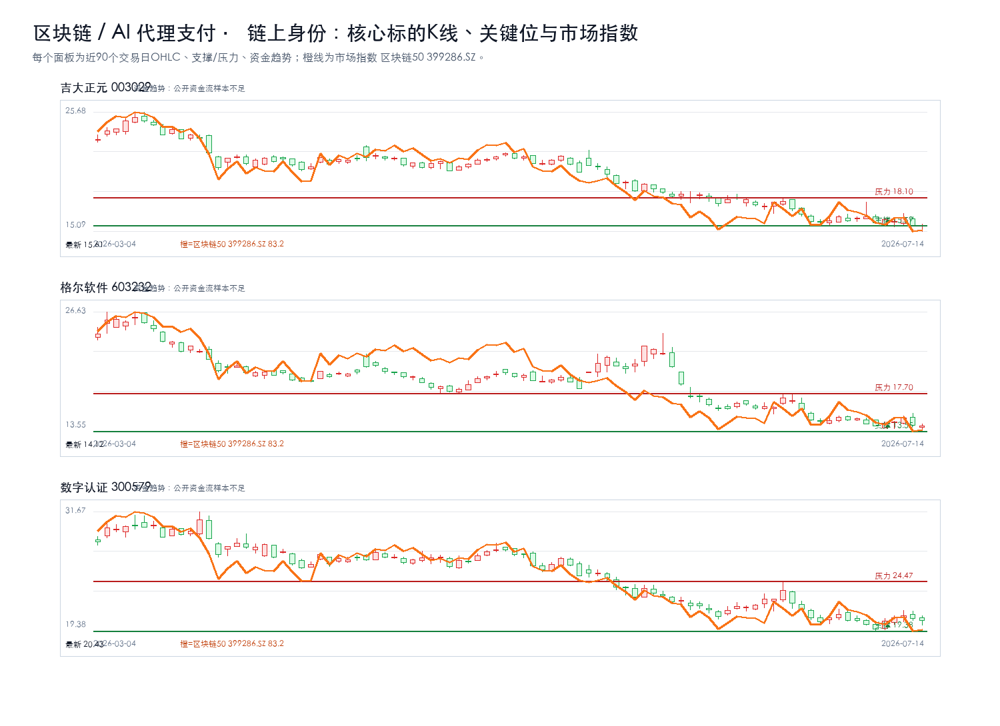
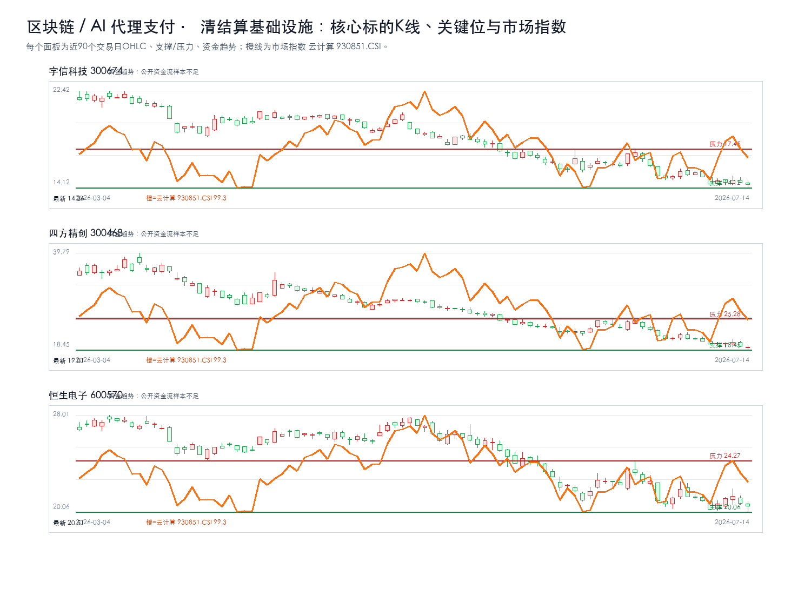

# 区块链 / AI 代理支付主题最终报告

## 研究课题

本报告只回答三个问题：`区块链 / AI 代理支付` 的利润会流向哪些卡口，A股哪些公司真正暴露在这些卡口上，当前价格是否允许执行。当前跟踪范围收敛在 稳定币/支付、Agent支付、链上身份、清结算基础设施。

## 一句话结论

强命题：区块链 / AI 代理支付 的机会不在泛主题，而在 `稳定币/支付 + Agent支付` 能否持续出现订单、价格、客户认证、收入占比或监管里程碑。方向谨慎看多，置信度中等；当前绝对核心候选为：拉卡拉、新大陆、新国都、四方精创、恒宝股份。没有新增硬证据时，只观察，不追高。

## 市场盘点

- 需求：AI资本开支仍是背景变量，但只有订单、产能、客户认证和收入占比能把主题变成业绩。
- 供给：重点看认证周期、良率/交付、关键材料和工程化能力是否造成瓶颈。
- 价格：股价接近压力位时不追；回到支撑区也要等硬证据同步。
- 证据密度：硬事实台账仍偏薄，PDF正文级和公告级证据不足，研报标题只作线索。

## 核心逻辑

1. 需求侧：AI 应用和模型迭代继续推高 `区块链 / AI 代理支付` 相关需求，但需求强度必须通过订单、客户认证、收入占比、价格趋势或政策里程碑验证。
2. 供给侧：利润更可能集中在短期难扩产、认证周期长、替代路线慢、合规壁垒高或工程化交付难的环节，例如 稳定币/支付、Agent支付、链上身份、清结算基础设施。
3. A股映射：先判断产业链位置，再核验收入/订单暴露，最后才进入估值和交易条件；不能把行情样本或主题标签直接当作核心标的。

## 关键数据

| 判断项 | 当前结论 | 投资含义 |
| --- | --- | --- |
| 核心卡口 | 稳定币/支付、Agent支付、链上身份、清结算基础设施 | 优先验证订单、价格、客户认证和收入占比 |
| 核心候选 | 拉卡拉、新大陆、新国都、四方精创、恒宝股份 | 只在买入触发满足时进入交易候选 |
| 财务口径 | 核心公司继续跟踪营收同比、归母净利同比、毛利率、预测PE | 财务改善要和订单/客户认证同步才升级 |
| 证据密度 | 公告/财报级硬证据不足，研报和新闻只作线索 | 不把主题热度等同于买入结论 |
| 正文证据 | 硬事实台账不铺长表；PDF正文级证据不足时降级为线索 | 避免把内部过程写进正文 |
| 交易纪律 | 等待买入触发；风险收益比不足时不追高 | 买点、支撑、压力和止损优先于叙事 |

## 产业链跟踪

### 产业链核心环节价值分布

| 产业链环节 | 细分领域/关键产品 | BOM成本占比/价值占比 | 核心技术壁垒 | 卡脖子程度 | 代表A股公司 | 公司环节地位 | 证据口径/备注 |
| --- | --- | --- | --- | --- | --- | --- | --- |
| 上游 | 稳定币/支付 | 待验证 | 客户认证、数据闭环、工程化交付、合规和成本控制 | High | 拉卡拉、新大陆、新国都 | 待验证 | 公开产业链与财务/研报口径，待公告和客户认证继续核验 |
| 上游 | Agent支付 | 待验证 | 客户认证、数据闭环、工程化交付、合规和成本控制 | High | 四方精创、恒宝股份、新大陆 | 待验证 | 公开产业链与财务/研报口径，待公告和客户认证继续核验 |
| 中游 | 链上身份 | 待验证 | 客户认证、数据闭环、工程化交付、合规和成本控制 | Medium | 数字认证、格尔软件、吉大正元 | 待验证 | 公开产业链与财务/研报口径，待公告和客户认证继续核验 |
| 中游 | 清结算基础设施 | 待验证 | 客户认证、数据闭环、工程化交付、合规和成本控制 | Medium | 恒生电子、四方精创、宇信科技 | 待验证 | 公开产业链与财务/研报口径，待公告和客户认证继续核验 |

### 供需链路跟踪

| 环节 | 事实映射 | 供需变化方向 | 瓶颈/卡口 | A股映射 |
| --- | --- | --- | --- | --- |
| 上游 | 稳定币/支付 | 上行 | 客户认证、数据闭环、工程化交付、合规和成本控制 | 拉卡拉、新大陆、新国都 |
| 上游 | Agent支付 | 上行 | 客户认证、数据闭环、工程化交付、合规和成本控制 | 四方精创、恒宝股份、新大陆 |
| 中游 | 链上身份 | 上行 | 客户认证、数据闭环、工程化交付、合规和成本控制 | 数字认证、格尔软件、吉大正元 |
| 中游 | 清结算基础设施 | 上行 | 客户认证、数据闭环、工程化交付、合规和成本控制 | 恒生电子、四方精创、宇信科技 |

### 核心节点三公司校验

| 产业链节点 | 核心公司1 | 核心公司2 | 核心公司3 | 升级催化 | 失效条件 |
| --- | --- | --- | --- | --- | --- |
| 稳定币/支付 | 拉卡拉 | 新大陆 | 新国都 | 订单/客户认证/收入占比/政策或监管里程碑出现公告级证据 | 商业化ROI不足、客户验证低于预期、收入暴露不足或监管约束增强 |
| Agent支付 | 四方精创 | 恒宝股份 | 新大陆 | 订单/客户认证/收入占比/政策或监管里程碑出现公告级证据 | 商业化ROI不足、客户验证低于预期、收入暴露不足或监管约束增强 |
| 链上身份 | 数字认证 | 格尔软件 | 吉大正元 | 订单/客户认证/收入占比/政策或监管里程碑出现公告级证据 | 商业化ROI不足、客户验证低于预期、收入暴露不足或监管约束增强 |
| 清结算基础设施 | 恒生电子 | 四方精创 | 宇信科技 | 订单/客户认证/收入占比/政策或监管里程碑出现公告级证据 | 商业化ROI不足、客户验证低于预期、收入暴露不足或监管约束增强 |

### 瓶颈战斗地图

| 瓶颈节点 | 当前三家核心公司 | 为什么卡 | 升级信号 | 反证信号 | 节点结论 |
| --- | --- | --- | --- | --- | --- |
| 稳定币/支付 | 拉卡拉、新国都、新大陆 | 需求放量与国产替代 | 订单/客户认证/收入占比/政策或监管里程碑出现公告级证据 | 商业化ROI不足、客户验证低于预期、收入暴露不足或监管约束增强 | 绝对核心 |
| Agent支付 | 恒宝股份、四方精创、新大陆 | 需求放量与国产替代 | 订单/客户认证/收入占比/政策或监管里程碑出现公告级证据 | 商业化ROI不足、客户验证低于预期、收入暴露不足或监管约束增强 | 绝对核心 |
| 链上身份 | 吉大正元、格尔软件、数字认证 | 需求放量与国产替代 | 订单/客户认证/收入占比/政策或监管里程碑出现公告级证据 | 商业化ROI不足、客户验证低于预期、收入暴露不足或监管约束增强 | 绝对核心 |
| 清结算基础设施 | 宇信科技、四方精创、恒生电子 | 需求放量与国产替代 | 订单/客户认证/收入占比/政策或监管里程碑出现公告级证据 | 商业化ROI不足、客户验证低于预期、收入暴露不足或监管约束增强 | 绝对核心 |

### 瓶颈四标准校验

| 候选环节 | 不可替代 | 供给刚性 | 寡头垄断 | 机构低配 | 反证条件 |
| --- | --- | --- | --- | --- | --- |
| 稳定币/支付 | 待验证 | 待验证 | 待验证 | 待验证 | 商业化ROI不足、客户验证低于预期、收入暴露不足或监管约束增强 |
| Agent支付 | 待验证 | 待验证 | 待验证 | 待验证 | 商业化ROI不足、客户验证低于预期、收入暴露不足或监管约束增强 |
| 链上身份 | 待验证 | 待验证 | 待验证 | 待验证 | 商业化ROI不足、客户验证低于预期、收入暴露不足或监管约束增强 |
| 清结算基础设施 | 待验证 | 待验证 | 待验证 | 待验证 | 商业化ROI不足、客户验证低于预期、收入暴露不足或监管约束增强 |

## 投资机会挖掘

### 瓶颈识别

- 1. 稳定币/支付：代表公司 拉卡拉、新大陆、新国都；催化 订单/客户认证/收入占比/政策或监管里程碑出现公告级证据；失效条件 商业化ROI不足、客户验证低于预期、收入暴露不足或监管约束增强。
- 2. Agent支付：代表公司 四方精创、恒宝股份、新大陆；催化 订单/客户认证/收入占比/政策或监管里程碑出现公告级证据；失效条件 商业化ROI不足、客户验证低于预期、收入暴露不足或监管约束增强。
- 3. 链上身份：代表公司 数字认证、格尔软件、吉大正元；催化 订单/客户认证/收入占比/政策或监管里程碑出现公告级证据；失效条件 商业化ROI不足、客户验证低于预期、收入暴露不足或监管约束增强。
- 4. 清结算基础设施：代表公司 恒生电子、四方精创、宇信科技；催化 订单/客户认证/收入占比/政策或监管里程碑出现公告级证据；失效条件 商业化ROI不足、客户验证低于预期、收入暴露不足或监管约束增强。

### 可交易标的筛选

- 直接暴露优先于相邻链路；公告/财报证明优先于研报标题；估值赔率优先于短期涨幅。当前所有候选仍需“收入占比/订单/客户认证”三项中的至少一项补强。

## A股可交易标的估值对比

### 稳定币/支付核心三公司K线

叠加板块指数：金融科技 930986.CSI；来源：tushare.index_daily。

### Agent支付核心三公司K线

叠加板块指数：人工智能 931071.CSI；来源：tushare.index_daily。

### 链上身份核心三公司K线

叠加板块指数：区块链50 399286.SZ；来源：tushare.index_daily。

### 清结算基础设施核心三公司K线

叠加板块指数：云计算 930851.CSI；来源：tushare.index_daily。

| 公司 | 代码 | 产业链位置 | 当前估值 | 财务/订单信号 | 催化 | 买点条件 | 失效条件 |
| --- | --- | --- | --- | --- | --- | --- | --- |
| 拉卡拉 | 300773 | 稳定币/支付 | PE 未取得可靠公开数据 / PB 未取得可靠公开数据 | 财务指标未取得可靠公开数据；None | 订单/客户认证/收入占比/政策或监管里程碑出现公告级证据 | 等待买入触发：当前未进入买入候选；需先满足交易决策、风险收益比、K线企稳和订单/价格/客户认证增量证据 | 商业化ROI不足、客户验证低于预期、收入暴露不足或监管约束增强 |
| 新大陆 | 000997 | 稳定币/支付 | PE 未取得可靠公开数据 / PB 未取得可靠公开数据 | 财务指标未取得可靠公开数据；None | 订单/客户认证/收入占比/政策或监管里程碑出现公告级证据 | 等待买入触发：当前未进入买入候选；需先满足交易决策、风险收益比、K线企稳和订单/价格/客户认证增量证据 | 商业化ROI不足、客户验证低于预期、收入暴露不足或监管约束增强 |
| 新国都 | 300130 | 稳定币/支付 | PE 未取得可靠公开数据 / PB 未取得可靠公开数据 | 财务指标未取得可靠公开数据；None | 订单/客户认证/收入占比/政策或监管里程碑出现公告级证据 | 等待买入触发：当前未进入买入候选；需先满足交易决策、风险收益比、K线企稳和订单/价格/客户认证增量证据 | 商业化ROI不足、客户验证低于预期、收入暴露不足或监管约束增强 |
| 四方精创 | 300468 | Agent支付 | PE 未取得可靠公开数据 / PB 未取得可靠公开数据 | 财务指标未取得可靠公开数据；None | 订单/客户认证/收入占比/政策或监管里程碑出现公告级证据 | 等待买入触发：当前未进入买入候选；需先满足交易决策、风险收益比、K线企稳和订单/价格/客户认证增量证据 | 商业化ROI不足、客户验证低于预期、收入暴露不足或监管约束增强 |
| 恒宝股份 | 002104 | Agent支付 | PE 未取得可靠公开数据 / PB 未取得可靠公开数据 | 财务指标未取得可靠公开数据；None | 订单/客户认证/收入占比/政策或监管里程碑出现公告级证据 | 等待买入触发：当前未进入买入候选；需先满足交易决策、风险收益比、K线企稳和订单/价格/客户认证增量证据 | 商业化ROI不足、客户验证低于预期、收入暴露不足或监管约束增强 |
| 新大陆 | 000997 | Agent支付 | PE 未取得可靠公开数据 / PB 未取得可靠公开数据 | 财务指标未取得可靠公开数据；None | 订单/客户认证/收入占比/政策或监管里程碑出现公告级证据 | 等待买入触发：当前未进入买入候选；需先满足交易决策、风险收益比、K线企稳和订单/价格/客户认证增量证据 | 商业化ROI不足、客户验证低于预期、收入暴露不足或监管约束增强 |
| 数字认证 | 300579 | 链上身份 | PE 未取得可靠公开数据 / PB 未取得可靠公开数据 | 财务指标未取得可靠公开数据；None | 订单/客户认证/收入占比/政策或监管里程碑出现公告级证据 | 等待买入触发：当前未进入买入候选；需先满足交易决策、风险收益比、K线企稳和订单/价格/客户认证增量证据 | 商业化ROI不足、客户验证低于预期、收入暴露不足或监管约束增强 |
| 格尔软件 | 603232 | 链上身份 | PE 未取得可靠公开数据 / PB 未取得可靠公开数据 | 财务指标未取得可靠公开数据；None | 订单/客户认证/收入占比/政策或监管里程碑出现公告级证据 | 等待买入触发：当前未进入买入候选；需先满足交易决策、风险收益比、K线企稳和订单/价格/客户认证增量证据 | 商业化ROI不足、客户验证低于预期、收入暴露不足或监管约束增强 |
| 吉大正元 | 003029 | 链上身份 | PE 未取得可靠公开数据 / PB 未取得可靠公开数据 | 财务指标未取得可靠公开数据；None | 订单/客户认证/收入占比/政策或监管里程碑出现公告级证据 | 等待买入触发：当前未进入买入候选；需先满足交易决策、风险收益比、K线企稳和订单/价格/客户认证增量证据 | 商业化ROI不足、客户验证低于预期、收入暴露不足或监管约束增强 |
| 恒生电子 | 600570 | 清结算基础设施 | PE 未取得可靠公开数据 / PB 未取得可靠公开数据 | 财务指标未取得可靠公开数据；None | 订单/客户认证/收入占比/政策或监管里程碑出现公告级证据 | 等待买入触发：当前未进入买入候选；需先满足交易决策、风险收益比、K线企稳和订单/价格/客户认证增量证据 | 商业化ROI不足、客户验证低于预期、收入暴露不足或监管约束增强 |
| 四方精创 | 300468 | 清结算基础设施 | PE 未取得可靠公开数据 / PB 未取得可靠公开数据 | 财务指标未取得可靠公开数据；None | 订单/客户认证/收入占比/政策或监管里程碑出现公告级证据 | 等待买入触发：当前未进入买入候选；需先满足交易决策、风险收益比、K线企稳和订单/价格/客户认证增量证据 | 商业化ROI不足、客户验证低于预期、收入暴露不足或监管约束增强 |
| 宇信科技 | 300674 | 清结算基础设施 | PE 未取得可靠公开数据 / PB 未取得可靠公开数据 | 财务指标未取得可靠公开数据；None | 订单/客户认证/收入占比/政策或监管里程碑出现公告级证据 | 等待买入触发：当前未进入买入候选；需先满足交易决策、风险收益比、K线企稳和订单/价格/客户认证增量证据 | 商业化ROI不足、客户验证低于预期、收入暴露不足或监管约束增强 |

## 核心个股交易跟踪

| 公司 | 代码 | 产业链位置 | 估值 | 财务质量 | 趋势结构 | 关键位 | 买入条件 | 止损/失效 | 卖出/目标 |
| --- | --- | --- | --- | --- | --- | --- | --- | --- | --- |
| 拉卡拉 | 300773 | 稳定币/支付 | PE 未取得可靠公开数据 / PB 未取得可靠公开数据 | 财务指标未取得可靠公开数据 | 现价 14.33；涨跌幅 0.21%；MA5/10/20/60=14.64/14.99/15.81/17.33；20日箱体 14.00-18.19；空头趋势；20日箱体位置8%；风险收益比128.67；资金趋势：公开资金流样本不足 | 支撑 14.30；压力 18.19 | 等待买入触发：当前未进入买入候选；需先满足交易决策、风险收益比、K线企稳和订单/价格/客户认证增量证据 | 跌破14.30且订单/业绩无增量；商业化ROI不足、客户验证低于预期、收入暴露不足或监管约束增强 | 未设技术目标：尚未进入买入候选，先观察证据和价格结构是否修复 |
| 新大陆 | 000997 | 稳定币/支付 | PE 未取得可靠公开数据 / PB 未取得可靠公开数据 | 财务指标未取得可靠公开数据 | 现价 15.61；涨跌幅 -0.45%；MA5/10/20/60=16.01/16.20/16.70/19.42；20日箱体 15.16-18.50；空头趋势；20日箱体位置13%；风险收益比6.42；资金趋势：公开资金流样本不足 | 支撑 15.16；压力 18.50 | 等待买入触发：当前未进入买入候选；需先满足交易决策、风险收益比、K线企稳和订单/价格/客户认证增量证据 | 跌破15.16且订单/业绩无增量；商业化ROI不足、客户验证低于预期、收入暴露不足或监管约束增强 | 未设技术目标：尚未进入买入候选，先观察证据和价格结构是否修复 |
| 新国都 | 300130 | 稳定币/支付 | PE 未取得可靠公开数据 / PB 未取得可靠公开数据 | 财务指标未取得可靠公开数据 | 现价 16.96；涨跌幅 -0.47%；MA5/10/20/60=17.67/18.72/20.15/21.94；20日箱体 16.41-24.07；空头趋势；20日箱体位置7%；风险收益比12.93；资金趋势：公开资金流样本不足 | 支撑 16.41；压力 24.07 | 等待买入触发：当前未进入买入候选；需先满足交易决策、风险收益比、K线企稳和订单/价格/客户认证增量证据 | 跌破16.41且订单/业绩无增量；商业化ROI不足、客户验证低于预期、收入暴露不足或监管约束增强 | 未设技术目标：尚未进入买入候选，先观察证据和价格结构是否修复 |
| 四方精创 | 300468 | Agent支付 | PE 未取得可靠公开数据 / PB 未取得可靠公开数据 | 财务指标未取得可靠公开数据 | 现价 19.01；涨跌幅 -0.83%；MA5/10/20/60=19.57/20.12/21.58/25.12；20日箱体 18.45-25.28；空头趋势；20日箱体位置8%；风险收益比11.20；资金趋势：公开资金流样本不足 | 支撑 18.45；压力 25.28 | 等待买入触发：当前未进入买入候选；需先满足交易决策、风险收益比、K线企稳和订单/价格/客户认证增量证据 | 跌破18.45且订单/业绩无增量；商业化ROI不足、客户验证低于预期、收入暴露不足或监管约束增强 | 未设技术目标：尚未进入买入候选，先观察证据和价格结构是否修复 |
| 恒宝股份 | 002104 | Agent支付 | PE 未取得可靠公开数据 / PB 未取得可靠公开数据 | 财务指标未取得可靠公开数据 | 现价 9.52；涨跌幅 0.21%；MA5/10/20/60=9.83/10.05/10.47/12.41；20日箱体 9.23-11.98；空头趋势；20日箱体位置11%；风险收益比123.00；资金趋势：公开资金流样本不足 | 支撑 9.50；压力 11.98 | 等待买入触发：当前未进入买入候选；需先满足交易决策、风险收益比、K线企稳和订单/价格/客户认证增量证据 | 跌破9.50且订单/业绩无增量；商业化ROI不足、客户验证低于预期、收入暴露不足或监管约束增强 | 未设技术目标：尚未进入买入候选，先观察证据和价格结构是否修复 |
| 新大陆 | 000997 | Agent支付 | PE 未取得可靠公开数据 / PB 未取得可靠公开数据 | 财务指标未取得可靠公开数据 | 现价 15.61；涨跌幅 -0.45%；MA5/10/20/60=16.01/16.20/16.70/19.42；20日箱体 15.16-18.50；空头趋势；20日箱体位置13%；风险收益比6.42；资金趋势：公开资金流样本不足 | 支撑 15.16；压力 18.50 | 等待买入触发：当前未进入买入候选；需先满足交易决策、风险收益比、K线企稳和订单/价格/客户认证增量证据 | 跌破15.16且订单/业绩无增量；商业化ROI不足、客户验证低于预期、收入暴露不足或监管约束增强 | 未设技术目标：尚未进入买入候选，先观察证据和价格结构是否修复 |
| 数字认证 | 300579 | 链上身份 | PE 未取得可靠公开数据 / PB 未取得可靠公开数据 | 财务指标未取得可靠公开数据 | 现价 20.43；涨跌幅 -1.16%；MA5/10/20/60=20.62/20.47/21.14/23.80；20日箱体 19.38-24.47；空头趋势；20日箱体位置21%；风险收益比3.85；资金趋势：公开资金流样本不足 | 支撑 19.38；压力 24.47 | 等待买入触发：当前未进入买入候选；需先满足交易决策、风险收益比、K线企稳和订单/价格/客户认证增量证据 | 跌破19.38且订单/业绩无增量；商业化ROI不足、客户验证低于预期、收入暴露不足或监管约束增强 | 未设技术目标：尚未进入买入候选，先观察证据和价格结构是否修复 |
| 格尔软件 | 603232 | 链上身份 | PE 未取得可靠公开数据 / PB 未取得可靠公开数据 | 财务指标未取得可靠公开数据 | 现价 14.12；涨跌幅 -0.21%；MA5/10/20/60=14.44/14.53/15.21/17.94；20日箱体 13.55-17.70；空头趋势；20日箱体位置14%；风险收益比6.28；资金趋势：公开资金流样本不足 | 支撑 13.55；压力 17.70 | 等待买入触发：当前未进入买入候选；需先满足交易决策、风险收益比、K线企稳和订单/价格/客户认证增量证据 | 跌破13.55且订单/业绩无增量；商业化ROI不足、客户验证低于预期、收入暴露不足或监管约束增强 | 未设技术目标：尚未进入买入候选，先观察证据和价格结构是否修复 |
| 吉大正元 | 003029 | 链上身份 | PE 未取得可靠公开数据 / PB 未取得可靠公开数据 | 财务指标未取得可靠公开数据 | 现价 15.61；涨跌幅 0.13%；MA5/10/20/60=15.91/16.03/16.49/18.99；20日箱体 15.09-18.10；空头趋势；20日箱体位置17%；风险收益比124.50；资金趋势：公开资金流样本不足 | 支撑 15.59；压力 18.10 | 等待买入触发：当前未进入买入候选；需先满足交易决策、风险收益比、K线企稳和订单/价格/客户认证增量证据 | 跌破15.59且订单/业绩无增量；商业化ROI不足、客户验证低于预期、收入暴露不足或监管约束增强 | 未设技术目标：尚未进入买入候选，先观察证据和价格结构是否修复 |
| 恒生电子 | 600570 | 清结算基础设施 | PE 未取得可靠公开数据 / PB 未取得可靠公开数据 | 财务指标未取得可靠公开数据 | 现价 20.51；涨跌幅 -1.20%；MA5/10/20/60=20.89/21.01/21.62/24.07；20日箱体 20.06-24.27；空头趋势；20日箱体位置11%；风险收益比8.36；资金趋势：公开资金流样本不足 | 支撑 20.06；压力 24.27 | 等待买入触发：当前未进入买入候选；需先满足交易决策、风险收益比、K线企稳和订单/价格/客户认证增量证据 | 跌破20.06且订单/业绩无增量；商业化ROI不足、客户验证低于预期、收入暴露不足或监管约束增强 | 未设技术目标：尚未进入买入候选，先观察证据和价格结构是否修复 |
| 四方精创 | 300468 | 清结算基础设施 | PE 未取得可靠公开数据 / PB 未取得可靠公开数据 | 财务指标未取得可靠公开数据 | 现价 19.01；涨跌幅 -0.83%；MA5/10/20/60=19.57/20.12/21.58/25.12；20日箱体 18.45-25.28；空头趋势；20日箱体位置8%；风险收益比11.20；资金趋势：公开资金流样本不足 | 支撑 18.45；压力 25.28 | 等待买入触发：当前未进入买入候选；需先满足交易决策、风险收益比、K线企稳和订单/价格/客户认证增量证据 | 跌破18.45且订单/业绩无增量；商业化ROI不足、客户验证低于预期、收入暴露不足或监管约束增强 | 未设技术目标：尚未进入买入候选，先观察证据和价格结构是否修复 |
| 宇信科技 | 300674 | 清结算基础设施 | PE 未取得可靠公开数据 / PB 未取得可靠公开数据 | 财务指标未取得可靠公开数据 | 现价 14.36；涨跌幅 -1.51%；MA5/10/20/60=14.59/14.85/15.44/17.29；20日箱体 14.12-17.45；空头趋势；20日箱体位置7%；风险收益比12.87；资金趋势：公开资金流样本不足 | 支撑 14.12；压力 17.45 | 等待买入触发：当前未进入买入候选；需先满足交易决策、风险收益比、K线企稳和订单/价格/客户认证增量证据 | 跌破14.12且订单/业绩无增量；商业化ROI不足、客户验证低于预期、收入暴露不足或监管约束增强 | 未设技术目标：尚未进入买入候选，先观察证据和价格结构是否修复 |

交易判断只看两件事：价格是否到买入触发区，证据是否同步增强。二者缺一，继续等待。

## 产业链 / 竞争格局

### A股公司映射与核心地位判断

| 公司 | 代码 | 环节 | 细分领域 | 产业占比/暴露度 | 核心技术/产品 | 卡脖子相关性 | 环节地位 | 证据与备注 |
| --- | --- | --- | --- | --- | --- | --- | --- | --- |
| 拉卡拉 | 300773 | 稳定币/支付 | 稳定币/支付 | 待公告/财报核验收入、订单或客户认证占比 | 稳定币/支付 | Medium/待验证 | 重要配套/待验证 | 财务指标未取得可靠公开数据；；反证/失效：商业化ROI不足、客户验证低于预期、收入暴露不足或监管约束增强 |
| 新大陆 | 000997 | 稳定币/支付 | 稳定币/支付 | 待公告/财报核验收入、订单或客户认证占比 | 稳定币/支付 | Medium/待验证 | 重要配套/待验证 | 财务指标未取得可靠公开数据；；反证/失效：商业化ROI不足、客户验证低于预期、收入暴露不足或监管约束增强 |
| 新国都 | 300130 | 稳定币/支付 | 稳定币/支付 | 待公告/财报核验收入、订单或客户认证占比 | 稳定币/支付 | Medium/待验证 | 重要配套/待验证 | 财务指标未取得可靠公开数据；；反证/失效：商业化ROI不足、客户验证低于预期、收入暴露不足或监管约束增强 |
| 四方精创 | 300468 | Agent支付 | Agent支付 | 待公告/财报核验收入、订单或客户认证占比 | Agent支付 | Medium/待验证 | 重要配套/待验证 | 财务指标未取得可靠公开数据；；反证/失效：商业化ROI不足、客户验证低于预期、收入暴露不足或监管约束增强 |
| 恒宝股份 | 002104 | Agent支付 | Agent支付 | 待公告/财报核验收入、订单或客户认证占比 | Agent支付 | Medium/待验证 | 重要配套/待验证 | 财务指标未取得可靠公开数据；；反证/失效：商业化ROI不足、客户验证低于预期、收入暴露不足或监管约束增强 |
| 新大陆 | 000997 | Agent支付 | Agent支付 | 待公告/财报核验收入、订单或客户认证占比 | Agent支付 | Medium/待验证 | 重要配套/待验证 | 财务指标未取得可靠公开数据；；反证/失效：商业化ROI不足、客户验证低于预期、收入暴露不足或监管约束增强 |
| 数字认证 | 300579 | 链上身份 | 链上身份 | 待公告/财报核验收入、订单或客户认证占比 | 链上身份 | Medium/待验证 | 重要配套/待验证 | 财务指标未取得可靠公开数据；；反证/失效：商业化ROI不足、客户验证低于预期、收入暴露不足或监管约束增强 |
| 格尔软件 | 603232 | 链上身份 | 链上身份 | 待公告/财报核验收入、订单或客户认证占比 | 链上身份 | Medium/待验证 | 重要配套/待验证 | 财务指标未取得可靠公开数据；；反证/失效：商业化ROI不足、客户验证低于预期、收入暴露不足或监管约束增强 |
| 吉大正元 | 003029 | 链上身份 | 链上身份 | 待公告/财报核验收入、订单或客户认证占比 | 链上身份 | Medium/待验证 | 重要配套/待验证 | 财务指标未取得可靠公开数据；；反证/失效：商业化ROI不足、客户验证低于预期、收入暴露不足或监管约束增强 |
| 恒生电子 | 600570 | 清结算基础设施 | 清结算基础设施 | 待公告/财报核验收入、订单或客户认证占比 | 清结算基础设施 | Medium/待验证 | 重要配套/待验证 | 财务指标未取得可靠公开数据；；反证/失效：商业化ROI不足、客户验证低于预期、收入暴露不足或监管约束增强 |
| 四方精创 | 300468 | 清结算基础设施 | 清结算基础设施 | 待公告/财报核验收入、订单或客户认证占比 | 清结算基础设施 | Medium/待验证 | 重要配套/待验证 | 财务指标未取得可靠公开数据；；反证/失效：商业化ROI不足、客户验证低于预期、收入暴露不足或监管约束增强 |
| 宇信科技 | 300674 | 清结算基础设施 | 清结算基础设施 | 待公告/财报核验收入、订单或客户认证占比 | 清结算基础设施 | Medium/待验证 | 重要配套/待验证 | 财务指标未取得可靠公开数据；；反证/失效：商业化ROI不足、客户验证低于预期、收入暴露不足或监管约束增强 |

### 竞争格局与反证条件

| 公司 | 代码 | 卡口环节 | 直接性 | 财务信号 | 研报/公告信号 | 估值压力 | 反证条件 |
| --- | --- | --- | --- | --- | --- | --- | --- |
| 拉卡拉 | 300773 | 稳定币/支付 | 重要配套 | 财务指标未取得可靠公开数据 | None | 待验证 | 商业化ROI不足、客户验证低于预期、收入暴露不足或监管约束增强 |
| 新大陆 | 000997 | 稳定币/支付 | 重要配套 | 财务指标未取得可靠公开数据 | None | 待验证 | 商业化ROI不足、客户验证低于预期、收入暴露不足或监管约束增强 |
| 新国都 | 300130 | 稳定币/支付 | 重要配套 | 财务指标未取得可靠公开数据 | None | 待验证 | 商业化ROI不足、客户验证低于预期、收入暴露不足或监管约束增强 |
| 四方精创 | 300468 | Agent支付 | 重要配套 | 财务指标未取得可靠公开数据 | None | 待验证 | 商业化ROI不足、客户验证低于预期、收入暴露不足或监管约束增强 |
| 恒宝股份 | 002104 | Agent支付 | 重要配套 | 财务指标未取得可靠公开数据 | None | 待验证 | 商业化ROI不足、客户验证低于预期、收入暴露不足或监管约束增强 |
| 新大陆 | 000997 | Agent支付 | 重要配套 | 财务指标未取得可靠公开数据 | None | 待验证 | 商业化ROI不足、客户验证低于预期、收入暴露不足或监管约束增强 |
| 数字认证 | 300579 | 链上身份 | 重要配套 | 财务指标未取得可靠公开数据 | None | 待验证 | 商业化ROI不足、客户验证低于预期、收入暴露不足或监管约束增强 |
| 格尔软件 | 603232 | 链上身份 | 重要配套 | 财务指标未取得可靠公开数据 | None | 待验证 | 商业化ROI不足、客户验证低于预期、收入暴露不足或监管约束增强 |
| 吉大正元 | 003029 | 链上身份 | 重要配套 | 财务指标未取得可靠公开数据 | None | 待验证 | 商业化ROI不足、客户验证低于预期、收入暴露不足或监管约束增强 |
| 恒生电子 | 600570 | 清结算基础设施 | 重要配套 | 财务指标未取得可靠公开数据 | None | 待验证 | 商业化ROI不足、客户验证低于预期、收入暴露不足或监管约束增强 |
| 四方精创 | 300468 | 清结算基础设施 | 重要配套 | 财务指标未取得可靠公开数据 | None | 待验证 | 商业化ROI不足、客户验证低于预期、收入暴露不足或监管约束增强 |
| 宇信科技 | 300674 | 清结算基础设施 | 重要配套 | 财务指标未取得可靠公开数据 | None | 待验证 | 商业化ROI不足、客户验证低于预期、收入暴露不足或监管约束增强 |

竞争判断：区块链 / AI 代理支付 中具备客户认证、数据闭环、合规壁垒、良率/交付和产能约束的环节更接近“瓶颈资产”；但若估值已经处在高压区，只有订单、价格、客户认证或收入占比继续补强，才能从“产业链好公司”升级为“可执行机会”。缺少差异化的概念映射容易只获得主题估值而非利润传导。

## 标的分层与入场条件

### 龙头分层

| 层级 | 公司 | 代码 | 节点 | 入选原因 | 升级触发器 | 降级/剔除条件 |
| --- | --- | --- | --- | --- | --- | --- |
| 主题观察 | 吉大正元 | 003029 | 链上身份 | 配套/相邻链路；风险收益比124.50 | 订单/客户认证/收入占比/政策或监管里程碑出现公告级证据 | 商业化ROI不足、客户验证低于预期、收入暴露不足或监管约束增强 |
| 主题观察 | 四方精创 | 300468 | Agent支付 | 配套/相邻链路；风险收益比11.20 | 订单/客户认证/收入占比/政策或监管里程碑出现公告级证据 | 商业化ROI不足、客户验证低于预期、收入暴露不足或监管约束增强 |
| 主题观察 | 四方精创 | 300468 | 清结算基础设施 | 配套/相邻链路；风险收益比11.20 | 订单/客户认证/收入占比/政策或监管里程碑出现公告级证据 | 商业化ROI不足、客户验证低于预期、收入暴露不足或监管约束增强 |
| 主题观察 | 宇信科技 | 300674 | 清结算基础设施 | 配套/相邻链路；风险收益比12.87 | 订单/客户认证/收入占比/政策或监管里程碑出现公告级证据 | 商业化ROI不足、客户验证低于预期、收入暴露不足或监管约束增强 |
| 主题观察 | 恒宝股份 | 002104 | Agent支付 | 配套/相邻链路；风险收益比123.00 | 订单/客户认证/收入占比/政策或监管里程碑出现公告级证据 | 商业化ROI不足、客户验证低于预期、收入暴露不足或监管约束增强 |
| 主题观察 | 恒生电子 | 600570 | 清结算基础设施 | 配套/相邻链路；风险收益比8.36 | 订单/客户认证/收入占比/政策或监管里程碑出现公告级证据 | 商业化ROI不足、客户验证低于预期、收入暴露不足或监管约束增强 |
| 主题观察 | 拉卡拉 | 300773 | 稳定币/支付 | 配套/相邻链路；风险收益比128.67 | 订单/客户认证/收入占比/政策或监管里程碑出现公告级证据 | 商业化ROI不足、客户验证低于预期、收入暴露不足或监管约束增强 |
| 主题观察 | 数字认证 | 300579 | 链上身份 | 配套/相邻链路；风险收益比3.85 | 订单/客户认证/收入占比/政策或监管里程碑出现公告级证据 | 商业化ROI不足、客户验证低于预期、收入暴露不足或监管约束增强 |
| 主题观察 | 新国都 | 300130 | 稳定币/支付 | 配套/相邻链路；风险收益比12.93 | 订单/客户认证/收入占比/政策或监管里程碑出现公告级证据 | 商业化ROI不足、客户验证低于预期、收入暴露不足或监管约束增强 |
| 主题观察 | 新大陆 | 000997 | 稳定币/支付 | 配套/相邻链路；风险收益比6.42 | 订单/客户认证/收入占比/政策或监管里程碑出现公告级证据 | 商业化ROI不足、客户验证低于预期、收入暴露不足或监管约束增强 |
| 主题观察 | 新大陆 | 000997 | Agent支付 | 配套/相邻链路；风险收益比6.42 | 订单/客户认证/收入占比/政策或监管里程碑出现公告级证据 | 商业化ROI不足、客户验证低于预期、收入暴露不足或监管约束增强 |
| 主题观察 | 格尔软件 | 603232 | 链上身份 | 配套/相邻链路；风险收益比6.28 | 订单/客户认证/收入占比/政策或监管里程碑出现公告级证据 | 商业化ROI不足、客户验证低于预期、收入暴露不足或监管约束增强 |

### 事件-交易触发器

| 公司 | 节点 | 需要等待的硬证据 | 买入触发 | 卖出/减仓触发 | 反证退出 |
| --- | --- | --- | --- | --- | --- |
| 拉卡拉 | 稳定币/支付 | 订单/客户认证/收入占比/政策或监管里程碑出现公告级证据 | 等待买入触发：当前未进入买入候选；需先满足交易决策、风险收益比、K线企稳和订单/价格/客户认证增量证据 | 未设技术目标：尚未进入买入候选，先观察证据和价格结构是否修复 | 商业化ROI不足、客户验证低于预期、收入暴露不足或监管约束增强 |
| 新大陆 | 稳定币/支付 | 订单/客户认证/收入占比/政策或监管里程碑出现公告级证据 | 等待买入触发：当前未进入买入候选；需先满足交易决策、风险收益比、K线企稳和订单/价格/客户认证增量证据 | 未设技术目标：尚未进入买入候选，先观察证据和价格结构是否修复 | 商业化ROI不足、客户验证低于预期、收入暴露不足或监管约束增强 |
| 新国都 | 稳定币/支付 | 订单/客户认证/收入占比/政策或监管里程碑出现公告级证据 | 等待买入触发：当前未进入买入候选；需先满足交易决策、风险收益比、K线企稳和订单/价格/客户认证增量证据 | 未设技术目标：尚未进入买入候选，先观察证据和价格结构是否修复 | 商业化ROI不足、客户验证低于预期、收入暴露不足或监管约束增强 |
| 四方精创 | Agent支付 | 订单/客户认证/收入占比/政策或监管里程碑出现公告级证据 | 等待买入触发：当前未进入买入候选；需先满足交易决策、风险收益比、K线企稳和订单/价格/客户认证增量证据 | 未设技术目标：尚未进入买入候选，先观察证据和价格结构是否修复 | 商业化ROI不足、客户验证低于预期、收入暴露不足或监管约束增强 |
| 恒宝股份 | Agent支付 | 订单/客户认证/收入占比/政策或监管里程碑出现公告级证据 | 等待买入触发：当前未进入买入候选；需先满足交易决策、风险收益比、K线企稳和订单/价格/客户认证增量证据 | 未设技术目标：尚未进入买入候选，先观察证据和价格结构是否修复 | 商业化ROI不足、客户验证低于预期、收入暴露不足或监管约束增强 |
| 新大陆 | Agent支付 | 订单/客户认证/收入占比/政策或监管里程碑出现公告级证据 | 等待买入触发：当前未进入买入候选；需先满足交易决策、风险收益比、K线企稳和订单/价格/客户认证增量证据 | 未设技术目标：尚未进入买入候选，先观察证据和价格结构是否修复 | 商业化ROI不足、客户验证低于预期、收入暴露不足或监管约束增强 |
| 数字认证 | 链上身份 | 订单/客户认证/收入占比/政策或监管里程碑出现公告级证据 | 等待买入触发：当前未进入买入候选；需先满足交易决策、风险收益比、K线企稳和订单/价格/客户认证增量证据 | 未设技术目标：尚未进入买入候选，先观察证据和价格结构是否修复 | 商业化ROI不足、客户验证低于预期、收入暴露不足或监管约束增强 |
| 格尔软件 | 链上身份 | 订单/客户认证/收入占比/政策或监管里程碑出现公告级证据 | 等待买入触发：当前未进入买入候选；需先满足交易决策、风险收益比、K线企稳和订单/价格/客户认证增量证据 | 未设技术目标：尚未进入买入候选，先观察证据和价格结构是否修复 | 商业化ROI不足、客户验证低于预期、收入暴露不足或监管约束增强 |

## 风险、反证与退出条件

- 订单反证：公告、年报或调研无法验证新增订单、客户认证或收入占比。
- 供给反证：替代路线成熟、扩产过快或价格回落，导致卡口缓解。
- 估值反证：估值和成交拥挤先于基本面兑现，风险收益比低于 2:1。
- 主题反证：新闻/研报热度上升但公司财务、订单和价格信号没有同步改善。

## 数据来源与证据强度

| 结论/数据 | 来源 | 日期 | 置信度 |
| --- | --- | --- | --- |
| 产业链与卡口判断 | 公开产业链、研报、行情结构化证据 | 2026-07-14 | Medium |
| 核心公司估值/财务/K线 | 公开行情、财务快照、公告与研报摘要 | 2026-07-14 | Medium |
| 复核与反证条件 | 投研复核规则 | 2026-07-14 | Medium |
| 钢铁行业周报：铁水产量回落，钢厂盈利再下降 | 大同证券 | 2026-07-14 | 标题级/Medium |
| 商贸零售行业7月投资策略：扩大消费“十五五”规划出台，顶层设计引领内需复苏成长 | 国信证券 | 2026-07-14 | 标题级/Medium |
| 食品饮料行业周报：估值筑底，关注中报业绩预告催化 | 华龙证券 | 2026-07-14 | 标题级/Medium |
| How Deutsche Telekom is rewiring telecomm… | OpenAI | 2026-07-10T07:00:00+00:00 | 线索级/Low |
| Getting started with ChatGPT | OpenAI | 2026-07-10T00:00:00+00:00 | 线索级/Low |
