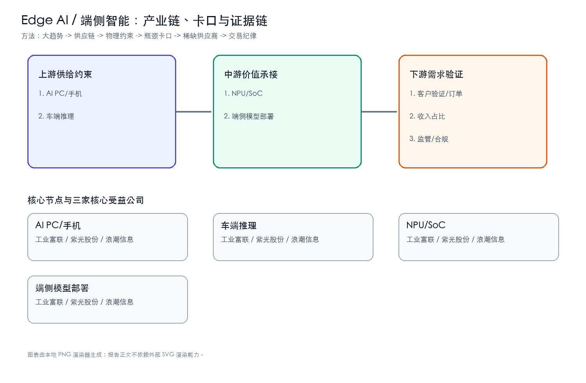
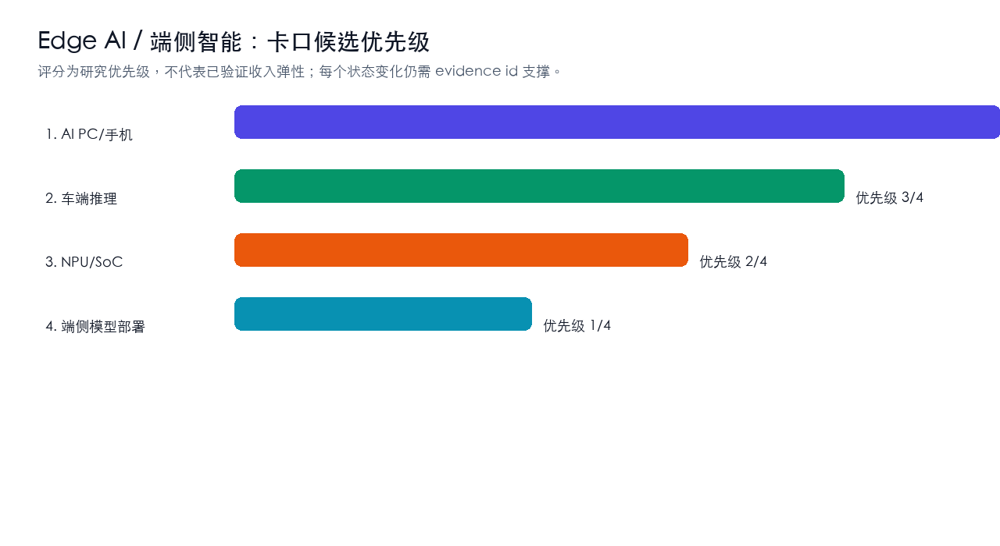
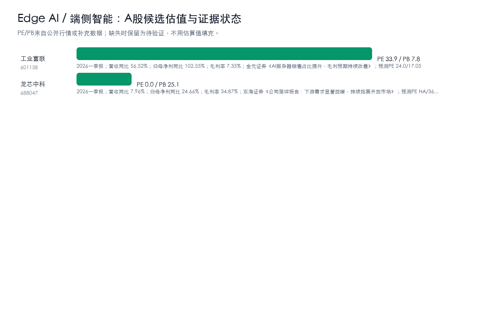
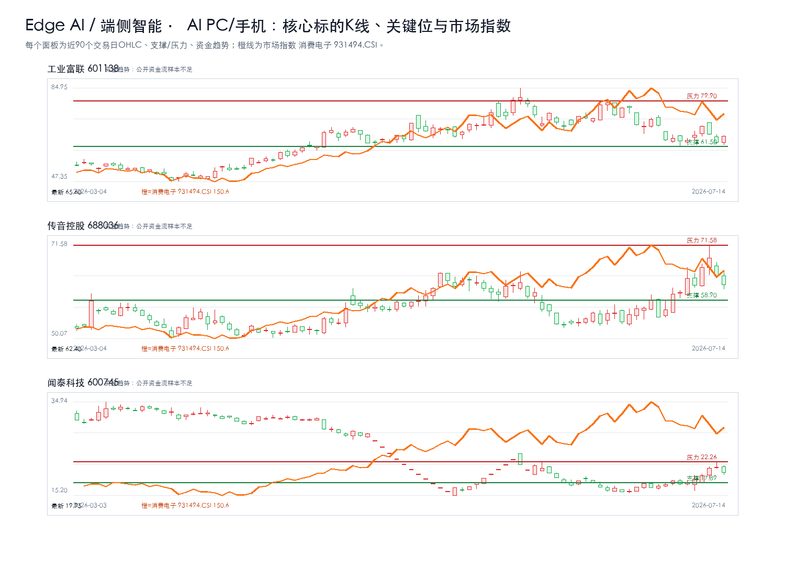
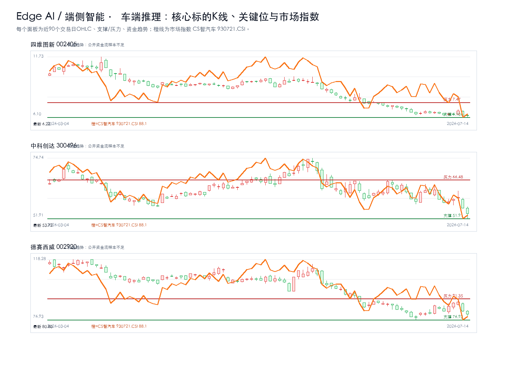
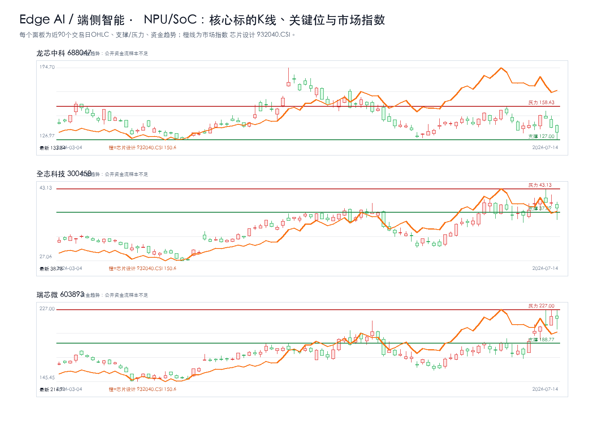
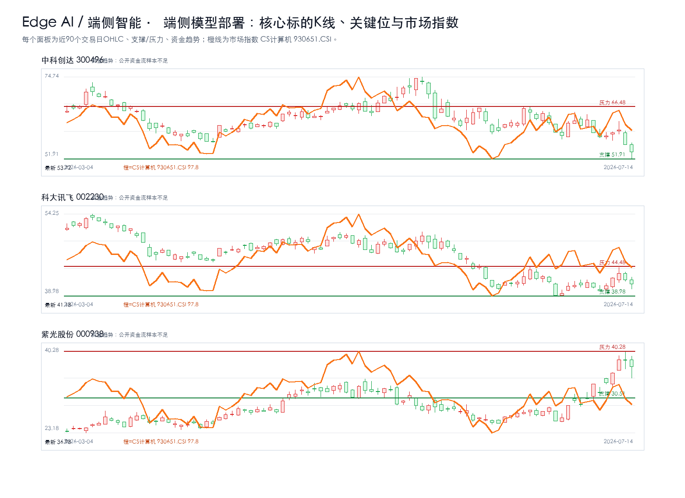

# Edge AI / 端侧智能主题最终报告

## 研究课题

本报告只回答三个问题：`Edge AI / 端侧智能` 的利润会流向哪些卡口，A股哪些公司真正暴露在这些卡口上，当前价格是否允许执行。当前跟踪范围收敛在 AI PC/手机、车端推理、NPU/SoC、端侧模型部署。

## 一句话结论

强命题：Edge AI / 端侧智能 的机会不在泛主题，而在 `AI PC/手机 + 车端推理` 能否持续出现订单、价格、客户认证、收入占比或监管里程碑。方向谨慎看多，置信度中等；当前绝对核心候选为：工业富联、闻泰科技、传音控股、德赛西威、中科创达。没有新增硬证据时，只观察，不追高。

## 市场盘点

- 需求：AI资本开支仍是背景变量，但只有订单、产能、客户认证和收入占比能把主题变成业绩。
- 供给：重点看认证周期、良率/交付、关键材料和工程化能力是否造成瓶颈。
- 价格：股价接近压力位时不追；回到支撑区也要等硬证据同步。
- 证据密度：硬事实台账仍偏薄，PDF正文级和公告级证据不足，研报标题只作线索。

## 核心逻辑

1. 需求侧：AI 应用和模型迭代继续推高 `Edge AI / 端侧智能` 相关需求，但需求强度必须通过订单、客户认证、收入占比、价格趋势或政策里程碑验证。
2. 供给侧：利润更可能集中在短期难扩产、认证周期长、替代路线慢、合规壁垒高或工程化交付难的环节，例如 AI PC/手机、车端推理、NPU/SoC、端侧模型部署。
3. A股映射：先判断产业链位置，再核验收入/订单暴露，最后才进入估值和交易条件；不能把行情样本或主题标签直接当作核心标的。

## 关键数据

| 判断项 | 当前结论 | 投资含义 |
| --- | --- | --- |
| 核心卡口 | AI PC/手机、车端推理、NPU/SoC、端侧模型部署 | 优先验证订单、价格、客户认证和收入占比 |
| 核心候选 | 工业富联、闻泰科技、传音控股、德赛西威、中科创达 | 只在买入触发满足时进入交易候选 |
| 财务口径 | 核心公司继续跟踪营收同比、归母净利同比、毛利率、预测PE | 财务改善要和订单/客户认证同步才升级 |
| 证据密度 | 公告/财报级硬证据不足，研报和新闻只作线索 | 不把主题热度等同于买入结论 |
| 正文证据 | 硬事实台账不铺长表；PDF正文级证据不足时降级为线索 | 避免把内部过程写进正文 |
| 交易纪律 | 等待买入触发；风险收益比不足时不追高 | 买点、支撑、压力和止损优先于叙事 |

## 产业链跟踪

### 产业链核心环节价值分布

| 产业链环节 | 细分领域/关键产品 | BOM成本占比/价值占比 | 核心技术壁垒 | 卡脖子程度 | 代表A股公司 | 公司环节地位 | 证据口径/备注 |
| --- | --- | --- | --- | --- | --- | --- | --- |
| 上游 | AI PC/手机 | 待验证 | 客户认证、数据闭环、工程化交付、合规和成本控制 | High | 工业富联、闻泰科技、传音控股 | 待验证 | 公开产业链与财务/研报口径，待公告和客户认证继续核验 |
| 上游 | 车端推理 | 待验证 | 客户认证、数据闭环、工程化交付、合规和成本控制 | High | 德赛西威、中科创达、四维图新 | 待验证 | 公开产业链与财务/研报口径，待公告和客户认证继续核验 |
| 中游 | NPU/SoC | 待验证 | 客户认证、数据闭环、工程化交付、合规和成本控制 | Medium | 瑞芯微、全志科技、龙芯中科 | 待验证 | 公开产业链与财务/研报口径，待公告和客户认证继续核验 |
| 中游 | 端侧模型部署 | 待验证 | 客户认证、数据闭环、工程化交付、合规和成本控制 | Medium | 科大讯飞、紫光股份、中科创达 | 待验证 | 公开产业链与财务/研报口径，待公告和客户认证继续核验 |

### 供需链路跟踪

| 环节 | 事实映射 | 供需变化方向 | 瓶颈/卡口 | A股映射 |
| --- | --- | --- | --- | --- |
| 上游 | AI PC/手机 | 上行 | 客户认证、数据闭环、工程化交付、合规和成本控制 | 工业富联、闻泰科技、传音控股 |
| 上游 | 车端推理 | 上行 | 客户认证、数据闭环、工程化交付、合规和成本控制 | 德赛西威、中科创达、四维图新 |
| 中游 | NPU/SoC | 上行 | 客户认证、数据闭环、工程化交付、合规和成本控制 | 瑞芯微、全志科技、龙芯中科 |
| 中游 | 端侧模型部署 | 上行 | 客户认证、数据闭环、工程化交付、合规和成本控制 | 科大讯飞、紫光股份、中科创达 |

### 核心节点三公司校验

| 产业链节点 | 核心公司1 | 核心公司2 | 核心公司3 | 升级催化 | 失效条件 |
| --- | --- | --- | --- | --- | --- |
| AI PC/手机 | 工业富联 | 闻泰科技 | 传音控股 | 订单/客户认证/收入占比/政策或监管里程碑出现公告级证据 | 商业化ROI不足、客户验证低于预期、收入暴露不足或监管约束增强 |
| 车端推理 | 德赛西威 | 中科创达 | 四维图新 | 订单/客户认证/收入占比/政策或监管里程碑出现公告级证据 | 商业化ROI不足、客户验证低于预期、收入暴露不足或监管约束增强 |
| NPU/SoC | 瑞芯微 | 全志科技 | 龙芯中科 | 订单/客户认证/收入占比/政策或监管里程碑出现公告级证据 | 商业化ROI不足、客户验证低于预期、收入暴露不足或监管约束增强 |
| 端侧模型部署 | 科大讯飞 | 紫光股份 | 中科创达 | 订单/客户认证/收入占比/政策或监管里程碑出现公告级证据 | 商业化ROI不足、客户验证低于预期、收入暴露不足或监管约束增强 |

### 瓶颈战斗地图

| 瓶颈节点 | 当前三家核心公司 | 为什么卡 | 升级信号 | 反证信号 | 节点结论 |
| --- | --- | --- | --- | --- | --- |
| AI PC/手机 | 工业富联、传音控股、闻泰科技 | 需求放量与国产替代 | 订单/客户认证/收入占比/政策或监管里程碑出现公告级证据 | 商业化ROI不足、客户验证低于预期、收入暴露不足或监管约束增强 | 绝对核心 |
| 车端推理 | 四维图新、中科创达、德赛西威 | 需求放量与国产替代 | 订单/客户认证/收入占比/政策或监管里程碑出现公告级证据 | 商业化ROI不足、客户验证低于预期、收入暴露不足或监管约束增强 | 绝对核心 |
| NPU/SoC | 龙芯中科、全志科技、瑞芯微 | 需求放量与国产替代 | 订单/客户认证/收入占比/政策或监管里程碑出现公告级证据 | 商业化ROI不足、客户验证低于预期、收入暴露不足或监管约束增强 | 绝对核心 |
| 端侧模型部署 | 中科创达、科大讯飞、紫光股份 | 需求放量与国产替代 | 订单/客户认证/收入占比/政策或监管里程碑出现公告级证据 | 商业化ROI不足、客户验证低于预期、收入暴露不足或监管约束增强 | 绝对核心 |

### 瓶颈四标准校验

| 候选环节 | 不可替代 | 供给刚性 | 寡头垄断 | 机构低配 | 反证条件 |
| --- | --- | --- | --- | --- | --- |
| AI PC/手机 | 待验证 | 待验证 | 待验证 | 待验证 | 商业化ROI不足、客户验证低于预期、收入暴露不足或监管约束增强 |
| 车端推理 | 待验证 | 待验证 | 待验证 | 待验证 | 商业化ROI不足、客户验证低于预期、收入暴露不足或监管约束增强 |
| NPU/SoC | 待验证 | 待验证 | 待验证 | 待验证 | 商业化ROI不足、客户验证低于预期、收入暴露不足或监管约束增强 |
| 端侧模型部署 | 待验证 | 待验证 | 待验证 | 待验证 | 商业化ROI不足、客户验证低于预期、收入暴露不足或监管约束增强 |

## 投资机会挖掘

### 瓶颈识别

- 1. AI PC/手机：代表公司 工业富联、闻泰科技、传音控股；催化 订单/客户认证/收入占比/政策或监管里程碑出现公告级证据；失效条件 商业化ROI不足、客户验证低于预期、收入暴露不足或监管约束增强。
- 2. 车端推理：代表公司 德赛西威、中科创达、四维图新；催化 订单/客户认证/收入占比/政策或监管里程碑出现公告级证据；失效条件 商业化ROI不足、客户验证低于预期、收入暴露不足或监管约束增强。
- 3. NPU/SoC：代表公司 瑞芯微、全志科技、龙芯中科；催化 订单/客户认证/收入占比/政策或监管里程碑出现公告级证据；失效条件 商业化ROI不足、客户验证低于预期、收入暴露不足或监管约束增强。
- 4. 端侧模型部署：代表公司 科大讯飞、紫光股份、中科创达；催化 订单/客户认证/收入占比/政策或监管里程碑出现公告级证据；失效条件 商业化ROI不足、客户验证低于预期、收入暴露不足或监管约束增强。

### 可交易标的筛选

- 直接暴露优先于相邻链路；公告/财报证明优先于研报标题；估值赔率优先于短期涨幅。当前所有候选仍需“收入占比/订单/客户认证”三项中的至少一项补强。

## A股可交易标的估值对比

### AI PC/手机核心三公司K线

叠加板块指数：消费电子 931494.CSI；来源：tushare.index_daily。

### 车端推理核心三公司K线

叠加板块指数：CS智汽车 930721.CSI；来源：tushare.index_daily。

### NPU/SoC核心三公司K线

叠加板块指数：芯片设计 932040.CSI；来源：tushare.index_daily。

### 端侧模型部署核心三公司K线

叠加板块指数：CS计算机 930651.CSI；来源：tushare.index_daily。

| 公司 | 代码 | 产业链位置 | 当前估值 | 财务/订单信号 | 催化 | 买点条件 | 失效条件 |
| --- | --- | --- | --- | --- | --- | --- | --- |
| 工业富联 | 601138 | AI PC/手机 | PE 33.94 / PB 7.83 | 2026一季报；营收同比 56.52%；归母净利同比 102.55%；毛利率 7.35%；金元证券《AI服务器销售占比提升，毛利预期持续改善》；预测PE 24.0/17.05 | 订单/客户认证/收入占比/政策或监管里程碑出现公告级证据 | 等待买入触发：当前未进入买入候选；需先满足交易决策、风险收益比、K线企稳和订单/价格/客户认证增量证据 | 商业化ROI不足、客户验证低于预期、收入暴露不足或监管约束增强 |
| 闻泰科技 | 600745 | AI PC/手机 | PE 未取得可靠公开数据 / PB 未取得可靠公开数据 | 财务指标未取得可靠公开数据；None | 订单/客户认证/收入占比/政策或监管里程碑出现公告级证据 | 等待买入触发：当前未进入买入候选；需先满足交易决策、风险收益比、K线企稳和订单/价格/客户认证增量证据 | 商业化ROI不足、客户验证低于预期、收入暴露不足或监管约束增强 |
| 传音控股 | 688036 | AI PC/手机 | PE 未取得可靠公开数据 / PB 未取得可靠公开数据 | 财务指标未取得可靠公开数据；None | 订单/客户认证/收入占比/政策或监管里程碑出现公告级证据 | 等待买入触发：当前未进入买入候选；需先满足交易决策、风险收益比、K线企稳和订单/价格/客户认证增量证据 | 商业化ROI不足、客户验证低于预期、收入暴露不足或监管约束增强 |
| 德赛西威 | 002920 | 车端推理 | PE 未取得可靠公开数据 / PB 未取得可靠公开数据 | 财务指标未取得可靠公开数据；None | 订单/客户认证/收入占比/政策或监管里程碑出现公告级证据 | 等待买入触发：当前未进入买入候选；需先满足交易决策、风险收益比、K线企稳和订单/价格/客户认证增量证据 | 商业化ROI不足、客户验证低于预期、收入暴露不足或监管约束增强 |
| 中科创达 | 300496 | 车端推理 | PE 未取得可靠公开数据 / PB 未取得可靠公开数据 | 财务指标未取得可靠公开数据；None | 订单/客户认证/收入占比/政策或监管里程碑出现公告级证据 | 等待买入触发：当前未进入买入候选；需先满足交易决策、风险收益比、K线企稳和订单/价格/客户认证增量证据 | 商业化ROI不足、客户验证低于预期、收入暴露不足或监管约束增强 |
| 四维图新 | 002405 | 车端推理 | PE 未取得可靠公开数据 / PB 未取得可靠公开数据 | 财务指标未取得可靠公开数据；None | 订单/客户认证/收入占比/政策或监管里程碑出现公告级证据 | 等待买入触发：当前未进入买入候选；需先满足交易决策、风险收益比、K线企稳和订单/价格/客户认证增量证据 | 商业化ROI不足、客户验证低于预期、收入暴露不足或监管约束增强 |
| 瑞芯微 | 603893 | NPU/SoC | PE 未取得可靠公开数据 / PB 未取得可靠公开数据 | 财务指标未取得可靠公开数据；None | 订单/客户认证/收入占比/政策或监管里程碑出现公告级证据 | 等待买入触发：当前未进入买入候选；需先满足交易决策、风险收益比、K线企稳和订单/价格/客户认证增量证据 | 商业化ROI不足、客户验证低于预期、收入暴露不足或监管约束增强 |
| 全志科技 | 300458 | NPU/SoC | PE 未取得可靠公开数据 / PB 未取得可靠公开数据 | 财务指标未取得可靠公开数据；None | 订单/客户认证/收入占比/政策或监管里程碑出现公告级证据 | 等待买入触发：当前未进入买入候选；需先满足交易决策、风险收益比、K线企稳和订单/价格/客户认证增量证据 | 商业化ROI不足、客户验证低于预期、收入暴露不足或监管约束增强 |
| 龙芯中科 | 688047 | NPU/SoC | PE -143.87 / PB 25.06 | 2026一季报；营收同比 7.96%；归母净利同比 24.66%；毛利率 34.87%；东海证券《公司简评报告：下游需求显著回暖，持续拓展开放市场》；预测PE NA/3628.28 | 订单/客户认证/收入占比/政策或监管里程碑出现公告级证据 | 等待买入触发：当前未进入买入候选；需先满足交易决策、风险收益比、K线企稳和订单/价格/客户认证增量证据 | 商业化ROI不足、客户验证低于预期、收入暴露不足或监管约束增强 |
| 科大讯飞 | 002230 | 端侧模型部署 | PE 未取得可靠公开数据 / PB 未取得可靠公开数据 | 财务指标未取得可靠公开数据；None | 订单/客户认证/收入占比/政策或监管里程碑出现公告级证据 | 等待买入触发：当前未进入买入候选；需先满足交易决策、风险收益比、K线企稳和订单/价格/客户认证增量证据 | 商业化ROI不足、客户验证低于预期、收入暴露不足或监管约束增强 |
| 紫光股份 | 000938 | 端侧模型部署 | PE 未取得可靠公开数据 / PB 未取得可靠公开数据 | 财务指标未取得可靠公开数据；None | 订单/客户认证/收入占比/政策或监管里程碑出现公告级证据 | 等待买入触发：当前未进入买入候选；需先满足交易决策、风险收益比、K线企稳和订单/价格/客户认证增量证据 | 商业化ROI不足、客户验证低于预期、收入暴露不足或监管约束增强 |
| 中科创达 | 300496 | 端侧模型部署 | PE 未取得可靠公开数据 / PB 未取得可靠公开数据 | 财务指标未取得可靠公开数据；None | 订单/客户认证/收入占比/政策或监管里程碑出现公告级证据 | 等待买入触发：当前未进入买入候选；需先满足交易决策、风险收益比、K线企稳和订单/价格/客户认证增量证据 | 商业化ROI不足、客户验证低于预期、收入暴露不足或监管约束增强 |

## 核心个股交易跟踪

| 公司 | 代码 | 产业链位置 | 估值 | 财务质量 | 趋势结构 | 关键位 | 买入条件 | 止损/失效 | 卖出/目标 |
| --- | --- | --- | --- | --- | --- | --- | --- | --- | --- |
| 工业富联 | 601138 | AI PC/手机 | PE 33.94 / PB 7.83 | 2026一季报；营收同比 56.52%；归母净利同比 102.55%；毛利率 7.35% | 现价 65.60；涨跌幅 3.99%；MA5/10/20/60=66.10/65.66/69.95/69.14；20日箱体 61.50-79.90；震荡分歧；20日箱体位置22%；风险收益比3.49；资金趋势：公开资金流样本不足 | 支撑 61.50；压力 79.90 | 等待买入触发：当前未进入买入候选；需先满足交易决策、风险收益比、K线企稳和订单/价格/客户认证增量证据 | 跌破61.50且订单/业绩无增量；商业化ROI不足、客户验证低于预期、收入暴露不足或监管约束增强 | 未设技术目标：尚未进入买入候选，先观察证据和价格结构是否修复 |
| 闻泰科技 | 600745 | AI PC/手机 | PE 未取得可靠公开数据 / PB 未取得可靠公开数据 | 财务指标未取得可靠公开数据 | 现价 19.95；涨跌幅 -5.45%；MA5/10/20/60=19.95/18.81/17.89/21.01；20日箱体 15.67-22.26；震荡分歧；20日箱体位置65%；风险收益比1.12；资金趋势：公开资金流样本不足 | 支撑 17.89；压力 22.26 | 等待买入触发：当前未进入买入候选；需先满足交易决策、风险收益比、K线企稳和订单/价格/客户认证增量证据 | 跌破17.89且订单/业绩无增量；商业化ROI不足、客户验证低于预期、收入暴露不足或监管约束增强 | 未设技术目标：尚未进入买入候选，先观察证据和价格结构是否修复 |
| 传音控股 | 688036 | AI PC/手机 | PE 未取得可靠公开数据 / PB 未取得可靠公开数据 | 财务指标未取得可靠公开数据 | 现价 62.40；涨跌幅 -3.15%；MA5/10/20/60=64.79/62.02/58.90/58.33；20日箱体 53.00-71.58；多头趋势；20日箱体位置51%；风险收益比2.63；资金趋势：公开资金流样本不足 | 支撑 58.90；压力 71.58 | 等待买入触发：当前未进入买入候选；需先满足交易决策、风险收益比、K线企稳和订单/价格/客户认证增量证据 | 跌破58.90且订单/业绩无增量；商业化ROI不足、客户验证低于预期、收入暴露不足或监管约束增强 | 未设技术目标：尚未进入买入候选，先观察证据和价格结构是否修复 |
| 德赛西威 | 002920 | 车端推理 | PE 未取得可靠公开数据 / PB 未取得可靠公开数据 | 财务指标未取得可靠公开数据 | 现价 80.80；涨跌幅 -2.38%；MA5/10/20/60=85.42/84.32/84.19/96.50；20日箱体 76.93-91.35；空头趋势；20日箱体位置27%；风险收益比2.73；资金趋势：公开资金流样本不足 | 支撑 76.93；压力 91.35 | 等待买入触发：当前未进入买入候选；需先满足交易决策、风险收益比、K线企稳和订单/价格/客户认证增量证据 | 跌破76.93且订单/业绩无增量；商业化ROI不足、客户验证低于预期、收入暴露不足或监管约束增强 | 未设技术目标：尚未进入买入候选，先观察证据和价格结构是否修复 |
| 中科创达 | 300496 | 车端推理 | PE 未取得可靠公开数据 / PB 未取得可靠公开数据 | 财务指标未取得可靠公开数据 | 现价 53.72；涨跌幅 -3.73%；MA5/10/20/60=57.37/59.02/60.67/63.73；20日箱体 51.91-66.48；空头趋势；20日箱体位置12%；风险收益比7.05；资金趋势：公开资金流样本不足 | 支撑 51.91；压力 66.48 | 等待买入触发：当前未进入买入候选；需先满足交易决策、风险收益比、K线企稳和订单/价格/客户认证增量证据 | 跌破51.91且订单/业绩无增量；商业化ROI不足、客户验证低于预期、收入暴露不足或监管约束增强 | 未设技术目标：尚未进入买入候选，先观察证据和价格结构是否修复 |
| 四维图新 | 002405 | 车端推理 | PE 未取得可靠公开数据 / PB 未取得可靠公开数据 | 财务指标未取得可靠公开数据 | 现价 6.22；涨跌幅 -0.96%；MA5/10/20/60=6.39/6.44/6.67/8.14；20日箱体 6.10-7.47；空头趋势；20日箱体位置9%；风险收益比10.42；资金趋势：公开资金流样本不足 | 支撑 6.10；压力 7.47 | 等待买入触发：当前未进入买入候选；需先满足交易决策、风险收益比、K线企稳和订单/价格/客户认证增量证据 | 跌破6.10且订单/业绩无增量；商业化ROI不足、客户验证低于预期、收入暴露不足或监管约束增强 | 未设技术目标：尚未进入买入候选，先观察证据和价格结构是否修复 |
| 瑞芯微 | 603893 | NPU/SoC | PE 未取得可靠公开数据 / PB 未取得可靠公开数据 | 财务指标未取得可靠公开数据 | 现价 216.91；涨跌幅 -0.95%；MA5/10/20/60=210.81/196.16/188.77/182.42；20日箱体 169.89-227.00；多头趋势；20日箱体位置82%；风险收益比0.36；资金趋势：公开资金流样本不足 | 支撑 188.77；压力 227.00 | 等待买入触发：当前未进入买入候选；需先满足交易决策、风险收益比、K线企稳和订单/价格/客户认证增量证据 | 跌破188.77且订单/业绩无增量；商业化ROI不足、客户验证低于预期、收入暴露不足或监管约束增强 | 未设技术目标：尚未进入买入候选，先观察证据和价格结构是否修复 |
| 全志科技 | 300458 | NPU/SoC | PE 未取得可靠公开数据 / PB 未取得可靠公开数据 | 财务指标未取得可靠公开数据 | 现价 38.78；涨跌幅 -2.93%；MA5/10/20/60=39.83/38.80/37.89/35.80；20日箱体 32.50-43.13；多头趋势；20日箱体位置59%；风险收益比4.88；资金趋势：公开资金流样本不足 | 支撑 37.89；压力 43.13 | 等待买入触发：当前未进入买入候选；需先满足交易决策、风险收益比、K线企稳和订单/价格/客户认证增量证据 | 跌破37.89且订单/业绩无增量；商业化ROI不足、客户验证低于预期、收入暴露不足或监管约束增强 | 未设技术目标：尚未进入买入候选，先观察证据和价格结构是否修复 |
| 龙芯中科 | 688047 | NPU/SoC | PE -143.87 / PB 25.06 | 2026一季报；营收同比 7.96%；归母净利同比 24.66%；毛利率 34.87% | 现价 133.84；涨跌幅 -3.36%；MA5/10/20/60=141.87/142.25/144.34/150.65；20日箱体 127.00-158.63；空头趋势；20日箱体位置22%；风险收益比3.62；资金趋势：公开资金流样本不足 | 支撑 127.00；压力 158.63 | 等待买入触发：当前未进入买入候选；需先满足交易决策、风险收益比、K线企稳和订单/价格/客户认证增量证据 | 跌破127.00且订单/业绩无增量；商业化ROI不足、客户验证低于预期、收入暴露不足或监管约束增强 | 未设技术目标：尚未进入买入候选，先观察证据和价格结构是否修复 |
| 科大讯飞 | 002230 | 端侧模型部署 | PE 未取得可靠公开数据 / PB 未取得可靠公开数据 | 财务指标未取得可靠公开数据 | 现价 41.18；涨跌幅 -1.72%；MA5/10/20/60=41.86/41.30/41.37/45.47；20日箱体 38.98-44.48；空头趋势；20日箱体位置40%；风险收益比1.50；资金趋势：公开资金流样本不足 | 支撑 38.98；压力 44.48 | 等待买入触发：当前未进入买入候选；需先满足交易决策、风险收益比、K线企稳和订单/价格/客户认证增量证据 | 跌破38.98且订单/业绩无增量；商业化ROI不足、客户验证低于预期、收入暴露不足或监管约束增强 | 未设技术目标：尚未进入买入候选，先观察证据和价格结构是否修复 |
| 紫光股份 | 000938 | 端侧模型部署 | PE 未取得可靠公开数据 / PB 未取得可靠公开数据 | 财务指标未取得可靠公开数据 | 现价 36.98；涨跌幅 -3.70%；MA5/10/20/60=36.62/33.71/30.51/29.89；20日箱体 25.44-40.28；多头趋势；20日箱体位置78%；风险收益比0.51；资金趋势：公开资金流样本不足 | 支撑 30.51；压力 40.28 | 等待买入触发：当前未进入买入候选；需先满足交易决策、风险收益比、K线企稳和订单/价格/客户认证增量证据 | 跌破30.51且订单/业绩无增量；商业化ROI不足、客户验证低于预期、收入暴露不足或监管约束增强 | 未设技术目标：尚未进入买入候选，先观察证据和价格结构是否修复 |
| 中科创达 | 300496 | 端侧模型部署 | PE 未取得可靠公开数据 / PB 未取得可靠公开数据 | 财务指标未取得可靠公开数据 | 现价 53.72；涨跌幅 -3.73%；MA5/10/20/60=57.37/59.02/60.67/63.73；20日箱体 51.91-66.48；空头趋势；20日箱体位置12%；风险收益比7.05；资金趋势：公开资金流样本不足 | 支撑 51.91；压力 66.48 | 等待买入触发：当前未进入买入候选；需先满足交易决策、风险收益比、K线企稳和订单/价格/客户认证增量证据 | 跌破51.91且订单/业绩无增量；商业化ROI不足、客户验证低于预期、收入暴露不足或监管约束增强 | 未设技术目标：尚未进入买入候选，先观察证据和价格结构是否修复 |

交易判断只看两件事：价格是否到买入触发区，证据是否同步增强。二者缺一，继续等待。

## 产业链 / 竞争格局

### A股公司映射与核心地位判断

| 公司 | 代码 | 环节 | 细分领域 | 产业占比/暴露度 | 核心技术/产品 | 卡脖子相关性 | 环节地位 | 证据与备注 |
| --- | --- | --- | --- | --- | --- | --- | --- | --- |
| 工业富联 | 601138 | AI PC/手机 | AI PC/手机 | 待公告/财报核验收入、订单或客户认证占比 | AI PC/手机 | Medium/待验证 | 重要配套/待验证 | 2026一季报；营收同比 56.52%；归母净利同比 102.55%；毛利率 7.…；金元证券《AI服务器销售占比提升，毛利预期持续改善》；预测PE 24.0/17.05；反证/失效：商业化ROI不足、客户验证低于预期、收入暴露不足或监管约束增强 |
| 闻泰科技 | 600745 | AI PC/手机 | AI PC/手机 | 待公告/财报核验收入、订单或客户认证占比 | AI PC/手机 | Medium/待验证 | 重要配套/待验证 | 财务指标未取得可靠公开数据；；反证/失效：商业化ROI不足、客户验证低于预期、收入暴露不足或监管约束增强 |
| 传音控股 | 688036 | AI PC/手机 | AI PC/手机 | 待公告/财报核验收入、订单或客户认证占比 | AI PC/手机 | Medium/待验证 | 重要配套/待验证 | 财务指标未取得可靠公开数据；；反证/失效：商业化ROI不足、客户验证低于预期、收入暴露不足或监管约束增强 |
| 德赛西威 | 002920 | 车端推理 | 车端推理 | 待公告/财报核验收入、订单或客户认证占比 | 车端推理 | Medium/待验证 | 重要配套/待验证 | 财务指标未取得可靠公开数据；；反证/失效：商业化ROI不足、客户验证低于预期、收入暴露不足或监管约束增强 |
| 中科创达 | 300496 | 车端推理 | 车端推理 | 待公告/财报核验收入、订单或客户认证占比 | 车端推理 | Medium/待验证 | 重要配套/待验证 | 财务指标未取得可靠公开数据；；反证/失效：商业化ROI不足、客户验证低于预期、收入暴露不足或监管约束增强 |
| 四维图新 | 002405 | 车端推理 | 车端推理 | 待公告/财报核验收入、订单或客户认证占比 | 车端推理 | Medium/待验证 | 重要配套/待验证 | 财务指标未取得可靠公开数据；；反证/失效：商业化ROI不足、客户验证低于预期、收入暴露不足或监管约束增强 |
| 瑞芯微 | 603893 | NPU/SoC | NPU/SoC | 待公告/财报核验收入、订单或客户认证占比 | NPU/SoC | Medium/待验证 | 重要配套/待验证 | 财务指标未取得可靠公开数据；；反证/失效：商业化ROI不足、客户验证低于预期、收入暴露不足或监管约束增强 |
| 全志科技 | 300458 | NPU/SoC | NPU/SoC | 待公告/财报核验收入、订单或客户认证占比 | NPU/SoC | Medium/待验证 | 重要配套/待验证 | 财务指标未取得可靠公开数据；；反证/失效：商业化ROI不足、客户验证低于预期、收入暴露不足或监管约束增强 |
| 龙芯中科 | 688047 | NPU/SoC | NPU/SoC | 待公告/财报核验收入、订单或客户认证占比 | NPU/SoC | Medium/待验证 | 重要配套/待验证 | 2026一季报；营收同比 7.96%；归母净利同比 24.66%；毛利率 34.8…；东海证券《公司简评报告：下游需求显著回暖，持续拓展开放市场》；预测PE NA/36…；反证/失效：商业化ROI不足、客户验证低于预期、收入暴露不足或监管约束增强 |
| 科大讯飞 | 002230 | 端侧模型部署 | 端侧模型部署 | 待公告/财报核验收入、订单或客户认证占比 | 端侧模型部署 | Medium/待验证 | 重要配套/待验证 | 财务指标未取得可靠公开数据；；反证/失效：商业化ROI不足、客户验证低于预期、收入暴露不足或监管约束增强 |
| 紫光股份 | 000938 | 端侧模型部署 | 端侧模型部署 | 待公告/财报核验收入、订单或客户认证占比 | 端侧模型部署 | Medium/待验证 | 重要配套/待验证 | 财务指标未取得可靠公开数据；；反证/失效：商业化ROI不足、客户验证低于预期、收入暴露不足或监管约束增强 |
| 中科创达 | 300496 | 端侧模型部署 | 端侧模型部署 | 待公告/财报核验收入、订单或客户认证占比 | 端侧模型部署 | Medium/待验证 | 重要配套/待验证 | 财务指标未取得可靠公开数据；；反证/失效：商业化ROI不足、客户验证低于预期、收入暴露不足或监管约束增强 |

### 竞争格局与反证条件

| 公司 | 代码 | 卡口环节 | 直接性 | 财务信号 | 研报/公告信号 | 估值压力 | 反证条件 |
| --- | --- | --- | --- | --- | --- | --- | --- |
| 工业富联 | 601138 | AI PC/手机 | 重要配套 | 2026一季报；营收同比 56.52%；归母净利同比 102.55%；毛利率 7.35% | 金元证券《AI服务器销售占比提升，毛利预期持续改善》；预测PE 24.0/17.05 | 中 | 商业化ROI不足、客户验证低于预期、收入暴露不足或监管约束增强 |
| 闻泰科技 | 600745 | AI PC/手机 | 重要配套 | 财务指标未取得可靠公开数据 | None | 待验证 | 商业化ROI不足、客户验证低于预期、收入暴露不足或监管约束增强 |
| 传音控股 | 688036 | AI PC/手机 | 重要配套 | 财务指标未取得可靠公开数据 | None | 待验证 | 商业化ROI不足、客户验证低于预期、收入暴露不足或监管约束增强 |
| 德赛西威 | 002920 | 车端推理 | 重要配套 | 财务指标未取得可靠公开数据 | None | 待验证 | 商业化ROI不足、客户验证低于预期、收入暴露不足或监管约束增强 |
| 中科创达 | 300496 | 车端推理 | 重要配套 | 财务指标未取得可靠公开数据 | None | 待验证 | 商业化ROI不足、客户验证低于预期、收入暴露不足或监管约束增强 |
| 四维图新 | 002405 | 车端推理 | 重要配套 | 财务指标未取得可靠公开数据 | None | 待验证 | 商业化ROI不足、客户验证低于预期、收入暴露不足或监管约束增强 |
| 瑞芯微 | 603893 | NPU/SoC | 重要配套 | 财务指标未取得可靠公开数据 | None | 待验证 | 商业化ROI不足、客户验证低于预期、收入暴露不足或监管约束增强 |
| 全志科技 | 300458 | NPU/SoC | 重要配套 | 财务指标未取得可靠公开数据 | None | 待验证 | 商业化ROI不足、客户验证低于预期、收入暴露不足或监管约束增强 |
| 龙芯中科 | 688047 | NPU/SoC | 重要配套 | 2026一季报；营收同比 7.96%；归母净利同比 24.66%；毛利率 34.87% | 东海证券《公司简评报告：下游需求显著回暖，持续拓展开放市场》；预测PE NA/3628.28 | 中 | 商业化ROI不足、客户验证低于预期、收入暴露不足或监管约束增强 |
| 科大讯飞 | 002230 | 端侧模型部署 | 重要配套 | 财务指标未取得可靠公开数据 | None | 待验证 | 商业化ROI不足、客户验证低于预期、收入暴露不足或监管约束增强 |
| 紫光股份 | 000938 | 端侧模型部署 | 重要配套 | 财务指标未取得可靠公开数据 | None | 待验证 | 商业化ROI不足、客户验证低于预期、收入暴露不足或监管约束增强 |
| 中科创达 | 300496 | 端侧模型部署 | 重要配套 | 财务指标未取得可靠公开数据 | None | 待验证 | 商业化ROI不足、客户验证低于预期、收入暴露不足或监管约束增强 |

竞争判断：Edge AI / 端侧智能 中具备客户认证、数据闭环、合规壁垒、良率/交付和产能约束的环节更接近“瓶颈资产”；但若估值已经处在高压区，只有订单、价格、客户认证或收入占比继续补强，才能从“产业链好公司”升级为“可执行机会”。缺少差异化的概念映射容易只获得主题估值而非利润传导。

## 标的分层与入场条件

### 龙头分层

| 层级 | 公司 | 代码 | 节点 | 入选原因 | 升级触发器 | 降级/剔除条件 |
| --- | --- | --- | --- | --- | --- | --- |
| 高弹性二线 | 工业富联 | 601138 | AI PC/手机 | 配套/相邻链路；财务增速可见；风险收益比3.49；PE 33.9 | 订单/客户认证/收入占比/政策或监管里程碑出现公告级证据 | 商业化ROI不足、客户验证低于预期、收入暴露不足或监管约束增强 |
| 高弹性二线 | 龙芯中科 | 688047 | NPU/SoC | 配套/相邻链路；财务增速可见；风险收益比3.62；PE -143.9 | 订单/客户认证/收入占比/政策或监管里程碑出现公告级证据 | 商业化ROI不足、客户验证低于预期、收入暴露不足或监管约束增强 |
| 主题观察 | 中科创达 | 300496 | 车端推理 | 配套/相邻链路；风险收益比7.05 | 订单/客户认证/收入占比/政策或监管里程碑出现公告级证据 | 商业化ROI不足、客户验证低于预期、收入暴露不足或监管约束增强 |
| 主题观察 | 中科创达 | 300496 | 端侧模型部署 | 配套/相邻链路；风险收益比7.05 | 订单/客户认证/收入占比/政策或监管里程碑出现公告级证据 | 商业化ROI不足、客户验证低于预期、收入暴露不足或监管约束增强 |
| 主题观察 | 传音控股 | 688036 | AI PC/手机 | 配套/相邻链路；风险收益比2.63 | 订单/客户认证/收入占比/政策或监管里程碑出现公告级证据 | 商业化ROI不足、客户验证低于预期、收入暴露不足或监管约束增强 |
| 主题观察 | 全志科技 | 300458 | NPU/SoC | 配套/相邻链路；风险收益比4.88 | 订单/客户认证/收入占比/政策或监管里程碑出现公告级证据 | 商业化ROI不足、客户验证低于预期、收入暴露不足或监管约束增强 |
| 主题观察 | 四维图新 | 002405 | 车端推理 | 配套/相邻链路；风险收益比10.42 | 订单/客户认证/收入占比/政策或监管里程碑出现公告级证据 | 商业化ROI不足、客户验证低于预期、收入暴露不足或监管约束增强 |
| 主题观察 | 德赛西威 | 002920 | 车端推理 | 配套/相邻链路；风险收益比2.73 | 订单/客户认证/收入占比/政策或监管里程碑出现公告级证据 | 商业化ROI不足、客户验证低于预期、收入暴露不足或监管约束增强 |
| 主题观察 | 瑞芯微 | 603893 | NPU/SoC | 配套/相邻链路；风险收益比0.36 | 订单/客户认证/收入占比/政策或监管里程碑出现公告级证据 | 商业化ROI不足、客户验证低于预期、收入暴露不足或监管约束增强 |
| 主题观察 | 科大讯飞 | 002230 | 端侧模型部署 | 配套/相邻链路；风险收益比1.50 | 订单/客户认证/收入占比/政策或监管里程碑出现公告级证据 | 商业化ROI不足、客户验证低于预期、收入暴露不足或监管约束增强 |
| 主题观察 | 紫光股份 | 000938 | 端侧模型部署 | 配套/相邻链路；风险收益比0.51 | 订单/客户认证/收入占比/政策或监管里程碑出现公告级证据 | 商业化ROI不足、客户验证低于预期、收入暴露不足或监管约束增强 |
| 主题观察 | 闻泰科技 | 600745 | AI PC/手机 | 配套/相邻链路；风险收益比1.12 | 订单/客户认证/收入占比/政策或监管里程碑出现公告级证据 | 商业化ROI不足、客户验证低于预期、收入暴露不足或监管约束增强 |

### 事件-交易触发器

| 公司 | 节点 | 需要等待的硬证据 | 买入触发 | 卖出/减仓触发 | 反证退出 |
| --- | --- | --- | --- | --- | --- |
| 工业富联 | AI PC/手机 | 订单/客户认证/收入占比/政策或监管里程碑出现公告级证据 | 等待买入触发：当前未进入买入候选；需先满足交易决策、风险收益比、K线企稳和订单/价格/客户认证增量证据 | 未设技术目标：尚未进入买入候选，先观察证据和价格结构是否修复 | 商业化ROI不足、客户验证低于预期、收入暴露不足或监管约束增强 |
| 闻泰科技 | AI PC/手机 | 订单/客户认证/收入占比/政策或监管里程碑出现公告级证据 | 等待买入触发：当前未进入买入候选；需先满足交易决策、风险收益比、K线企稳和订单/价格/客户认证增量证据 | 未设技术目标：尚未进入买入候选，先观察证据和价格结构是否修复 | 商业化ROI不足、客户验证低于预期、收入暴露不足或监管约束增强 |
| 传音控股 | AI PC/手机 | 订单/客户认证/收入占比/政策或监管里程碑出现公告级证据 | 等待买入触发：当前未进入买入候选；需先满足交易决策、风险收益比、K线企稳和订单/价格/客户认证增量证据 | 未设技术目标：尚未进入买入候选，先观察证据和价格结构是否修复 | 商业化ROI不足、客户验证低于预期、收入暴露不足或监管约束增强 |
| 德赛西威 | 车端推理 | 订单/客户认证/收入占比/政策或监管里程碑出现公告级证据 | 等待买入触发：当前未进入买入候选；需先满足交易决策、风险收益比、K线企稳和订单/价格/客户认证增量证据 | 未设技术目标：尚未进入买入候选，先观察证据和价格结构是否修复 | 商业化ROI不足、客户验证低于预期、收入暴露不足或监管约束增强 |
| 中科创达 | 车端推理 | 订单/客户认证/收入占比/政策或监管里程碑出现公告级证据 | 等待买入触发：当前未进入买入候选；需先满足交易决策、风险收益比、K线企稳和订单/价格/客户认证增量证据 | 未设技术目标：尚未进入买入候选，先观察证据和价格结构是否修复 | 商业化ROI不足、客户验证低于预期、收入暴露不足或监管约束增强 |
| 四维图新 | 车端推理 | 订单/客户认证/收入占比/政策或监管里程碑出现公告级证据 | 等待买入触发：当前未进入买入候选；需先满足交易决策、风险收益比、K线企稳和订单/价格/客户认证增量证据 | 未设技术目标：尚未进入买入候选，先观察证据和价格结构是否修复 | 商业化ROI不足、客户验证低于预期、收入暴露不足或监管约束增强 |
| 瑞芯微 | NPU/SoC | 订单/客户认证/收入占比/政策或监管里程碑出现公告级证据 | 等待买入触发：当前未进入买入候选；需先满足交易决策、风险收益比、K线企稳和订单/价格/客户认证增量证据 | 未设技术目标：尚未进入买入候选，先观察证据和价格结构是否修复 | 商业化ROI不足、客户验证低于预期、收入暴露不足或监管约束增强 |
| 全志科技 | NPU/SoC | 订单/客户认证/收入占比/政策或监管里程碑出现公告级证据 | 等待买入触发：当前未进入买入候选；需先满足交易决策、风险收益比、K线企稳和订单/价格/客户认证增量证据 | 未设技术目标：尚未进入买入候选，先观察证据和价格结构是否修复 | 商业化ROI不足、客户验证低于预期、收入暴露不足或监管约束增强 |

## 风险、反证与退出条件

- 订单反证：公告、年报或调研无法验证新增订单、客户认证或收入占比。
- 供给反证：替代路线成熟、扩产过快或价格回落，导致卡口缓解。
- 估值反证：估值和成交拥挤先于基本面兑现，风险收益比低于 2:1。
- 主题反证：新闻/研报热度上升但公司财务、订单和价格信号没有同步改善。

## 数据来源与证据强度

| 结论/数据 | 来源 | 日期 | 置信度 |
| --- | --- | --- | --- |
| 产业链与卡口判断 | 公开产业链、研报、行情结构化证据 | 2026-07-14 | Medium |
| 核心公司估值/财务/K线 | 公开行情、财务快照、公告与研报摘要 | 2026-07-14 | Medium |
| 复核与反证条件 | 投研复核规则 | 2026-07-14 | Medium |
| 钢铁行业周报：铁水产量回落，钢厂盈利再下降 | 大同证券 | 2026-07-14 | 标题级/Medium |
| 商贸零售行业7月投资策略：扩大消费“十五五”规划出台，顶层设计引领内需复苏成长 | 国信证券 | 2026-07-14 | 标题级/Medium |
| 食品饮料行业周报：估值筑底，关注中报业绩预告催化 | 华龙证券 | 2026-07-14 | 标题级/Medium |
| How Deutsche Telekom is rewiring telecomm… | OpenAI | 2026-07-10T07:00:00+00:00 | 线索级/Low |
| Getting started with ChatGPT | OpenAI | 2026-07-10T00:00:00+00:00 | 线索级/Low |
