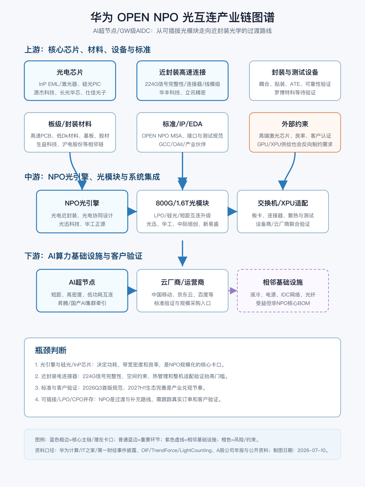

# 华为NPO光互连上下游产业链与A股公司分析报告

> 分析日期：2026-07-10  
> 研究范围：中国NPO近封装光互连产业链；A股映射以直接产品/年报/公开活动披露为准  
> 主题边界：OPEN NPO项目、NPO光引擎、光电芯片、高速连接器、封装测试、AI算力基础设施

## 0. 核心结论

1. 华为牵头的 OPEN NPO 项目把 NPO 从“技术路线讨论”推向“国内多源协议与样品适配阶段”。短期看，它更像 AI 超节点光互连的标准化与国产生态建设事件；中期看，若 2026Q3 首版规范和 2027H1 生态完善兑现，产业传导会从主题催化转为样品、测试、认证、订单。
2. NPO 的价值不是简单替代可插拔光模块，而是在交换芯片/XPU附近缩短高速电链路，用光引擎和近封装连接器换取更低功耗、更高密度和更低时延。它处在 LPO/可插拔与 CPO 之间，技术路线具备过渡属性。
3. 卡口优先级：光引擎/硅光PIC/InP激光芯片 > 近封装高速连接器/线模组 > 封装耦合与测试 > 高速PCB/基板材料 > 下游云厂商与整机系统。真正的利润池可能先集中在“能过客户验证的核心部件”，而不是所有光模块概念股。
4. A股直接映射较清晰的公司包括：光迅科技、华工科技、华丰科技、立讯精密；间接受益或需继续核验的包括中际旭创、新易盛、天孚通信、源杰科技、长光华芯、仕佳光子、光库科技、沪电股份、生益科技、罗博特科等。
5. 最大不确定性在于 NPO 商用节奏：标准发布、样品互通、整机验证、云厂商采购和路线竞争缺一不可。若 LPO可插拔继续满足短距需求，或 CPO路线提前成熟，NPO的产业空间会被压缩。

## 1. 研究对象、边界与口径

| 项目 | 定义 |
| --- | --- |
| 分析对象 | 华为 OPEN NPO 项目牵引的近封装光学（Near Package Optics, NPO）光互连产业链 |
| 纳入主线 | NPO标准/接口、光引擎、硅光/InP光芯片、高速连接器与线模组、封装测试、800G/1.6T光模块、AI超节点/云厂商 |
| 弱相关/相邻链 | 液冷、电源、IDC、普通光纤、通用PCB、泛AI服务器；这些受AI算力扩张影响，但不是NPO核心BOM |
| A股映射口径 | 优先采用年报/公告/公司产品披露；媒体和互动平台只作发现线索；未见收入占比则标注“未披露” |
| 证据层级 | 年报/公告/公司官方资料 > 标准组织/行业机构 > 权威媒体 > 第三方/自媒体线索 > 概念标签 |
| 投资口径 | 本报告给产业链与受益顺序，不给买点、目标价或短线操作建议 |

## 2. 行业背景与需求驱动

AI训练和推理集群正在把数据中心网络从“机柜间带宽”推进到“机柜内、板间、芯片附近互连”。随着 XPU/交换芯片速率提升，高速电链路在距离、功耗、损耗、散热和板级布线上的压力上升，光互连被推到更靠近芯片的位置。

| 驱动 | 方向 | 影响环节 | 传导逻辑 | 证据强度 |
| --- | --- | --- | --- | --- |
| AI光模块市场扩张 | 正向 | 800G/1.6T光模块、光芯片 | TrendForce称2026年全球AI光收发器市场有望达260亿美元，且组件短缺是扩产瓶颈 | Medium-High |
| 以太网光模块高速增长 | 正向 | 光模块、InP激光芯片 | LightCounting称2026年以太网光模块仍高增，瓶颈之一是InP EML与激光芯片产能 | Medium-High |
| 国产AI超节点建设 | 正向 | NPO光引擎、连接器、标准 | OPEN NPO把运营商、云厂商、设备商、连接器和光器件伙伴拉进同一验证框架 | Medium-High |
| 路线竞争 | 不确定 | NPO/LPO/CPO | NPO需证明相对可插拔/LPO的功耗和密度优势，同时避免被CPO直接越过 | Medium |

## 3. 产业链全景图谱

| 环节 | 细分领域 | 角色 | 关键输入 | 关键输出 | 价值/成本驱动 | 代表A股公司 |
| --- | --- | --- | --- | --- | --- | --- |
| 上游 | InP激光器/EML、硅光PIC、PLC/AWG | 决定光引擎速率、功耗、可靠性 | 外延片、芯片设计、流片/封装、耦合工艺 | 光芯片、硅光芯片、无源光器件 | 良率、客户认证、单波速率 | 源杰科技、长光华芯、仕佳光子、光库科技 |
| 上游 | 高速连接器/线模组 | 解决近封装场景短距离高速电连接 | 金属端子、塑胶、精密模具、仿真设计 | 224G连接器、线模组、NPO连接器方案 | 信号完整性、散热、空间约束 | 华丰科技、立讯精密 |
| 中游 | NPO光引擎 | 把光电转换移近交换芯片/XPU | 光芯片、驱动/TIA、封装、连接器 | 近封装光引擎/样品 | 光电协同设计、封装耦合、互通测试 | 光迅科技、华工科技 |
| 中游 | 800G/1.6T光模块 | 当前AI数据中心光互连主力产品 | 光芯片、DSP/LPO方案、封装、PCB | 可插拔/LPO/硅光模块 | 规模量产、客户导入、成本控制 | 光迅科技、中际旭创、新易盛、华工科技 |
| 下游 | AI超节点/云厂商/运营商 | 标准验证和规模采购入口 | XPU、交换芯片、机柜、网络架构 | 算力集群、AIDC网络 | Capex、能效、可靠性、生态绑定 | 间接映射：设备与算力基础设施公司 |

## 4. 上游材料、部件与制程要素挖掘

| 上游层级 | 细分材料/部件 | 对目标产业的作用 | 价值/稀缺性 | 卡脖子程度 | A股候选 | 纳入主线判断 |
| --- | --- | --- | --- | --- | --- | --- |
| Product BOM | InP激光器/EML、CW光源 | 光引擎和高速模块的核心光源，影响功耗、速率和供应弹性 | 高；LightCounting将InP EML/激光芯片列为供给瓶颈之一 | High | 源杰科技、长光华芯 | Core |
| Product BOM | 硅光PIC/调制器 | 提升集成度，适配NPO/CPO/LPO等低功耗路线 | 高；客户认证和良率门槛高 | High | 华工科技、光迅科技、光库科技 | Core/Important |
| Product BOM | 高速连接器/线模组 | NPO近封装电互连接口，影响224G信号完整性和整机空间 | 高；设计绑定和验证周期长 | High | 华丰科技、立讯精密 | Core |
| Process materials | 封装胶材、贴装、耦合、测试治具 | 决定光电共封/近封装良率和可靠性 | 中高；工艺Know-how强，但A股映射分散 | Medium | 罗博特科、天孚通信（部件/工艺） | Important/待验证 |
| Board/package materials | 高速PCB、低Dk/低损耗CCL、基板 | 为交换机/XPU板卡提供高速信号承载 | 中；更偏AI服务器/交换机相邻链 | Medium | 沪电股份、胜宏科技、生益科技 | Adjacent |
| Resource/feedstock | 铟、磷、镓、铌酸锂相关上游 | 支撑InP/GaAs/TFLN等光电材料体系 | 中；更多是材料安全与成本背景 | Medium/Low | 云南锗业等待验证 | Commodity/Adjacent |
| Adjacent infrastructure | 液冷、电源、IDC网络 | AI集群放大后的配套基础设施 | 中；非NPO核心BOM | Low | 英维克、科华数据等 | Adjacent |

## 5. 产业链核心环节价值分布

| 产业链环节 | 细分领域/关键产品 | BOM成本占比/价值占比 | 核心技术壁垒 | 卡脖子程度 | 代表A股公司 | 公司环节地位 | 证据口径/备注 |
| --- | --- | --- | --- | --- | --- | --- | --- |
| 上游 | InP激光器/EML、CW光源 | 精确BOM未披露；按价值链为高价值核心件 | 外延/芯片设计、良率、可靠性、客户认证 | High | 源杰科技、长光华芯 | 关键技术突破者 | 行业机构称InP/激光芯片供给限制光模块增长；公司收入占比需年报细拆 |
| 上游 | 硅光PIC/薄膜铌酸锂 | 高价值，随1.6T/3.2T与NPO/CPO提升 | 高速调制、耦合、封装、光电协同 | High | 华工科技、光库科技、光迅科技 | 核心/重要 | 华工科技年报披露硅光芯片用于400G/800G/1.6T，且实现3.2T CPO/NPO高集成硅光芯片能力 |
| 上游 | 高速连接器/线模组 | NPO接口关键部件，价值占比待披露 | 224G信号完整性、热管理、紧凑布局、整机验证 | High | 华丰科技、立讯精密 | 卡口资产/重要配套 | OPEN NPO首批伙伴与华丰NPO连接器公开分享支持，收入占比待核验 |
| 中游 | NPO光引擎 | 高价值，取决于客户验证和标准互通 | 光电设计、封装耦合、良率、样品适配 | High | 光迅科技、华工科技 | 核心环节龙头/挑战者 | 华为事件披露光迅、华工正源为首批伙伴；年报验证高速光模块和光通信能力 |
| 中游 | 800G/1.6T光模块 | 当前收入兑现最强 | 量产、成本、客户导入、LPO/硅光路线 | Medium | 中际旭创、新易盛、光迅科技、华工科技 | 核心受益/普通受益 | 与NPO相邻但不等同；需看是否参与近封装样品 |
| 下游 | AI超节点/云厂商 | 需求源，不直接构成A股核心BOM | 网络架构、生态、采购节奏 | Medium | 无纯A股直接映射 | 需求牵引 | 华为、中国移动研究院、京东云、百度等是标准与需求侧锚点 |

## 6. 竞争格局与核心壁垒

NPO竞争不是单点器件竞争，而是标准、光引擎、连接器、封装、整机验证的系统竞争。对A股而言，最值得跟踪的是“已在传统高速光模块/连接器中有量产基础，同时进入NPO首批生态或公开技术验证”的公司。

### 四层物理约束校验

| 候选环节 | 寡头是谁 | 扩产周期 | 替代方案 | 下游刚需 | 是否卡口 |
| --- | --- | --- | --- | --- | --- |
| InP激光芯片/EML | 海外龙头与少数国内厂商，国内高端仍在追赶 | 外延、芯片、可靠性验证周期长 | 硅光仍需光源；替代有限 | AI光模块与光引擎必需 | 是 |
| 硅光PIC/光引擎 | 国际大厂与少数具备垂直整合能力厂商 | 流片、封装、耦合良率爬坡较慢 | 可插拔LPO、传统模块、CPO | 低功耗高密度互连需要 | 是 |
| NPO高速连接器 | 高端连接器国际厂商与国内少数高速连接器厂商 | 模具、仿真、客户验证周期中等偏长 | PCB铜链路/线缆，但距离和功耗受限 | 近封装互连需要 | 是，需订单验证 |
| 封装耦合与测试 | 分散，工艺Know-how重 | 设备交期和良率爬坡 | 可外协，但客户一致性要求高 | 光引擎量产需要 | 候选卡口 |
| 高速PCB/CCL | 国内供应较多，头部集中度较高 | 扩产和认证中等 | 多供应商可替代 | AI交换机需要 | 重要相邻，不是NPO主卡口 |

## 7. A股公司映射与核心地位判断

| 公司 | 代码 | 环节 | 细分领域 | 产业占比/暴露度 | 核心技术/产品 | 卡脖子相关性 | 环节地位 | 证据与备注 |
| --- | --- | --- | --- | --- | --- | --- | --- | --- |
| 光迅科技 | 002281 | 中游 | 光模块、光器件、NPO生态伙伴 | 未披露NPO收入；年报确认数据中心高速光模块覆盖800G、1.6T | 高速光模块、AOC、无源光器件 | Medium-High | 核心环节龙头/重要配套 | IT之家披露为OPEN NPO首批伙伴；年报验证高速数通产品 |
| 华工科技 | 000988 | 中游/上游 | 华工正源、硅光芯片、光模块、CPO/NPO | 光通信为重要业务；NPO收入未披露 | 自研硅光芯片、1.6T光模块、3.2T CPO/NPO高集成硅光芯片 | High | 核心环节龙头 | 年报披露硅光芯片用于400G/800G/1.6T并具备3.2T CPO/NPO能力；华工正源为OPEN NPO伙伴 |
| 华丰科技 | 688629 | 上游 | NPO电连接器、高速连接器/线模组 | 未披露NPO收入；高速连接器收入占比需年报核验 | 112G/224G高速连接器、NPO连接器方案 | High | 卡口资产/关键技术突破者 | OPEN NPO首批伙伴；公开资料显示参与论坛分享NPO电连接器关键技术，证据强度中等 |
| 立讯精密 | 002475 | 上游/中游 | 连接器、线束、通讯互联 | NPO收入未披露 | 高速互联、连接器、系统制造能力 | Medium | 重要配套 | 立讯技术为OPEN NPO伙伴；上市公司口径需进一步确认主体归属与收入占比 |
| 中际旭创 | 300308 | 中游 | 800G/1.6T高速光模块 | NPO直接暴露未确认 | 高速数通光模块 | Medium | 相邻核心受益 | 与AI光模块主线高度相关，但需核验NPO光引擎/样品参与情况 |
| 新易盛 | 300502 | 中游 | 高速光模块 | NPO直接暴露未确认 | 800G/1.6T光模块 | Medium | 相邻核心受益 | 受AI光模块增长驱动，NPO主链证据不足 |
| 天孚通信 | 300394 | 上游 | 光器件、耦合/无源部件 | NPO收入未披露 | 光无源器件、封装配套能力 | Medium | 重要配套 | 逻辑上受益于光引擎封装与光器件需求，需订单验证 |
| 源杰科技 | 688498 | 上游 | 激光芯片 | NPO直接收入未披露 | 高速激光芯片、CW/EML方向待核验 | High | 关键技术突破者 | 激光芯片是行业瓶颈，需用最新年报/客户验证确认高端产品进展 |
| 长光华芯 | 688048 | 上游 | 激光芯片 | NPO直接收入未披露 | 半导体激光芯片 | Medium-High | 关键技术突破者 | 与光源国产化相关，数据中心高端验证需继续核验 |
| 仕佳光子 | 688313 | 上游 | PLC/AWG、无源光芯片 | NPO直接收入未披露 | AWG、PLC分路器、光芯片 | Medium | 重要配套 | 更偏无源光器件/光芯片配套，NPO核心性低于光源和光引擎 |
| 光库科技 | 300620 | 上游/相邻 | 薄膜铌酸锂、光器件 | NPO直接收入未披露 | 铌酸锂调制器、光器件 | Medium | 关键技术观察 | 低功耗高速调制路线相关，需验证与NPO客户的绑定 |
| 沪电股份 | 002463 | 相邻链 | 高速PCB | NPO直接收入不适用 | 高速通信板、服务器PCB | Low/Medium | 相邻基础设施 | 受AI交换机/服务器拉动，但不是NPO核心部件 |
| 生益科技 | 600183 | 相邻链 | 高速覆铜板/电子材料 | NPO直接收入不适用 | CCL、低损耗材料 | Low/Medium | 相邻基础设施 | 受高速PCB升级受益，NPO主链相关性间接 |

## 8. 投资线索、交易跟踪与目标价情景

本报告不输出买点、目标价或操作建议。产业链机会按“直接暴露 + 卡口价值 + 验证里程碑”排序如下。

| 机会类型 | 产业链逻辑 | 代表A股公司 | 验证里程碑 | 风险 |
| --- | --- | --- | --- | --- |
| 核心环节龙头 | 光引擎/硅光/高速光模块具备产品和客户验证基础，最可能承接NPO样品适配 | 华工科技、光迅科技 | 2026Q3首版技术规范、样品适配、全场景测试、客户订单 | NPO商用节奏延后、CPO/LPO路线分流 |
| 关键技术突破者 | 光芯片和低功耗集成决定国产化深度，是供给瓶颈的上游 | 源杰科技、长光华芯、光库科技 | 高速激光芯片/调制器客户认证、良率和出货提升 | 高端产品未导入、海外供应缓解 |
| 卡口资产/重要配套 | 224G近封装连接器直接影响NPO接口标准和整机适配 | 华丰科技、立讯精密 | NPO连接器样品互通、客户导入、批量订单 | 标准变更、客户自研、海外连接器厂商优势 |
| 相邻核心受益 | 800G/1.6T光模块继续受AI数据中心扩张驱动，收入兑现早于NPO | 中际旭创、新易盛、天孚通信 | 1.6T订单、LPO/硅光产品量产、海外云厂商capex | 估值拥挤、价格竞争、NPO参与度不足 |
| 相邻基础设施 | AI集群建设拉动高速PCB、液冷、电源等，但不是NPO主链 | 沪电股份、生益科技、英维克等 | AI交换机/服务器订单、材料升级 | 与NPO主题传导弱，易被概念化 |

## 9. 催化因素与产业传导路径

| 催化 | 时间窗口 | 影响链路 | 产业传导 |
| --- | --- | --- | --- |
| OPEN NPO首版技术规范发布 | 2026Q3规划 | 标准、连接器、光引擎 | 规范明确后，样品互通和供应商进入门槛更清晰 |
| NPO及电连接器产品样品适配/全场景测试 | 2026Q3后 | 光引擎、连接器、封装测试 | 从主题事件进入样品验证，核心供应商名单收窄 |
| NPO MSA协作机制和生态完善 | 2027H1规划 | 全产业链 | 云厂商/设备商采购前置验证，收入弹性开始可跟踪 |
| 800G/1.6T继续放量 | 2026-2027 | 光芯片、光模块、光器件 | 现金流和产能利用率先兑现，并为NPO/CPO研发提供基础 |
| 海外组件短缺或出口限制 | 持续 | 光芯片、连接器、封装设备 | 国产替代优先级上升，但也可能压制整机供应节奏 |

## 10. 风险提示

- 技术路线风险：NPO不是唯一方向，LPO可插拔、CPO、铜缆/有源电缆和系统架构优化都可能分流需求。
- 商用节奏风险：标准发布不等于批量订单；样品适配、可靠性测试、客户认证和成本下降仍需时间。
- 供给瓶颈风险：InP激光芯片、封装良率、连接器良率和测试能力不足会限制出货。
- 证据风险：部分A股公司仅有生态伙伴或技术方向证据，NPO收入占比普遍未披露。
- 市场拥挤风险：AI光模块主线已有较强市场认知，若订单低于预期或价格竞争加剧，估值可能先于基本面回撤。

## 11. 数据来源、证据强度与待核验事项

| 结论/数据 | 来源 | 日期 | 置信度 |
| --- | --- | --- | --- |
| 华为联合20余家伙伴启动OPEN NPO项目，并规划2026Q3首版规范、2027H1生态完善 | IT之家转引华为计算、第一财经快讯 | 2026-07-09 | Medium-High |
| 趋势：AI光收发器市场扩张，组件短缺成为扩产瓶颈之一 | TrendForce | 2026-04-20 | Medium-High |
| 趋势：以太网光模块高增长，InP EML/激光芯片为供给瓶颈之一 | LightCounting April 2026 Market Forecast newsletter | 2026-04 | Medium-High |
| 光迅科技数据中心高速光模块覆盖800G、1.6T等速率 | 光迅科技2025年年度报告摘要，巨潮资讯 | 2026-04-23 | High |
| 华工科技披露硅光芯片应用于400G/800G/1.6T，且具备3.2T CPO/NPO高集成硅光芯片能力 | 华工科技2025年年度报告，巨潮资讯 | 2026-03-26 | High |
| 华丰科技参与NPO电连接器技术分享，涉及224G信号完整性、散热和整机场景验证 | 东方财富财富号/公开活动报道 | 2026-07-09 | Medium |

待核验事项：

- 华为计算原始公众号全文与GCC/OAII正式项目页面。
- 光迅科技、华工正源、华丰科技、立讯技术在OPEN NPO中的具体样品、测试结果和订单状态。
- 华丰科技、立讯精密、源杰科技、长光华芯、光库科技的最新年报/IR中与NPO、CPO、1.6T、224G连接器相关的收入占比。
- NPO标准与OIF CPO/ELSFP、OCP/OAII等现有生态之间的接口兼容关系。
