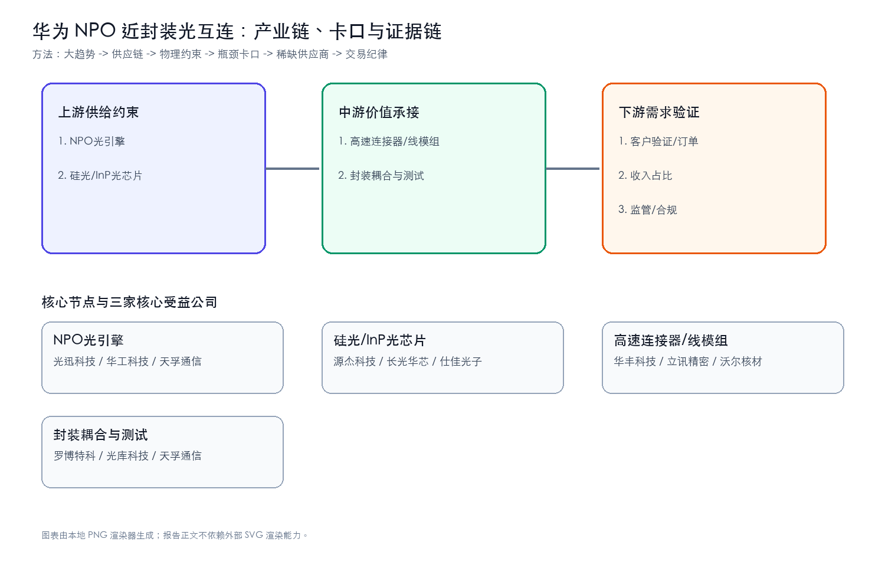
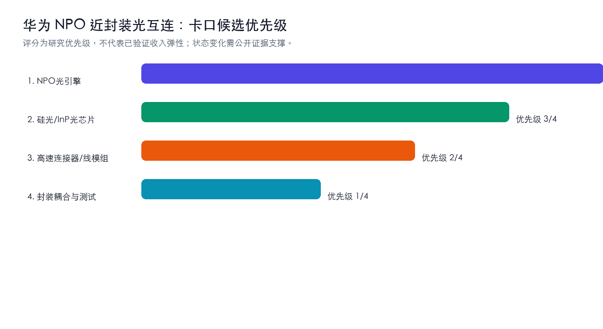
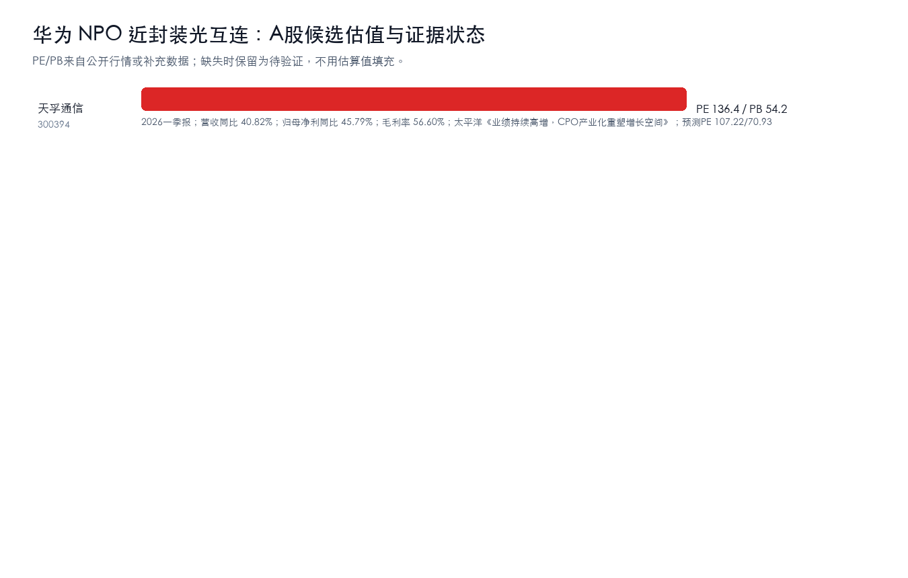
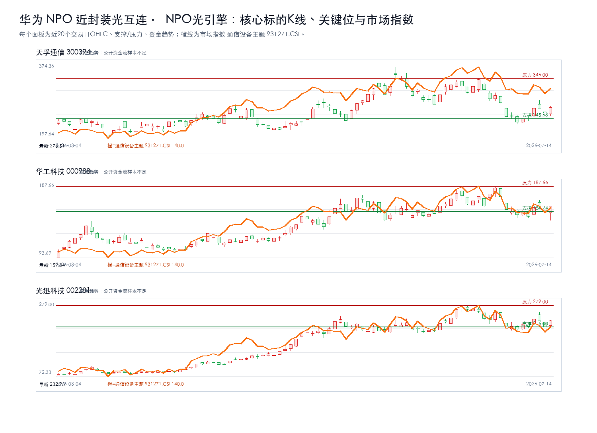
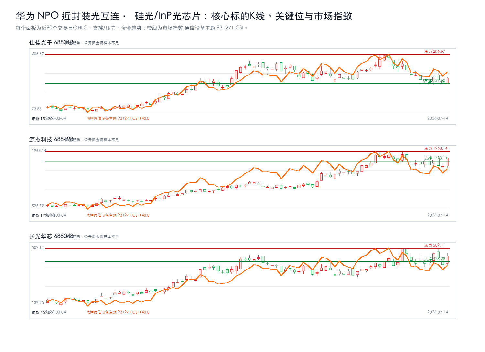
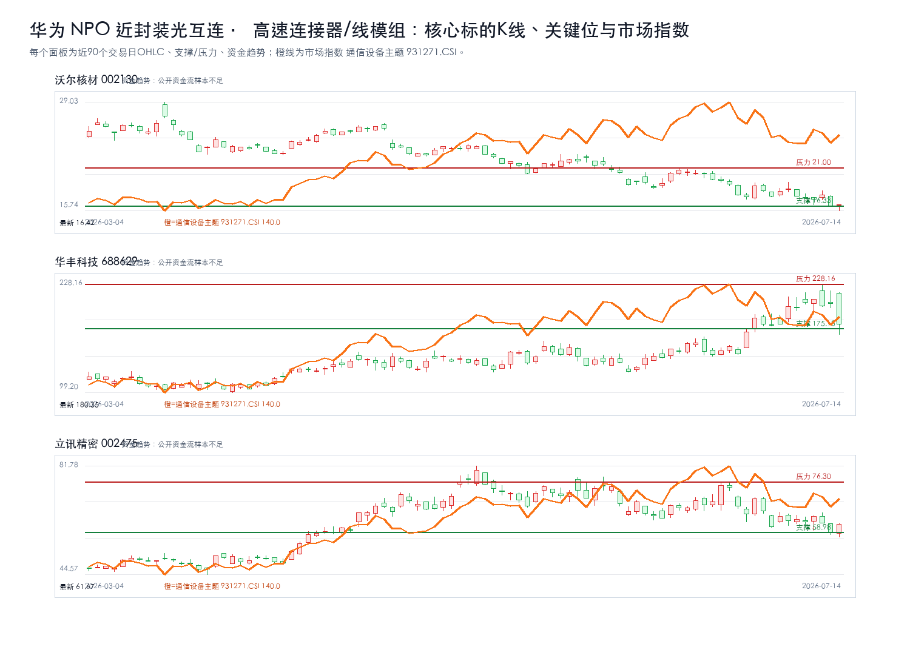
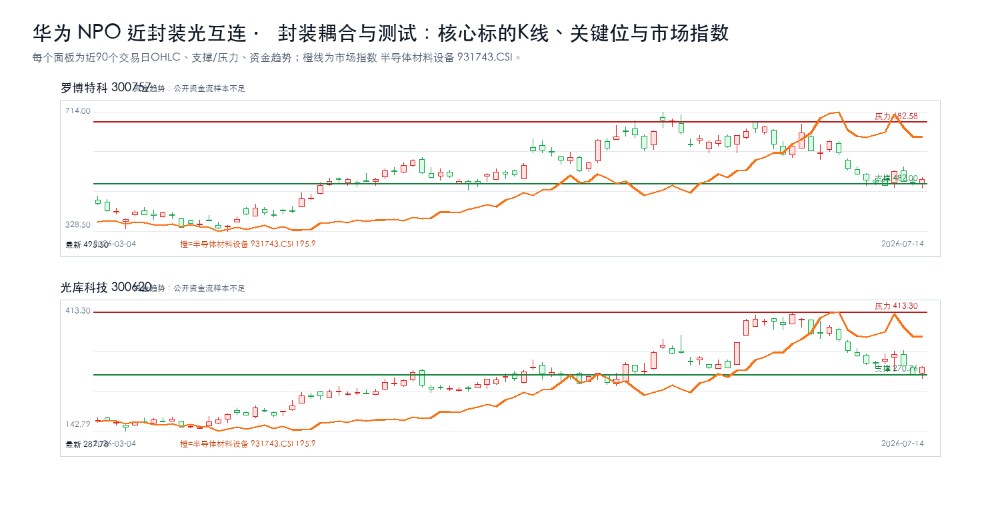

# 华为NPO光互连上下游产业链与A股公司分析报告

## 研究课题

本报告只回答三个问题：`华为 NPO 近封装光互连` 的利润会流向哪些卡口，A股哪些公司真正暴露在这些卡口上，当前价格是否允许执行。当前跟踪范围收敛在 NPO光引擎、硅光/InP光芯片、高速连接器/线模组、封装耦合与测试。

## 一句话结论

强命题：华为 NPO 近封装光互连 的机会不在泛主题，而在 `NPO光引擎 + 硅光/InP光芯片` 能否持续出现订单、价格、客户认证、收入占比或监管里程碑。方向谨慎看多，置信度中等；当前绝对核心候选为：天孚通信。没有新增硬证据时，只观察，不追高。

## 市场盘点

- 需求：AI资本开支仍是背景变量，但只有订单、产能、客户认证和收入占比能把主题变成业绩。
- 供给：重点看认证周期、良率/交付、关键材料和工程化能力是否造成瓶颈。
- 价格：股价接近压力位时不追；回到支撑区也要等硬证据同步。
- 证据密度：硬事实台账仍偏薄，PDF正文级和公告级证据不足，研报标题只作线索。

## 核心逻辑

1. 需求侧：AI 应用和模型迭代继续推高 `华为 NPO 近封装光互连` 相关需求，但需求强度必须通过订单、客户认证、收入占比、价格趋势或政策里程碑验证。
2. 供给侧：利润更可能集中在短期难扩产、认证周期长、替代路线慢、合规壁垒高或工程化交付难的环节，例如 NPO光引擎、硅光/InP光芯片、高速连接器/线模组、封装耦合与测试。
3. A股映射：先判断产业链位置，再核验收入/订单暴露，最后才进入估值和交易条件；不能把行情样本或主题标签直接当作核心标的。

## 关键数据

| 判断项 | 当前结论 | 投资含义 |
| --- | --- | --- |
| 核心卡口 | NPO光引擎、硅光/InP光芯片、高速连接器/线模组、封装耦合与测试 | 优先验证订单、价格、客户认证和收入占比 |
| 核心候选 | 天孚通信 | 只在买入触发满足时进入交易候选 |
| 财务口径 | 核心公司继续跟踪营收同比、归母净利同比、毛利率、预测PE | 财务改善要和订单/客户认证同步才升级 |
| 证据密度 | 公告/财报级硬证据不足，研报和新闻只作线索 | 不把主题热度等同于买入结论 |
| 正文证据 | 硬事实台账不铺长表；PDF正文级证据不足时降级为线索 | 避免把内部过程写进正文 |
| 交易纪律 | 等待买入触发；风险收益比不足时不追高 | 买点、支撑、压力和止损优先于叙事 |

## 产业链跟踪

### 产业链核心环节价值分布

| 产业链环节 | 细分领域/关键产品 | BOM成本占比/价值占比 | 核心技术壁垒 | 卡脖子程度 | 代表A股公司 | 公司环节地位 | 证据口径/备注 |
| --- | --- | --- | --- | --- | --- | --- | --- |
| 上游 | NPO光引擎 | 待验证 | 客户认证、数据闭环、工程化交付、合规和成本控制 | High | 光迅科技、华工科技、天孚通信 | 待验证 | 公开产业链与财务/研报口径，待公告和客户认证继续核验 |
| 上游 | 硅光/InP光芯片 | 待验证 | 客户认证、数据闭环、工程化交付、合规和成本控制 | High | 源杰科技、长光华芯、仕佳光子 | 待验证 | 公开产业链与财务/研报口径，待公告和客户认证继续核验 |
| 中游 | 高速连接器/线模组 | 待验证 | 客户认证、数据闭环、工程化交付、合规和成本控制 | Medium | 华丰科技、立讯精密、沃尔核材 | 待验证 | 公开产业链与财务/研报口径，待公告和客户认证继续核验 |
| 中游 | 封装耦合与测试 | 待验证 | 客户认证、数据闭环、工程化交付、合规和成本控制 | Medium | 罗博特科、光库科技、天孚通信 | 待验证 | 公开产业链与财务/研报口径，待公告和客户认证继续核验 |

### 供需链路跟踪

| 环节 | 事实映射 | 供需变化方向 | 瓶颈/卡口 | A股映射 |
| --- | --- | --- | --- | --- |
| 上游 | NPO光引擎 | 上行 | 客户认证、数据闭环、工程化交付、合规和成本控制 | 光迅科技、华工科技、天孚通信 |
| 上游 | 硅光/InP光芯片 | 上行 | 客户认证、数据闭环、工程化交付、合规和成本控制 | 源杰科技、长光华芯、仕佳光子 |
| 中游 | 高速连接器/线模组 | 上行 | 客户认证、数据闭环、工程化交付、合规和成本控制 | 华丰科技、立讯精密、沃尔核材 |
| 中游 | 封装耦合与测试 | 上行 | 客户认证、数据闭环、工程化交付、合规和成本控制 | 罗博特科、光库科技、天孚通信 |

### 核心节点三公司校验

| 产业链节点 | 核心公司1 | 核心公司2 | 核心公司3 | 升级催化 | 失效条件 |
| --- | --- | --- | --- | --- | --- |
| NPO光引擎 | 光迅科技 | 华工科技 | 天孚通信 | 订单/客户认证/收入占比/政策或监管里程碑出现公告级证据 | 商业化ROI不足、客户验证低于预期、收入暴露不足或监管约束增强 |
| 硅光/InP光芯片 | 源杰科技 | 长光华芯 | 仕佳光子 | 订单/客户认证/收入占比/政策或监管里程碑出现公告级证据 | 商业化ROI不足、客户验证低于预期、收入暴露不足或监管约束增强 |
| 高速连接器/线模组 | 华丰科技 | 立讯精密 | 沃尔核材 | 订单/客户认证/收入占比/政策或监管里程碑出现公告级证据 | 商业化ROI不足、客户验证低于预期、收入暴露不足或监管约束增强 |
| 封装耦合与测试 | 罗博特科 | 光库科技 | 天孚通信 | 订单/客户认证/收入占比/政策或监管里程碑出现公告级证据 | 商业化ROI不足、客户验证低于预期、收入暴露不足或监管约束增强 |

### 瓶颈战斗地图

| 瓶颈节点 | 当前三家核心公司 | 为什么卡 | 升级信号 | 反证信号 | 节点结论 |
| --- | --- | --- | --- | --- | --- |
| NPO光引擎 | 天孚通信、华工科技、光迅科技 | 需求放量与国产替代 | 订单/客户认证/收入占比/政策或监管里程碑出现公告级证据 | 商业化ROI不足、客户验证低于预期、收入暴露不足或监管约束增强 | 绝对核心 |
| 硅光/InP光芯片 | 仕佳光子、源杰科技、长光华芯 | 需求放量与国产替代 | 订单/客户认证/收入占比/政策或监管里程碑出现公告级证据 | 商业化ROI不足、客户验证低于预期、收入暴露不足或监管约束增强 | 绝对核心 |
| 高速连接器/线模组 | 沃尔核材、华丰科技、立讯精密 | 需求放量与国产替代 | 订单/客户认证/收入占比/政策或监管里程碑出现公告级证据 | 商业化ROI不足、客户验证低于预期、收入暴露不足或监管约束增强 | 绝对核心 |
| 封装耦合与测试 | 罗博特科、光库科技 | 需求放量与国产替代 | 订单/客户认证/收入占比/政策或监管里程碑出现公告级证据 | 商业化ROI不足、客户验证低于预期、收入暴露不足或监管约束增强 | 样本不足，留观察 |

### 瓶颈四标准校验

| 候选环节 | 不可替代 | 供给刚性 | 寡头垄断 | 机构低配 | 反证条件 |
| --- | --- | --- | --- | --- | --- |
| NPO光引擎 | 待验证 | 待验证 | 待验证 | 待验证 | 商业化ROI不足、客户验证低于预期、收入暴露不足或监管约束增强 |
| 硅光/InP光芯片 | 待验证 | 待验证 | 待验证 | 待验证 | 商业化ROI不足、客户验证低于预期、收入暴露不足或监管约束增强 |
| 高速连接器/线模组 | 待验证 | 待验证 | 待验证 | 待验证 | 商业化ROI不足、客户验证低于预期、收入暴露不足或监管约束增强 |
| 封装耦合与测试 | 待验证 | 待验证 | 待验证 | 待验证 | 商业化ROI不足、客户验证低于预期、收入暴露不足或监管约束增强 |

## 投资机会挖掘

### 瓶颈识别

- 1. NPO光引擎：代表公司 光迅科技、华工科技、天孚通信；催化 订单/客户认证/收入占比/政策或监管里程碑出现公告级证据；失效条件 商业化ROI不足、客户验证低于预期、收入暴露不足或监管约束增强。
- 2. 硅光/InP光芯片：代表公司 源杰科技、长光华芯、仕佳光子；催化 订单/客户认证/收入占比/政策或监管里程碑出现公告级证据；失效条件 商业化ROI不足、客户验证低于预期、收入暴露不足或监管约束增强。
- 3. 高速连接器/线模组：代表公司 华丰科技、立讯精密、沃尔核材；催化 订单/客户认证/收入占比/政策或监管里程碑出现公告级证据；失效条件 商业化ROI不足、客户验证低于预期、收入暴露不足或监管约束增强。
- 4. 封装耦合与测试：代表公司 罗博特科、光库科技、天孚通信；催化 订单/客户认证/收入占比/政策或监管里程碑出现公告级证据；失效条件 商业化ROI不足、客户验证低于预期、收入暴露不足或监管约束增强。

### 可交易标的筛选

- 直接暴露优先于相邻链路；公告/财报证明优先于研报标题；估值赔率优先于短期涨幅。当前所有候选仍需“收入占比/订单/客户认证”三项中的至少一项补强。

## A股可交易标的估值对比

### NPO光引擎核心三公司K线

叠加板块指数：通信设备主题 931271.CSI；来源：tushare.index_daily。

### 硅光/InP光芯片核心三公司K线

叠加板块指数：通信设备主题 931271.CSI；来源：tushare.index_daily。

### 高速连接器/线模组核心三公司K线

叠加板块指数：通信设备主题 931271.CSI；来源：tushare.index_daily。

### 封装耦合与测试核心三公司K线

叠加板块指数：半导体材料设备 931743.CSI；来源：tushare.index_daily。

| 公司 | 代码 | 产业链位置 | 当前估值 | 财务/订单信号 | 催化 | 买点条件 | 失效条件 |
| --- | --- | --- | --- | --- | --- | --- | --- |
| 光迅科技 | 002281 | NPO光引擎 | PE 未取得可靠公开数据 / PB 未取得可靠公开数据 | 财务指标未取得可靠公开数据；None | 订单/客户认证/收入占比/政策或监管里程碑出现公告级证据 | 等待买入触发：当前未进入买入候选；需先满足交易决策、风险收益比、K线企稳和订单/价格/客户认证增量证据 | 商业化ROI不足、客户验证低于预期、收入暴露不足或监管约束增强 |
| 华工科技 | 000988 | NPO光引擎 | PE 未取得可靠公开数据 / PB 未取得可靠公开数据 | 财务指标未取得可靠公开数据；None | 订单/客户认证/收入占比/政策或监管里程碑出现公告级证据 | 等待买入触发：当前未进入买入候选；需先满足交易决策、风险收益比、K线企稳和订单/价格/客户认证增量证据 | 商业化ROI不足、客户验证低于预期、收入暴露不足或监管约束增强 |
| 天孚通信 | 300394 | NPO光引擎 | PE 136.36 / PB 54.17 | 2026一季报；营收同比 40.82%；归母净利同比 45.79%；毛利率 56.60%；太平洋《业绩持续高增，CPO产业化重塑增长空间》；预测PE 107.22/70.93 | 订单/客户认证/收入占比/政策或监管里程碑出现公告级证据 | 等待买入触发：当前未进入买入候选；需先满足交易决策、风险收益比、K线企稳和订单/价格/客户认证增量证据 | 商业化ROI不足、客户验证低于预期、收入暴露不足或监管约束增强 |
| 源杰科技 | 688498 | 硅光/InP光芯片 | PE 未取得可靠公开数据 / PB 未取得可靠公开数据 | 财务指标未取得可靠公开数据；None | 订单/客户认证/收入占比/政策或监管里程碑出现公告级证据 | 等待买入触发：当前未进入买入候选；需先满足交易决策、风险收益比、K线企稳和订单/价格/客户认证增量证据 | 商业化ROI不足、客户验证低于预期、收入暴露不足或监管约束增强 |
| 长光华芯 | 688048 | 硅光/InP光芯片 | PE 未取得可靠公开数据 / PB 未取得可靠公开数据 | 财务指标未取得可靠公开数据；None | 订单/客户认证/收入占比/政策或监管里程碑出现公告级证据 | 等待买入触发：当前未进入买入候选；需先满足交易决策、风险收益比、K线企稳和订单/价格/客户认证增量证据 | 商业化ROI不足、客户验证低于预期、收入暴露不足或监管约束增强 |
| 仕佳光子 | 688313 | 硅光/InP光芯片 | PE 未取得可靠公开数据 / PB 未取得可靠公开数据 | 财务指标未取得可靠公开数据；None | 订单/客户认证/收入占比/政策或监管里程碑出现公告级证据 | 等待买入触发：当前未进入买入候选；需先满足交易决策、风险收益比、K线企稳和订单/价格/客户认证增量证据 | 商业化ROI不足、客户验证低于预期、收入暴露不足或监管约束增强 |
| 华丰科技 | 688629 | 高速连接器/线模组 | PE 未取得可靠公开数据 / PB 未取得可靠公开数据 | 财务指标未取得可靠公开数据；None | 订单/客户认证/收入占比/政策或监管里程碑出现公告级证据 | 等待买入触发：当前未进入买入候选；需先满足交易决策、风险收益比、K线企稳和订单/价格/客户认证增量证据 | 商业化ROI不足、客户验证低于预期、收入暴露不足或监管约束增强 |
| 立讯精密 | 002475 | 高速连接器/线模组 | PE 未取得可靠公开数据 / PB 未取得可靠公开数据 | 财务指标未取得可靠公开数据；None | 订单/客户认证/收入占比/政策或监管里程碑出现公告级证据 | 等待买入触发：当前未进入买入候选；需先满足交易决策、风险收益比、K线企稳和订单/价格/客户认证增量证据 | 商业化ROI不足、客户验证低于预期、收入暴露不足或监管约束增强 |
| 沃尔核材 | 002130 | 高速连接器/线模组 | PE 未取得可靠公开数据 / PB 未取得可靠公开数据 | 财务指标未取得可靠公开数据；None | 订单/客户认证/收入占比/政策或监管里程碑出现公告级证据 | 等待买入触发：当前未进入买入候选；需先满足交易决策、风险收益比、K线企稳和订单/价格/客户认证增量证据 | 商业化ROI不足、客户验证低于预期、收入暴露不足或监管约束增强 |
| 罗博特科 | 300757 | 封装耦合与测试 | PE 未取得可靠公开数据 / PB 未取得可靠公开数据 | 财务指标未取得可靠公开数据；None | 订单/客户认证/收入占比/政策或监管里程碑出现公告级证据 | 等待买入触发：当前未进入买入候选；需先满足交易决策、风险收益比、K线企稳和订单/价格/客户认证增量证据 | 商业化ROI不足、客户验证低于预期、收入暴露不足或监管约束增强 |
| 光库科技 | 300620 | 封装耦合与测试 | PE 未取得可靠公开数据 / PB 未取得可靠公开数据 | 财务指标未取得可靠公开数据；None | 订单/客户认证/收入占比/政策或监管里程碑出现公告级证据 | 等待买入触发：当前未进入买入候选；需先满足交易决策、风险收益比、K线企稳和订单/价格/客户认证增量证据 | 商业化ROI不足、客户验证低于预期、收入暴露不足或监管约束增强 |

## 核心个股交易跟踪

| 公司 | 代码 | 产业链位置 | 估值 | 财务质量 | 趋势结构 | 关键位 | 买入条件 | 止损/失效 | 卖出/目标 |
| --- | --- | --- | --- | --- | --- | --- | --- | --- | --- |
| 光迅科技 | 002281 | NPO光引擎 | PE 未取得可靠公开数据 / PB 未取得可靠公开数据 | 财务指标未取得可靠公开数据 | 现价 232.95；涨跌幅 7.85%；MA5/10/20/60=227.54/224.63/239.43/203.18；20日箱体 205.11-279.00；震荡分歧；20日箱体位置38%；风险收益比2.72；资金趋势：公开资金流样本不足 | 支撑 216.00；压力 279.00 | 等待买入触发：当前未进入买入候选；需先满足交易决策、风险收益比、K线企稳和订单/价格/客户认证增量证据 | 跌破216.00且订单/业绩无增量；商业化ROI不足、客户验证低于预期、收入暴露不足或监管约束增强 | 未设技术目标：尚未进入买入候选，先观察证据和价格结构是否修复 |
| 华工科技 | 000988 | NPO光引擎 | PE 未取得可靠公开数据 / PB 未取得可靠公开数据 | 财务指标未取得可靠公开数据 | 现价 159.84；涨跌幅 3.63%；MA5/10/20/60=155.73/156.56/164.00/148.94；20日箱体 142.50-187.66；震荡分歧；20日箱体位置38%；风险收益比4.97；资金趋势：公开资金流样本不足 | 支撑 154.24；压力 187.66 | 等待买入触发：当前未进入买入候选；需先满足交易决策、风险收益比、K线企稳和订单/价格/客户认证增量证据 | 跌破154.24且订单/业绩无增量；商业化ROI不足、客户验证低于预期、收入暴露不足或监管约束增强 | 未设技术目标：尚未进入买入候选，先观察证据和价格结构是否修复 |
| 天孚通信 | 300394 | NPO光引擎 | PE 136.36 / PB 54.17 | 2026一季报；营收同比 40.82%；归母净利同比 45.79%；毛利率 56.60% | 现价 273.51；涨跌幅 5.48%；MA5/10/20/60=264.22/258.81/289.95/279.24；20日箱体 231.45-346.00；震荡分歧；20日箱体位置37%；风险收益比2.60；资金趋势：公开资金流样本不足 | 支撑 245.68；压力 346.00 | 等待买入触发：当前未进入买入候选；需先满足交易决策、风险收益比、K线企稳和订单/价格/客户认证增量证据 | 跌破245.68且订单/业绩无增量；商业化ROI不足、客户验证低于预期、收入暴露不足或监管约束增强 | 未设技术目标：尚未进入买入候选，先观察证据和价格结构是否修复 |
| 源杰科技 | 688498 | 硅光/InP光芯片 | PE 未取得可靠公开数据 / PB 未取得可靠公开数据 | 财务指标未取得可靠公开数据 | 现价 1798.90；涨跌幅 13.12%；MA5/10/20/60=1672.22/1677.54/1723.11/1336.20；20日箱体 1432.00-1968.14；多头趋势；20日箱体位置68%；风险收益比2.23；资金趋势：公开资金流样本不足 | 支撑 1723.11；压力 1968.14 | 等待买入触发：当前未进入买入候选；需先满足交易决策、风险收益比、K线企稳和订单/价格/客户认证增量证据 | 跌破1723.11且订单/业绩无增量；商业化ROI不足、客户验证低于预期、收入暴露不足或监管约束增强 | 未设技术目标：尚未进入买入候选，先观察证据和价格结构是否修复 |
| 长光华芯 | 688048 | 硅光/InP光芯片 | PE 未取得可靠公开数据 / PB 未取得可靠公开数据 | 财务指标未取得可靠公开数据 | 现价 459.00；涨跌幅 13.70%；MA5/10/20/60=438.94/434.52/423.28/390.15；20日箱体 355.00-509.11；多头趋势；20日箱体位置67%；风险收益比1.40；资金趋势：公开资金流样本不足 | 支撑 423.28；压力 509.11 | 等待买入触发：当前未进入买入候选；需先满足交易决策、风险收益比、K线企稳和订单/价格/客户认证增量证据 | 跌破423.28且订单/业绩无增量；商业化ROI不足、客户验证低于预期、收入暴露不足或监管约束增强 | 未设技术目标：尚未进入买入候选，先观察证据和价格结构是否修复 |
| 仕佳光子 | 688313 | 硅光/InP光芯片 | PE 未取得可靠公开数据 / PB 未取得可靠公开数据 | 财务指标未取得可靠公开数据 | 现价 151.90；涨跌幅 8.81%；MA5/10/20/60=147.12/151.95/168.14/160.82；20日箱体 136.50-206.67；震荡分歧；20日箱体位置22%；风险收益比4.45；资金趋势：公开资金流样本不足 | 支撑 139.60；压力 206.67 | 等待买入触发：当前未进入买入候选；需先满足交易决策、风险收益比、K线企稳和订单/价格/客户认证增量证据 | 跌破139.60且订单/业绩无增量；商业化ROI不足、客户验证低于预期、收入暴露不足或监管约束增强 | 未设技术目标：尚未进入买入候选，先观察证据和价格结构是否修复 |
| 华丰科技 | 688629 | 高速连接器/线模组 | PE 未取得可靠公开数据 / PB 未取得可靠公开数据 | 财务指标未取得可靠公开数据 | 现价 180.35；涨跌幅 -11.81%；MA5/10/20/60=200.50/194.31/175.18/150.23；20日箱体 142.30-228.16；多头趋势；20日箱体位置44%；风险收益比9.24；资金趋势：公开资金流样本不足 | 支撑 175.18；压力 228.16 | 等待买入触发：当前未进入买入候选；需先满足交易决策、风险收益比、K线企稳和订单/价格/客户认证增量证据 | 跌破175.18且订单/业绩无增量；商业化ROI不足、客户验证低于预期、收入暴露不足或监管约束增强 | 未设技术目标：尚未进入买入候选，先观察证据和价格结构是否修复 |
| 立讯精密 | 002475 | 高速连接器/线模组 | PE 未取得可靠公开数据 / PB 未取得可靠公开数据 | 财务指标未取得可靠公开数据 | 现价 61.67；涨跌幅 4.56%；MA5/10/20/60=61.94/62.75/66.15/68.76；20日箱体 57.41-76.30；空头趋势；20日箱体位置23%；风险收益比5.44；资金趋势：公开资金流样本不足 | 支撑 58.98；压力 76.30 | 等待买入触发：当前未进入买入候选；需先满足交易决策、风险收益比、K线企稳和订单/价格/客户认证增量证据 | 跌破58.98且订单/业绩无增量；商业化ROI不足、客户验证低于预期、收入暴露不足或监管约束增强 | 未设技术目标：尚未进入买入候选，先观察证据和价格结构是否修复 |
| 沃尔核材 | 002130 | 高速连接器/线模组 | PE 未取得可靠公开数据 / PB 未取得可靠公开数据 | 财务指标未取得可靠公开数据 | 现价 16.42；涨跌幅 0.55%；MA5/10/20/60=16.97/17.44/18.38/20.95；20日箱体 15.74-21.00；空头趋势；20日箱体位置13%；风险收益比50.89；资金趋势：公开资金流样本不足 | 支撑 16.33；压力 21.00 | 等待买入触发：当前未进入买入候选；需先满足交易决策、风险收益比、K线企稳和订单/价格/客户认证增量证据 | 跌破16.33且订单/业绩无增量；商业化ROI不足、客户验证低于预期、收入暴露不足或监管约束增强 | 未设技术目标：尚未进入买入候选，先观察证据和价格结构是否修复 |
| 罗博特科 | 300757 | 封装耦合与测试 | PE 未取得可靠公开数据 / PB 未取得可靠公开数据 | 财务指标未取得可靠公开数据 | 现价 495.50；涨跌幅 2.80%；MA5/10/20/60=492.59/506.68/563.38/567.87；20日箱体 467.70-682.58；空头趋势；20日箱体位置13%；风险收益比13.86；资金趋势：公开资金流样本不足 | 支撑 482.00；压力 682.58 | 等待买入触发：当前未进入买入候选；需先满足交易决策、风险收益比、K线企稳和订单/价格/客户认证增量证据 | 跌破482.00且订单/业绩无增量；商业化ROI不足、客户验证低于预期、收入暴露不足或监管约束增强 | 未设技术目标：尚未进入买入候选，先观察证据和价格结构是否修复 |
| 光库科技 | 300620 | 封装耦合与测试 | PE 未取得可靠公开数据 / PB 未取得可靠公开数据 | 财务指标未取得可靠公开数据 | 现价 287.78；涨跌幅 6.29%；MA5/10/20/60=293.87/305.06/345.64/297.02；20日箱体 261.00-413.30；震荡分歧；20日箱体位置18%；风险收益比7.37；资金趋势：公开资金流样本不足 | 支撑 270.76；压力 413.30 | 等待买入触发：当前未进入买入候选；需先满足交易决策、风险收益比、K线企稳和订单/价格/客户认证增量证据 | 跌破270.76且订单/业绩无增量；商业化ROI不足、客户验证低于预期、收入暴露不足或监管约束增强 | 未设技术目标：尚未进入买入候选，先观察证据和价格结构是否修复 |

交易判断只看两件事：价格是否到买入触发区，证据是否同步增强。二者缺一，继续等待。

## 产业链 / 竞争格局

### A股公司映射与核心地位判断

| 公司 | 代码 | 环节 | 细分领域 | 产业占比/暴露度 | 核心技术/产品 | 卡脖子相关性 | 环节地位 | 证据与备注 |
| --- | --- | --- | --- | --- | --- | --- | --- | --- |
| 光迅科技 | 002281 | NPO光引擎 | NPO光引擎 | 待公告/财报核验收入、订单或客户认证占比 | NPO光引擎 | Medium/待验证 | 重要配套/待验证 | 财务指标未取得可靠公开数据；；反证/失效：商业化ROI不足、客户验证低于预期、收入暴露不足或监管约束增强 |
| 华工科技 | 000988 | NPO光引擎 | NPO光引擎 | 待公告/财报核验收入、订单或客户认证占比 | NPO光引擎 | Medium/待验证 | 重要配套/待验证 | 财务指标未取得可靠公开数据；；反证/失效：商业化ROI不足、客户验证低于预期、收入暴露不足或监管约束增强 |
| 天孚通信 | 300394 | NPO光引擎 | NPO光引擎 | 待公告/财报核验收入、订单或客户认证占比 | NPO光引擎 | Medium/待验证 | 重要配套/待验证 | 2026一季报；营收同比 40.82%；归母净利同比 45.79%；毛利率 56.…；太平洋《业绩持续高增，CPO产业化重塑增长空间》；预测PE 107.22/70.93；反证/失效：商业化ROI不足、客户验证低于预期、收入暴露不足或监管约束增强 |
| 源杰科技 | 688498 | 硅光/InP光芯片 | 硅光/InP光芯片 | 待公告/财报核验收入、订单或客户认证占比 | 硅光/InP光芯片 | High/待验证 | 核心卡口候选 | 财务指标未取得可靠公开数据；；反证/失效：商业化ROI不足、客户验证低于预期、收入暴露不足或监管约束增强 |
| 长光华芯 | 688048 | 硅光/InP光芯片 | 硅光/InP光芯片 | 待公告/财报核验收入、订单或客户认证占比 | 硅光/InP光芯片 | High/待验证 | 核心卡口候选 | 财务指标未取得可靠公开数据；；反证/失效：商业化ROI不足、客户验证低于预期、收入暴露不足或监管约束增强 |
| 仕佳光子 | 688313 | 硅光/InP光芯片 | 硅光/InP光芯片 | 待公告/财报核验收入、订单或客户认证占比 | 硅光/InP光芯片 | High/待验证 | 核心卡口候选 | 财务指标未取得可靠公开数据；；反证/失效：商业化ROI不足、客户验证低于预期、收入暴露不足或监管约束增强 |
| 华丰科技 | 688629 | 高速连接器/线模组 | 高速连接器/线模组 | 待公告/财报核验收入、订单或客户认证占比 | 高速连接器/线模组 | Medium/待验证 | 重要配套/待验证 | 财务指标未取得可靠公开数据；；反证/失效：商业化ROI不足、客户验证低于预期、收入暴露不足或监管约束增强 |
| 立讯精密 | 002475 | 高速连接器/线模组 | 高速连接器/线模组 | 待公告/财报核验收入、订单或客户认证占比 | 高速连接器/线模组 | Medium/待验证 | 重要配套/待验证 | 财务指标未取得可靠公开数据；；反证/失效：商业化ROI不足、客户验证低于预期、收入暴露不足或监管约束增强 |
| 沃尔核材 | 002130 | 高速连接器/线模组 | 高速连接器/线模组 | 待公告/财报核验收入、订单或客户认证占比 | 高速连接器/线模组 | Medium/待验证 | 重要配套/待验证 | 财务指标未取得可靠公开数据；；反证/失效：商业化ROI不足、客户验证低于预期、收入暴露不足或监管约束增强 |
| 罗博特科 | 300757 | 封装耦合与测试 | 封装耦合与测试 | 待公告/财报核验收入、订单或客户认证占比 | 封装耦合与测试 | High/待验证 | 重要配套/待验证 | 财务指标未取得可靠公开数据；；反证/失效：商业化ROI不足、客户验证低于预期、收入暴露不足或监管约束增强 |
| 光库科技 | 300620 | 封装耦合与测试 | 封装耦合与测试 | 待公告/财报核验收入、订单或客户认证占比 | 封装耦合与测试 | High/待验证 | 重要配套/待验证 | 财务指标未取得可靠公开数据；；反证/失效：商业化ROI不足、客户验证低于预期、收入暴露不足或监管约束增强 |

### 竞争格局与反证条件

| 公司 | 代码 | 卡口环节 | 直接性 | 财务信号 | 研报/公告信号 | 估值压力 | 反证条件 |
| --- | --- | --- | --- | --- | --- | --- | --- |
| 光迅科技 | 002281 | NPO光引擎 | 重要配套 | 财务指标未取得可靠公开数据 | None | 待验证 | 商业化ROI不足、客户验证低于预期、收入暴露不足或监管约束增强 |
| 华工科技 | 000988 | NPO光引擎 | 重要配套 | 财务指标未取得可靠公开数据 | None | 待验证 | 商业化ROI不足、客户验证低于预期、收入暴露不足或监管约束增强 |
| 天孚通信 | 300394 | NPO光引擎 | 重要配套 | 2026一季报；营收同比 40.82%；归母净利同比 45.79%；毛利率 56.60% | 太平洋《业绩持续高增，CPO产业化重塑增长空间》；预测PE 107.22/70.93 | 高 | 商业化ROI不足、客户验证低于预期、收入暴露不足或监管约束增强 |
| 源杰科技 | 688498 | 硅光/InP光芯片 | 重要配套 | 财务指标未取得可靠公开数据 | None | 待验证 | 商业化ROI不足、客户验证低于预期、收入暴露不足或监管约束增强 |
| 长光华芯 | 688048 | 硅光/InP光芯片 | 重要配套 | 财务指标未取得可靠公开数据 | None | 待验证 | 商业化ROI不足、客户验证低于预期、收入暴露不足或监管约束增强 |
| 仕佳光子 | 688313 | 硅光/InP光芯片 | 重要配套 | 财务指标未取得可靠公开数据 | None | 待验证 | 商业化ROI不足、客户验证低于预期、收入暴露不足或监管约束增强 |
| 华丰科技 | 688629 | 高速连接器/线模组 | 重要配套 | 财务指标未取得可靠公开数据 | None | 待验证 | 商业化ROI不足、客户验证低于预期、收入暴露不足或监管约束增强 |
| 立讯精密 | 002475 | 高速连接器/线模组 | 重要配套 | 财务指标未取得可靠公开数据 | None | 待验证 | 商业化ROI不足、客户验证低于预期、收入暴露不足或监管约束增强 |
| 沃尔核材 | 002130 | 高速连接器/线模组 | 重要配套 | 财务指标未取得可靠公开数据 | None | 待验证 | 商业化ROI不足、客户验证低于预期、收入暴露不足或监管约束增强 |
| 罗博特科 | 300757 | 封装耦合与测试 | 重要配套 | 财务指标未取得可靠公开数据 | None | 待验证 | 商业化ROI不足、客户验证低于预期、收入暴露不足或监管约束增强 |
| 光库科技 | 300620 | 封装耦合与测试 | 重要配套 | 财务指标未取得可靠公开数据 | None | 待验证 | 商业化ROI不足、客户验证低于预期、收入暴露不足或监管约束增强 |

竞争判断：华为 NPO 近封装光互连 中具备客户认证、数据闭环、合规壁垒、良率/交付和产能约束的环节更接近“瓶颈资产”；但若估值已经处在高压区，只有订单、价格、客户认证或收入占比继续补强，才能从“产业链好公司”升级为“可执行机会”。缺少差异化的概念映射容易只获得主题估值而非利润传导。

## 标的分层与入场条件

### 龙头分层

| 层级 | 公司 | 代码 | 节点 | 入选原因 | 升级触发器 | 降级/剔除条件 |
| --- | --- | --- | --- | --- | --- | --- |
| 绝对核心龙头 | 天孚通信 | 300394 | NPO光引擎 | 配套/相邻链路；财务增速可见；风险收益比2.60；PE 136.4 | 订单/客户认证/收入占比/政策或监管里程碑出现公告级证据 | 商业化ROI不足、客户验证低于预期、收入暴露不足或监管约束增强 |
| 主题观察 | 仕佳光子 | 688313 | 硅光/InP光芯片 | 配套/相邻链路；风险收益比4.45 | 订单/客户认证/收入占比/政策或监管里程碑出现公告级证据 | 商业化ROI不足、客户验证低于预期、收入暴露不足或监管约束增强 |
| 主题观察 | 光库科技 | 300620 | 封装耦合与测试 | 配套/相邻链路；风险收益比7.37 | 订单/客户认证/收入占比/政策或监管里程碑出现公告级证据 | 商业化ROI不足、客户验证低于预期、收入暴露不足或监管约束增强 |
| 主题观察 | 光迅科技 | 002281 | NPO光引擎 | 配套/相邻链路；风险收益比2.72 | 订单/客户认证/收入占比/政策或监管里程碑出现公告级证据 | 商业化ROI不足、客户验证低于预期、收入暴露不足或监管约束增强 |
| 主题观察 | 华丰科技 | 688629 | 高速连接器/线模组 | 配套/相邻链路；风险收益比9.24 | 订单/客户认证/收入占比/政策或监管里程碑出现公告级证据 | 商业化ROI不足、客户验证低于预期、收入暴露不足或监管约束增强 |
| 主题观察 | 华工科技 | 000988 | NPO光引擎 | 配套/相邻链路；风险收益比4.97 | 订单/客户认证/收入占比/政策或监管里程碑出现公告级证据 | 商业化ROI不足、客户验证低于预期、收入暴露不足或监管约束增强 |
| 主题观察 | 沃尔核材 | 002130 | 高速连接器/线模组 | 配套/相邻链路；风险收益比50.89 | 订单/客户认证/收入占比/政策或监管里程碑出现公告级证据 | 商业化ROI不足、客户验证低于预期、收入暴露不足或监管约束增强 |
| 主题观察 | 源杰科技 | 688498 | 硅光/InP光芯片 | 配套/相邻链路；风险收益比2.23 | 订单/客户认证/收入占比/政策或监管里程碑出现公告级证据 | 商业化ROI不足、客户验证低于预期、收入暴露不足或监管约束增强 |
| 主题观察 | 立讯精密 | 002475 | 高速连接器/线模组 | 配套/相邻链路；风险收益比5.44 | 订单/客户认证/收入占比/政策或监管里程碑出现公告级证据 | 商业化ROI不足、客户验证低于预期、收入暴露不足或监管约束增强 |
| 主题观察 | 罗博特科 | 300757 | 封装耦合与测试 | 配套/相邻链路；风险收益比13.86 | 订单/客户认证/收入占比/政策或监管里程碑出现公告级证据 | 商业化ROI不足、客户验证低于预期、收入暴露不足或监管约束增强 |
| 主题观察 | 长光华芯 | 688048 | 硅光/InP光芯片 | 配套/相邻链路；风险收益比1.40 | 订单/客户认证/收入占比/政策或监管里程碑出现公告级证据 | 商业化ROI不足、客户验证低于预期、收入暴露不足或监管约束增强 |

### 事件-交易触发器

| 公司 | 节点 | 需要等待的硬证据 | 买入触发 | 卖出/减仓触发 | 反证退出 |
| --- | --- | --- | --- | --- | --- |
| 光迅科技 | NPO光引擎 | 订单/客户认证/收入占比/政策或监管里程碑出现公告级证据 | 等待买入触发：当前未进入买入候选；需先满足交易决策、风险收益比、K线企稳和订单/价格/客户认证增量证据 | 未设技术目标：尚未进入买入候选，先观察证据和价格结构是否修复 | 商业化ROI不足、客户验证低于预期、收入暴露不足或监管约束增强 |
| 华工科技 | NPO光引擎 | 订单/客户认证/收入占比/政策或监管里程碑出现公告级证据 | 等待买入触发：当前未进入买入候选；需先满足交易决策、风险收益比、K线企稳和订单/价格/客户认证增量证据 | 未设技术目标：尚未进入买入候选，先观察证据和价格结构是否修复 | 商业化ROI不足、客户验证低于预期、收入暴露不足或监管约束增强 |
| 天孚通信 | NPO光引擎 | 订单/客户认证/收入占比/政策或监管里程碑出现公告级证据 | 等待买入触发：当前未进入买入候选；需先满足交易决策、风险收益比、K线企稳和订单/价格/客户认证增量证据 | 未设技术目标：尚未进入买入候选，先观察证据和价格结构是否修复 | 商业化ROI不足、客户验证低于预期、收入暴露不足或监管约束增强 |
| 源杰科技 | 硅光/InP光芯片 | 订单/客户认证/收入占比/政策或监管里程碑出现公告级证据 | 等待买入触发：当前未进入买入候选；需先满足交易决策、风险收益比、K线企稳和订单/价格/客户认证增量证据 | 未设技术目标：尚未进入买入候选，先观察证据和价格结构是否修复 | 商业化ROI不足、客户验证低于预期、收入暴露不足或监管约束增强 |
| 长光华芯 | 硅光/InP光芯片 | 订单/客户认证/收入占比/政策或监管里程碑出现公告级证据 | 等待买入触发：当前未进入买入候选；需先满足交易决策、风险收益比、K线企稳和订单/价格/客户认证增量证据 | 未设技术目标：尚未进入买入候选，先观察证据和价格结构是否修复 | 商业化ROI不足、客户验证低于预期、收入暴露不足或监管约束增强 |
| 仕佳光子 | 硅光/InP光芯片 | 订单/客户认证/收入占比/政策或监管里程碑出现公告级证据 | 等待买入触发：当前未进入买入候选；需先满足交易决策、风险收益比、K线企稳和订单/价格/客户认证增量证据 | 未设技术目标：尚未进入买入候选，先观察证据和价格结构是否修复 | 商业化ROI不足、客户验证低于预期、收入暴露不足或监管约束增强 |
| 华丰科技 | 高速连接器/线模组 | 订单/客户认证/收入占比/政策或监管里程碑出现公告级证据 | 等待买入触发：当前未进入买入候选；需先满足交易决策、风险收益比、K线企稳和订单/价格/客户认证增量证据 | 未设技术目标：尚未进入买入候选，先观察证据和价格结构是否修复 | 商业化ROI不足、客户验证低于预期、收入暴露不足或监管约束增强 |
| 立讯精密 | 高速连接器/线模组 | 订单/客户认证/收入占比/政策或监管里程碑出现公告级证据 | 等待买入触发：当前未进入买入候选；需先满足交易决策、风险收益比、K线企稳和订单/价格/客户认证增量证据 | 未设技术目标：尚未进入买入候选，先观察证据和价格结构是否修复 | 商业化ROI不足、客户验证低于预期、收入暴露不足或监管约束增强 |

## 风险、反证与退出条件

- 订单反证：公告、年报或调研无法验证新增订单、客户认证或收入占比。
- 供给反证：替代路线成熟、扩产过快或价格回落，导致卡口缓解。
- 估值反证：估值和成交拥挤先于基本面兑现，风险收益比低于 2:1。
- 主题反证：新闻/研报热度上升但公司财务、订单和价格信号没有同步改善。

## 数据来源与证据强度

| 结论/数据 | 来源 | 日期 | 置信度 |
| --- | --- | --- | --- |
| 产业链与卡口判断 | 公开产业链、研报、行情结构化证据 | 2026-07-14 | Medium |
| 核心公司估值/财务/K线 | 公开行情、财务快照、公告与研报摘要 | 2026-07-14 | Medium |
| 复核与反证条件 | 投研复核规则 | 2026-07-14 | Medium |
| 钢铁行业周报：铁水产量回落，钢厂盈利再下降 | 大同证券 | 2026-07-14 | 标题级/Medium |
| 商贸零售行业7月投资策略：扩大消费“十五五”规划出台，顶层设计引领内需复苏成长 | 国信证券 | 2026-07-14 | 标题级/Medium |
| 食品饮料行业周报：估值筑底，关注中报业绩预告催化 | 华龙证券 | 2026-07-14 | 标题级/Medium |
| How Deutsche Telekom is rewiring telecomm… | OpenAI | 2026-07-10T07:00:00+00:00 | 线索级/Low |
| Getting started with ChatGPT | OpenAI | 2026-07-10T00:00:00+00:00 | 线索级/Low |

## 0. 核心结论

1. 华为牵头的 OPEN NPO 项目把 NPO 从“技术路线讨论”推向“国内多源协议与样品适配阶段”。短期看，它更像 AI 超节点光互连的标准化与国产生态建设事件；中期看，若 2026Q3 首版规范和 2027H1 生态完善兑现，产业传导会从主题催化转为样品、测试、认证、订单。
2. NPO 的价值不是简单替代可插拔光模块，而是在交换芯片/XPU附近缩短高速电链路，用光引擎和近封装连接器换取更低功耗、更高密度和更低时延。它处在 LPO/可插拔与 CPO 之间，技术路线具备过渡属性。
3. 卡口优先级：光引擎/硅光PIC/InP激光芯片 > 近封装高速连接器/线模组 > 封装耦合与测试 > 高速PCB/基板材料 > 下游云厂商与整机系统。真正的利润池可能先集中在“能过客户验证的核心部件”，而不是所有光模块概念股。
4. A股直接映射较清晰的公司包括：光迅科技、华工科技、华丰科技、立讯精密；间接受益或需继续核验的包括中际旭创、新易盛、天孚通信、源杰科技、长光华芯、仕佳光子、光库科技、沪电股份、生益科技、罗博特科等。
5. 最大不确定性在于 NPO 商用节奏：标准发布、样品互通、整机验证、云厂商采购和路线竞争缺一不可。若 LPO可插拔继续满足短距需求，或 CPO路线提前成熟，NPO的产业空间会被压缩。

## 1. 研究对象、边界与口径

| 项目 | 定义 |
| --- | --- |
| 分析对象 | 华为 OPEN NPO 项目牵引的近封装光学（Near Package Optics, NPO）光互连产业链 |
| 纳入主线 | NPO标准/接口、光引擎、硅光/InP光芯片、高速连接器与线模组、封装测试、800G/1.6T光模块、AI超节点/云厂商 |
| 弱相关/相邻链 | 液冷、电源、IDC、普通光纤、通用PCB、泛AI服务器；这些受AI算力扩张影响，但不是NPO核心BOM |
| A股映射口径 | 优先采用年报/公告/公司产品披露；媒体和互动平台只作发现线索；未见收入占比则标注“未披露” |
| 证据层级 | 年报/公告/公司官方资料 > 标准组织/行业机构 > 权威媒体 > 第三方/自媒体线索 > 概念标签 |
| 投资口径 | 本报告给产业链与受益顺序，不给买点、目标价或短线操作建议 |

## 2. 行业背景与需求驱动

AI训练和推理集群正在把数据中心网络从“机柜间带宽”推进到“机柜内、板间、芯片附近互连”。随着 XPU/交换芯片速率提升，高速电链路在距离、功耗、损耗、散热和板级布线上的压力上升，光互连被推到更靠近芯片的位置。

| 驱动 | 方向 | 影响环节 | 传导逻辑 | 证据强度 |
| --- | --- | --- | --- | --- |
| AI光模块市场扩张 | 正向 | 800G/1.6T光模块、光芯片 | TrendForce称2026年全球AI光收发器市场有望达260亿美元，且组件短缺是扩产瓶颈 | Medium-High |
| 以太网光模块高速增长 | 正向 | 光模块、InP激光芯片 | LightCounting称2026年以太网光模块仍高增，瓶颈之一是InP EML与激光芯片产能 | Medium-High |
| 国产AI超节点建设 | 正向 | NPO光引擎、连接器、标准 | OPEN NPO把运营商、云厂商、设备商、连接器和光器件伙伴拉进同一验证框架 | Medium-High |
| 路线竞争 | 不确定 | NPO/LPO/CPO | NPO需证明相对可插拔/LPO的功耗和密度优势，同时避免被CPO直接越过 | Medium |

## 3. 产业链全景图谱

| 环节 | 细分领域 | 角色 | 关键输入 | 关键输出 | 价值/成本驱动 | 代表A股公司 |
| --- | --- | --- | --- | --- | --- | --- |
| 上游 | InP激光器/EML、硅光PIC、PLC/AWG | 决定光引擎速率、功耗、可靠性 | 外延片、芯片设计、流片/封装、耦合工艺 | 光芯片、硅光芯片、无源光器件 | 良率、客户认证、单波速率 | 源杰科技、长光华芯、仕佳光子、光库科技 |
| 上游 | 高速连接器/线模组 | 解决近封装场景短距离高速电连接 | 金属端子、塑胶、精密模具、仿真设计 | 224G连接器、线模组、NPO连接器方案 | 信号完整性、散热、空间约束 | 华丰科技、立讯精密 |
| 中游 | NPO光引擎 | 把光电转换移近交换芯片/XPU | 光芯片、驱动/TIA、封装、连接器 | 近封装光引擎/样品 | 光电协同设计、封装耦合、互通测试 | 光迅科技、华工科技 |
| 中游 | 800G/1.6T光模块 | 当前AI数据中心光互连主力产品 | 光芯片、DSP/LPO方案、封装、PCB | 可插拔/LPO/硅光模块 | 规模量产、客户导入、成本控制 | 光迅科技、中际旭创、新易盛、华工科技 |
| 下游 | AI超节点/云厂商/运营商 | 标准验证和规模采购入口 | XPU、交换芯片、机柜、网络架构 | 算力集群、AIDC网络 | Capex、能效、可靠性、生态绑定 | 间接映射：设备与算力基础设施公司 |

## 4. 上游材料、部件与制程要素挖掘

| 上游层级 | 细分材料/部件 | 对目标产业的作用 | 价值/稀缺性 | 卡脖子程度 | A股候选 | 纳入主线判断 |
| --- | --- | --- | --- | --- | --- | --- |
| Product BOM | InP激光器/EML、CW光源 | 光引擎和高速模块的核心光源，影响功耗、速率和供应弹性 | 高；LightCounting将InP EML/激光芯片列为供给瓶颈之一 | High | 源杰科技、长光华芯 | Core |
| Product BOM | 硅光PIC/调制器 | 提升集成度，适配NPO/CPO/LPO等低功耗路线 | 高；客户认证和良率门槛高 | High | 华工科技、光迅科技、光库科技 | Core/Important |
| Product BOM | 高速连接器/线模组 | NPO近封装电互连接口，影响224G信号完整性和整机空间 | 高；设计绑定和验证周期长 | High | 华丰科技、立讯精密 | Core |
| Process materials | 封装胶材、贴装、耦合、测试治具 | 决定光电共封/近封装良率和可靠性 | 中高；工艺Know-how强，但A股映射分散 | Medium | 罗博特科、天孚通信（部件/工艺） | Important/待验证 |
| Board/package materials | 高速PCB、低Dk/低损耗CCL、基板 | 为交换机/XPU板卡提供高速信号承载 | 中；更偏AI服务器/交换机相邻链 | Medium | 沪电股份、胜宏科技、生益科技 | Adjacent |
| Resource/feedstock | 铟、磷、镓、铌酸锂相关上游 | 支撑InP/GaAs/TFLN等光电材料体系 | 中；更多是材料安全与成本背景 | Medium/Low | 云南锗业等待验证 | Commodity/Adjacent |
| Adjacent infrastructure | 液冷、电源、IDC网络 | AI集群放大后的配套基础设施 | 中；非NPO核心BOM | Low | 英维克、科华数据等 | Adjacent |

## 5. 产业链核心环节价值分布

| 产业链环节 | 细分领域/关键产品 | BOM成本占比/价值占比 | 核心技术壁垒 | 卡脖子程度 | 代表A股公司 | 公司环节地位 | 证据口径/备注 |
| --- | --- | --- | --- | --- | --- | --- | --- |
| 上游 | InP激光器/EML、CW光源 | 精确BOM未披露；按价值链为高价值核心件 | 外延/芯片设计、良率、可靠性、客户认证 | High | 源杰科技、长光华芯 | 关键技术突破者 | 行业机构称InP/激光芯片供给限制光模块增长；公司收入占比需年报细拆 |
| 上游 | 硅光PIC/薄膜铌酸锂 | 高价值，随1.6T/3.2T与NPO/CPO提升 | 高速调制、耦合、封装、光电协同 | High | 华工科技、光库科技、光迅科技 | 核心/重要 | 华工科技年报披露硅光芯片用于400G/800G/1.6T，且实现3.2T CPO/NPO高集成硅光芯片能力 |
| 上游 | 高速连接器/线模组 | NPO接口关键部件，价值占比待披露 | 224G信号完整性、热管理、紧凑布局、整机验证 | High | 华丰科技、立讯精密 | 卡口资产/重要配套 | OPEN NPO首批伙伴与华丰NPO连接器公开分享支持，收入占比待核验 |
| 中游 | NPO光引擎 | 高价值，取决于客户验证和标准互通 | 光电设计、封装耦合、良率、样品适配 | High | 光迅科技、华工科技 | 核心环节龙头/挑战者 | 华为事件披露光迅、华工正源为首批伙伴；年报验证高速光模块和光通信能力 |
| 中游 | 800G/1.6T光模块 | 当前收入兑现最强 | 量产、成本、客户导入、LPO/硅光路线 | Medium | 中际旭创、新易盛、光迅科技、华工科技 | 核心受益/普通受益 | 与NPO相邻但不等同；需看是否参与近封装样品 |
| 下游 | AI超节点/云厂商 | 需求源，不直接构成A股核心BOM | 网络架构、生态、采购节奏 | Medium | 无纯A股直接映射 | 需求牵引 | 华为、中国移动研究院、京东云、百度等是标准与需求侧锚点 |

## 6. 竞争格局与核心壁垒

NPO竞争不是单点器件竞争，而是标准、光引擎、连接器、封装、整机验证的系统竞争。对A股而言，最值得跟踪的是“已在传统高速光模块/连接器中有量产基础，同时进入NPO首批生态或公开技术验证”的公司。

### 四层物理约束校验

| 候选环节 | 寡头是谁 | 扩产周期 | 替代方案 | 下游刚需 | 是否卡口 |
| --- | --- | --- | --- | --- | --- |
| InP激光芯片/EML | 海外龙头与少数国内厂商，国内高端仍在追赶 | 外延、芯片、可靠性验证周期长 | 硅光仍需光源；替代有限 | AI光模块与光引擎必需 | 是 |
| 硅光PIC/光引擎 | 国际大厂与少数具备垂直整合能力厂商 | 流片、封装、耦合良率爬坡较慢 | 可插拔LPO、传统模块、CPO | 低功耗高密度互连需要 | 是 |
| NPO高速连接器 | 高端连接器国际厂商与国内少数高速连接器厂商 | 模具、仿真、客户验证周期中等偏长 | PCB铜链路/线缆，但距离和功耗受限 | 近封装互连需要 | 是，需订单验证 |
| 封装耦合与测试 | 分散，工艺Know-how重 | 设备交期和良率爬坡 | 可外协，但客户一致性要求高 | 光引擎量产需要 | 候选卡口 |
| 高速PCB/CCL | 国内供应较多，头部集中度较高 | 扩产和认证中等 | 多供应商可替代 | AI交换机需要 | 重要相邻，不是NPO主卡口 |

## 7. A股公司映射与核心地位判断

| 公司 | 代码 | 环节 | 细分领域 | 产业占比/暴露度 | 核心技术/产品 | 卡脖子相关性 | 环节地位 | 证据与备注 |
| --- | --- | --- | --- | --- | --- | --- | --- | --- |
| 光迅科技 | 002281 | 中游 | 光模块、光器件、NPO生态伙伴 | 未披露NPO收入；年报确认数据中心高速光模块覆盖800G、1.6T | 高速光模块、AOC、无源光器件 | Medium-High | 核心环节龙头/重要配套 | IT之家披露为OPEN NPO首批伙伴；年报验证高速数通产品 |
| 华工科技 | 000988 | 中游/上游 | 华工正源、硅光芯片、光模块、CPO/NPO | 光通信为重要业务；NPO收入未披露 | 自研硅光芯片、1.6T光模块、3.2T CPO/NPO高集成硅光芯片 | High | 核心环节龙头 | 年报披露硅光芯片用于400G/800G/1.6T并具备3.2T CPO/NPO能力；华工正源为OPEN NPO伙伴 |
| 华丰科技 | 688629 | 上游 | NPO电连接器、高速连接器/线模组 | 未披露NPO收入；高速连接器收入占比需年报核验 | 112G/224G高速连接器、NPO连接器方案 | High | 卡口资产/关键技术突破者 | OPEN NPO首批伙伴；公开资料显示参与论坛分享NPO电连接器关键技术，证据强度中等 |
| 立讯精密 | 002475 | 上游/中游 | 连接器、线束、通讯互联 | NPO收入未披露 | 高速互联、连接器、系统制造能力 | Medium | 重要配套 | 立讯技术为OPEN NPO伙伴；上市公司口径需进一步确认主体归属与收入占比 |
| 中际旭创 | 300308 | 中游 | 800G/1.6T高速光模块 | NPO直接暴露未确认 | 高速数通光模块 | Medium | 相邻核心受益 | 与AI光模块主线高度相关，但需核验NPO光引擎/样品参与情况 |
| 新易盛 | 300502 | 中游 | 高速光模块 | NPO直接暴露未确认 | 800G/1.6T光模块 | Medium | 相邻核心受益 | 受AI光模块增长驱动，NPO主链证据不足 |
| 天孚通信 | 300394 | 上游 | 光器件、耦合/无源部件 | NPO收入未披露 | 光无源器件、封装配套能力 | Medium | 重要配套 | 逻辑上受益于光引擎封装与光器件需求，需订单验证 |
| 源杰科技 | 688498 | 上游 | 激光芯片 | NPO直接收入未披露 | 高速激光芯片、CW/EML方向待核验 | High | 关键技术突破者 | 激光芯片是行业瓶颈，需用最新年报/客户验证确认高端产品进展 |
| 长光华芯 | 688048 | 上游 | 激光芯片 | NPO直接收入未披露 | 半导体激光芯片 | Medium-High | 关键技术突破者 | 与光源国产化相关，数据中心高端验证需继续核验 |
| 仕佳光子 | 688313 | 上游 | PLC/AWG、无源光芯片 | NPO直接收入未披露 | AWG、PLC分路器、光芯片 | Medium | 重要配套 | 更偏无源光器件/光芯片配套，NPO核心性低于光源和光引擎 |
| 光库科技 | 300620 | 上游/相邻 | 薄膜铌酸锂、光器件 | NPO直接收入未披露 | 铌酸锂调制器、光器件 | Medium | 关键技术观察 | 低功耗高速调制路线相关，需验证与NPO客户的绑定 |
| 沪电股份 | 002463 | 相邻链 | 高速PCB | NPO直接收入不适用 | 高速通信板、服务器PCB | Low/Medium | 相邻基础设施 | 受AI交换机/服务器拉动，但不是NPO核心部件 |
| 生益科技 | 600183 | 相邻链 | 高速覆铜板/电子材料 | NPO直接收入不适用 | CCL、低损耗材料 | Low/Medium | 相邻基础设施 | 受高速PCB升级受益，NPO主链相关性间接 |

## 8. 投资线索、交易跟踪与目标价情景

本报告不输出买点、目标价或操作建议。产业链机会按“直接暴露 + 卡口价值 + 验证里程碑”排序如下。

| 机会类型 | 产业链逻辑 | 代表A股公司 | 验证里程碑 | 风险 |
| --- | --- | --- | --- | --- |
| 核心环节龙头 | 光引擎/硅光/高速光模块具备产品和客户验证基础，最可能承接NPO样品适配 | 华工科技、光迅科技 | 2026Q3首版技术规范、样品适配、全场景测试、客户订单 | NPO商用节奏延后、CPO/LPO路线分流 |
| 关键技术突破者 | 光芯片和低功耗集成决定国产化深度，是供给瓶颈的上游 | 源杰科技、长光华芯、光库科技 | 高速激光芯片/调制器客户认证、良率和出货提升 | 高端产品未导入、海外供应缓解 |
| 卡口资产/重要配套 | 224G近封装连接器直接影响NPO接口标准和整机适配 | 华丰科技、立讯精密 | NPO连接器样品互通、客户导入、批量订单 | 标准变更、客户自研、海外连接器厂商优势 |
| 相邻核心受益 | 800G/1.6T光模块继续受AI数据中心扩张驱动，收入兑现早于NPO | 中际旭创、新易盛、天孚通信 | 1.6T订单、LPO/硅光产品量产、海外云厂商capex | 估值拥挤、价格竞争、NPO参与度不足 |
| 相邻基础设施 | AI集群建设拉动高速PCB、液冷、电源等，但不是NPO主链 | 沪电股份、生益科技、英维克等 | AI交换机/服务器订单、材料升级 | 与NPO主题传导弱，易被概念化 |

## 9. 催化因素与产业传导路径

| 催化 | 时间窗口 | 影响链路 | 产业传导 |
| --- | --- | --- | --- |
| OPEN NPO首版技术规范发布 | 2026Q3规划 | 标准、连接器、光引擎 | 规范明确后，样品互通和供应商进入门槛更清晰 |
| NPO及电连接器产品样品适配/全场景测试 | 2026Q3后 | 光引擎、连接器、封装测试 | 从主题事件进入样品验证，核心供应商名单收窄 |
| NPO MSA协作机制和生态完善 | 2027H1规划 | 全产业链 | 云厂商/设备商采购前置验证，收入弹性开始可跟踪 |
| 800G/1.6T继续放量 | 2026-2027 | 光芯片、光模块、光器件 | 现金流和产能利用率先兑现，并为NPO/CPO研发提供基础 |
| 海外组件短缺或出口限制 | 持续 | 光芯片、连接器、封装设备 | 国产替代优先级上升，但也可能压制整机供应节奏 |

## 10. 风险提示

- 技术路线风险：NPO不是唯一方向，LPO可插拔、CPO、铜缆/有源电缆和系统架构优化都可能分流需求。
- 商用节奏风险：标准发布不等于批量订单；样品适配、可靠性测试、客户认证和成本下降仍需时间。
- 供给瓶颈风险：InP激光芯片、封装良率、连接器良率和测试能力不足会限制出货。
- 证据风险：部分A股公司仅有生态伙伴或技术方向证据，NPO收入占比普遍未披露。
- 市场拥挤风险：AI光模块主线已有较强市场认知，若订单低于预期或价格竞争加剧，估值可能先于基本面回撤。

## 11. 数据来源、证据强度与待核验事项

| 结论/数据 | 来源 | 日期 | 置信度 |
| --- | --- | --- | --- |
| 华为联合20余家伙伴启动OPEN NPO项目，并规划2026Q3首版规范、2027H1生态完善 | IT之家转引华为计算、第一财经快讯 | 2026-07-09 | Medium-High |
| 趋势：AI光收发器市场扩张，组件短缺成为扩产瓶颈之一 | TrendForce | 2026-04-20 | Medium-High |
| 趋势：以太网光模块高增长，InP EML/激光芯片为供给瓶颈之一 | LightCounting April 2026 Market Forecast newsletter | 2026-04 | Medium-High |
| 光迅科技数据中心高速光模块覆盖800G、1.6T等速率 | 光迅科技2025年年度报告摘要，巨潮资讯 | 2026-04-23 | High |
| 华工科技披露硅光芯片应用于400G/800G/1.6T，且具备3.2T CPO/NPO高集成硅光芯片能力 | 华工科技2025年年度报告，巨潮资讯 | 2026-03-26 | High |
| 华丰科技参与NPO电连接器技术分享，涉及224G信号完整性、散热和整机场景验证 | 东方财富财富号/公开活动报道 | 2026-07-09 | Medium |

待核验事项：

- 华为计算原始公众号全文与GCC/OAII正式项目页面。
- 光迅科技、华工正源、华丰科技、立讯技术在OPEN NPO中的具体样品、测试结果和订单状态。
- 华丰科技、立讯精密、源杰科技、长光华芯、光库科技的最新年报/IR中与NPO、CPO、1.6T、224G连接器相关的收入占比。
- NPO标准与OIF CPO/ELSFP、OCP/OAII等现有生态之间的接口兼容关系。
