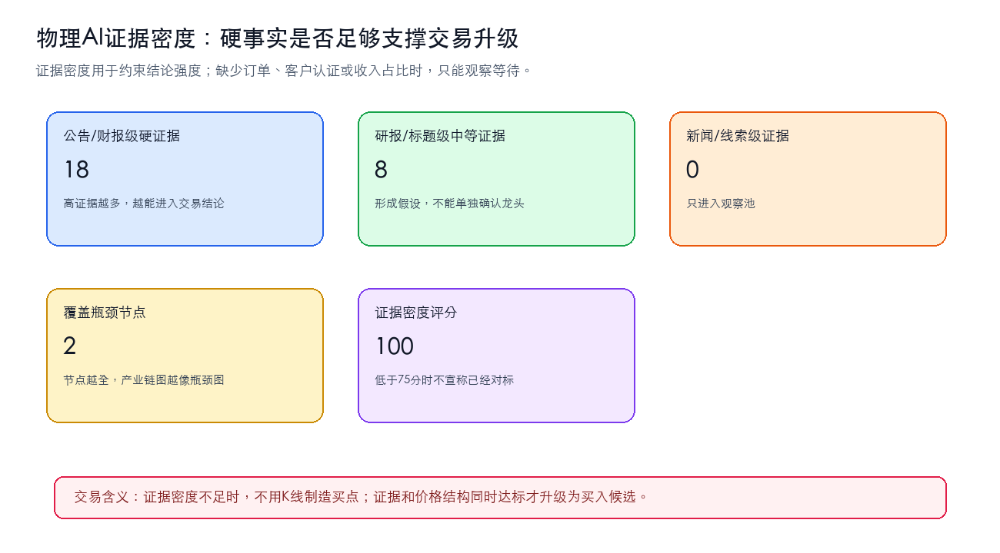
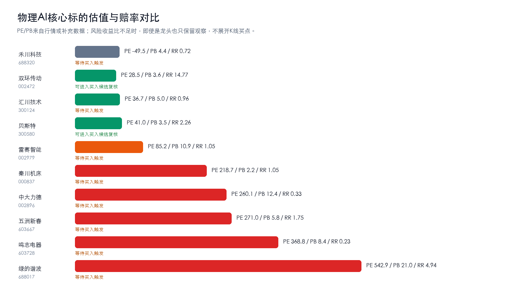
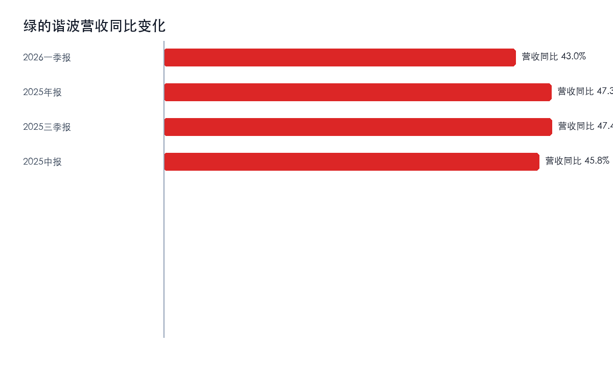

# 物理AI/人形机器人核心零部件产业链与A股公司分析报告

## 0. 核心结论

1. 强命题：物理 AI 当前不是“谁名字像机器人谁涨”，而是执行器链进入第一次龙头筛选期；真正能对标深度研究的主线应收敛到减速器/精密传动、丝杠/线性执行器、伺服/运动控制三类瓶颈。置信度中等偏上，当前绝对核心候选：双环传动、汇川技术、绿的谐波。
2. 绿的谐波仍是精密传动主研究位，但 PE 547.34 已经把远期成长打得很满；如果后续没有机器人订单、客户认证或收入占比证据，它只能是高波动卡口股，不是无条件龙头。
3. 核心跟踪标的不应只剩一只。本报告把 绿的谐波、双环传动、中大力德、秦川机床、贝斯特、五洲新春、鸣志电器、汇川技术、雷赛智能、禾川科技 作为上游核心部件主线跟踪，并把公司分为绝对核心龙头、高弹性二线和主题观察三层；只有“产业证据 + 股价位置”同时转强，才进入可执行机会。
4. 买点不能靠一句“机器人量产”判断，必须同时满足三件事：订单/客户/收入证据补强、估值消化到可解释区间、价格结构从单边下跌转为企稳修复。否则只是主题波动，不是产业链买点，风险收益比不成立。
5. 宁德时代、贵州茅台等样本不能被混入主线。宁德时代可作为工程机械电动化和储能资本开支的侧面验证，贵州茅台只能作为市场风险偏好温度计，不能提供物理 AI 产业链证据。
6. 财务验证必须同步看营收同比、归母净利同比和毛利率，任何只讲机器人概念但无法证明利润弹性的公司，都不得进入绝对核心龙头层。

## 1. 研究对象、边界与口径

| 项目 | 定义 |
| --- | --- |
| 分析对象 | 物理AI/人形机器人核心零部件，重点是精密传动、丝杠、伺服、电机、控制器和系统集成 |
| 纳入主线 | 减速器、丝杠、伺服电机、控制器、传感器、精密加工与检测设备、人形机器人本体 |
| 相邻链路 | 工程机械电动化、新能源/储能、工业软件、视觉传感、算力基础设施 |
| 排除/弱相关 | 只有AI概念标签、无机器人收入/订单/客户认证披露的公司；消费品和非产业链样本 |
| 核心指标 | 订单/客户认证、收入占比、毛利率、产能利用率、PE/PB、远期EPS、60日价格结构 |
| 证据层级 | 公告/财报/研报PDF/行情K线 > 公开新闻 > 主题标签和逻辑推断 |

## 2. 行业背景与需求驱动

公开新闻显示企业 AI 和云端基础设施仍在扩散；A股研报端同时出现人形机器人量产、工程机械销量、国产 CPU 提价、IC 封装基板等线索。需求端没有冷却，但股票定价开始要求更硬的兑现证据。

| 驱动 | 方向 | 影响环节 | 传导逻辑 | 证据强度 |
| --- | --- | --- | --- | --- |
| 企业AI扩散 | 正向 | 算力/机器人应用 | AI进入企业流程 -> 物理世界自动化需求提升 | 中-高 |
| 人形机器人量产爬坡 | 正向 | 减速器/丝杠/伺服 | 本体放量 -> 运动部件价值量与客户认证重要性上升 | 中-高 |
| 工程机械销量与电动化 | 正向但间接 | 工程机械/新能源链 | 设备电动化和资本开支改善 -> 相邻链路验证 | 中 |
| 高估值样本大跌 | 负向/筛选 | 核心卡口标的 | 估值先于订单透支 -> 市场要求更硬证据 | 高 |

## 2.5 硬事实台账与证据密度

对标深度文章时，物理 AI 最大短板不是产业链节点不全，而是订单、客户认证、产能利用率、良率、机器人收入占比这些硬事实不足。下面的台账把公告级、财报级、研报级和标题级线索拆开，避免用弱证据覆盖强报告。

### 正文级事实摘要

- **订单/客户**：绿的谐波：8%，公司在全球市场品牌影响力逐步提升，报告期内实 现了国际头部机器人客户的批量交付。（群益证券 PDF正文 / 2026-04-23，PDF正文级/Medium-High）。交易含义：可提升机器人链收入兑现置信度；必须继续核验客户名称和金额
- **订单/客户**：绿的谐波：本公司建议客户应 考虑本报告的任何意见或建议是否符合其特定状况，以及（若有必要）咨询独立投资顾问。（国元证券 PDF正文 / 2026-04-29，PDF正文级/Medium-High）。交易含义：可提升机器人链收入兑现置信度；必须继续核验客户名称和金额
- **订单/客户**：绿的谐波： 战略卡位具身智能，拓展新业务增长点 公司战略卡位具身智能，全力打造具身智能领域底层传动部件核心供应商， 自主研发高扭矩密度谐波减速器和一体化关节模组，在国内具身…（国元证券 PDF正文 / 2026-04-29，PDF正文级/Medium-High）。交易含义：可提升机器人链收入兑现置信度；必须继续核验客户名称和金额
- **产能/扩产**：绿的谐波：公司已完成年产50万台精密减速器扩产 项目的调试和达产工作。（国信证券 PDF正文 / 2026-05-26，PDF正文级/Medium-High）。交易含义：决定量产爬坡节奏，也可能带来供给释放反证
- **收入占比/财务**：双环传动：2026Q1 公司在乘用车批发销售同比下滑背景下， 录得营收正增长， 并实现 归母净利润增速快于收入的高质量增长态势，持续跑赢行业水平。（国元证券 PDF正文 / 2026-05-06，PDF正文级/Medium-High）。交易含义：证明公司质量，但还需拆分机器人相关收入
- **收入占比/财务**：双环传动：2026Q1 受行业下行影响， 公司各项利润率较单季度高点略有下滑， 但毛利率、EBIT Margin 仍高于 2025 年年度水平，体现公司发展韧性。（国元证券 PDF正文 / 2026-05-06，PDF正文级/Medium-High）。交易含义：证明公司质量，但还需拆分机器人相关收入

| 事实类型 | 硬事实/线索 | 涉及节点 | 涉及公司 | 数值/时间 | 来源 | 证据强度 | 交易含义 |
| --- | --- | --- | --- | --- | --- | --- | --- |
| 收入占比/财务 | 绿的谐波：2026一季报 营收同比42.96%，归母净利同比61.17%，毛利率33.62% | 减速器/精密传动 | 绿的谐波 | 42.96%、61.17%、33.62% | 公开财务接口 / 2026一季报 | 财报级/High | 证明公司质量，但还需拆分机器人相关收入 |
| 收入占比/财务 | 双环传动：2026一季报 营收同比1.49%，归母净利同比2.93%，毛利率27.55% | 减速器/精密传动 | 双环传动 | 1.49%、2.93%、27.55% | 公开财务接口 / 2026一季报 | 财报级/High | 证明公司质量，但还需拆分机器人相关收入 |
| 收入占比/财务 | 中大力德：2026一季报 营收同比5.12%，归母净利同比-36.42%，毛利率24.41% | 跨节点/待定位 | 中大力德 | 5.12%、36.42%、24.41% | 公开财务接口 / 2026一季报 | 财报级/High | 证明公司质量，但还需拆分机器人相关收入 |
| 收入占比/财务 | 秦川机床：2026一季报 营收同比9.64%，归母净利同比-11.71%，毛利率16.89% | 精密加工/检测设备 | 秦川机床 | 9.64%、11.71%、16.89% | 公开财务接口 / 2026一季报 | 财报级/High | 证明公司质量，但还需拆分机器人相关收入 |
| 收入占比/财务 | 贝斯特：2026一季报 营收同比10.38%，归母净利同比5.23%，毛利率33.59% | 跨节点/待定位 | 贝斯特 | 10.38%、5.23%、33.59% | 公开财务接口 / 2026一季报 | 财报级/High | 证明公司质量，但还需拆分机器人相关收入 |
| 收入占比/财务 | 五洲新春：2026一季报 营收同比-18.83%，归母净利同比-18.62%，毛利率19.76% | 跨节点/待定位 | 五洲新春 | 18.83%、18.62%、19.76% | 公开财务接口 / 2026一季报 | 财报级/High | 证明公司质量，但还需拆分机器人相关收入 |
| 收入占比/财务 | 鸣志电器：2026一季报 营收同比17.65%，归母净利同比92.19%，毛利率37.02% | 跨节点/待定位 | 鸣志电器 | 17.65%、92.19%、37.02% | 公开财务接口 / 2026一季报 | 财报级/High | 证明公司质量，但还需拆分机器人相关收入 |
| 收入占比/财务 | 汇川技术：2026一季报 营收同比12.98%，归母净利同比-23.39%，毛利率29.08% | 跨节点/待定位 | 汇川技术 | 12.98%、23.39%、29.08% | 公开财务接口 / 2026一季报 | 财报级/High | 证明公司质量，但还需拆分机器人相关收入 |
| 收入占比/财务 | 雷赛智能：2026一季报 营收同比34.55%，归母净利同比29.20%，毛利率38.94% | 跨节点/待定位 | 雷赛智能 | 34.55%、29.20%、38.94% | 公开财务接口 / 2026一季报 | 财报级/High | 证明公司质量，但还需拆分机器人相关收入 |
| 收入占比/财务 | 禾川科技：2026一季报 营收同比18.70%，归母净利同比79.10%，毛利率23.35% | 跨节点/待定位 | 禾川科技 | 18.70%、79.10%、23.35% | 公开财务接口 / 2026一季报 | 财报级/High | 证明公司质量，但还需拆分机器人相关收入 |
| 收入占比/财务 | 绿的谐波：1) (1070) 0 0 0 ROE 2% 4% 5% 7% 9% 投资活动现金流 (31) (1283) (70) (68) (79) 毛利率 38% 37% … | 减速器/精密传动 | 绿的谐波 | 2%、4%、5%、7%、9% | 国信证券 PDF正文 / 2026-05-26 | PDF正文级/Medium-High | 证明公司质量，但还需拆分机器人相关收入 |
| 产能/扩产 | 绿的谐波：公司已完成年产50万台精密减速器扩产 项目的调试和达产工作。 | 减速器/精密传动 | 绿的谐波 | 50万 | 国信证券 PDF正文 / 2026-05-26 | PDF正文级/Medium-High | 决定量产爬坡节奏，也可能带来供给释放反证 |
| 订单/客户 | 绿的谐波： 战略卡位具身智能，拓展新业务增长点 公司战略卡位具身智能，全力打造具身智能领域底层传动部件核心供应商， 自主研发高扭矩密度谐波减速器和一体化关节模组，在国内具身… | 减速器/精密传动 | 绿的谐波 | 未披露明确数值/日期 | 国元证券 PDF正文 / 2026-04-29 | PDF正文级/Medium-High | 可提升机器人链收入兑现置信度；必须继续核验客户名称和金额 |
| 订单/客户 | 绿的谐波：本公司建议客户应 考虑本报告的任何意见或建议是否符合其特定状况，以及（若有必要）咨询独立投资顾问。 | 减速器/精密传动 | 绿的谐波 | 未披露明确数值/日期 | 国元证券 PDF正文 / 2026-04-29 | PDF正文级/Medium-High | 可提升机器人链收入兑现置信度；必须继续核验客户名称和金额 |
| 订单/客户 | 绿的谐波：8%，公司在全球市场品牌影响力逐步提升，报告期内实 现了国际头部机器人客户的批量交付。 | 减速器/精密传动 | 绿的谐波 | 8% | 群益证券 PDF正文 / 2026-04-23 | PDF正文级/Medium-High | 可提升机器人链收入兑现置信度；必须继续核验客户名称和金额 |
| 收入占比/财务 | 双环传动：2026Q1 公司在乘用车批发销售同比下滑背景下， 录得营收正增长， 并实现 归母净利润增速快于收入的高质量增长态势，持续跑赢行业水平。 | 减速器/精密传动 | 双环传动 | 2026Q1 | 国元证券 PDF正文 / 2026-05-06 | PDF正文级/Medium-High | 证明公司质量，但还需拆分机器人相关收入 |
| 收入占比/财务 | 双环传动：2026Q1 受行业下行影响， 公司各项利润率较单季度高点略有下滑， 但毛利率、EBIT Margin 仍高于 2025 年年度水平，体现公司发展韧性。 | 减速器/精密传动 | 双环传动 | 2026Q1 | 国元证券 PDF正文 / 2026-05-06 | PDF正文级/Medium-High | 证明公司质量，但还需拆分机器人相关收入 |
| 收入占比/财务 | 双环传动：0 0 0 ROE 12% 13% 13% 14% 15% 投资活动现金流 (5) (2171) (1410) (1401) (801) 毛利率 25% 27% 2… | 减速器/精密传动 | 双环传动 | 12%、13%、14%、15% | 国信证券 PDF正文 / 2026-05-06 | PDF正文级/Medium-High | 证明公司质量，但还需拆分机器人相关收入 |

### 证据密度评分

| 维度 | 数量/评分 | 口径 | 含义 |
| --- | --- | --- | --- |
| 公告/财报级硬证据 | 18 | 订单、客户、财报、风险提示 | 高证据越多，越能进入交易结论 |
| 研报/标题级中等证据 | 8 | 券商研报、行业研报标题 | 形成假设，不能单独确认龙头 |
| 新闻/线索级证据 | 0 | 资讯标题和主题热度 | 只进入观察池 |
| 覆盖瓶颈节点 | 2 | 减速器/丝杠/伺服/本体/设备 | 节点越全，产业链图越像瓶颈图 |
| 证据密度评分 | 100 | 可接近标杆文硬事实密度 | 低于75分时不宣称已经对标 |

### 外部复核与数据路由

| 来源 | 状态 | 复用能力 | 本轮信息 | 降级策略 | 证据id |
| --- | --- | --- | --- | --- | --- |
| 公开数据工作台 数据工作台 | ok | a-stock-data、A股行情/财务数据清洗、报告证据组织 | 公开数据工作台 reused normalized A-share data for 7 symbols.；Symbols with usable K-line+financial coverage: 7. | 不阻塞；可用 | ev-provider-0f682d909bef |
| 策略路由复核 策略路由 | ok | 数据源优先级、公告/财务数据契约、交易风险门槛 | 策略路由复核 evaluated 7 decision rows.；Paper candidates=0, reject_or_wait=5. | 不阻塞；可用 | ev-provider-0f682d909bef |
| 投委会复核 | ok | 公开数据/策略复核 | 组合复核 portfolio_rating=Underweight；组合复核 trader_action=Hold | 不阻塞；可用 | ev-provider-0f682d909bef |

## 3. 产业链全景图谱

### 核心节点三公司校验

| 产业链节点 | 至少三家核心受益/候选公司 | 为什么重要 | 反证风险 |
| --- | --- | --- | --- |
| 减速器/精密传动 | 绿的谐波、双环传动、中大力德 | 决定关节运动精度、寿命和负载，是人形机器人从样机走向量产最需要验证的卡口。 | 订单和客户认证不足、谐波/行星/滚柱丝杠路线切换、扩产后价格压力。 |
| 丝杠/线性执行器 | 秦川机床、贝斯特、五洲新春 | 线性执行器对应腿部、手臂等运动单元，丝杠良率、寿命和一致性决定量产天花板。 | 送样不等于量产，机器人收入占比披露不足会削弱估值支撑。 |
| 伺服/运动控制 | 鸣志电器、汇川技术、雷赛智能 | 控制响应、伺服精度和关节协同决定机器人运动能力，应用广但竞争也更分散。 | 壁垒低于核心传动，价格竞争和主业周期会稀释机器人弹性。 |
| 本体/系统集成 | 埃斯顿、汇川技术、机器人 | 承接终端场景和工程交付，能验证下游需求，但利润池可能被集成成本吞噬。 | 本体环节竞争者多，若缺少核心零部件自供和规模化订单，估值弹性有限。 |
| 精密加工/检测设备 | 华中数控、华辰装备、日发精机 | 影响丝杠、减速器等核心部件良率和扩产速度，是上游卡口的设备底座。 | 需要确认机器人链订单而不是传统机床周期反弹。 |

### 瓶颈战斗地图

| 瓶颈节点 | 当前三家核心公司 | 为什么卡 | 当前主研究位 | 升级信号 | 反证信号 |
| --- | --- | --- | --- | --- | --- |
| 减速器/精密传动 | 绿的谐波、双环传动、中大力德 | 决定关节运动精度、寿命和负载，是人形机器人从样机走向量产最需要验证的卡口。 | 当前主研究位：双环传动 | 客户认证/订单/收入占比/毛利率任一项出现公告级证据 | 订单和客户认证不足、谐波/行星/滚柱丝杠路线切换、扩产后价格压力。 |
| 丝杠/线性执行器 | 秦川机床、贝斯特、五洲新春 | 线性执行器对应腿部、手臂等运动单元，丝杠良率、寿命和一致性决定量产天花板。 | 当前主研究位：贝斯特 | 客户认证/订单/收入占比/毛利率任一项出现公告级证据 | 送样不等于量产，机器人收入占比披露不足会削弱估值支撑。 |
| 伺服/运动控制 | 鸣志电器、汇川技术、雷赛智能 | 控制响应、伺服精度和关节协同决定机器人运动能力，应用广但竞争也更分散。 | 当前主研究位：雷赛智能 | 客户认证/订单/收入占比/毛利率任一项出现公告级证据 | 壁垒低于核心传动，价格竞争和主业周期会稀释机器人弹性。 |

| 环节 | 细分领域 | 角色 | 关键输入 | 关键输出 | 价值/成本驱动 | 代表A股公司 |
| --- | --- | --- | --- | --- | --- | --- |
| 上游核心部件 | 减速器、丝杠、伺服、电机、控制器 | 决定运动精度、寿命和负载 | 精密加工、材料、客户认证 | 精密传动/运动控制部件 | 认证周期、良率、寿命、订单 | 绿的谐波、双环传动、中大力德、秦川机床、贝斯特、五洲新春、鸣志电器、汇川技术、雷赛智能 |
| 上游设备/检测 | 精密加工与检测设备 | 影响良率和扩产速度 | 机床、检测、工艺Know-how | 加工/检测能力 | 扩产周期、良率爬坡 | 华中数控、华辰装备、日发精机待验证 |
| 中游制造 | 机器人本体、系统集成、工程机械 | 承接终端需求和场景交付 | 核心零部件、软件、工程能力 | 机器人/智能设备 | 订单、场景复制、成本控制 | 埃斯顿、汇川技术、机器人 |
| 下游应用 | 工厂、物流、工程施工、服务机器人 | 形成最终需求 | ROI、客户预算、场景标准化 | 自动化/智能化服务 | 订单、销量、客户验证 | 非A股或间接映射 |
| 相邻链路 | 新能源、储能、工程机械电动化 | 侧面验证制造业资本开支 | 电池、电驱、储能 | 电动化设备 | 销量和资本开支 | 宁德时代 |

## 4. 上游材料、部件与制程要素挖掘

| 上游层级 | 细分材料/部件 | 对目标产业的作用 | 价值/稀缺性 | 卡脖子程度 | A股候选 | 纳入主线判断 |
| --- | --- | --- | --- | --- | --- | --- |
| Product BOM | 减速器/丝杠/伺服电机 | 决定运动精度、负载和寿命 | 高；客户认证和可靠性要求高 | 高 | 绿的谐波/秦川机床/鸣志电器 | Core |
| Equipment/tools | 精密加工与检测设备 | 影响良率、成本和扩产速度 | 中高；良率爬坡慢 | 中 | 华中数控/日发精机待验证 | Important |
| Adjacent infrastructure | 工业软件/视觉传感/AI模型 | 提升泛化和场景复制 | 中；技术路线分散 | 中 | 科大讯飞/虹软科技待验证 | Adjacent |
| Commodity/background | 新能源/储能/工程机械电动化 | 验证设备电动化需求，不是机器人核心部件 | 中 | 低-中 | 宁德时代 | Adjacent |

## 5. 产业链核心环节价值分布

| 产业链环节 | 细分领域/关键产品 | BOM成本占比/价值占比 | 核心技术壁垒 | 卡脖子程度 | 代表A股公司 | 公司环节地位 | 证据口径/备注 |
| --- | --- | --- | --- | --- | --- | --- | --- |
| 减速器/精密传动 | 核心三公司 | 高 | 决定关节运动精度、寿命和负载，是人形机器人从样机走向量产最需要验证的卡口。 | 高 | 绿的谐波、双环传动、中大力德 | 卡口候选/重要配套 | 订单和客户认证不足、谐波/行星/滚柱丝杠路线切换、扩产后价格压力。 |
| 丝杠/线性执行器 | 核心三公司 | 高 | 线性执行器对应腿部、手臂等运动单元，丝杠良率、寿命和一致性决定量产天花板。 | 高 | 秦川机床、贝斯特、五洲新春 | 卡口候选/重要配套 | 送样不等于量产，机器人收入占比披露不足会削弱估值支撑。 |
| 伺服/运动控制 | 核心三公司 | 高 | 控制响应、伺服精度和关节协同决定机器人运动能力，应用广但竞争也更分散。 | 中-高 | 鸣志电器、汇川技术、雷赛智能 | 卡口候选/重要配套 | 壁垒低于核心传动，价格竞争和主业周期会稀释机器人弹性。 |
| 本体/系统集成 | 核心三公司 | 中高 | 承接终端场景和工程交付，能验证下游需求，但利润池可能被集成成本吞噬。 | 中-高 | 埃斯顿、汇川技术、机器人 | 卡口候选/重要配套 | 本体环节竞争者多，若缺少核心零部件自供和规模化订单，估值弹性有限。 |
| 精密加工/检测设备 | 核心三公司 | 中高 | 影响丝杠、减速器等核心部件良率和扩产速度，是上游卡口的设备底座。 | 中-高 | 华中数控、华辰装备、日发精机 | 卡口候选/重要配套 | 需要确认机器人链订单而不是传统机床周期反弹。 |

## 6. 竞争格局与核心壁垒

| 候选环节 | 寡头是谁 | 扩产周期 | 替代方案 | 下游刚需 | 是否卡口 |
| --- | --- | --- | --- | --- | --- |
| 减速器/丝杠 | 国内少数精密传动供应商，海外仍有强供应商 | 中长；客户认证、寿命测试和良率爬坡耗时 | 短期可多供应商验证，但核心客户切换慢 | 是，机器人运动执行绕不开 | 卡口候选 |
| 伺服/电机/控制器 | 供应商较多但高端产品分化 | 中；需要客户和场景适配 | 替代较减速器更容易 | 是，但壁垒分化 | 重要配套 |
| 本体与系统集成 | 竞争者较多 | 中；工程交付为主 | 替代较多 | 是，但利润池可能分散 | 普通受益/核心需验证 |
| 新能源/储能 | 龙头集中但不在主链 | 长 | 与机器人核心部件替代关系弱 | 间接 | 相邻链路 |

## 7. A股公司映射与核心地位判断

| 公司 | 代码 | 环节 | 细分领域 | 产业占比/暴露度 | 核心技术/产品 | 卡脖子相关性 | 环节地位 | 证据与备注 |
| --- | --- | --- | --- | --- | --- | --- | --- | --- |
| 绿的谐波 | 688017 | 上游核心部件 | 减速器/精密传动 | 高；机器人收入占比需公告/财报继续核验 | 谐波减速器主研究位；若人形机器人订单兑现，卡口属性最直接 | 高；趋势分5.0/5 | 核心环节龙头/卡口候选 | 现价408.28，PE 547.34，支撑399.74，压力419.23/441.27；已有财报高增长和研报覆盖，但订单/收入占比仍需公告验证 |
| 双环传动 | 002472 | 上游核心部件 | 精密齿轮/传动系统 | 高；机器人收入占比需公告/财报继续核验 | 传动齿轮与减速器产业化能力较强，是精密传动国产替代的重要对照样本 | 高；趋势分5.0/5 | 核心环节龙头/卡口候选 | 现价42.52，PE 28.47，支撑42.38，压力44.66/49.42；机器人链弹性需用订单、客户和产品收入占比继续验证 |
| 中大力德 | 002896 | 上游核心部件 | 减速器/电机/驱动一体化 | 高；机器人收入占比需公告/财报继续核验 | 小型减速电机和精密减速器具备机器人执行单元映射，弹性高但波动也大 | 高；趋势分3.0/5 | 高弹性配套/待验证 | 现价74.60，PE 260.08，支撑67.71，压力76.88/77.78；高弹性配套候选，需防止主题估值先行而基本面兑现不足 |
| 秦川机床 | 000837 | 上游核心部件 | 丝杠/机床/精密加工 | 高；机器人收入占比需公告/财报继续核验 | 丝杠和精密机床是运动执行链的重要配套，弹性取决于机器人业务直接暴露 | 高；趋势分1.2/5 | 核心环节龙头/卡口候选 | 现价10.62，PE 218.74，支撑10.01，压力11.26/11.39；保留为关键技术突破者，需继续核验收入占比和客户名单 |
| 贝斯特 | 300580 | 上游核心部件 | 滚珠丝杠/精密零部件 | 高；机器人收入占比需公告/财报继续核验 | 丝杠和精密零部件是人形机器人线性执行器的重要观察方向，估值弹性来自产能和客户 | 高；趋势分3.0/5 | 高弹性配套/待验证 | 现价22.98，PE 40.99，支撑22.26，压力24.60/25.35；丝杠方向候选，需核验机器人业务收入确认节奏 |
| 五洲新春 | 603667 | 上游核心部件 | 丝杠/轴承/线性执行器配套 | 高；机器人收入占比需公告/财报继续核验 | 轴承、丝杠及线性执行器配套具备物理AI关节和执行器映射 | 高；趋势分1.2/5 | 高弹性配套/待验证 | 现价59.65，PE 270.98，支撑56.45，压力65.25/65.36；属于高弹性配套链，需用客户、订单和毛利率排除概念化风险 |
| 鸣志电器 | 603728 | 上游核心部件 | 电机/控制 | 中；机器人收入占比需公告/财报继续核验 | 电机与运动控制是机器人执行单元的重要环节，壁垒低于减速器但应用广 | 中；趋势分2.0/5 | 高弹性配套/待验证 | 现价59.65，PE 368.77，支撑53.15，压力61.16/61.34；保留为重要配套，需验证人形机器人订单和收入弹性 |
| 汇川技术 | 300124 | 上游核心部件 | 伺服/控制器/工业自动化 | 中；机器人收入占比需公告/财报继续核验 | 国内工业自动化龙头，机器人链受益来自伺服、控制和制造业自动化资本开支 | 中；趋势分1.2/5 | 核心环节龙头/卡口候选 | 现价64.32，PE 36.74，支撑62.01，压力66.55/66.81；基本面质量较强，但机器人链弹性可能被大体量主业摊薄 |
| 雷赛智能 | 002979 | 上游核心部件 | 运动控制/伺服系统 | 中；机器人收入占比需公告/财报继续核验 | 运动控制和伺服系统是执行层基础能力，受益于机器人关节和自动化设备扩散 | 中；趋势分5.0/5 | 高弹性配套/待验证 | 现价65.14，PE 85.18，支撑62.16，压力68.28/76.51；运动控制受益明确，但竞争格局比减速器更分散 |
| 禾川科技 | 688320 | 上游核心部件 | 伺服系统/控制 | 中；机器人收入占比需公告/财报继续核验 | 国产伺服系统候选，机器人和自动化链需求改善时具备弹性 | 中；趋势分4.0/5 | 高弹性配套/待验证 | 现价35.67，PE -49.54，支撑33.87，压力36.97/38.67；基本面修复尚需验证，亏损或低利润阶段需更严格看订单 |
| 埃斯顿 | 002747 | 中游 | 工业机器人/系统集成 | 中；需区分机器人收入和自动化收入 | 本体和系统集成验证下游需求，但利润弹性取决于规模与核心零部件能力 | 中 | 本体侧候选 | 纳入产业链对照，不替代上游卡口主线 |
| 机器人 | 300024 | 中游 | 机器人本体/系统集成 | 中；订单和盈利质量需验证 | 老牌机器人平台型公司，适合观察行业景气但交易弹性需另证 | 中 | 需求验证位 | 需要补充实时行情和财报后再进入核心交易表 |
| 华中数控 | 300161 | 设备 | 数控系统/精密加工 | 中；受益于加工设备和国产替代 | 加工精度和数控系统是核心部件良率底座 | 中 | 设备侧候选 | 需要确认机器人核心零部件加工订单 |
| 华辰装备 | 300809 | 设备 | 精密磨床/加工设备 | 中；与丝杠加工能力相关 | 精密磨床影响丝杠和传动件良率 | 中 | 设备侧候选 | 订单和客户结构需进一步核验 |
| 日发精机 | 002520 | 设备 | 数控机床/加工装备 | 中低；需排除传统周期扰动 | 设备链对良率和扩产有支撑 | 中 | 设备侧待验证 | 暂不进入核心交易表 |

## 8. 投资线索、交易跟踪与目标价情景

### 8.1 机会类型

| 机会类型 | 产业链逻辑 | 代表A股公司 | 验证里程碑 | 风险 |
| --- | --- | --- | --- | --- |
| 核心环节龙头/卡口候选 | 机器人量产带动精密传动需求，上游认证和寿命壁垒决定价值捕获 | 绿的谐波 | 订单/客户认证/收入占比披露；毛利率稳定；价格止跌 | 估值过高、公告无法验证订单、替代路线成熟 |
| 关键技术突破者 | 丝杠、机床和精密加工能力决定运动执行部件良率和扩产 | 秦川机床 | 机器人客户、滚动功能部件订单、收入占比 | 仅有概念标签，无法确认产业占比 |
| 重要配套/高弹性 | 伺服、电机、控制环节受益于关节数量和执行单元增多，但竞争更分散 | 鸣志电器 | 高端电机产品规格、客户认证、毛利率 | 技术壁垒和客户粘性弱于减速器 |
| 相邻基础设施 | 工程机械电动化、储能和制造业资本开支提供侧面验证 | 宁德时代 | 工程机械电动化订单、储能需求 | 不是机器人核心部件，不能上升为主线标的 |

### 8.2 龙头分层与事件-交易触发器

| 层级 | 公司 | 代码 | 节点 | 入选/降级原因 | 买入触发 | 卖出/降级触发 | 反证退出 |
| --- | --- | --- | --- | --- | --- | --- | --- |
| 绝对核心龙头 | 双环传动 | 002472 | 精密齿轮/传动系统 | 精密齿轮/传动系统；趋势分5.0/5；PE 28.47；证据状态：机器人链弹性需用订单、客户和产品收入占比继续验证 | 等待买入触发：当前未进入买入候选；需风险收益比、趋势分、价格位置和订单/客户/收入证据同步满足 | 未设技术目标：尚未进入买入候选，先观察证据和价格结构修复 | 机器人链弹性需用订单、客户和产品收入占比继续验证 |
| 绝对核心龙头 | 汇川技术 | 300124 | 伺服/控制器/工业自动化 | 伺服/控制器/工业自动化；趋势分1.2/5；PE 36.74；证据状态：基本面质量较强，但机器人链弹性可能被大体量主业摊薄 | 等待买入触发：当前未进入买入候选；需风险收益比、趋势分、价格位置和订单/客户/收入证据同步满足 | 未设技术目标：尚未进入买入候选，先观察证据和价格结构修复 | 基本面质量较强，但机器人链弹性可能被大体量主业摊薄 |
| 绝对核心龙头 | 绿的谐波 | 688017 | 减速器/精密传动 | 减速器/精密传动；趋势分5.0/5；PE 573.79；证据状态：已有财报高增长和研报覆盖，但订单/收入占比仍需公告验证 | 等待买入触发：当前未进入买入候选；需风险收益比、趋势分、价格位置和订单/客户/收入证据同步满足 | 未设技术目标：尚未进入买入候选，先观察证据和价格结构修复 | 已有财报高增长和研报覆盖，但订单/收入占比仍需公告验证 |
| 高弹性二线 | 中大力德 | 002896 | 减速器/电机/驱动一体化 | 减速器/电机/驱动一体化；趋势分3.0/5；PE 260.08；证据状态：高弹性配套候选，需防止主题估值先行而基本面兑现不足 | 等待买入触发：当前未进入买入候选；需风险收益比、趋势分、价格位置和订单/客户/收入证据同步满足 | 未设技术目标：尚未进入买入候选，先观察证据和价格结构修复 | 高弹性配套候选，需防止主题估值先行而基本面兑现不足 |
| 高弹性二线 | 五洲新春 | 603667 | 丝杠/轴承/线性执行器配套 | 丝杠/轴承/线性执行器配套；趋势分1.2/5；PE 270.98；证据状态：属于高弹性配套链，需用客户、订单和毛利率排除概念化风险 | 等待买入触发：当前未进入买入候选；需风险收益比、趋势分、价格位置和订单/客户/收入证据同步满足 | 未设技术目标：尚未进入买入候选，先观察证据和价格结构修复 | 属于高弹性配套链，需用客户、订单和毛利率排除概念化风险 |
| 高弹性二线 | 禾川科技 | 688320 | 伺服系统/控制 | 伺服系统/控制；趋势分4.0/5；PE -49.54；证据状态：基本面修复尚需验证，亏损或低利润阶段需更严格看订单 | 等待买入触发：当前未进入买入候选；需风险收益比、趋势分、价格位置和订单/客户/收入证据同步满足 | 未设技术目标：尚未进入买入候选，先观察证据和价格结构修复 | 基本面修复尚需验证，亏损或低利润阶段需更严格看订单 |
| 高弹性二线 | 秦川机床 | 000837 | 丝杠/机床/精密加工 | 丝杠/机床/精密加工；趋势分1.2/5；PE 218.74；证据状态：保留为关键技术突破者，需继续核验收入占比和客户名单 | 等待买入触发：当前未进入买入候选；需风险收益比、趋势分、价格位置和订单/客户/收入证据同步满足 | 未设技术目标：尚未进入买入候选，先观察证据和价格结构修复 | 保留为关键技术突破者，需继续核验收入占比和客户名单 |
| 高弹性二线 | 贝斯特 | 300580 | 滚珠丝杠/精密零部件 | 滚珠丝杠/精密零部件；趋势分3.0/5；PE 40.99；证据状态：丝杠方向候选，需核验机器人业务收入确认节奏 | 等待买入触发：当前未进入买入候选；需风险收益比、趋势分、价格位置和订单/客户/收入证据同步满足 | 未设技术目标：尚未进入买入候选，先观察证据和价格结构修复 | 丝杠方向候选，需核验机器人业务收入确认节奏 |
| 高弹性二线 | 雷赛智能 | 002979 | 运动控制/伺服系统 | 运动控制/伺服系统；趋势分5.0/5；PE 85.18；证据状态：运动控制受益明确，但竞争格局比减速器更分散 | 等待买入触发：当前未进入买入候选；需风险收益比、趋势分、价格位置和订单/客户/收入证据同步满足 | 未设技术目标：尚未进入买入候选，先观察证据和价格结构修复 | 运动控制受益明确，但竞争格局比减速器更分散 |
| 高弹性二线 | 鸣志电器 | 603728 | 电机/控制 | 电机/控制；趋势分2.0/5；PE 368.77；证据状态：保留为重要配套，需验证人形机器人订单和收入弹性 | 等待买入触发：当前未进入买入候选；需风险收益比、趋势分、价格位置和订单/客户/收入证据同步满足 | 未设技术目标：尚未进入买入候选，先观察证据和价格结构修复 | 保留为重要配套，需验证人形机器人订单和收入弹性 |

### 8.3 核心标的股票层面跟踪

股票层面的顺序是：先确认公司确实卡在产业链关键环节，再看财务和估值是否能解释预期，最后才用价格结构寻找买点。下表里的买点不是“明天买什么”，而是用于持续跟踪的触发条件：支撑位只代表观察区，必须叠加订单/客户/收入证据；压力位代表兑现或减仓观察位。

> 本轮没有通过交易决策与技术面风险收益比门槛的现阶段买入候选，K线压力/支撑图不展开；龙头和核心公司仍保留在产业链、估值和证据观察表。

| 公司 | 代码 | 产业链结论 | 财务质量 | 当前估值 | 技术面/趋势 | 买入条件 | 止损/失效条件 | 卖出/目标 | 综合判断 |
| --- | --- | --- | --- | --- | --- | --- | --- | --- | --- |
| 绿的谐波 | 688017 | 减速器/精密传动；谐波减速器主研究位；若人形机器人订单兑现，卡口属性最直接 | 2026一季报营收1.40亿，营收同比42.96%；归母净利3263.41万，归母净利同比61.17% | 现价428.01，PE 573.79，PB 22.23；券商远期PE中位数112.28 | 多头趋势修复/延续；MA5/10/20/60=429.23/424.96/402.62/324.26；20日箱体344.79-495.45，60日箱体200.39-495.45；箱体位置77.14%；量能收敛/常态；趋势分5.0/5；风险收益比0.40 | 等待买入触发：当前未进入买入候选；需风险收益比、趋势分、价格位置和订单/客户/收入证据同步满足 | 有效跌破402.62且两日不能收回，技术结构失效；产业证据失效：已有财报高增长和研报覆盖，但订单/收入占比仍需公告验证 | 未设技术目标：尚未进入买入候选，先观察证据和价格结构修复 | 观察名单，等待结构修复和证据补强 |
| 双环传动 | 002472 | 精密齿轮/传动系统；传动齿轮与减速器产业化能力较强，是精密传动国产替代的重要对照样本 | 2026一季报营收20.95亿，营收同比1.49%；归母净利2.84亿，归母净利同比2.93% | 现价42.52，PE 28.47，PB 3.59；券商远期PE中位数17.00 | 多头趋势修复/延续；MA5/10/20/60=44.66/42.38/41.79/41.06；20日箱体36.23-49.42，60日箱体36.02-49.42；箱体位置48.51%；量能放大；趋势分5.0/5；风险收益比14.77 | 等待买入触发：当前未进入买入候选；需风险收益比、趋势分、价格位置和订单/客户/收入证据同步满足 | 有效跌破41.79且两日不能收回，技术结构失效；产业证据失效：机器人链弹性需用订单、客户和产品收入占比继续验证 | 未设技术目标：尚未进入买入候选，先观察证据和价格结构修复 | 观察名单，等待结构修复和证据补强 |
| 中大力德 | 002896 | 减速器/电机/驱动一体化；小型减速电机和精密减速器具备机器人执行单元映射，弹性高但波动也大 | 2026一季报营收2.42亿，营收同比5.12%；归母净利1106.20万，归母净利同比-36.42% | 现价74.60，PE 260.08，PB 12.41；券商远期PE中位数150.86 | 回踩中期均线，观察承接；MA5/10/20/60=79.36/76.88/77.96/77.78；20日箱体67.71-88.48，60日箱体67.29-95.28；箱体位置26.12%；量能收敛/常态；趋势分3.0/5；风险收益比0.33 | 等待买入触发：当前未进入买入候选；需风险收益比、趋势分、价格位置和订单/客户/收入证据同步满足 | 有效跌破67.29且两日不能收回，技术结构失效；产业证据失效：高弹性配套候选，需防止主题估值先行而基本面兑现不足 | 未设技术目标：尚未进入买入候选，先观察证据和价格结构修复 | 观察名单，等待结构修复和证据补强 |
| 秦川机床 | 000837 | 丝杠/机床/精密加工；丝杠和精密机床是运动执行链的重要配套，弹性取决于机器人业务直接暴露 | 2026一季报营收11.44亿，营收同比9.64%；归母净利2426.68万，归母净利同比-11.71% | 现价10.62，PE 218.74，PB 2.21；券商远期PE中位数106.98 | 空头压制/破位后修复前；MA5/10/20/60=11.39/11.26/11.62/11.66；20日箱体10.01-12.88，60日箱体10.01-13.60；箱体位置16.99%；量能收敛/常态；趋势分1.2/5；风险收益比1.05 | 等待买入触发：当前未进入买入候选；需风险收益比、趋势分、价格位置和订单/客户/收入证据同步满足 | 有效跌破10.01且两日不能收回，技术结构失效；产业证据失效：保留为关键技术突破者，需继续核验收入占比和客户名单 | 未设技术目标：尚未进入买入候选，先观察证据和价格结构修复 | 观察名单，等待结构修复和证据补强 |
| 贝斯特 | 300580 | 滚珠丝杠/精密零部件；丝杠和精密零部件是人形机器人线性执行器的重要观察方向，估值弹性来自产能和客户 | 2026一季报营收3.86亿，营收同比10.38%；归母净利7303.05万，归母净利同比5.23% | 现价22.98，PE 40.99，PB 3.51；券商远期PE中位数29.00 | 围绕MA20震荡，等待方向选择；MA5/10/20/60=24.60/22.26/22.14/25.35；20日箱体17.70-27.29，60日箱体17.70-31.30；箱体位置38.82%；量能放大；趋势分3.0/5；风险收益比2.26 | 等待买入触发：当前未进入买入候选；需风险收益比、趋势分、价格位置和订单/客户/收入证据同步满足 | 有效跌破22.14且两日不能收回，技术结构失效；产业证据失效：丝杠方向候选，需核验机器人业务收入确认节奏 | 未设技术目标：尚未进入买入候选，先观察证据和价格结构修复 | 观察名单，等待结构修复和证据补强 |
| 五洲新春 | 603667 | 丝杠/轴承/线性执行器配套；轴承、丝杠及线性执行器配套具备物理AI关节和执行器映射 | 2026一季报营收7.22亿，营收同比-18.83%；归母净利3080.00万，归母净利同比-18.62% | 现价59.65，PE 270.98，PB 5.79；券商远期PE中位数61.58 | 空头压制/破位后修复前；MA5/10/20/60=65.36/65.25/65.42/71.18；20日箱体56.45-77.20，60日箱体56.45-90.46；箱体位置9.41%；量能放大；趋势分1.2/5；风险收益比1.75 | 等待买入触发：当前未进入买入候选；需风险收益比、趋势分、价格位置和订单/客户/收入证据同步满足 | 有效跌破56.45且两日不能收回，技术结构失效；产业证据失效：属于高弹性配套链，需用客户、订单和毛利率排除概念化风险 | 未设技术目标：尚未进入买入候选，先观察证据和价格结构修复 | 观察名单，等待结构修复和证据补强 |
| 鸣志电器 | 603728 | 电机/控制；电机与运动控制是机器人执行单元的重要环节，壁垒低于减速器但应用广 | 2026一季报营收7.00亿，营收同比17.65%；归母净利1381.71万，归母净利同比92.19% | 现价59.65，PE 368.77，PB 8.43；券商远期PE中位数159.37 | 空头压制/破位后修复前；MA5/10/20/60=62.95/61.34/61.16/62.02；20日箱体53.15-69.71，60日箱体53.15-72.97；箱体位置32.79%；量能放大；趋势分2.0/5；风险收益比0.23 | 等待买入触发：当前未进入买入候选；需风险收益比、趋势分、价格位置和订单/客户/收入证据同步满足 | 有效跌破53.15且两日不能收回，技术结构失效；产业证据失效：保留为重要配套，需验证人形机器人订单和收入弹性 | 未设技术目标：尚未进入买入候选，先观察证据和价格结构修复 | 观察名单，等待结构修复和证据补强 |
| 汇川技术 | 300124 | 伺服/控制器/工业自动化；国内工业自动化龙头，机器人链受益来自伺服、控制和制造业自动化资本开支 | 2026一季报营收101.43亿，营收同比12.98%；归母净利10.13亿，归母净利同比-23.39% | 现价64.32，PE 36.74，PB 4.97；券商远期PE中位数24.29 | 空头压制/破位后修复前；MA5/10/20/60=66.81/66.55/67.56/70.65；20日箱体62.01-74.63，60日箱体59.63-83.55；箱体位置19.61%；量能收敛/常态；趋势分1.2/5；风险收益比0.96 | 等待买入触发：当前未进入买入候选；需风险收益比、趋势分、价格位置和订单/客户/收入证据同步满足 | 有效跌破59.63且两日不能收回，技术结构失效；产业证据失效：基本面质量较强，但机器人链弹性可能被大体量主业摊薄 | 未设技术目标：尚未进入买入候选，先观察证据和价格结构修复 | 观察名单，等待结构修复和证据补强 |
| 雷赛智能 | 002979 | 运动控制/伺服系统；运动控制和伺服系统是执行层基础能力，受益于机器人关节和自动化设备扩散 | 2026一季报营收5.25亿，营收同比34.55%；归母净利7212.03万，归母净利同比29.20% | 现价65.14，PE 85.18，PB 10.91；券商远期PE中位数30.91 | 多头趋势修复/延续；MA5/10/20/60=68.28/62.16/57.58/52.94；20日箱体49.32-76.51，60日箱体38.75-76.51；箱体位置69.89%；量能放大；趋势分5.0/5；风险收益比1.05 | 等待买入触发：当前未进入买入候选；需风险收益比、趋势分、价格位置和订单/客户/收入证据同步满足 | 有效跌破57.58且两日不能收回，技术结构失效；产业证据失效：运动控制受益明确，但竞争格局比减速器更分散 | 未设技术目标：尚未进入买入候选，先观察证据和价格结构修复 | 观察名单，等待结构修复和证据补强 |
| 禾川科技 | 688320 | 伺服系统/控制；国产伺服系统候选，机器人和自动化链需求改善时具备弹性 | 2026一季报营收2.72亿，营收同比18.70%；归母净利-562.96万，归母净利同比79.10% | 现价35.67，PE -49.54，PB 4.44；券商远期PE中位数NA | 回踩中期均线，观察承接；MA5/10/20/60=39.40/39.79/38.67/36.97；20日箱体33.87-44.25，60日箱体30.13-44.25；箱体位置39.24%；量能放大；趋势分4.0/5；风险收益比0.72 | 等待买入触发：当前未进入买入候选；需风险收益比、趋势分、价格位置和订单/客户/收入证据同步满足 | 有效跌破30.13且两日不能收回，技术结构失效；产业证据失效：基本面修复尚需验证，亏损或低利润阶段需更严格看订单 | 未设技术目标：尚未进入买入候选，先观察证据和价格结构修复 | 观察名单，等待结构修复和证据补强 |

> 说明：目标价情景使用券商研报 EPS 预测的中位数作为粗略锚点，并按减速器/丝杠/伺服等环节使用不同 PE 区间；该区间不是买入建议，而是用于判断市场价格是否已经透支远期成长。

## 9. 催化因素与产业传导路径

| 催化因素 | 方向 | 影响环节 | 传导路径 | 受影响A股公司 | 证据强度 | 时间维度 |
| --- | --- | --- | --- | --- | --- | --- |
| 人形机器人量产爬坡 | 正向 | 减速器/丝杠/伺服 | 本体放量 -> 核心部件订单 -> 收入和毛利验证 | 绿的谐波、秦川机床、鸣志电器 | 中-高 | 中期 |
| 工程机械销量延续高增 | 正向但间接 | 工程机械/电动化设备 | 销量改善 -> 制造业资本开支 -> 设备智能化需求 | 宁德时代、工程机械链 | 中 | 短中期 |
| 核心公司风险提示公告 | 负向/筛选 | 高估值卡口股 | 股价波动和估值压力 -> 需要订单证据消化 | 绿的谐波 | 高 | 短期 |
| 国产CPU/封装基板研报升温 | 相邻正向 | 算力硬件/封装 | AI基础设施扩散 -> 硬件链关注度提升 | 半导体/封装链 | 中 | 中期 |

## 10. 风险提示

1. 机器人量产节奏低于预期，核心零部件订单无法兑现。
2. 绿的谐波等高估值标的已经提前反映远期成长，若订单证据不足，估值回撤可能继续。
3. 减速器、丝杠、伺服等环节存在替代路线和供应商竞争，卡口价值可能被稀释。
4. 公司公告只能证明事件存在，不等于机器人收入占比提升；必须继续核验年报、订单和客户认证。
5. 研报标题和主题热度不能代替原始财报、公告和产品收入证据。

## 11. 数据来源、证据强度与待核验事项

| 结论/数据 | 来源 | 日期 | 置信度 | 链接 |
| --- | --- | --- | --- | --- |
| GPT-5.6 is now the preferred model in Microsoft 365 Copilot | OpenAI | 2026-07-09T13:00:00+00:00 | 中-高 | https://openai.com/index/gpt-5-6-preferred-model-microsoft-365-copilot |
| ChatGPT is now a partner for your most ambitious work | OpenAI | 2026-07-09T10:00:00+00:00 | 中-高 | https://openai.com/index/chatgpt-for-your-most-ambitious-work |
| GPT-5.5 Bio Bug Bounty | OpenAI | 2026-07-09T10:00:00+00:00 | 中-高 | https://openai.com/index/bio-bug-bounty |
| 新消费与消费电子行业动态：中国空调欧洲热销，关注消费&芯片出海 | 上海证券 | 2026-07-10 | 中-高 | https://pdf.dfcfw.com/pdf/H3_AP202607101826864099_1.pdf |
| 小游戏行业热点专题报告 | 艾瑞股份 | 2026-07-10 | 中-高 | https://pdf.dfcfw.com/pdf/H3_AP202607101826863898_1.pdf |
| 公用环保行业2026年7月投资策略：国务院印发《美丽中国建设“十五五”规划》，多家电力上市公司公布26H1经营数据 | 国信证券 | 2026-07-10 | 中-高 | https://pdf.dfcfw.com/pdf/H3_AP202607101826859332_1.pdf |
| 具身智能（人形机器人）产业发展蓝皮书：从技术验证到规模化商用：新质生产力核心载体（2026年） | 天津知行元界智能科技 | 2026-07-10 | 中-高 | https://pdf.dfcfw.com/pdf/H3_AP202607101826859296_1.pdf |
| 懂保汇智能经营体系蓝皮书：AI驱动保险新增长-从认知破局到组织变革，助力保司与中介机构构建“第二增长曲线”的智能引擎 | 上海红砥智能科技 | 2026-07-10 | 中-高 | https://pdf.dfcfw.com/pdf/H3_AP202607101826859293_1.pdf |
| 半导体设备深度：超级扩产周期开启，设备迎来超级时代 | 国金证券 | 2026-07-10 | 中-高 | https://pdf.dfcfw.com/pdf/H3_AP202607101826859257_1.pdf |
| 2026年一季度业绩快速增长，人形机器人优势持续巩固 | eastmoney_reportapi | 2026-05-26 | 中-高 | https://pdf.dfcfw.com/pdf/H3_AP202605261822876254_1.pdf |
| 2025年年报及2026年一季报点评：战略卡位具身智能，营收净利表现亮眼 | eastmoney_reportapi | 2026-04-29 | 中-高 | https://pdf.dfcfw.com/pdf/H3_AP202604291821759233_1.pdf |
| 机器人需求回升，公司25Q4/26Q1净利润大幅增长 | eastmoney_reportapi | 2026-04-23 | 中-高 | https://pdf.dfcfw.com/pdf/H3_AP202604231821497943_1.pdf |
| 2025年报&2026一季报点评：Q1营收同比+43%，具身智能+工业机器人双轮驱动 | eastmoney_reportapi | 2026-04-23 | 中-高 | https://pdf.dfcfw.com/pdf/H3_AP202604231821491305_1.pdf |
| 绿的谐波:中信证券股份有限公司关于苏州绿的谐波传动科技股份有限公司募集资金投资项目延期的核查意见 | eastmoney_announcement | 2026-07-10 | 高 | https://data.eastmoney.com/notices/detail/688017/AN202607091826851669.html |

### 问财增强数据交叉验证

| 查询项 | 类型 | 查询语句 | 状态 | 返回条数 | 样本/字段 | 用途 |
| --- | --- | --- | --- | --- | --- | --- |
| sector_hotspots | sector-select | 人形机器人概念板块 今日涨跌幅 主力资金净流入 市盈率 | ok | 1 | 字段：指数代码,指数简称,最新涨跌幅:前复权,最新价,主力净买入额[20260709],市… | 板块热度/资金面交叉验证 |
| robotics_reports | report | 人形机器人 产业链 核心零部件 研报 投资评级 | ok | 8 | 人形机器人进入量产爬坡阶段，看好物理AI中长期机遇 | 行业研报线索补充 |
| robotics_news | news | 人形机器人 产业链 最新 政策 订单 量产 | ok | 8 | 人形机器人量产节点确认！工信部定调+减速器产业链核心企业梳理 | 产业催化与新闻事件补充 |
| 688017_business | business | 绿的谐波 主营业务 主要客户 供应商 重大合同 机器人 | ok | 1 | 绿的谐波 | 公司经营/评级/事件证据补充 |
| 688017_rating | rating | 绿的谐波 机构评级 目标价 业绩预测 | ok | 6 | 绿的谐波 | 公司经营/评级/事件证据补充 |
| 688017_event | event | 绿的谐波 机构调研 重大事件 业绩预告 机器人 | ok | 0 | 字段： | 公司经营/评级/事件证据补充 |
| 688017_report | report | 绿的谐波 机器人 研报 投资评级 目标价 | ok | 5 | 绿的谐波（688017）：盈利端承压，机电一体化新产品布局中 | 公司经营/评级/事件证据补充 |
| 002472_business | business | 双环传动 主营业务 主要客户 供应商 重大合同 机器人 | ok | 1 | 双环传动 | 公司经营/评级/事件证据补充 |
| 002472_rating | rating | 双环传动 机构评级 目标价 业绩预测 | ok | 6 | 双环传动 | 公司经营/评级/事件证据补充 |
| 002472_event | event | 双环传动 机构调研 重大事件 业绩预告 机器人 | ok | 0 | 字段： | 公司经营/评级/事件证据补充 |
| 002472_report | report | 双环传动 机器人 研报 投资评级 目标价 | ok | 5 | 双环传动（002472）：更新报告：汽车、机器人，高精密传动龙头不断成长 | 公司经营/评级/事件证据补充 |
| 002896_business | business | 中大力德 主营业务 主要客户 供应商 重大合同 机器人 | ok | 1 | 中大力德 | 公司经营/评级/事件证据补充 |
| 002896_rating | rating | 中大力德 机构评级 目标价 业绩预测 | ok | 6 | 中大力德 | 公司经营/评级/事件证据补充 |
| 002896_event | event | 中大力德 机构调研 重大事件 业绩预告 机器人 | ok | 1 | 中大力德 | 公司经营/评级/事件证据补充 |
| 002896_report | report | 中大力德 机器人 研报 投资评级 目标价 | error | 0 | 字段： | 公司经营/评级/事件证据补充 |
| 000837_business | business | 秦川机床 主营业务 主要客户 供应商 重大合同 机器人 | error | 0 | 字段： | 公司经营/评级/事件证据补充 |
| 000837_rating | rating | 秦川机床 机构评级 目标价 业绩预测 | error | 0 | 字段： | 公司经营/评级/事件证据补充 |
| 000837_event | event | 秦川机床 机构调研 重大事件 业绩预告 机器人 | error | 0 | 字段： | 公司经营/评级/事件证据补充 |

待核验事项：

1. 绿的谐波机器人相关收入占比、客户认证、订单和产能利用率。
2. 秦川机床、鸣志电器等配套公司的机器人链直接收入和客户证据。
3. 核心部件行业的真实 BOM 价值占比和国产替代率。
4. 历史 PE 分位、机构持仓、成交结构和更长周期 K 线趋势。
5. 研报 PDF 对收入预测、EPS 假设和风险提示的原文核验。

### 四标准瓶颈校验

| 候选环节 | 不可替代 | 供给刚性 | 寡头垄断 | 机构低配 | 反证条件 |
| --- | --- | --- | --- | --- | --- |
| 减速器/精密传动 | 客户认证/设计绑定/可靠性要求待继续核验；决定关节运动精度、寿命和负载，是人形机器人从样机走向量产最需要验证的卡口。 | 扩产、良率、交期或交付弹性待继续核验；决定关节运动精度、寿命和负载，是人形机器人从样机走向量产最需要验证的卡口。 | 供应集中度待继续核验；当前核心公司：绿的谐波、双环传动、中大力德 | 估值、覆盖和持仓拥挤度待继续核验；升级信号：客户认证/订单/收入占比/毛利率任一项出现公告级证据 | 订单和客户认证不足、谐波/行星/滚柱丝杠路线切换、扩产后价格压力。 |
| 丝杠/线性执行器 | 客户认证/设计绑定/可靠性要求待继续核验；线性执行器对应腿部、手臂等运动单元，丝杠良率、寿命和一致性决定量产天花板。 | 扩产、良率、交期或交付弹性待继续核验；线性执行器对应腿部、手臂等运动单元，丝杠良率、寿命和一致性决定量产天花板。 | 供应集中度待继续核验；当前核心公司：秦川机床、贝斯特、五洲新春 | 估值、覆盖和持仓拥挤度待继续核验；升级信号：客户认证/订单/收入占比/毛利率任一项出现公告级证据 | 送样不等于量产，机器人收入占比披露不足会削弱估值支撑。 |
| 伺服/运动控制 | 客户认证/设计绑定/可靠性要求待继续核验；控制响应、伺服精度和关节协同决定机器人运动能力，应用广但竞争也更分散。 | 扩产、良率、交期或交付弹性待继续核验；控制响应、伺服精度和关节协同决定机器人运动能力，应用广但竞争也更分散。 | 供应集中度待继续核验；当前核心公司：鸣志电器、汇川技术、雷赛智能 | 估值、覆盖和持仓拥挤度待继续核验；升级信号：客户认证/订单/收入占比/毛利率任一项出现公告级证据 | 壁垒低于核心传动，价格竞争和主业周期会稀释机器人弹性。 |
